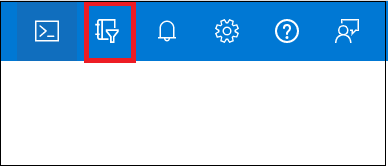
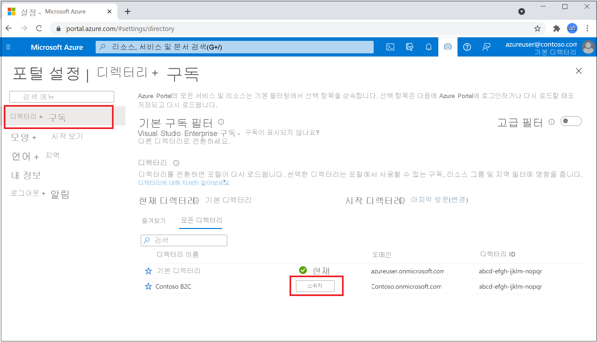

# 자습서: Azure Active Directory B2C 테넌트 만들기

애플리케이션이 Azure AD B2C(Azure Active Directory B2C)와 상호 작용하려면 먼저 사용자가 관리하는 테넌트에 등록되어야 합니다. 

> [!NOTE]
> 구독당 최대 20개의 테넌트를 만들 수 있습니다. 이 제한 사항을 사용하면 서비스 거부 공격과 같은 리소스에 대한 위협을 방지하고 Azure Portal 및 기본 테넌트 생성 API 모두에 적용됩니다. 20개 이상의 테넌트를 만들어야 하는 경우 [Microsoft 지원](support-options.md)에 문의하세요.
> 
> 이전에 삭제하려고 했던 테넌트 이름을 다시 사용하려고 했지만 도메인 이름을 입력할 때 "다른 디렉터리에서 이미 사용 중입니다."라는 오류가 표시되는 경우 [먼저 다음 단계에 따라 테넌트를 먼저 완전히 삭제](./faq.yml?tabs=app-reg-ga#how-do-i-delete-my-azure-ad-b2c-tenant-)해야 합니다. 구독 관리자 이상의 역할이 필요합니다. 테넌트를 삭제한 후 도메인 이름을 다시 사용하기 전에 로그아웃했다가 다시 로그인해야 할 수도 있습니다.

이 문서에서는 다음 방법을 설명합니다.

> [!div class="checklist"]
> * Azure AD B2C 테넌트 만들기
> * 구독에 테넌트 연결
> * Azure AD B2C 테넌트를 포함하는 디렉터리로 전환합니다.
> * Azure AD B2C 리소스를 Azure Portal의 **즐겨찾기** 로 추가합니다.

애플리케이션을 등록하는 방법은 다음 자습서에서 알아봅니다.

## 필수 구성 요소

- Azure 구독 구독이 없으면 시작하기 전에 [계정](https://azure.microsoft.com/free/?WT.mc_id=A261C142F)을 만드세요.

- 구독 내에서 [기여자](../role-based-access-control/built-in-roles.md) 역할 이상이 할당된 Azure 계정 또는 구독 내의 리소스 그룹이 필요합니다. 

## Azure AD B2C 테넌트 만들기

1. [Azure Portal](https://portal.azure.com/)에 로그인합니다. 

1. 구독이 포함된 디렉터리를 선택합니다.
    1. Azure Portal 포털 도구 모음에서 **디렉터리 + 구독** 필터 아이콘을 선택합니다. 
    
    

    1. 구독이 포함된 디렉터리를 찾아서 옆에 있는 **전환** 단추를 선택합니다. 디렉터리를 전환하면 포털이 다시 로드됩니다.

    

1. 사용 중인 Azure 구독에 대한 리소스 공급자로 **Microsoft.AzureActiveDirectory** 를 추가합니다([자세히 알아보기](../azure-resource-manager/management/resource-providers-and-types.md?WT.mc_id=Portal-Microsoft_Azure_Support#register-resource-provider-1)).

    1. Azure Portal 메뉴 또는 **홈** 페이지에서 **구독** 을 선택합니다.
    2. 구독을 선택한 다음, 왼쪽 메뉴에서 **리소스 공급자** 를 선택합니다.
    3. **Microsoft.AzureActiveDirectory** 행에 **등록됨** 상태가 표시되는지 확인합니다. 표시되지 않으면 행을 선택한 다음, **등록** 을 선택합니다.

1. Azure Portal 메뉴 또는 **홈** 페이지에서 **리소스 만들기** 를 선택합니다.

   

1. **Active Directory B2C** 를 검색한 다음, **만들기** 를 선택합니다.
2. **새 Azure AD B2C 테넌트 만들기** 를 선택합니다.

    

1. **디렉터리 만들기** 페이지에서 다음 정보를 입력합니다.

   - **조직 이름** - Azure AD B2C 테넌트의 이름을 입력합니다.
   - **초기 도메인 이름** - Azure AD B2C 테넌트의 도메인 이름을 입력합니다.
   - **국가 또는 지역** - 목록에서 국가 또는 지역을 선택합니다. 이 이름은 나중에 변경할 수 없습니다.
   - **구독** - 목록에서 구독을 선택합니다.
   - **리소스 그룹** - 테넌트를 포함하는 리소스 그룹을 선택하거나 검색합니다.

    

1. **검토 + 만들기** 를 선택합니다.
1. 디렉터리 설정을 검토합니다. 그런 다음 **만들기** 를 선택합니다. [배포 오류 문제 해결](../azure-resource-manager/templates/common-deployment-errors.md)에 대해 자세히 알아보세요.

청구 목적으로 여러 Azure AD B2C 테넌트를 단일 Azure 구독에 연결할 수 있습니다. 테넌트를 연결하려면 Azure AD B2C 테넌트의 관리자여야 하고 Azure 구독 내에서 적어도 기여자 역할을 할당받아야 합니다. [구독에 Azure AD B2C 테넌트 연결](billing.md#link-an-azure-ad-b2c-tenant-to-a-subscription)을 참조하세요.

## B2C 테넌트 디렉터리 선택

새 Azure AD B2C 테넌트 사용을 시작하려면 테넌트가 포함된 디렉터리로 전환해야 합니다.
1. Azure Portal 포털 도구 모음에서 **디렉터리 + 구독** 필터 아이콘을 선택합니다.
1. **모든 디렉터리** 탭에서 Azure AD B2C 테넌트가 포함된 디렉터리를 찾은 다음, 옆에 있는 **전환** 단추를 선택합니다.

처음에 새 Azure B2C 테넌트가 목록에 표시되지 않으면 브라우저 창을 새로 고치거나 로그아웃했다가 다시 로그인합니다. 그런 다음, Azure Portal 포털 도구 모음에서 **디렉터리 + 구독** 필터를 다시 선택합니다.

## Azure AD B2C를 즐겨찾기로 추가(선택 사항)

이 선택적 단계를 사용하면 다음 및 모든 후속 자습서에서 Azure AD B2C 테넌트를 더 쉽게 선택할 수 있습니다.

테넌트로 작업할 때마다 **모든 서비스** 에서 *Azure AD B2C* 를 검색하는 대신 리소스를 즐겨찾기에 추가할 수 있습니다. 그런 다음, 포털 메뉴의 **즐겨찾기** 섹션에서 이를 선택하여 Azure AD B2C 테넌트를 빠르게 찾아볼 수 있습니다.

이 작업은 한 번만 수행하면 됩니다. 이러한 단계를 수행하기 전에 이전 섹션인 [B2C 테넌트 디렉터리 선택](#select-your-b2c-tenant-directory)에서 설명한 대로 Azure AD B2C 테넌트를 포함하는 디렉터리로 전환했는지 확인합니다.

1. [Azure Portal](https://portal.azure.com)에 로그인합니다.
1. Azure Portal 메뉴에서 **모든 서비스** 를 선택합니다.
1. **모든 서비스** 검색 상자에서 **Azure AD B2C** 를 검색하고 검색 결과 위로 마우스를 이동한 다음, 도구 설명의 별표 아이콘을 선택합니다. 이제 **Azure AD B2C** 가 **즐겨찾기** 아래의 Azure Portal에 표시됩니다.
1. 새 즐겨찾기의 위치를 변경하려면 Azure Portal 메뉴로 이동하여 **Azure AD B2C** 를 선택한 다음, 원하는 위치로 끌어 놓습니다.

    

## 다음 단계

이 문서에서는 다음 방법에 대해 알아보았습니다.

> [!div class="checklist"]
> * Azure AD B2C 테넌트 만들기
> * 구독에 테넌트 연결
> * Azure AD B2C 테넌트를 포함하는 디렉터리로 전환합니다.
> * Azure AD B2C 리소스를 Azure Portal의 **즐겨찾기** 로 추가합니다.

다음으로, 새 테넌트에 웹 애플리케이션을 등록하는 방법을 알아봅니다.

> [!div class="nextstepaction"]
> [애플리케이션 등록 >](tutorial-register-applications.md)