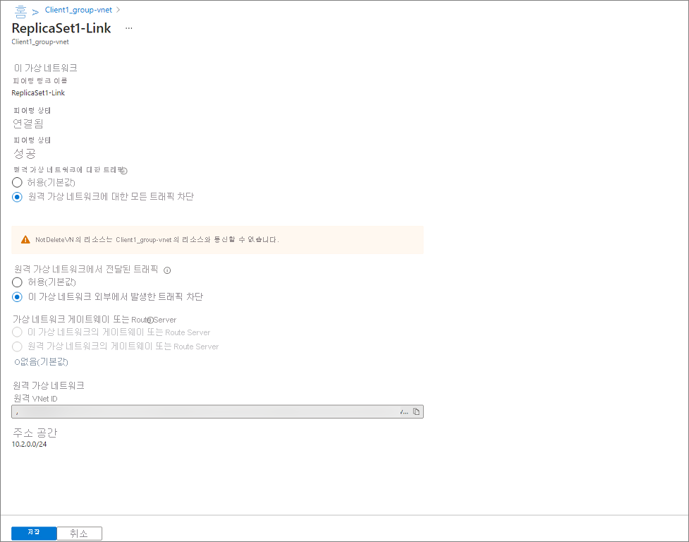

# 자습서: Azure Active Directory Domain Services에서 복제본 세트를 사용하여 재해 복구 훈련 수행

이 토픽에서는 복제본 세트를 사용하여 Azure AD DS(Azure AD Domain Services)에 대한 DR(재해 복구) 훈련을 수행하는 방법을 보여줍니다.  클라이언트가 액세스할 수 없도록 네트워크 가상 네트워크 속성을 변경하여 복제본 세트 중 하나를 오프라인으로 전환하는 시뮬레이션을 수행합니다.  복제본 세트가 오프라인으로 전환되지 않는다는 점에서 진정한 DR 훈련은 아닙니다. 

이 DR 훈련에서 다루는 내용은 다음과 같습니다. 

1. 클라이언트 머신이 지정된 복제본 세트에 연결됩니다. 클라이언트 머신이 도메인에 인증하고 LDAP 쿼리를 수행할 수 있습니다.
1. 클라이언트와 복제본 세트의 연결이 종료됩니다. 연결을 종료하기 위해 네트워크 액세스를 제한할 것입니다.
1. 그러면 클라이언트가 다른 복제본 세트와 새 연결을 설정합니다. 그러면 클라이언트가 도메인에 인증하고 LDAP 쿼리를 수행할 수 있습니다. 
1. 도메인 멤버가 다시 부팅되고, 재부팅 후 도메인 사용자가 로그인할 수 있습니다.
1. 네트워크 제한이 제거되고, 클라이언트가 원래 복제본 세트에 연결할 수 있습니다. 

## 필수 구성 요소 

DR 훈련을 완료하려면 다음 요구 사항이 충족되어야 합니다. 

- 여분의 복제본 세트가 하나 이상 있는 활성 Azure AD DS 인스턴스가 배포되어 있어야 합니다. 도메인이 정상 상태여야 합니다. 
- Azure AD DS 호스팅 도메인에 조인된 클라이언트 머신이 있어야 합니다.  클라이언트는 자체 가상 네트워크에 있어야 하고, 두 복제본 세트 가상 네트워크에서 가상 네트워크 피어링을 사용해야 하고, 가상 네트워크에는 DNS에 나열된 복제본 세트의 모든 도메인 컨트롤러 IP 주소가 있어야 합니다. 

## 환경 유효성 검사 

1. 도메인 계정으로 클라이언트 머신에 로그인합니다. 
1. Active Directory Domain Services RSAT 도구를 설치합니다. 
1. 관리자 권한 PowerShell 창을 엽니다.
1. 다음과 같이 기본 도메인 유효성 검사를 수행합니다. 
   - `nslookup [domain]` 명령을 실행하여 DNS 확인이 제대로 작동하는지 확인합니다. 
   - `nltest /dsgetdc:` 명령을 실행하여 성공을 반환하고 현재 사용 중인 도메인 컨트롤러를 확인합니다.
   - `nltest /dclist:` 명령을 실행하여 디렉터리에 있는 도메인 컨트롤러의 전체 목록을 반환합니다. 
1. 디렉터리에 있는 각 도메인 컨트롤러에서 기본 도메인 컨트롤러 유효성 검사를 수행합니다("nltest /dclist:"의 출력에서 전체 목록을 얻을 수 있음). 
   - `nltest /sc_reset:[domain name]\[domain controller name]` 명령을 실행하여 도메인 컨트롤러와 보안 연결을 설정합니다. 
   - `Get-AdDomain` 명령을 실행하여 기본 디렉터리 설정을 검색합니다. 

## 재해 복구 훈련 수행 

Azure AD DS 인스턴스의 각 복제본 세트에 대해 다음 작업을 수행할 것입니다. 이렇게 하여 각 복제본 세트가 중단되는 상황을 시뮬레이션합니다. 도메인 컨트롤러에 연결할 수 없는 경우 클라이언트는 연결 가능한 도메인 컨트롤러로 자동 장애 조치(failover)되며 이 환경은 최종 사용자 또는 워크로드에 영향을 주지 않아야 합니다. 따라서 애플리케이션 및 서비스가 특정 도메인 컨트롤러를 가리키지 않는 것이 중요합니다. 

1. 오프라인으로 전환 시뮬레이션을 수행하려는 복제본 세트의 도메인 컨트롤러를 식별합니다. 
1. 클라이언트 머신에서 `nltest /sc_reset:[domain]\[domain controller name]` 명령을 사용하여 도메인 컨트롤러 중 하나에 연결합니다. 
1. Azure Portal에서 클라이언트 가상 네트워크 피어링으로 이동하여 클라이언트와 복제본 세트 간의 모든 트래픽이 차단되도록 속성을 업데이트합니다. 
   1. 업데이트하려는 피어링된 네트워크를 선택합니다. 
   1. 가상 네트워크로 들어오거나 나가는 모든 네트워크 트래픽을 차단하도록 선택합니다. 
      
1. 클라이언트 머신에서 동일한 nltest 명령을 사용하여 2단계의 두 도메인 컨트롤러에 대한 보안 연결을 다시 시도합니다. 네트워크 연결이 차단되었기 때문에 이 작업이 실패합니다. 
1. `Get-AdDomain` 및 `Get-AdForest` 명령을 실행하여 기본 디렉터리 속성을 가져옵니다. 이러한 호출은 자동으로 다른 복제본 세트의 도메인 컨트롤러 중 하나로 진행되므로 성공합니다. 
1. 클라이언트를 다시 부팅하고 동일한 도메인 계정으로 로그인합니다. 그러면 인증이 여전히 예상대로 작동하고 로그인이 차단되지 않은 것을 알 수 있습니다. 
1. Azure Portal에서 클라이언트 가상 네트워크 피어링으로 이동하여 모든 트래픽이 차단 해제되도록 속성을 업데이트합니다. 그러면 3단계에서 변경한 내용이 되돌아갑니다. 
1. 클라이언트 머신에서 동일한 nltest 명령을 사용하여 2단계의 두 도메인 컨트롤러에 대한 보안 연결을 다시 시도합니다. 네트워크 연결이 차단 해제되었기 때문에 이 작업이 성공합니다. 

이러한 작업은 클라이언트에서 복제본 세트 중 하나에 연결할 수 없더라도 도메인을 계속 사용할 수 있다는 것을 보여줍니다. Azure AD DS 인스턴스의 각 복제본 세트에 대해 이러한 단계를 수행합니다. 

## 요약 

이러한 단계를 완료하면 Azure AD DS의 복제본 세트 중 하나에 연결할 수 없더라도 도메인 멤버가 디렉터리에 계속 액세스하는 것을 볼 수 있습니다. 클라이언트 머신 대신 복제본 세트에 대한 모든 네트워크 액세스를 차단하여 동일한 동작을 시뮬레이션할 수 있지만, 권장하지는 않습니다. 클라이언트 관점에서 동작이 바뀌는 것은 아니지만, 네트워크 액세스가 복원될 때까지 Azure AD DS 인스턴스의 상태에 영향을 주기 때문입니다. 

## 다음 단계

이 자습서에서는 다음 작업 방법을 알아보았습니다.

> [!div class="checklist"]
> * 복제본 세트의 도메인 컨트롤러에 대한 클라이언트 연결의 유효성 검사
> * 클라이언트와 복제본 세트 간의 네트워크 트래픽 차단
> * 다른 복제본 세트의 도메인 컨트롤러에 대한 클라이언트 연결의 유효성 검사

개념에 대해 자세히 알아보려면 Azure AD DS에서 복제본 세트가 작동하는 방식을 알아보세요.

> [!div class="nextstepaction"]
> [복제본 세트 개념 및 기능][concepts-replica-sets]

<!-- INTERNAL LINKS -->
[replica-sets]: concepts-replica-sets.md
[tutorial-create-instance]: tutorial-create-instance-advanced.md
[create-azure-ad-tenant]: ../active-directory/fundamentals/sign-up-organization.md
[associate-azure-ad-tenant]: ../active-directory/fundamentals/active-directory-how-subscriptions-associated-directory.md
[howto-change-sku]: change-sku.md
[concepts-replica-sets]: concepts-replica-sets.md
