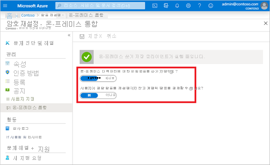

# <a name="tutorial-enable-cloud-sync-self-service-password-reset-writeback-to-an-on-premises-environment-preview"></a>자습서: 온-프레미스 환경에 클라우드 동기화 셀프 서비스 암호 재설정 쓰기 저장 사용(미리 보기)

Azure Active Directory Connect 클라우드 동기화는 연결이 끊긴 온-프레미스 AD DS(Active Directory Domain Services) 도메인의 사용자 간에 Azure AD 암호 변경 내용을 실시간으로 동기화할 수 있습니다. Azure AD Connect 클라우드 동기화의 공개 미리 보기는 도메인 수준에서 [Azure Active Directory Connect](tutorial-enable-sspr-writeback.md)와 함께 실행되어 회사 분할 또는 합병으로 인해 연결이 끊긴 도메인에 있는 사용자와 같은 추가 시나리오에 대한 비밀번호 쓰기 저장을 간소화할 수 있습니다. 요구 사항에 따라 서로 다른 사용자 집합을 대상으로 지정하도록 다른 도메인의 각 서비스를 구성할 수 있습니다. Azure Active Directory Connect 클라우드 동기화는 경량 Azure AD 클라우드 프로비전 에이전트를 사용하여 SSPR(셀프 서비스 암호 재설정) 쓰기 저장 설정을 간소화하고, 클라우드의 암호 변경 내용을 온-프레미스 디렉터리로 다시 보내는 안전한 방법을 제공합니다. 

Azure Active Directory Connect 클라우드 동기화 셀프 서비스 암호 재설정 쓰기 저장은 공개 미리 보기의 일부로 지원됩니다. 미리 보기에 대한 자세한 내용은 [Microsoft Azure 미리 보기에 대한 추가 사용 약관](https://azure.microsoft.com/support/legal/preview-supplemental-terms/)을 참조하세요.

## <a name="prerequisites"></a>사전 요구 사항 

- Azure AD Premium P1 또는 평가판 이상의 라이선스가 사용하도록 설정된 Azure AD 테넌트 필요한 경우, [체험 계정을 만드세요](https://azure.microsoft.com/free/?WT.mc_id=A261C142F). 
- 다음 중 하나가 있는 계정:
  - [인증 정책 관리자](../roles/permissions-reference.md#authentication-policy-administrator) 및 [하이브리드 ID 관리자](../roles/permissions-reference.md#hybrid-identity-administrator) 역할
  - [전역 관리자](../roles/permissions-reference.md#global-administrator) 역할 
- 셀프 서비스 암호 재설정으로 구성된 Azure AD 필요한 경우 이 자습서를 완료하여 Azure AD SSPR을 사용하도록 설정합니다. 
- Azure AD Connect 클라우드 동기화 버전 1.1.587 이상으로 구성된 온-프레미스 AD DS 환경 필요한 경우 [이 자습서](tutorial-enable-sspr.md)를 사용하여 Azure AD Connect 클라우드 동기화를 구성합니다. 
- Azure AD Connect 클라우드 동기화에서 비밀번호 쓰기 저장을 사용하도록 설정하려면 서명된 PowerShell 스크립트를 실행해야 합니다.
  - PowerShell 실행 정책이 스크립트 실행을 허용하는지 확인합니다. 
  - 설치하는 동안 권장되는 실행 정책은 "RemoteSigned"입니다. 
  - PowerShell 실행 정책을 설정하는 방법에 대한 자세한 내용은 [Set-ExecutionPolicy](/powershell/module/microsoft.powershell.security/set-executionpolicy)를 참조하세요. 


## <a name="deployment-steps"></a>배포 단계

1. [Azure AD Connect 클라우드 동기화 서비스 계정 권한 구성](#configure-azure-ad-connect-cloud-sync-service-account-permissions)
1. [Azure AD Connect 클라우드 동기화에서 비밀번호 쓰기 저장 사용](#enable-password-writeback-in-azure-ad-connect-cloud-sync)
1. [SSPR에 대한 비밀번호 쓰기 저장 사용](#enable-password-writeback-for-sspr)
 
### <a name="configure-azure-ad-connect-cloud-sync-service-account-permissions"></a>Azure AD Connect 클라우드 동기화 서비스 계정 권한 구성 

클라우드 동기화에 대한 권한은 기본적으로 구성됩니다. 권한을 다시 설정해야 하는 경우 비밀번호 쓰기 저장에 필요한 특정 권한 및 PowerShell을 사용하여 이러한 권한을 설정하는 방법에 대한 자세한 내용은 [문제 해결](#troubleshooting)을 참조하세요. 

### <a name="enable-password-writeback-in-azure-ad-connect-cloud-sync"></a>Azure AD Connect 클라우드 동기화에서 비밀번호 쓰기 저장 사용

공개 미리 보기의 경우 Set-AADCloudSyncPasswordWritebackConfiguration cmdlet 및 테넌트의 전역 관리자 자격 증명을 사용하여 Azure AD Connect 클라우드 동기화에서 비밀번호 쓰기 저장을 사용하도록 설정해야 합니다. 

```powershell
Import-Module 'C:\\Program Files\\Microsoft Azure AD Connect Provisioning Agent\\Microsoft.CloudSync.Powershell.dll' 
Set-AADCloudSyncPasswordWritebackConfiguration -Enable $true -Credential $(Get-Credential)
``` 

### <a name="enable-password-writeback-for-sspr"></a>SSPR에 대한 비밀번호 쓰기 저장 사용 

Azure AD Connect 클라우드 동기화에서 비밀번호 쓰기 저장이 사용하도록 설정되면 이제 유효성을 검사하고 Azure AD SSPR(셀프 서비스 암호 재설정)을 비밀번호 쓰기 저장으로 구성합니다. SSPR에서 비밀번호 쓰기 저장을 사용하도록 설정되면 암호를 변경하거나 다시 설정하는 사용자는 업데이트된 암호를 온-프레미스 AD DS 환경으로도 다시 동기화해야 합니다. 

SSPR에서 비밀번호 쓰기 저장을 확인하고 사용하도록 설정하려면 다음 단계를 완료합니다. 

1. 전역 관리자 계정을 사용하여 Azure Portal에 로그인합니다. 
1. Azure Active Directory로 이동하여 **암호 재설정** 을 선택한 다음, **온-프레미스 통합** 을 선택합니다. 
1. Azure AD Connect 클라우드 동기화 에이전트 설정이 완료되었는지 확인합니다.
1. **온-프레미스 디렉터리에 암호를 쓰기 저장하시겠습니까?** 를 **예** 로 설정합니다. 
1. **사용자가 암호를 재설정하지 않고 계정을 잠금 해제하도록 허용하시겠습니까?** 를 **예** 로 설정합니다.
   
   

1. 준비되면 **저장** 을 선택합니다. 

## <a name="clean-up-resources"></a>리소스 정리

이 문서의 일부로 구성한 SSPR 비밀번호 쓰기 저장 기능을 더 이상 사용하지 않으려면 다음 단계를 완료합니다. 

1. 전역 관리자 계정을 사용하여 Azure Portal에 로그인합니다. 
1. Azure Active Directory를 검색하여 선택하고, **암호 재설정** 을 선택한 다음, **온-프레미스 통합** 을 선택합니다. 
1. **온-프레미스 디렉터리에 암호를 쓰기 저장하시겠습니까?** 를 **아니요** 로 설정합니다. 
1. **사용자가 암호를 재설정하지 않고 계정을 잠금 해제하도록 허용하시겠습니까?** 를 **아니요** 로 설정합니다. 

Azure AD Connect 클라우드 동기화 서버에서 전역 관리자 자격 증명으로 `Set-AADCloudSyncPasswordWritebackConfiguration`을 실행하여 Azure AD Connect 클라우드 동기화에서 비밀번호 쓰기 저장을 사용하지 않도록 설정합니다. 

```powershell
Import-Module ‘C:\\Program Files\\Microsoft Azure AD Connect Provisioning Agent\\Microsoft.CloudSync.Powershell.dll’ 
Set-AADCloudSyncPasswordWritebackConfiguration -Enable $false -Credential $(Get-Credential)
```

## <a name="supported-operations"></a>지원되는 작업

최종 사용자 및 관리자에 대한 암호는 다음과 같은 상황에서 다시 쓰기 저장됩니다.


| 계정        | 지원되는 작업 | 
|----------------|------------------------|
| 최종 사용자      |  모든 최종 사용자 셀프 서비스 자발적 암호 변경 작업<br>모든 최종 사용자 셀프 서비스 강제 암호 변경 작업(예: 암호 만료)<br>암호 재설정 포털에서 시작되는 모든 최종 사용자 셀프 서비스 암호 재설정 |
| 관리자 |  모든 관리자 셀프 서비스 자발적 암호 변경 작업<br>모든 관리자 셀프 서비스 강제 암호 변경 작업(예: 암호 만료)<br>암호 재설정 포털에서 시작되는 모든 관리자 셀프 서비스 암호 재설정<br> Azure Portal에서 관리자 시작 최종 사용자 암호 재설정<br>Microsoft Graph API에서 관리자 시작 최종 사용자 암호를 재설정합니다.                       |

## <a name="unsupported-operations"></a>지원되지 않는 작업

암호는 다음과 같은 상황에서 다시 쓰기 저장되지 않습니다.

| 계정        | 지원되지 않는 작업 | 
|----------------|------------------------|
| 최종 사용자      | PowerShell cmdlet 또는 Microsoft Graph API를 사용하여 자신의 암호를 다시 설정하는 모든 최종 사용자                        |
| 관리자 | PowerShell cmdlet을 사용하여 관리자가 시작한 최종 사용자 암호 재설정<br>Microsoft 365 관리 센터에서 관리자 시작 최종 사용자 암호 재설정<br>모든 관리자는 암호 재설정 도구를 사용하여 자신의 암호를 다시 설정하거나 비밀번호 쓰기 저장을 위해 Azure AD의 다른 관리자를 사용할 수 없습니다.                        |

## <a name="validation-scenarios"></a>유효성 검사 시나리오

비밀번호 쓰기 저장을 사용하여 시나리오의 유효성을 검사하려면 다음 작업을 수행합니다. 모든 유효성 검사 시나리오에서는 클라우드 동기화가 설치되어 있고 사용자가 비밀번호 쓰기 저장 범위에 있어야 합니다.  


|시나리오|세부 정보 |
|--------|--------|
| 로그인 페이지에서 암호 재설정 | 연결이 끊긴 도메인 및 포리스트의 두 사용자가 SSPR을 수행하도록 합니다. 또한 Azure AD Connect와 클라우드 동기화를 나란히 배포하고, 한 사용자를 클라우드 동기화 구성 범위에 배치하고, 다른 사용자를 Azure AD Connect 범위에 배치하고, 해당 사용자가 자신의 암호를 다시 설정하도록 할 수 있습니다. |
| 만료된 암호 변경 강제 | 연결이 끊긴 도메인 및 포리스트의 두 사용자가 만료된 암호를 변경하도록 합니다. 또한 Azure AD Connect와 클라우드 동기화를 나란히 배포하고, 한 사용자를 클라우드 동기화 구성 범위에 배치하고, 다른 사용자를 Azure AD Connect 범위에 배치하도록 할 수 있습니다. |
| 일반 암호 변경 | 연결이 끊긴 도메인 및 포리스트의 두 사용자가 일상적인 암호 변경을 수행하도록 합니다. Azure AD Connect와 클라우드 동기화를 나란히 배포하고 한 사용자를 클라우드 동기화 구성 범위에 배치하고, 다른 사용자를 Azure AD Connect 범위에 배치하도록 할 수 있습니다.  |
| 관리자의 사용자 암호 재설정 | 연결이 끊긴 도메인 및 포리스트의 두 사용자가 Azure 관리 포털 또는 Frontline 작업자 포털에서 암호를 다시 설정하도록 합니다. 또한 Azure AD Connect와 클라우드 동기화를 나란히 배포하고, 한 사용자를 클라우드 동기화 구성 범위에 배치하고, 다른 사용자를 Azure AD Connect 범위에 배치하도록 할 수 있습니다.  |
| 셀프 서비스 계정 잠금 해제 | 연결이 끊긴 도메인 및 포리스트의 두 사용자가 SSPR 포털에서 계정 잠금을 해제하여 암호를 다시 설정하도록 합니다. Azure AD Connect와 클라우드 동기화를 나란히 배포하고 한 사용자를 클라우드 동기화 구성 범위에 배치하고, 다른 사용자를 Azure AD Connect 범위에 배치하도록 할 수 있습니다. |

## <a name="troubleshooting"></a>문제 해결

Azure AD Connect 클라우드 동기화 그룹 관리되는 서비스 계정에는 기본적으로 암호를 쓰기 저장하도록 설정된 다음과 같은 권한이 있어야 합니다. 

- 암호 재설정
- lockoutTime에 대한 쓰기 권한
- pwdLastSet에 대한 쓰기 권한
- 아직 설정하지 않은 경우 해당 포리스트에 있는 각 도메인의 루트 개체에 "암호 만료"에 대한 확장 권한이 있습니다. 

이러한 권한이 설정되지 않은 경우 Set-AADCloudSyncPermissions cmdlet 및 온-프레미스 엔터프라이즈 관리자 자격 증명을 사용하여 서비스 계정에 대한 PasswordWriteBack 권한을 설정할 수 있습니다. 

```powershell
Import-Module ‘C:\\Program Files\\Microsoft Azure AD Connect Provisioning Agent\\Microsoft.CloudSync.Powershell.dll’ 
Set-AADCloudSyncPermissions -PermissionType PasswordWriteBack -EACredential $(Get-Credential)
```

권한이 업데이트되면 이러한 권한으로 디렉터리의 모든 개체를 복제하는 데 한 시간 이상 걸릴 수 있습니다. 

이러한 권한을 할당하지 않으면 쓰기 저장이 올바르게 구성된 것처럼 표시되지만 사용자가 클라우드에서 온-프레미스 암호를 업데이트할 때 오류가 발생할 수 있습니다. "만료되지 않은 암호"가 표시되도록 하려면 권한을 "이 개체 및 모든 하위 개체"에 적용해야 합니다. 

일부 사용자 계정의 암호가 온-프레미스 디렉터리에 다시 기록되지 않는 경우 온-프레미스 AD DS 환경의 계정에 대해 상속이 비활성화되어 있지 않은지 확인합니다. 기능이 제대로 작동하려면 암호에 대한 쓰기 권한을 하위 개체에 적용해야 합니다. 

온-프레미스 AD DS 환경의 암호 정책에 따라 암호 재설정이 올바르게 처리되지 않을 수 있습니다. 이 기능을 테스트하고 사용자 암호를 하루에 두 번 이상 다시 설정하려면 최소 암호 사용 기간에 대한 그룹 정책을 0으로 설정해야 합니다. 이 설정은 gpmc.msc의 컴퓨터 구성 > 정책 > Windows 설정 > 보안 설정 > 계정 정책 아래에서 확인할 수 있습니다. 

그룹 정책을 업데이트하는 경우 업데이트된 정책이 복제될 때까지 기다리거나 gpupdate /force 명령을 사용합니다. 

암호를 즉시 변경하려면 최소 암호 사용 기간을 0으로 설정해야 합니다. 그러나 사용자가 온-프레미스 정책을 준수하고 최소 암호 사용 기간을 0보다 큰 값으로 설정한 경우 온-프레미스 정책이 평가되면 비밀번호 쓰기 저장이 작동하지 않습니다. 

적절한 권한을 유효성 검사하거나 설정하는 방법에 대한 자세한 내용은 [Azure AD Connect에 대한 계정 권한 구성](tutorial-enable-sspr-writeback.md#configure-account-permissions-for-azure-ad-connect)을 참조하세요. 

## <a name="next-steps"></a>다음 단계

- 클라우드 동기화 및 Azure AD Connect와 클라우드 동기화를 비교하는 방법에 대한 자세한 내용은 [Azure AD Connect 클라우드 동기화란?](../cloud-sync/what-is-cloud-sync.md)을 참조하세요.
- Azure AD Connect를 사용하여 비밀번호 쓰기 저장을 설정하는 방법에 대한 자습서는 [자습서: 온-프레미스 환경에 Azure Active Directory 셀프 서비스 암호 재설정 쓰기 저장 사용](tutorial-enable-sspr-writeback.md)을 참조하세요.
