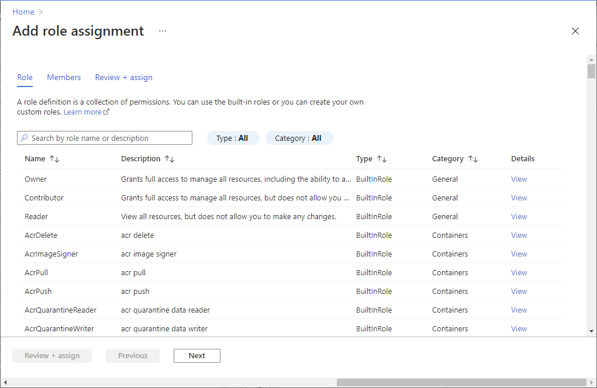

# Azure Portal을 사용하여 리소스에 관리 ID 액세스 권한 할당

[!INCLUDE [preview-notice](../../../includes/active-directory-msi-preview-notice.md)]

관리 ID를 사용하여 Azure 리소스를 구성한 후에 모든 보안 주체와 마찬가지로 다른 리소스에 관리 ID 액세스 권한을 제공할 수 있습니다. 이 문서에서는 Azure Portal을 사용하여 Azure 가상 머신 또는 가상 머신 확장 집합의 관리 ID 액세스 권한을 Azure 스토리지 계정에 부여하는 방법을 보여 줍니다.

## 필수 구성 요소

- Azure 리소스에 대한 관리 ID를 잘 모르는 경우 [개요 섹션](overview.md)을 확인하세요. **[시스템 할당 ID와 사용자 할당 관리 ID의 차이점](overview.md#managed-identity-types)을 반드시 검토하세요**.
- 아직 Azure 계정이 없으면 계속하기 전에 [평가판 계정](https://azure.microsoft.com/free/)에 등록해야 합니다.

## Azure RBAC를 사용하여 다른 리소스에 관리 ID 액세스 권한 할당

[Azure VM](qs-configure-portal-windows-vm.md) 또는 [Azure 가상 머신 확장 집합](qs-configure-portal-windows-vmss.md)과 같은 Azure 리소스에서 관리 ID를 사용하도록 설정한 후 다음을 수행합니다.

1. 관리 ID를 구성한 Azure 구독과 연결된 계정을 사용하여 [Azure Portal](https://portal.azure.com)에 로그인합니다.

2. 액세스 제어를 수정하려는 리소스로 이동합니다. 이 예제에서는 Azure 가상 머신 액세스 권한을 스토리지 계정에 제공하므로 스토리지 계정으로 이동합니다.

1. **액세스 제어(IAM)** 를 선택합니다.

1. **추가** > **역할 할당 추가** 를 선택하여 역할 할당 추가 페이지를 엽니다.

1. 역할 및 관리 ID를 선택합니다. 세부 단계에 대해서는 [Azure Portal을 사용하여 Azure 역할 할당](../../role-based-access-control/role-assignments-portal.md)을 참조하세요.

    
     
## 다음 단계

- [Azure 리소스에 대한 관리 ID 개요](overview.md)
- Azure 가상 머신에서 관리 ID를 사용하려면 [Azure Portal을 사용하여 VM에서 Azure 리소스에 대한 관리 ID 구성](qs-configure-portal-windows-vm.md)을 참조하세요.
- Azure 가상 머신에서 관리 ID를 사용하려면 [Azure Portal을 사용하여 가상 머신 확장 집합에서 Azure 리소스에 대한 관리 ID 구성](qs-configure-portal-windows-vmss.md)을 참조하세요.

