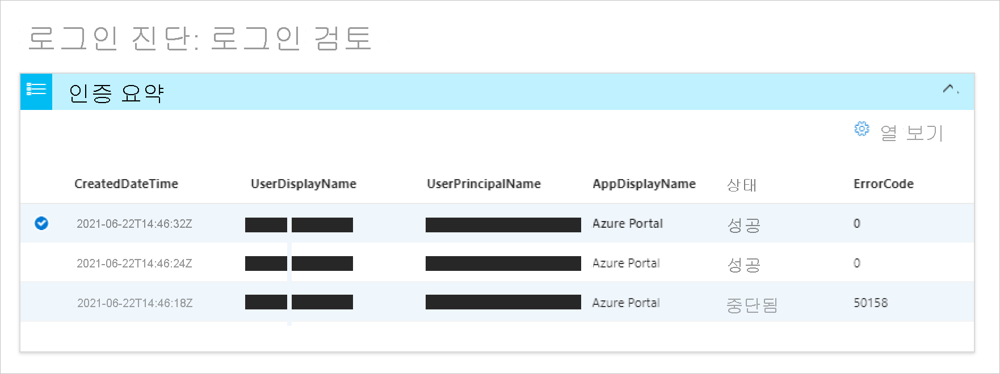
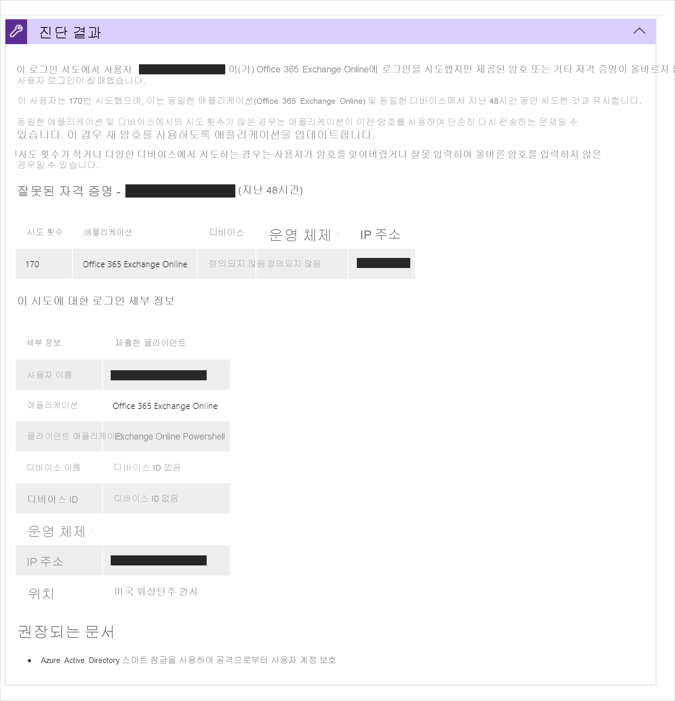

# Azure AD의 로그인 진단이란?

실패한 로그인의 원인을 파악하는 것은 빠르게 어려운 작업이 될 수 있습니다. 로그인을 시도하는 동안 발생한 상황을 분석하고 사용 가능한 권장 사항을 조사하여 문제를 해결해야 합니다. Microsoft 지원과 같은 다른 수단이 개입하지 않고 문제를 해결하는 것이 가장 좋습니다. 이와 같은 상황에 있는 경우 Azure AD에서 로그인을 조사하는 데 도움이 되는 도구인 Azure AD의 로그인 진단을 사용할 수 있습니다. 

이 문서에서는 진단의 정의와 이를 사용하여 로그인 관련 오류를 해결하는 방법에 대해 간략히 설명합니다. 

## 작동 방식  

Azure AD에서 로그인 시도는 다음에 의해 제어됩니다.

- **누가** - 로그인 시도를 수행하는 사용자
- **어떻게** - 로그인 시도를 수행한 방법

예를 들어 관리자가 회사 네트워크에서 로그인할 때 테넌트의 모든 측면을 구성할 수 있도록 하는 조건부 액세스 정책을 구성할 수 있습니다. 그러나 동일한 사용자가 신뢰할 수 없는 네트워크에서 동일한 계정에 로그인하면 차단될 수 있습니다. 

로그인 시도에 응답하는 시스템의 유연성이 높으므로 로그인 문제를 해결해야 하는 시나리오가 발생할 수 있습니다. 로그인 진단은 다음을 통해 로그인 문제를 자가 진단할 수 있도록 설계된 도구입니다.  

- 로그인 이벤트에서 데이터를 분석합니다.  

- 발생한 상황에 대한 정보를 표시합니다.  

- 문제 해결을 위한 권장 사항을 제공합니다.  

진단 프로세스를 시작하여 완료하려면 다음을 수행해야 합니다.   

1. **이벤트 식별**  - 진단을 시작하고 사용자에게 지원을 요청하는 플래그가 지정된 이벤트를 검토하거나 조사할 로그인 이벤트에 대한 정보를 입력합니다. 

2. **이벤트 선택**  - 공유 정보를 기반으로 이벤트를 선택합니다. 

3. **작업 수행**  - 진단 결과를 검토하고 단계를 수행합니다. 

### 이벤트 식별 

진단을 통해 다음 두 가지 방법으로 조사할 이벤트를 찾을 수 있습니다.  

- 로그인 오류 사용자에게 [지원 플래그가 지정](overview-flagged-sign-ins.md)되어 있습니다. 
- 사용자 및 추가 조건에 따라 특정 이벤트를 검색합니다. 

플래그가 지정된 로그인은 최대 100개의 목록에 자동으로 표시됩니다. 이벤트를 클릭하여 즉시 진단을 실행할 수 있습니다.  

플래그가 지정된 로그인이 있는 경우에도 검색 탭을 선택하여 특정 이벤트를 검색할 수 있습니다. 특정 이벤트를 검색하는 경우 다음 옵션을 기준으로 필터링할 수 있습니다. 

- 사용자의 이름 

- 애플리케이션 

- 상관 관계 ID 또는 요청 ID입니다. 

- 날짜 및 시간 

### 이벤트 선택  

플래그가 지정된 로그인의 경우 또는 검색이 완료되면 Azure AD는 일치하는 로그인 이벤트를 모두 검색하여 인증 요약 목록 보기에 표시합니다. 

기본 설정에 따라 열에 표시되는 콘텐츠를 변경할 수 있습니다. 예를 들면 다음과 같습니다.

- 위험 세부 정보
- 조건부 액세스 상태
- 위치
- 리소스 ID
- 사용자 유형
- 인증 세부 정보

### 작업 수행

선택한 로그인 이벤트에 대해 진단 결과를 받습니다. 결과를 읽고 문제를 해결하기 위해 수행할 수 있는 작업을 식별합니다. 이러한 결과는 권장 단계를 추가하고, 관련 정책, 로그인 세부 정보 및 지원 설명서와 같은 관련 정보를 제공합니다. 추가 지원을 통해 문제를 해결할 수 있는 경우가 있으므로 추천 단계가 지원 티켓을 여는 것일 수 있습니다. 

## 액세스 방법

진단을 사용하려면 테넌트에 전역 관리자 또는 전역 읽기 권한자 권한으로 로그인해야 합니다. 이 수준의 액세스 권한이 없는 경우 [PIM(Privileged Identity Management)](../privileged-identity-management/pim-resource-roles-activate-your-roles.md)을 사용하여 테넌트 내의 전역 관리자/읽기 권한자에 대한 액세스 권한을 높입니다. 그러면 진단에 일시적으로 액세스할 수 있습니다.  

올바른 액세스 수준을 사용하면 다양한 위치에서 진단을 찾을 수 있습니다. 

**옵션 A**: 문제 진단 및 해결 

1. **AAD(Azure Active Directory) 또는 Azure AD 조건부 액세스** 를 엽니다. 

2. 주 메뉴에서 **진단 및 문제 해결** 을 클릭합니다.  

3. **문제 해결사** 아래에 로그인 진단 타일이 있습니다. 

4. **문제 해결** 단추를 클릭합니다.  

 

 

**옵션 B**: 로그인 이벤트 

1. Azure Active Directory를 엽니다. 

2. 주 메뉴의 **모니터링** 섹션에서 **로그인** 을 선택합니다. 

3. 로그인 목록에서 **실패** 상태의 로그인을 선택합니다. 실패한 로그인은 상태를 기준으로 목록을 필터링하여 쉽게 찾을 수 있습니다. 

4. 선택한 로그인에 대한 **작업 세부 정보: 로그인** 탭이 열립니다. 더 많은 메뉴 아이콘을 보려면 점 아이콘을 클릭합니다. **문제 해결 및 지원** 탭을 선택합니다. 

5. **로그인 진단 시작** 링크를 클릭합니다. 

 

**옵션 C**: 지원 사례 

지원 사례를 만들 때 진단을 확인하여 사례를 제출하기 전에 자가 진단을 수행할 수 있습니다. 

## 다음 단계

- [Azure AD 로그인 진단 시나리오](concept-sign-in-diagnostics-scenarios.md)
