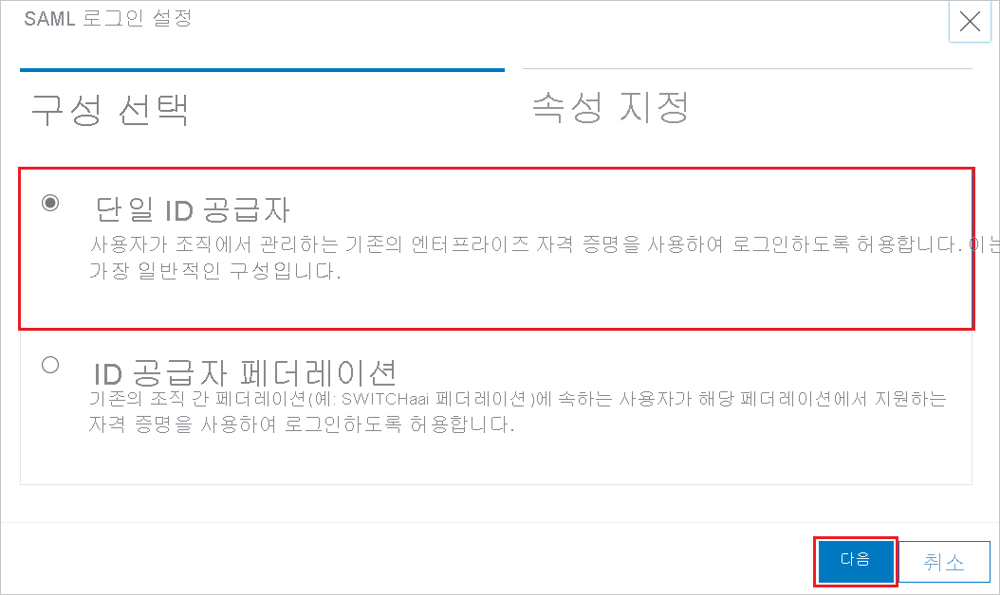
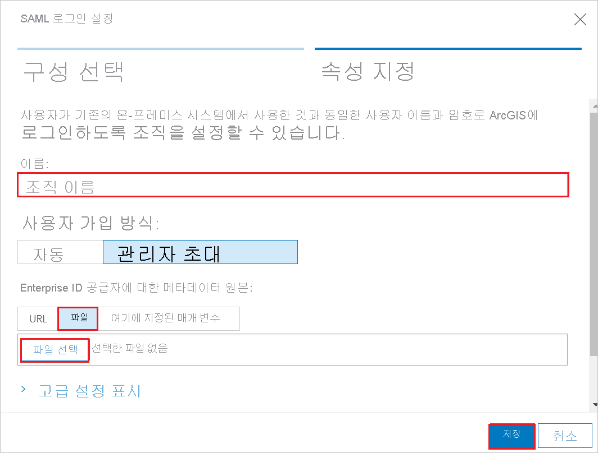
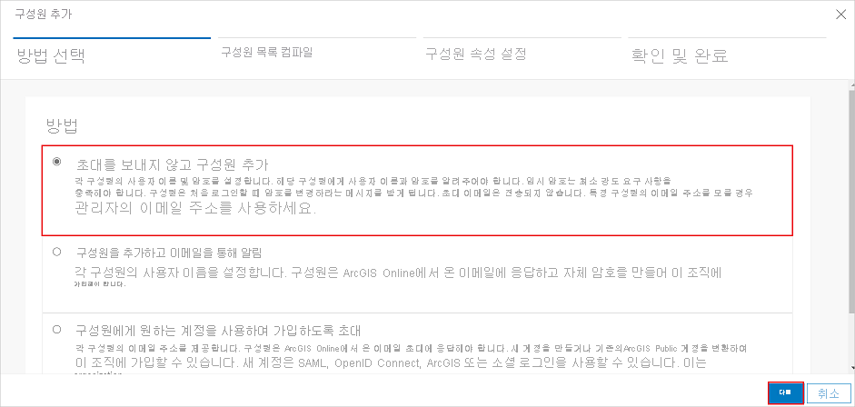

# 자습서: ArcGIS Online과 Azure Active Directory 통합

이 자습서에서는 Azure AD(Azure Active Directory)와 ArcGIS Online을 통합하는 방법에 대해 알아봅니다. Azure AD와 ArcGIS Online을 통합하면 다음 작업을 수행할 수 있습니다.

* ArcGIS Online에 대한 액세스 권한이 있는 사용자를 Azure AD에서 제어합니다.
* 사용자가 해당 Azure AD 계정으로 ArcGIS Online에 자동으로 로그인되도록 설정할 수 있습니다.
* 단일 중앙 위치인 Azure Portal에서 계정을 관리합니다.

## 사전 요구 사항

시작하려면 다음 항목이 필요합니다.

* Azure AD 구독 구독이 없는 경우 [체험 계정](https://azure.microsoft.com/free/)을 얻을 수 있습니다.
* ArcGIS Online SSO(Single Sign-On)가 설정된 구독.

> [!NOTE]
> 이 통합은 Azure AD 미국 정부 클라우드 환경에서도 사용할 수 있습니다. 이 애플리케이션은 Azure AD 미국 정부 클라우드 애플리케이션 갤러리에서 찾을 수 있으며 퍼블릭 클라우드에서와 동일한 방법으로 구성할 수 있습니다.

## 시나리오 설명

이 자습서에서는 테스트 환경에서 Azure AD Single Sign-On을 구성하고 테스트합니다.

* ArcGIS Online에서 **SP** 시작 SSO를 지원합니다.

## 갤러리에서 ArcGIS Online 추가

ArcGIS Online의 Azure AD 통합을 구성하려면 갤러리의 ArcGIS Online을 관리되는 SaaS 앱 목록에 추가해야 합니다.

1. Azure Portal에 회사 또는 학교 계정, 개인 Microsoft 계정으로 로그인합니다.
1. 왼쪽 탐색 창에서 **Azure Active Directory** 서비스를 선택합니다.
1. **엔터프라이즈 애플리케이션** 으로 이동한 다음, **모든 애플리케이션** 을 선택합니다.
1. 새 애플리케이션을 추가하려면 **새 애플리케이션** 을 선택합니다.
1. **갤러리에서 추가** 섹션의 검색 상자에 **ArcGIS Online** 을 입력합니다.
1. 결과 패널에서 **ArcGIS Online** 을 선택한 다음, 앱을 추가합니다. 앱이 테넌트에 추가될 때까지 잠시 동안 기다려 주세요.

## ArcGIS Online에 대한 Azure AD SSO 구성 및 테스트

**B.Simon** 이라는 테스트 사용자를 사용하여 ArcGIS Online에서 Azure AD SSO를 구성하고 테스트합니다. SSO가 작동하려면 Azure AD 사용자와 ArcGIS Online의 관련 사용자 간에 연결 관계를 설정해야 합니다.

ArcGIS Online에서 Azure AD SSO를 구성하고 테스트하려면 다음 단계를 수행합니다.

1. **[Azure AD SSO 구성](#configure-azure-ad-sso)** - 사용자가 이 기능을 사용할 수 있도록 합니다.
    1. **[Azure AD 테스트 사용자 만들기](#create-an-azure-ad-test-user)** - B.Simon을 사용하여 Azure AD Single Sign-On을 테스트합니다.
    1. **[Azure AD 테스트 사용자 할당](#assign-the-azure-ad-test-user)** - B. Simon이 Azure AD Single Sign-On을 사용할 수 있도록 합니다.
1. **[ArcGIS Online SSO 구성](#configure-arcgis-online-sso)** - 애플리케이션 쪽에서 Single Sign-On 설정을 구성합니다.
    1. **[ArcGIS Online 테스트 사용자 만들기](#create-arcgis-online-test-user)** - B.Simon의 Azure AD 표현과 연결된 해당 사용자를 ArcGIS Online에 만듭니다.
1. **[SSO 테스트](#test-sso)** - 구성이 작동하는지 여부를 확인합니다.

## Azure AD SSO 구성

Azure Portal에서 Azure AD SSO를 사용하도록 설정하려면 다음 단계를 수행합니다.

1. Azure Portal의 **ArcGIS Online** 애플리케이션 통합 페이지에서 **관리** 섹션을 찾아 **Single Sign-On** 을 선택합니다.
1. **Single Sign-On 방법 선택** 페이지에서 **SAML** 을 선택합니다.
1. **SAML로 Single Sign-On 설정** 페이지에서 **기본 SAML 구성** 에 대한 연필 아이콘을 클릭하여 설정을 편집합니다.

   

4. **기본 SAML 구성** 섹션에서 다음 단계를 수행합니다.

    a. **로그온 URL** 텍스트 상자에서 `https://<companyname>.maps.arcgis.com` 패턴을 사용하는 URL을 입력합니다.

    b. **식별자(엔터티 ID)** 텍스트 상자에서 `<companyname>.maps.arcgis.com` 패턴을 사용하는 URL을 입력합니다.

    > [!NOTE]
    > 이러한 값은 실제 값이 아닙니다. 실제 로그온 URL 및 식별자로 이러한 값을 업데이트합니다. 이 값을 가져오려면 [ArcGIS Online 클라이언트 지원 팀](https://support.esri.com/en/)에 문의하세요. Azure Portal의 **기본 SAML 구성** 섹션에 표시된 패턴을 참조할 수도 있습니다.

5. **SAML로 Single Sign-On 설정** 페이지의 **SAML 서명 인증서** 섹션에서 **다운로드** 를 클릭하여 요구 사항에 따라 제공된 옵션에서 **페더레이션 메타데이터 XML** 을 다운로드하고 컴퓨터에 저장합니다.

    

6. **ArcGIS Online** 내에서 구성을 자동화하려면 **확장 설치** 를 클릭하여 **내 앱 보안 로그인 브라우저 확장** 을 설치해야 합니다.

    

7. 브라우저에 확장을 추가한 후 **ArcGIS Online 설정** 을 클릭하면 ArcGIS Online 애플리케이션으로 이동하게 됩니다. 응용 프로그램에서 관리자 자격 증명을 입력하여 ArcGIS Online에 로그인합니다. 브라우저 확장에서 애플리케이션을 자동으로 구성하고 **ArcGIS Online Single Sign-On 구성** 섹션의 단계를 자동화합니다.

### Azure AD 테스트 사용자 만들기 

이 섹션에서는 Azure Portal에서 B.Simon이라는 테스트 사용자를 만듭니다.

1. Azure Portal의 왼쪽 창에서 **Azure Active Directory**, **사용자**, **모든 사용자** 를 차례로 선택합니다.
1. 화면 위쪽에서 **새 사용자** 를 선택합니다.
1. **사용자** 속성에서 다음 단계를 수행합니다.
   1. **이름** 필드에 `B.Simon`을 입력합니다.  
   1. **사용자 이름** 필드에서 username@companydomain.extension을 입력합니다. `B.Simon@contoso.com`)을 입력합니다.
   1. **암호 표시** 확인란을 선택한 다음, **암호** 상자에 표시된 값을 적어둡니다.
   1. **만들기** 를 클릭합니다.

### Azure AD 테스트 사용자 할당

이 섹션에서는 Azure Single Sign-On을 사용할 수 있도록 B.Simon에게 ArcGIS Online에 대한 액세스 권한을 부여합니다.

1. Azure Portal에서 **엔터프라이즈 애플리케이션** 을 선택한 다음, **모든 애플리케이션** 을 선택합니다.
1. 애플리케이션 목록에서 **ArcGIS Online** 을 선택합니다.
1. 앱의 개요 페이지에서 **관리** 섹션을 찾고 **사용자 및 그룹** 을 선택합니다.
1. **사용자 추가** 를 선택한 다음, **할당 추가** 대화 상자에서 **사용자 및 그룹** 을 선택합니다.
1. **사용자 및 그룹** 대화 상자의 사용자 목록에서 **B.Simon** 을 선택한 다음, 화면 아래쪽에서 **선택** 단추를 클릭합니다.
1. 사용자에게 역할을 할당할 것으로 예상되는 경우 **역할 선택** 드롭다운에서 선택할 수 있습니다. 이 앱에 대한 역할이 설정되지 않은 경우 "기본 액세스" 역할이 선택된 것으로 표시됩니다.
1. **할당 추가** 대화 상자에서 **할당** 단추를 클릭합니다.

## ArcGIS Online SSO 구성

1. ArcGIS Online을 수동으로 설치하려는 경우 새 웹 브라우저 창을 열고 ArcGIS 회사 사이트에 관리자로 로그인한 후에 다음 단계를 수행합니다.

2. **Organization(조직)**  -> **Settings(설정)** 로 차례로 이동합니다. 

    

3. 왼쪽 메뉴에서 **보안** 을 클릭하고 로그인 탭에서 **새 SAML 로그인** 을 선택합니다.

    

4. **SAML 로그인 설정** 창에서 구성을 **하나의 ID 공급자** 로 선택하고 **다음** 을 클릭합니다.

    

5. **속성 지정** 탭에서 다음 단계를 수행합니다.

    

    a. **이름** 텍스트 상자에 조직의 이름을 입력합니다.

    b. **Enterprise ID 공급자에 대한 메타데이터 원본** 에서 **파일** 을 선택합니다.

    c. **파일 선택** 을 클릭하여 Azure Portal에서 다운로드한 **페더레이션 메타데이터 XML** 파일을 업로드합니다.

    d. **저장** 을 클릭합니다.

### ArcGIS Online 테스트 사용자 만들기

Azure AD 사용자가 ArcGIS Online에 로그인할 수 있도록 하려면 ArcGIS Online으로 프로비전되어야 합니다.  
ArcGIS Online의 경우 프로비전은 수동 작업입니다.

**사용자 계정을 프로비전하려면 다음 단계를 수행합니다.**

1. **ArcGIS** 테넌트에 로그인합니다.

2. **조직** -> **멤버** 로 이동하여 **멤버 초대** 를 클릭합니다.

    

3. **초대를 보내지 않고 멤버 추가** 방법을 선택한 후, **다음** 을 클릭합니다.

    

1. **컴파일 멤버 목록** 에서 **새 멤버** 를 선택하고 **다음** 을 클릭합니다.

4. 다음 페이지에서 필수 필드를 채우고 **다음** 을 클릭합니다.

    

5. 다음 페이지에서 추가할 멤버를 선택하고 **다음** 을 클릭합니다. 

1. 다음 페이지에서 필요한 멤버 속성을 설정하고 **다음** 을 클릭합니다.

1. **확인 및 완료** 탭에서 **멤버 추가** 를 클릭합니다.

    

    > [!NOTE]
    > Azure Active Directory 계정 보유자는 활성화되기 전에 전자 메일을 받고 링크를 따라 계정을 확인합니다.

## SSO 테스트

이 섹션에서는 다음 옵션을 사용하여 Azure AD Single Sign-On 구성을 테스트합니다. 

* Azure Portal에서 **이 애플리케이션 테스트** 를 클릭합니다. 그러면 로그인 흐름을 시작할 수 있는 ArcGIS Online 로그온 URL로 리디렉션됩니다. 

* ArcGIS Online 로그온 URL로 직접 이동하여 해당 위치에서 로그인 흐름을 시작합니다.

* Microsoft 내 앱을 사용할 수 있습니다. 내 앱에서 ArcGIS Online 타일을 클릭하면 ArcGIS Online 로그온 URL로 리디렉션됩니다. 내 앱에 대한 자세한 내용은 [내 앱 소개](../user-help/my-apps-portal-end-user-access.md)를 참조하세요.

## 다음 단계

ArcGIS Online이 구성되면 세션 제어를 적용하여 조직의 중요한 데이터의 반출 및 반입을 실시간으로 보호할 수 있습니다. 세션 제어는 조건부 액세스에서 확장됩니다. [Microsoft Cloud App Security를 사용하여 세션 제어를 적용하는 방법을 알아봅니다](/cloud-app-security/proxy-deployment-any-app).