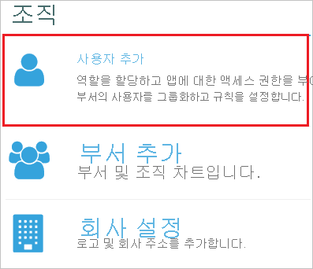

# 자습서: BitaBIZ와 Azure Active Directory 통합

이 자습서에서는 Azure AD(Azure Active Directory)와 BitaBIZ를 통합하는 방법에 대해 알아봅니다. Azure AD와 BitaBIZ를 통합하면 다음을 수행할 수 있습니다.

* Azure AD에서 BitaBIZ에 액세스할 수 있는 사용자를 제어합니다.
* 사용자가 해당 Azure AD 계정으로 BitaBIZ에 자동으로 로그인되도록 설정합니다.
* 단일 중앙 위치인 Azure Portal에서 계정을 관리합니다.

## 사전 요구 사항

BitaBIZ와 Azure AD의 통합을 구성하려면 다음 항목이 필요합니다.

* Azure AD 구독 Azure AD 환경이 없으면 [체험 계정](https://azure.microsoft.com/free/)을 얻을 수 있습니다.
* BitaBIZ Single Sign-On을 사용하도록 설정된 구독

## 시나리오 설명

이 자습서에서는 테스트 환경에서 Azure AD Single Sign-On을 구성하고 테스트합니다.

* BitaBIZ에서 **SP 및 IDP** 시작 SSO를 지원합니다.
* BitaBIZ에서 [자동화된 사용자 프로비저닝](bitabiz-provisioning-tutorial.md)을 지원합니다.

## 갤러리에서 BitaBIZ 추가

BitaBIZ와 Azure AD의 통합을 구성하려면 갤러리의 BitaBIZ를 관리되는 SaaS 앱 목록에 추가해야 합니다.

1. Azure Portal에 회사 또는 학교 계정, 개인 Microsoft 계정으로 로그인합니다.
1. 왼쪽 탐색 창에서 **Azure Active Directory** 서비스를 선택합니다.
1. **엔터프라이즈 애플리케이션** 으로 이동한 다음, **모든 애플리케이션** 을 선택합니다.
1. 새 애플리케이션을 추가하려면 **새 애플리케이션** 을 선택합니다.
1. **갤러리에서 추가** 섹션의 검색 상자에서 **BitaBIZ** 를 입력합니다.
1. 결과 패널에서 **BitaBIZ** 를 선택한 다음, 앱을 추가합니다. 앱이 테넌트에 추가될 때까지 잠시 동안 기다려 주세요.

## BitaBIZ에 대한 Azure AD SSO 구성 및 테스트

**B.Simon** 이라는 테스트 사용자를 사용하여 BitaBIZ에서 Azure AD SSO를 구성하고 테스트합니다. SSO가 작동하려면 Azure AD 사용자와 BitaBIZ의 관련 사용자 간에 연결 관계를 설정해야 합니다.

BitaBIZ에서 Azure AD SSO를 구성하고 테스트하려면 다음 단계를 수행합니다.

1. **[Azure AD SSO 구성](#configure-azure-ad-sso)** - 사용자가 이 기능을 사용할 수 있도록 합니다.
    1. **[Azure AD 테스트 사용자 만들기](#create-an-azure-ad-test-user)** - Britta Simon으로 Azure AD Single Sign-On을 테스트하는 데 사용합니다.
    1. **[Azure AD 테스트 사용자 할당](#assign-the-azure-ad-test-user)** - Britta Simon이 Azure AD Single Sign-on을 사용할 수 있도록 합니다.
2. **[BitaBIZ SSO 구성](#configure-bitabiz-sso)** - 애플리케이션 쪽에서 Single Sign-On 설정을 구성합니다.
    1. **[BitaBIZ 테스트 사용자 만들기](#create-bitabiz-test-user)** - Britta Simon의 Azure AD 표현과 연결되는 해당 사용자를 BitaBIZ에 만듭니다.
1. **[SSO 테스트](#test-sso)** - 구성이 작동하는지 여부를 확인합니다.

## Azure AD SSO 구성

Azure Portal에서 Azure AD SSO를 사용하도록 설정하려면 다음 단계를 수행합니다.

1. Azure Portal의 **BitaBIZ** 애플리케이션 통합 페이지에서 **관리** 섹션을 찾고, **Single Sign-On** 을 선택합니다.
1. **Single Sign-On 방법 선택** 페이지에서 **SAML** 을 선택합니다.
1. **SAML로 Single Sign-On 설정** 페이지에서 **기본 SAML 구성** 에 대한 연필 아이콘을 클릭하여 설정을 편집합니다.

   

4. **IDP 시작** 모드에서 애플리케이션을 구성하려면 **기본 SAML 구성** 섹션에서 다음 단계를 수행합니다.

    **식별자** 텍스트 상자에 `https://www.bitabiz.com/<INSTANCE_ID>` 패턴을 사용하여 URL을 입력합니다.

    > [!NOTE]
    > 위 URL의 값은 데모용입니다. 자습서의 뒷부분에서 설명하는 실제 식별자로 값을 업데이트합니다.

5. **SP** 시작 모드에서 애플리케이션을 구성하려면 **추가 URL 설정** 를 클릭하고 다음 단계를 수행합니다.

    **로그온 URL** 텍스트 상자에 `https://www.bitabiz.com/dashboard` URL을 입력합니다.

6. **SAML로 Single Sign-On 설정** 페이지의 **SAML 서명 인증서** 섹션에서 **다운로드** 를 클릭하여 요구 사항에 따라 제공된 옵션에서 **인증서(Base64)** 를 다운로드한 다음, 컴퓨터에 저장합니다.

    

7. **BitaBIZ 설정** 섹션에서 요구 사항에 따라 적절한 URL을 복사합니다.

    

### Azure AD 테스트 사용자 만들기

이 섹션에서는 Azure Portal에서 B.Simon이라는 테스트 사용자를 만듭니다.

1. Azure Portal의 왼쪽 창에서 **Azure Active Directory**, **사용자**, **모든 사용자** 를 차례로 선택합니다.
1. 화면 위쪽에서 **새 사용자** 를 선택합니다.
1. **사용자** 속성에서 다음 단계를 수행합니다.
   1. **이름** 필드에 `B.Simon`을 입력합니다.  
   1. **사용자 이름** 필드에서 username@companydomain.extension을 입력합니다. 예들 들어 `B.Simon@contoso.com`입니다.
   1. **암호 표시** 확인란을 선택한 다음, **암호** 상자에 표시된 값을 적어둡니다.
   1. **만들기** 를 클릭합니다.

### Azure AD 테스트 사용자 할당

이 섹션에서는 B.Simon에게 BitaBIZ에 대한 액세스 권한을 부여하여 해당 사용자가 Azure Single Sign-On을 사용하도록 설정합니다.

1. Azure Portal에서 **엔터프라이즈 애플리케이션** 을 선택한 다음, **모든 애플리케이션** 을 선택합니다.
1. 애플리케이션 목록에서 **BitaBIZ** 를 선택합니다.
1. 앱의 개요 페이지에서 **관리** 섹션을 찾고 **사용자 및 그룹** 을 선택합니다.
1. **사용자 추가** 를 선택한 다음, **할당 추가** 대화 상자에서 **사용자 및 그룹** 을 선택합니다.
1. **사용자 및 그룹** 대화 상자의 사용자 목록에서 **B.Simon** 을 선택한 다음, 화면 아래쪽에서 **선택** 단추를 클릭합니다.
1. 사용자에게 역할을 할당할 것으로 예상되는 경우 **역할 선택** 드롭다운에서 선택할 수 있습니다. 이 앱에 대한 역할이 설정되지 않은 경우 "기본 액세스" 역할이 선택된 것으로 표시됩니다.
1. **할당 추가** 대화 상자에서 **할당** 단추를 클릭합니다.

## BitaBIZ SSO 구성

1. 다른 웹 브라우저 창에서 BitaBIZ 테넌트에 관리자 권한으로 로그인합니다.

2. **SETUP ADMIN(설치 관리자)** 을 클릭합니다.

    

3. **값 추가** 섹션 아래에서 **Microsoft 통합** 을 클릭합니다.

    

4. **Microsoft Azure AD(Single Sign-On 사용)** 섹션까지 아래로 스크롤하고 다음 단계를 수행합니다.

    

    a. **엔터티 ID(Azure AD의 "식별자")** 텍스트 상자의 값을 복사하고, Azure Portal의 **기본 SAML 구성** 섹션에 있는 **식별자** 텍스트 상자에 붙여넣습니다. 

    b. Azure Portal에서 복사한 **로그인 URL** 을 **Azure AD Single Sign-On 서비스 URL** 텍스트 상자에 붙여넣습니다.

    다. Azure Portal에서 복사한 **Azure AD 식별자** 를 **Azure AD SAML 엔터티 ID** 텍스트 상자에 붙여넣습니다.

    d. 다운로드한 **인증서(Base64)** 파일을 메모장에서 열고, 내용을 클립보드에 복사한 다음, **Azure AD 서명 인증서(Base64 인코딩)** 텍스트 상자에 붙여넣습니다.

    e. **도메인 이름** 텍스트 상자에서 비즈니스 전자 메일 도메인 이름인 mycompany.com을 추가하여 이 전자 메일 도메인이 있는 회사의 사용자에게 SSO를 할당합니다(필수 항목이 아님).

    f. BitaBIZ 계정을 **SSO 사용** 으로 표시합니다.

    g. **Azure AD 구성 저장** 을 클릭하여 SSO 구성을 저장하고 활성화합니다.

### BitaBIZ 테스트 사용자 만들기

Azure AD 사용자가 BitaBIZ에 로그인할 수 있게 하려면 BitaBIZ에 프로비전해야 합니다.  
BitaBIZ의 경우 프로비전은 수동 작업입니다.

**사용자 계정을 프로비전하려면 다음 단계를 수행합니다.**

1. BitaBIZ 회사 사이트에 관리자 권한으로 로그인합니다.

2. **SETUP ADMIN(설치 관리자)** 을 클릭합니다.

    

3. **조직**  섹션 아래에서 **사용자 추가** 를 클릭합니다.

    

4. **새 직원 추가** 를 클릭합니다.

    

5. **새 직원 추가** 대화 상자 페이지에서 다음 단계를 수행합니다.

    

    a. **이름** 텍스트 상자에서 사용자의 이름(예: Britta)을 입력합니다.

    b. **성** 텍스트 상자에서 사용자의 성(예: Simon)을 입력합니다.

    다. **전자 메일** 텍스트 상자에서 Brittasimon@contoso.com과 같은 사용자의 이메일 주소를 입력합니다.

    d. **고용 날짜** 에서 날짜를 선택합니다.

    e. 사용자에 대해 설정할 수 있는 필수가 아닌 다른 사용자 속성이 있습니다. 자세한 내용은 [직원 설정 문서(영문)](https://help.bitabiz.dk/manage-or-set-up-your-account/on-boarding-employees/new-employee)를 참조하세요.

    f. **직원 저장** 을 클릭합니다.

    > [!NOTE]
    > Azure Active Directory 계정 보유자는 활성화되기 전에 메일을 받고 링크를 따라 계정을 확인합니다.

> [!NOTE]
>BitaBIZ는 자동화된 사용자 프로비저닝도 지원합니다. 자동화된 사용자 프로비저닝을 구성하는 방법에 대한 자세한 내용은 [여기](./bitabiz-provisioning-tutorial.md)서 확인할 수 있습니다.

## SSO 테스트

이 섹션에서는 다음 옵션을 사용하여 Azure AD Single Sign-On 구성을 테스트합니다. 

#### SP 시작:

* Azure Portal에서 **이 애플리케이션 테스트** 를 클릭합니다. 그러면 로그인 흐름을 시작할 수 있는 BitaBIZ 로그온 URL로 리디렉션됩니다.  

* BitaBIZ 로그온 URL로 직접 이동하여 해당 위치에서 로그인 흐름을 시작합니다.

#### IDP 시작:

* Azure Portal에서 **이 애플리케이션 테스트** 를 클릭하면 SSO를 설정한 BitaBIZ에 자동으로 로그인됩니다. 

Microsoft 내 앱을 사용하여 모든 모드에서 애플리케이션을 테스트할 수도 있습니다. 내 앱에서 BitaBIZ 타일을 클릭하면 SP 모드로 구성된 경우 로그인 흐름을 시작하기 위해 애플리케이션 로그온 페이지로 리디렉션되고, IDP 모드로 구성된 경우 SSO를 설정한 BitaBIZ에 자동으로 로그인됩니다. 내 앱에 대한 자세한 내용은 [내 앱 소개](../user-help/my-apps-portal-end-user-access.md)를 참조하세요.

## 다음 단계

BitaBIZ가 구성되면 세션 제어를 적용하여 조직의 중요한 데이터의 반출 및 반입을 실시간으로 보호할 수 있습니다. 세션 제어는 조건부 액세스에서 확장됩니다. [Microsoft Cloud App Security를 사용하여 세션 제어를 적용하는 방법을 알아봅니다](/cloud-app-security/proxy-deployment-aad).
