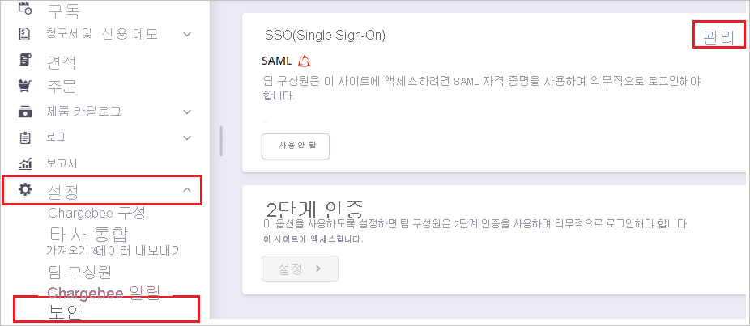
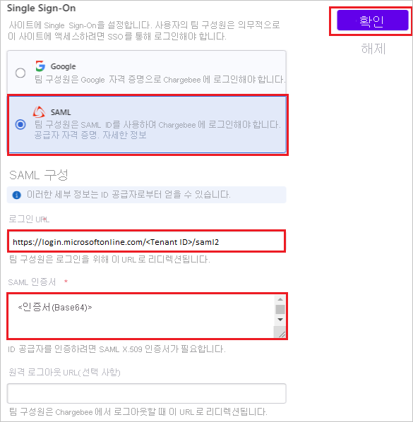
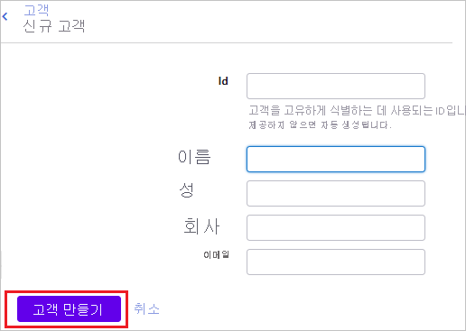

# 자습서: Chargebee와 Azure AD SSO 통합

이 자습서에서는 Azure AD(Azure Active Directory)와 Chargebee를 통합하는 방법에 대해 알아봅니다. Azure AD와 Chargebee를 통합하면 다음을 수행할 수 있습니다.

* Azure AD에서 Chargebee에 액세스할 수 있는 사용자를 제어합니다.
* 사용자가 해당 Azure AD 계정으로 Chargebee에 자동으로 로그인되도록 설정합니다.
* 단일 중앙 위치인 Azure Portal에서 계정을 관리합니다.

## 사전 요구 사항

시작하려면 다음 항목이 필요합니다.

* Azure AD 구독 구독이 없는 경우 [체험 계정](https://azure.microsoft.com/free/)을 얻을 수 있습니다.
* Chargebee SSO(Single Sign-On)를 사용하도록 설정된 구독

## 시나리오 설명

이 자습서에서는 테스트 환경에서 Azure AD SSO를 구성하고 테스트합니다.

* Chargebee에서 **SP 및 IDP** 시작 SSO를 지원합니다.

## 갤러리에서 Chargebee 추가

Chargebee가 Azure AD에 통합되도록 구성하려면 갤러리에서 Chargebee를 관리형 SaaS 앱 목록에 추가해야 합니다.

1. Azure Portal에 회사 또는 학교 계정, 개인 Microsoft 계정으로 로그인합니다.
1. 왼쪽 탐색 창에서 **Azure Active Directory** 서비스를 선택합니다.
1. **엔터프라이즈 애플리케이션** 으로 이동한 다음, **모든 애플리케이션** 을 선택합니다.
1. 새 애플리케이션을 추가하려면 **새 애플리케이션** 을 선택합니다.
1. **갤러리에서 추가** 섹션의 검색 상자에서 **Chargebee** 를 입력합니다.
1. 결과 패널에서 **Chargebee** 를 선택한 다음, 앱을 추가합니다. 앱이 테넌트에 추가될 때까지 잠시 동안 기다려 주세요.

## Chargebee에 대한 Azure AD SSO 구성 및 테스트

**B.Simon** 이라는 테스트 사용자를 사용하여 Chargebee에서 Azure AD SSO를 구성하고 테스트합니다. SSO가 작동하려면 Azure AD 사용자와 Chargebee의 관련 사용자 간에 연결 관계를 설정해야 합니다.

Chargebee에서 Azure AD SSO를 구성하고 테스트하려면 다음 단계를 수행합니다.

1. **[Azure AD SSO 구성](#configure-azure-ad-sso)** - 사용자가 이 기능을 사용할 수 있도록 합니다.
    1. **[Azure AD 테스트 사용자 만들기](#create-an-azure-ad-test-user)** - B.Simon을 사용하여 Azure AD Single Sign-On을 테스트합니다.
    1. **[Azure AD 테스트 사용자 할당](#assign-the-azure-ad-test-user)** - B. Simon이 Azure AD Single Sign-On을 사용할 수 있도록 합니다.
2. **[Chargebee SSO 구성](#configure-chargebee-sso)** - 애플리케이션 쪽에서 Single Sign-On 설정을 구성합니다.
    1. **[Chargebee 테스트 사용자 만들기](#create-chargebee-test-user)** - B.Simon의 Azure AD 표현과 연결된 해당 사용자를 Chargebee에 만듭니다.
3. **[SSO 테스트](#test-sso)** - 구성이 작동하는지 여부를 확인합니다.

## Azure AD SSO 구성

Azure Portal에서 Azure AD SSO를 사용하도록 설정하려면 다음 단계를 수행합니다.

1. Azure Portal의 **Chargebee** 애플리케이션 통합 페이지에서 **관리** 섹션을 찾은 후 **Single Sign-On** 을 선택합니다.
1. **Single Sign-On 방법 선택** 페이지에서 **SAML** 을 선택합니다.
1. **SAML로 Single Sign-On 설정** 페이지에서 **기본 SAML 구성** 에 대한 연필 아이콘을 클릭하여 설정을 편집합니다.

   

1. **IDP** 시작 모드에서 애플리케이션을 구성하려면 **기본 SAML 구성** 섹션에서 다음 단계를 수행합니다.

    a. **식별자** 텍스트 상자에서 `https://<domainname>.chargebee.com` 패턴을 사용하여 URL을 입력합니다.

    b. **회신 URL** 텍스트 상자에서 `https://app.chargebee.com/saml/<domainname>/acs` 패턴을 사용하여 URL을 입력합니다.

1. **SP** 시작 모드에서 애플리케이션을 구성하려면 **추가 URL 설정** 를 클릭하고 다음 단계를 수행합니다.

    **로그인 URL** 텍스트 상자에서 `https://<domainname>.chargebee.com` 패턴을 사용하여 URL을 입력합니다.

    > [!NOTE]
    > `<domainname>`은 계정을 클레임한 후에 사용자가 만드는 도메인의 이름입니다. 다른 정보가 있으면 [Chargebee 클라이언트 지원 팀](mailto:support@chargebee.com)에 문의하세요. Azure Portal의 **기본 SAML 구성** 섹션에 표시된 패턴을 참조할 수도 있습니다.

4. **SAML로 Single Sign-On 설정** 페이지의 **SAML 서명 인증서** 섹션에서 **인증서(Base64)** 를 찾은 후 **다운로드** 를 선택하여 인증서를 다운로드하고 본인의 컴퓨터에 저장합니다.

    

6. **Chargebee 설정** 섹션에서 요구 사항에 따라 적절한 URL을 복사합니다.

    

### Azure AD 테스트 사용자 만들기

이 섹션에서는 Azure Portal에서 B.Simon이라는 테스트 사용자를 만듭니다.

1. Azure Portal의 왼쪽 창에서 **Azure Active Directory**, **사용자**, **모든 사용자** 를 차례로 선택합니다.
1. 화면 위쪽에서 **새 사용자** 를 선택합니다.
1. **사용자** 속성에서 다음 단계를 수행합니다.
   1. **이름** 필드에 `B.Simon`을 입력합니다.  
   1. **사용자 이름** 필드에서 username@companydomain.extension을 입력합니다. 예들 들어 `B.Simon@contoso.com`입니다.
   1. **암호 표시** 확인란을 선택한 다음, **암호** 상자에 표시된 값을 적어둡니다.
   1. **만들기** 를 클릭합니다.

### Azure AD 테스트 사용자 할당

이 섹션에서는 Azure Single Sign-On을 사용할 수 있도록 B.Simon에게 Chargebee에 대한 액세스 권한을 부여합니다.

1. Azure Portal에서 **엔터프라이즈 애플리케이션** 을 선택한 다음, **모든 애플리케이션** 을 선택합니다.
1. 애플리케이션 목록에서 **Chargebee** 를 선택합니다.
1. 앱의 개요 페이지에서 **관리** 섹션을 찾고 **사용자 및 그룹** 을 선택합니다.
1. **사용자 추가** 를 선택한 다음, **할당 추가** 대화 상자에서 **사용자 및 그룹** 을 선택합니다.
1. **사용자 및 그룹** 대화 상자의 사용자 목록에서 **B.Simon** 을 선택한 다음, 화면 아래쪽에서 **선택** 단추를 클릭합니다.
1. SAML 어설션에 역할 값이 필요한 경우 **역할 선택** 대화 상자의 목록에서 사용자에 대한 적절한 역할을 선택한 다음, 화면의 아래쪽에 있는 **선택** 단추를 클릭합니다.
1. **할당 추가** 대화 상자에서 **할당** 단추를 클릭합니다.

## Chargebee SSO 구성

1. 새 웹 브라우저 창을 열고, Chargebee 회사 사이트에 관리자 권한으로 로그인합니다.

4. 메뉴의 왼쪽에서 **Settings(설정)**  > **Security(보안)**  > **Manage(관리)** 를 차례로 클릭합니다.

    

5. **Single Sign-On** 팝업에서 다음 단계를 수행합니다.

    

    a. **SAML** 을 선택합니다.

    b. **로그인 URL** 텍스트 상자에 Azure Portal에서 복사한 **로그인 URL** 값을 붙여넣습니다.

    다. 메모장에서 Base64로 인코딩된 인증서를 열고, 해당 내용을 복사한 다음, **SAML 인증서** 텍스트 상자에 붙여넣습니다.

    d. **확인** 을 클릭합니다.

### Chargebee 테스트 사용자 만들기

Azure AD 사용자를 사용하도록 설정하려면 Chargebee에 로그인하고 해당 사용자를 Chargebee에 프로비저닝해야 합니다. Chargebee에서 프로비저닝은 수동 작업입니다.

**사용자 계정을 프로비전하려면 다음 단계를 수행합니다.**

1. 다른 웹 브라우저 창에서 Chargebee에 보안 관리자 권한으로 로그인합니다.

2. 메뉴의 왼쪽에서 **Customers**(고객)를 클릭한 다음, **Create a New Customer**(새 고객 만들기)로 이동합니다.

    

3. **New Customer**(새 고객) 페이지에서 아래쪽에 표시된 각 필드를 채우고, 사용자 만들기에 대해 **Create Customer**(고객 만들기)를 클릭합니다.

    

## SSO 테스트 

이 섹션에서는 다음 옵션을 사용하여 Azure AD Single Sign-On 구성을 테스트합니다. 

#### SP 시작:

* Azure Portal에서 **이 애플리케이션 테스트** 를 클릭합니다. 그러면 로그인 흐름을 시작할 수 있는 Chargebee 로그온 URL로 리디렉션됩니다.  

* Chargebee 로그온 URL로 직접 이동하여 해당 위치에서 로그인 흐름을 시작합니다.

#### IDP 시작:

* Azure Portal에서 **이 애플리케이션 테스트** 를 클릭하면 SSO를 설정한 Chargebee에 자동으로 로그인됩니다. 

Microsoft 내 앱을 사용하여 모든 모드에서 애플리케이션을 테스트할 수도 있습니다. 내 앱에서 Chargebee 타일을 클릭하면 SP 모드로 구성된 경우 로그인 흐름을 시작할 수 있는 애플리케이션 로그온 페이지로 리디렉션됩니다. IDP 모드로 구성된 경우에는 SSO를 설정한 Chargebee에 자동으로 로그인되어야 합니다. 내 앱에 대한 자세한 내용은 [내 앱 소개](../user-help/my-apps-portal-end-user-access.md)를 참조하세요.

## 다음 단계

Chargebee를 구성하면 세션 제어를 적용하여 조직의 중요한 데이터 반출과 반입을 실시간으로 보호할 수 있습니다. 세션 제어는 조건부 액세스에서 확장됩니다. [Microsoft Defender for Cloud Apps를 사용하여 세션 제어를 적용하는 방법을 알아봅니다](/cloud-app-security/proxy-deployment-aad).
