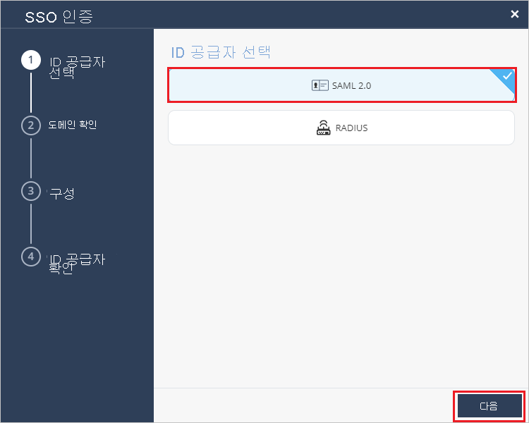
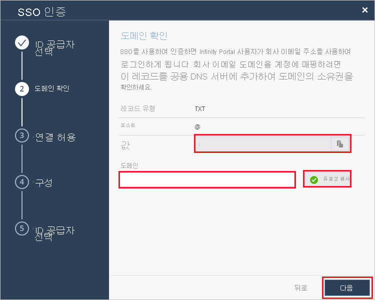
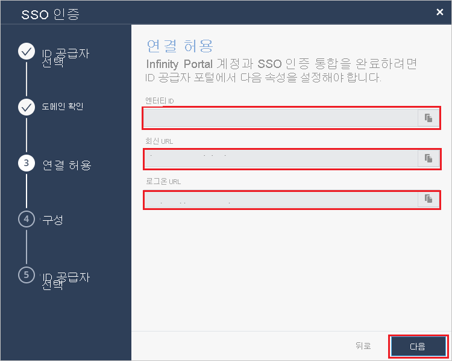
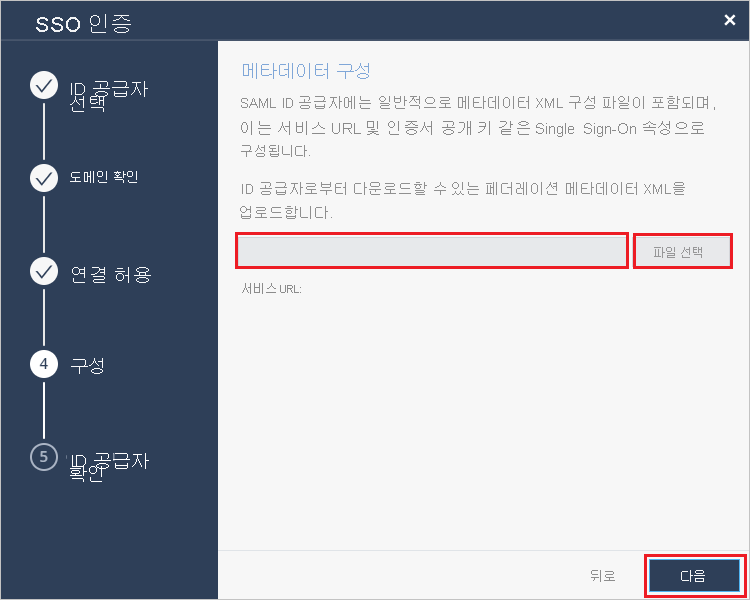

# 자습서: Check Point Infinity Portal과 Azure AD SSO 통합

이 자습서에서는 Azure AD(Azure Active Directory)와 Check Point Infinity Portal을 통합하는 방법에 대해 알아봅니다. Azure AD와 Check Point Infinity Portal을 통합하면 다음을 수행할 수 있습니다.

* Check Point Infinity Portal에 대한 액세스 권한이 있는 사용자를 Azure AD에서 제어합니다.
* 사용자가 해당 Azure AD 계정으로 Check Point Infinity Portal에 자동으로 로그인되도록 설정합니다.
* 단일 중앙 위치인 Azure Portal에서 계정을 관리합니다.

## 사전 요구 사항

시작하려면 다음 항목이 필요합니다.

* Azure AD 구독 구독이 없는 경우 [체험 계정](https://azure.microsoft.com/free/)을 얻을 수 있습니다.
* Check Point Infinity Portal SSO(Single Sign-On)가 설정된 구독.

## 시나리오 설명

이 자습서에서는 테스트 환경에서 Azure AD SSO를 구성하고 테스트합니다.

* Check Point Infinity Portal은 **SP** 시작 SSO를 지원합니다.

* Check Point Infinity Portal은 **Just In Tim** 사용자 프로비저닝을 지원합니다.

> [!NOTE]
> 이 애플리케이션의 식별자는 고정 문자열 값이므로 하나의 테넌트에서 하나의 인스턴스만 구성할 수 있습니다.

## 갤러리에서 Check Point Infinity Portal 추가

Azure AD에 Check Point Infinity Portal을 통합하도록 구성하려면 갤러리의 Check Point Infinity Portal을 관리형 SaaS 앱 목록에 추가해야 합니다.

1. Azure Portal에 회사 또는 학교 계정, 개인 Microsoft 계정으로 로그인합니다.
1. 왼쪽 탐색 창에서 **Azure Active Directory** 서비스를 선택합니다.
1. **엔터프라이즈 애플리케이션** 으로 이동한 다음, **모든 애플리케이션** 을 선택합니다.
1. 새 애플리케이션을 추가하려면 **새 애플리케이션** 을 선택합니다.
1. **갤러리에서 추가** 섹션의 검색창에 **Check Point Infinity Portal** 을 입력합니다.
1. 결과 창에서 **Check Point Infinity Portal** 을 선택한 다음, 앱을 추가합니다. 앱이 테넌트에 추가될 때까지 잠시 동안 기다려 주세요.

## Check Point Infinity Portal에서 Azure AD SSO 구성 및 테스트

**B.Simon** 이라는 테스트 사용자를 사용하여 Check Point Infinity Portal에서 Azure AD SSO를 구성하고 테스트합니다. SSO가 작동하려면 Azure AD 사용자와 Check Point Infinity Portal의 관련 사용자 간에 연결 관계를 설정해야 합니다.

Check Point Infinity Portal에서 Azure AD SSO를 구성하고 테스트하려면 다음 단계를 수행합니다.

1. **[Azure AD SSO 구성](#configure-azure-ad-sso)** - 사용자가 이 기능을 사용할 수 있도록 합니다.
    1. **[Azure AD 테스트 사용자 만들기](#create-an-azure-ad-test-user)** - B.Simon을 사용하여 Azure AD Single Sign-On을 테스트합니다.
    1. **[Azure AD 테스트 사용자 할당](#assign-the-azure-ad-test-user)** - B. Simon이 Azure AD Single Sign-On을 사용할 수 있도록 합니다.
1. **[Check Point Infinity Portal SSO 구성](#configure-check-point-infinity-portal-sso)** - 애플리케이션 쪽에서 Single Sign-On(SSO) 설정을 구성합니다.
    1. **[Check Point Infinity Portal 테스트 사용자 만들기](#create-check-point-infinity-portal-test-user)** - 사용자의 Azure AD 표현과 연결된 B.Simon의 해당 사용자를 Check Point Infinity Portal에 만듭니다.
1. **[SSO 테스트](#test-sso)** - 구성이 작동하는지 여부를 확인합니다.

## Azure AD SSO 구성

Azure Portal에서 Azure AD SSO를 사용하도록 설정하려면 다음 단계를 수행합니다.

1. Azure Portal의 **Check Point Infinity Portal** 애플리케이션 통합 페이지에서 **관리** 섹션을 찾아 **Single Sign-On** 을 선택합니다.
1. **Single Sign-On 방법 선택** 페이지에서 **SAML** 을 선택합니다.
1. **SAML로 Single Sign-On 설정** 페이지에서 **기본 SAML 구성** 에 대한 연필 아이콘을 클릭하여 설정을 편집합니다.

   

1. **기본 SAML 구성** 섹션에서 다음 단계를 수행합니다.

    a. **식별자** 텍스트 상자에서 다음 값 중 하나를 입력합니다.

    | 환경 | ID |
    |-------------| -------------|
    | EU/미국 | `cloudinfra.checkpoint.com` |
    | AP | `ap.portal.checkpoint.com` |
    |

    b. **회신 URL** 텍스트 상자에서 다음 URL 중 하나를 입력합니다.

    | Environment | 회신 URL |
    |-------------| -------------|
    | EU/미국 | `https://portal.checkpoint.com/` |
    | AP | `https://ap.portal.checkpoint.com/` |
    |

    다. **로그온 URL** 텍스트 상자에서 다음 URL 중 하나를 입력합니다.

    | 환경 | URL에 로그인 |
    |-------------| -------------|
    | EU/미국 | `https://portal.checkpoint.com/` |
    | AP | `https://ap.portal.checkpoint.com/` |
    |

1. **SAML로 Single Sign-On 설정** 페이지의 **SAML 서명 인증서** 섹션에서 **페더레이션 메타데이터 XML** 을 찾고, **다운로드** 를 선택하여 인증서를 컴퓨터에 다운로드 및 저장합니다.

    

1. **Check Point Infinity Portal 설정** 섹션에서 요구 사항에 따라 적절한 URL을 복사합니다.

    

다음과 같은 두 가지 방법으로 사용자를 인증할 수 있습니다.

* Azure AD 포털에서 Check Point Infinity Portal 애플리케이션 사용자 역할 구성

* Check Point Infinity Portal에서 Check Point Infinity Portal 애플리케이션 사용자 역할 구성

#### Azure AD 포털에서 Check Point Infinity Portal 애플리케이션 사용자 역할 구성

이 섹션에서는 Azure Portal에서 관리자 및 읽기 전용 역할을 만듭니다.

1. Azure Portal의 왼쪽 창에서 **앱 등록** 을 선택하고 **모든 애플리케이션** 을 선택한 다음, **Check Point Infinity Portal** 애플리케이션을 선택합니다.

2. 왼쪽 창에서 **앱 역할** 을 선택하고, **앱 역할 만들기** 를 클릭하고, 다음 단계를 수행합니다.

   a. **표시 이름** 필드에 **관리자** 를 입력합니다.

   b. **허용되는 멤버 유형** 에서 **사용자/그룹** 을 선택합니다.
   
   c. **값** 필드에 **관리자** 를 입력합니다.

   d. **설명** 필드에 **Check Point Infinity Portal 관리자 역할** 을 입력합니다.

   e. **이 앱 역할 활성화** 옵션이 선택되었는지 확인합니다.

   f. **적용** 을 클릭합니다.

   g. **앱 역할 만들기** 를 다시 클릭합니다.

   h. **표시 이름** 필드에 **읽기 전용** 을 입력합니다.

   i. **허용되는 멤버 유형** 에서 **사용자/그룹** 을 선택합니다.

   j. **값** 필드에 **읽기 전용** 을 입력합니다.

   k. **설명** 필드에 **Check Point Infinity Portal 관리자 역할** 을 입력합니다.

   l. **이 앱 역할 활성화** 옵션이 선택되었는지 확인합니다.

   m. **적용** 을 클릭합니다.

#### Check Point Infinity Portal에서 Check Point Infinity Portal 애플리케이션 사용자 역할 구성

이 구성은 Azure AD의 Check Point Infinity Portal 애플리케이션에 할당된 그룹에만 적용됩니다.

이 섹션에서는 관련 Azure AD 그룹에 대한 전역 및 서비스 역할을 보유하는 사용자 그룹을 하나 이상 만듭니다.

* Check Point Infinity Portal 사용자 그룹과 함께 사용하기 위해 할당된 그룹의 ID를 복사합니다.
* 사용자 그룹 구성의 경우 [Infinity Portal 관리자 가이드](https://sc1.checkpoint.com/documents/Infinity_Portal/WebAdminGuides/EN/Infinity-Portal-Admin-Guide/Default.htm#cshid=user_groups)를 참조하세요.

### Azure AD 테스트 사용자 만들기

이 섹션에서는 Azure Portal에서 B.Simon이라는 테스트 사용자를 만듭니다.

1. Azure Portal의 왼쪽 창에서 **Azure Active Directory**, **사용자**, **모든 사용자** 를 차례로 선택합니다.
1. 화면 위쪽에서 **새 사용자** 를 선택합니다.
1. **사용자** 속성에서 다음 단계를 수행합니다.
   1. **이름** 필드에 `B.Simon`을 입력합니다.  
   1. **사용자 이름** 필드에서 username@companydomain.extension을 입력합니다. 예들 들어 `B.Simon@contoso.com`입니다.
   1. **암호 표시** 확인란을 선택한 다음, **암호** 상자에 표시된 값을 적어둡니다.
   1. **만들기** 를 클릭합니다.

### Azure AD 테스트 사용자 할당

이 섹션에서는 Azure Single Sign-On을 사용할 수 있도록 B.Simon에게 Check Point Infinity Portal에 대한 액세스 권한을 부여합니다.

1. Azure Portal에서 **엔터프라이즈 애플리케이션** 을 선택한 다음, **모든 애플리케이션** 을 선택합니다.
1. 애플리케이션 목록에서 **Check Point Infinity Portal** 을 선택합니다.
1. 앱의 개요 페이지에서 **관리** 섹션을 찾고 **사용자 및 그룹** 을 선택합니다.
1. **사용자 추가** 를 선택한 다음, **할당 추가** 대화 상자에서 **사용자 및 그룹** 을 선택합니다.
1. **사용자 및 그룹** 대화 상자의 사용자 목록에서 **B.Simon** 을 선택한 다음, 화면 아래쪽에서 **선택** 단추를 클릭합니다.
1. 사용자에게 역할을 할당할 것으로 예상되는 경우 **역할 선택** 드롭다운에서 선택할 수 있습니다. 이 앱에 대한 역할이 설정되지 않은 경우 "기본 액세스" 역할이 선택된 것으로 표시됩니다.
1. **할당 추가** 대화 상자에서 **할당** 단추를 클릭합니다.

## Check Point Infinity Portal SSO 구성

1. Check Point Infinity Portal 회사 사이트에 관리자 권한으로 로그인합니다.

2. **전역 설정** > **계정 설정** 으로 이동한 후 SSO 인증에서 **정의** 를 클릭합니다.
   
    

3. **SSO 인증** 페이지에서 **SAML 2.0** 을 **ID 공급자** 로 선택하고 **다음** 을 클릭합니다.
     
   

4. **도메인 확인** 섹션에서 다음 단계를 수행합니다.

   
 
   a. DNS 레코드 값을 복사하고 이 값을 회사 DNS 서버의 DNS 값에 추가합니다. 

   b. **도메인** 필드에 회사의 도메인 이름을 입력하고 **유효성 검사** 를 클릭합니다. 

   c. Check Point가 DNS 레코드 업데이트를 승인할 때까지 기다립니다. 최대 30분이 걸릴 수 있습니다. 

   d. 도메인 이름의 유효성 검사가 완료되면 **다음** 을 클릭합니다. 

5. **연결 허용** 섹션에서 다음 단계를 수행합니다.
    
    

   a. **Entity ID(엔터티 ID)** 값을 복사하고, 이 값을 Azure Portal의 기본 SAML 구성 섹션에 있는 **Azure AD 식별자** 텍스트 상자에 붙여넣습니다.

   b. **Reply URL**(회신 URL) 값을 복사하고, 이 값을 Azure Portal의 기본 SAML 구성 섹션에 있는 **회신 URL** 텍스트 상자에 붙여넣습니다.

   c. **로그온 URL** 값을 복사하여 Azure Portal에 있는 기본 SAML 구성 섹션의 **로그온 URL** 텍스트 상자에 붙여넣습니다.
      
   d. **다음** 을 클릭합니다.

6. **구성 섹션** 에서 **파일 선택** 을 클릭하고 Azure Portal에서 다운로드한 **페더레이션 메타데이터 XML** 파일을 업로드한 후 **다음** 을 클릭합니다. 

    

7. **ID 공급자 확인** 섹션에서 구성을 검토하고 **제출** 을 클릭합니다.
     
    

### Check Point Infinity Portal 테스트 사용자 만들기

이 섹션에서는 Check Point Infinity Portal에서 Britta Simon이라는 사용자를 만듭니다. Check Point Infinity Portal은 기본적으로 사용하도록 설정되는 Just-In-Time 사용자 프로비저닝을 지원합니다. 이 섹션에 작업 항목이 없습니다. Check Point Infinity Portal에 사용자가 아직 없는 경우 인증 후에 새 사용자가 만들어집니다.

## SSO 테스트 

이 섹션에서는 다음 옵션을 사용하여 Azure AD Single Sign-On 구성을 테스트합니다. 

* Azure Portal에서 **이 애플리케이션 테스트** 를 클릭합니다. 그러면 로그인 흐름을 시작할 수 있는 Check Point Infinity Portal 로그온 URL로 리디렉션됩니다. 

* Check Point Infinity Portal 로그온 URL로 직접 이동하여 해당 위치에서 로그인 흐름을 시작합니다.

* Microsoft 내 앱을 사용할 수 있습니다. 내 앱에서 Check Point Infinity Portal 타일을 클릭하면 Check Point Infinity Portal 로그온 URL로 리디렉션됩니다. 내 앱에 대한 자세한 내용은 [내 앱 소개](https://support.microsoft.com/account-billing/sign-in-and-start-apps-from-the-my-apps-portal-2f3b1bae-0e5a-4a86-a33e-876fbd2a4510)를 참조하세요.

## 다음 단계

Check Point Infinity Portal이 구성되면 세션 제어를 적용하여 조직의 중요한 데이터의 반출 및 반입을 실시간으로 보호할 수 있습니다. 세션 제어는 조건부 액세스에서 확장됩니다. [Microsoft Cloud App Security를 사용하여 세션 제어를 적용하는 방법을 알아봅니다](/cloud-app-security/proxy-deployment-any-app).