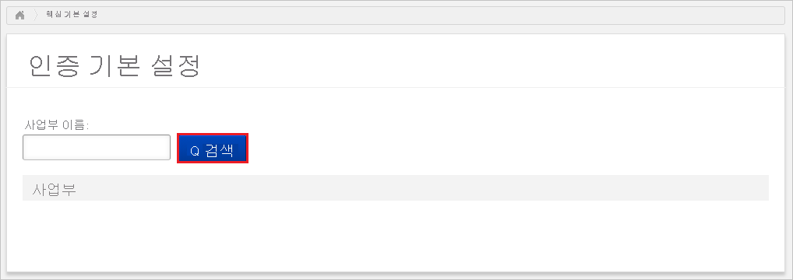
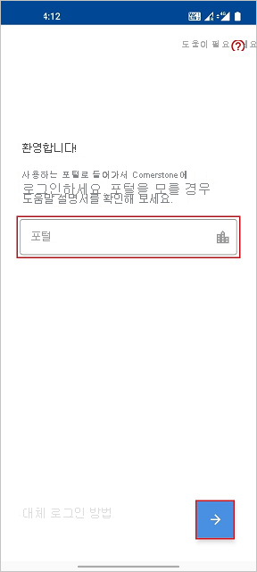
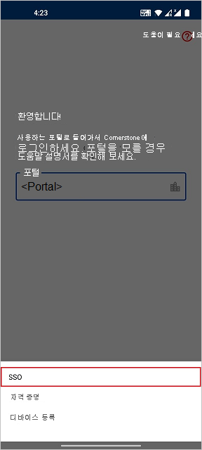
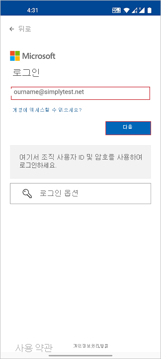

# 자습서: Cornerstone과 Azure Active Directory SSO(Single Sign-On) 통합

이 자습서에서는 Cornerstone과 Azure AD(Azure Active Directory) 간에 Single Sign-On 통합을 설정하는 방법을 알아봅니다. Azure AD와 Cornerstone을 통합하면 다음을 수행할 수 있습니다.

* Cornerstone에 대한 SSO 액세스 권한이 있는 사용자를 Azure AD에서 제어합니다.
* 사용자가 자신의 Azure AD 계정으로 Cornerstone에 자동으로 로그인되도록 설정합니다.
* 단일 중앙 위치인 Azure Portal에서 계정을 관리합니다.

## 사전 요구 사항

시작하려면 다음 항목이 필요합니다.

* Azure AD 구독 구독이 없는 경우 [체험 계정](https://azure.microsoft.com/free/)을 얻을 수 있습니다.
* Cornerstone에서 사용하도록 설정된 SSO

> [!NOTE]
> 이 통합은 Azure AD 미국 정부 클라우드 환경에서도 사용할 수 있습니다. 이 애플리케이션은 Azure AD 미국 정부 클라우드 애플리케이션 갤러리에서 찾을 수 있으며 퍼블릭 클라우드에서와 동일한 방법으로 구성할 수 있습니다.

## 시나리오 설명

이 자습서에서는 테스트 환경에서 Azure AD SSO를 구성하고 테스트합니다.

* Cornerstone은 **SP** 시작 SSO를 지원합니다.

* 이 특정 목록에서 제품을 하나 이상 통합하는 경우 갤러리에서 이 Cornerstone Single Sign-On 앱을 사용해야 합니다.

    다음에 대한 솔루션을 제공합니다.

    1. 모집
    2. 학습
    3. 개발
    4. 콘텐츠
    5. 성능
    6. 경력
    7. HR

## 갤러리에서 Cornerstone Single Sign-On 추가

Cornerstone과 Azure AD SSO 통합을 구성하려면 다음을 수행해야 합니다.

1. Azure Portal에 회사 또는 학교 계정, 개인 Microsoft 계정으로 로그인합니다.
1. 왼쪽 탐색 창에서 **Azure Active Directory** 서비스를 선택합니다.
1. **엔터프라이즈 애플리케이션** 으로 이동한 다음, **모든 애플리케이션** 을 선택합니다.
1. 새 애플리케이션을 추가하려면 **새 애플리케이션** 을 선택합니다.
1. **갤러리에서 추가** 섹션의 검색 상자에서 **Cornerstone Single Sign-On** 을 입력합니다.
1. 결과 패널에서 **Cornerstone Single Sign-On** 을 선택한 다음, 앱을 추가합니다. 앱이 테넌트에 추가될 때까지 잠시 동안 기다려 주세요.

## Cornerstone에 대한 Azure AD SSO 구성 및 테스트

**B.Simon** 이라는 테스트 사용자를 사용하여 Cornerstone에서 Azure AD SSO를 구성하고 테스트합니다. SSO가 작동하려면 Azure AD 사용자와 Cornerstone의 관련 사용자 간에 연결 관계를 설정해야 합니다.

Cornerstone에서 Azure AD SSO를 구성하고 테스트하려면 다음 단계를 수행합니다.

1. **[Azure AD SSO 구성](#configure-azure-ad-sso)** - 사용자가 이 기능을 사용할 수 있도록 합니다.
    1. **[Azure AD 테스트 사용자 만들기](#create-an-azure-ad-test-user)** - B.Simon을 사용하여 Azure AD Single Sign-On을 테스트합니다.
    1. **[Azure AD 테스트 사용자 할당](#assign-the-azure-ad-test-user)** - B. Simon이 Azure AD Single Sign-On을 사용할 수 있도록 합니다.
2. **[Cornerstone Single Sign-On 구성](#configure-cornerstone-single-sign-on)** - Cornerstone에서 SSO를 구성합니다.
    1. **[Cornerstone Single Sign-On 테스트 사용자 만들기](#create-cornerstone-single-sign-on-test-user)** - B.Simon의 Azure AD 표현과 연결된 해당 사용자를 Cornerstone에 만듭니다.
3. **[SSO 테스트](#test-sso)** - 구성이 작동하는지 여부를 확인합니다.
4. **[Cornerstone에 대한 SSO 테스트(모바일)](#test-sso-for-cornerstone-mobile)** - 구성이 작동하는지 여부를 확인합니다.

## Azure AD SSO 구성

Azure Portal에서 Azure AD SSO를 사용하도록 설정하려면 다음 단계를 수행합니다.

1. Azure Portal의 **Cornerstone Single Sign-On** 애플리케이션 통합 페이지에서 **관리** 섹션을 찾고, **Single Sign-On** 을 선택합니다.
1. **Single Sign-On 방법 선택** 페이지에서 **SAML** 을 선택합니다.
1. **SAML로 Single Sign-On 설정** 페이지에서 **기본 SAML 구성** 에 대한 연필 아이콘을 클릭하여 설정을 편집합니다.

   

1. **기본 SAML 구성** 섹션에서 다음 단계를 수행합니다.

    a. **식별자** 텍스트 상자에서 `https://<PORTAL_NAME>.csod.com` 패턴을 사용하여 URL을 입력합니다.

    b. **회신 URL** 텍스트 상자에서 `https://<PORTAL_NAME>.csod.com/samldefault.aspx?ouid=<OUID>` 패턴을 사용하여 URL을 입력합니다.

    다. **로그온 URL** 텍스트 상자에서 `https://<PORTAL_NAME>.csod.com/samldefault.aspx?ouid=<OUID>` 패턴을 사용하는 URL을 입력합니다.

    > [!NOTE]
    > 이러한 값은 실제 값이 아닙니다. 이러한 값을 실제 회신 URL, 식별자 및 로그온 URL로 업데이트합니다. 해당 값을 가져오려면 Cornerstone 구현 프로젝트 팀에 문의하세요. Azure Portal의 **기본 SAML 구성** 섹션에 표시된 패턴을 참조할 수도 있습니다.

4. **SAML로 Single Sign-On 설정** 페이지의 **SAML 서명 인증서** 섹션에서 **인증서(Base64)** 를 찾은 후 **다운로드** 를 선택하여 인증서를 다운로드하고 본인의 컴퓨터에 저장합니다.

    

6. **Cornerstone Single Sign-On 설정** 섹션에서 요구 사항에 따라 적절한 URL을 복사합니다.

    

### Azure AD 테스트 사용자 만들기

이 섹션에서는 Azure Portal에서 B.Simon이라는 테스트 사용자를 만듭니다.

1. Azure Portal의 왼쪽 창에서 **Azure Active Directory**, **사용자**, **모든 사용자** 를 차례로 선택합니다.
1. 화면 위쪽에서 **새 사용자** 를 선택합니다.
1. **사용자** 속성에서 다음 단계를 수행합니다.
    1. **이름** 필드에 `B.Simon`을 입력합니다.  
    1. **사용자 이름** 필드에서 username@companydomain.extension을 입력합니다. `B.Simon@contoso.com`)을 입력합니다.
    1. **암호 표시** 확인란을 선택한 다음, **암호** 상자에 표시된 값을 적어둡니다.
    1. **만들기** 를 클릭합니다.

### Azure AD 테스트 사용자 할당

이 섹션에서는 Azure Single Sign-On을 사용할 수 있도록 B.Simon에게 Cornerstone에 대한 액세스 권한을 부여합니다.

1. Azure Portal에서 **엔터프라이즈 애플리케이션** 을 선택한 다음, **모든 애플리케이션** 을 선택합니다.
1. 애플리케이션 목록에서 **Cornerstone Single Sign-On** 을 클릭합니다.
1. 앱의 개요 페이지에서 **관리** 섹션을 찾고 **사용자 및 그룹** 을 선택합니다.
1. **사용자 추가** 를 선택한 다음, **할당 추가** 대화 상자에서 **사용자 및 그룹** 을 선택합니다.
1. **사용자 및 그룹** 대화 상자의 사용자 목록에서 **B.Simon** 을 선택한 다음, 화면 아래쪽에서 **선택** 단추를 클릭합니다.
1. 사용자에게 역할을 할당할 것으로 예상되는 경우 **역할 선택** 드롭다운에서 선택할 수 있습니다. 이 앱에 대한 역할이 설정되지 않은 경우 "기본 액세스" 역할이 선택된 것으로 표시됩니다.
1. **할당 추가** 대화 상자에서 **할당** 단추를 클릭합니다.

## Cornerstone Single Sign-On 구성

Cornerstone에서 SSO를 구성하려면 Cornerstone 구현 프로젝트 팀에 문의해야 합니다. 이렇게 설정하면 SAML SSO 연결이 양쪽에서 제대로 설정됩니다.

### Cornerstone Single Sign-On 테스트 사용자 만들기

이 섹션에서는 Cornerstone에서 Britta Simon이라는 사용자를 만듭니다. Cornerstone에 사용자를 추가하려면 Cornerstone 구현 프로젝트 팀에 문의하세요. Single Sign-On을 사용하려면 먼저 사용자를 만들고 활성화해야 합니다.

## SSO 테스트 

이 섹션에서는 다음 옵션을 사용하여 Azure AD Single Sign-On 구성을 테스트합니다. 

* Azure Portal에서 **이 애플리케이션 테스트** 를 클릭합니다. 그러면 로그인 흐름을 시작할 수 있는 Cornerstone 로그온 URL로 리디렉션됩니다. 

* Cornerstone 로그온 URL로 직접 이동하여 해당 위치에서 로그인 흐름을 시작합니다.

* Microsoft 내 앱을 사용할 수 있습니다. 내 앱에서 Cornerstone Single Sign-On 타일을 클릭하면 Cornerstone 로그온 URL로 리디렉션됩니다. 내 앱에 대한 자세한 내용은 [내 앱 소개](../user-help/my-apps-portal-end-user-access.md)를 참조하세요.

## Cornerstone에 대한 SSO 테스트(모바일)

1. 다른 브라우저 창에서 Cornerstone 웹 사이트에 관리자로 로그인하고 다음 단계를 수행합니다.

    a. **관리 -> 도구 -> 핵심 기능 -> 핵심 기본 설정 -> 인증 기본 설정** 으로 이동합니다.

    

    b. 검색 상자에 부서 이름을 입력하여 **부서 이름** 을 검색합니다.

    c. 결과에서 **부서 이름** 을 클릭합니다.

    d. SAML/IDP 서버 URL 드롭다운에서 사용자 인증에 사용해야 하는 적절한 SAML/IDP 서버를 선택합니다.

    

    e. **저장** 을 클릭합니다.

1. **관리 > 도구 > 핵심 기능 > 핵심 기본 설정 > 모바일** 로 이동합니다.

    a. 적절한 **부서 OU** 를 선택합니다.

    b. OU에서 **사용자 허용** 을 선택하여 모바일 및 태블릿 디바이스와 모바일 액세스 사용의 확인란에서 Cornerstone Learn 앱에 액세스합니다.

    다. **저장** 을 클릭합니다.

2. **Cornerstone Learn** 모바일 애플리케이션을 엽니다. 로그인 페이지에서 포털 이름을 입력합니다.

    

3. **대체 로그인** 을 클릭한 다음, **SSO** 를 클릭합니다.

    

4. .  **Azure AD 자격 증명** 을 입력하여 Cornerstone 애플리케이션에 로그인하고 **다음** 을 클릭합니다.

    

5. 마지막으로 로그인하면 애플리케이션 홈페이지가 아래와 같이 표시됩니다.

    

## 다음 단계

Cornerstone Single Sign-On이 구성되면 세션 제어를 적용하여 조직의 중요한 데이터의 반출 및 반입을 실시간으로 보호할 수 있습니다. 세션 제어는 조건부 액세스에서 확장됩니다. [Microsoft Cloud App Security를 사용하여 세션 제어를 적용하는 방법 알아보기](/cloud-app-security/proxy-deployment-aad)
