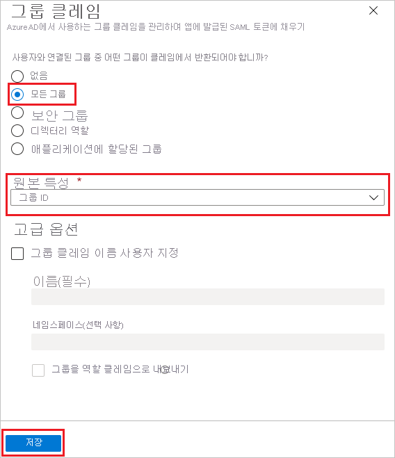
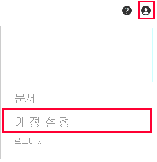
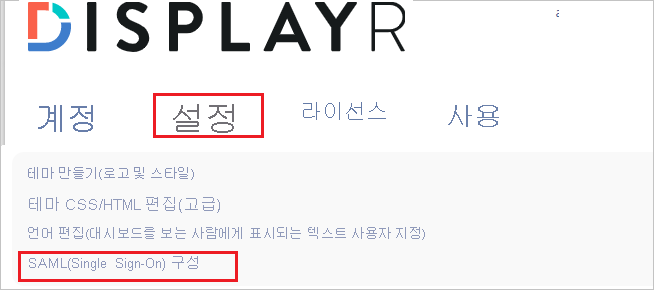
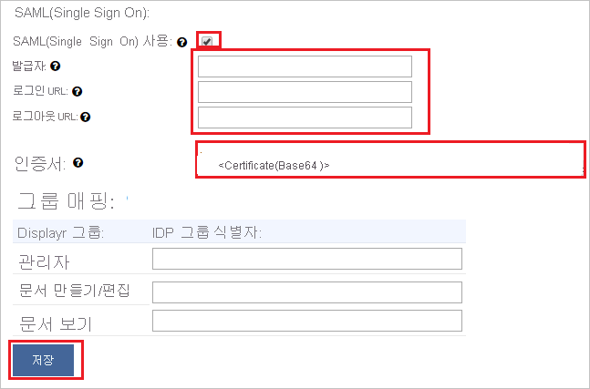

# 자습서: Displayr과 Azure Active Directory 통합

이 자습서에서는 Displayr을 Azure AD(Azure Active Directory)와 연결하는 방법을 알아봅니다. Azure AD와 Displayr을 통합하는 경우 다음을 수행할 수 있습니다.

* Displayr에 대한 액세스 권한이 있는 사용자를 Azure AD에 제어합니다.
* 사용자가 해당 Azure AD 계정으로 Displayr에 자동으로 로그온(Single Sign-On)되도록 설정할 수 있습니다.
* 단일 중앙 위치인 Azure Portal에서 계정을 관리합니다.

## 필수 구성 요소

시작하려면 다음 항목이 필요합니다.

* Azure AD 구독 구독이 없는 경우 [체험 계정](https://azure.microsoft.com/free/)을 얻을 수 있습니다.
* Displayr SSO(Single Sign-On)가 설정된 회사.

## 시나리오 설명

이 자습서에서는 Displayr 회사에서 Azure AD SSO를 구성하는 방법을 알아봅니다.

* Displayr에서 **SP** 시작 SSO를 지원합니다.

## 갤러리에서 Displayr 추가

Displayr이 Azure AD에 연결되도록 구성하려면 갤러리의 Displayr을 관리형 SaaS 앱 목록에 추가해야 합니다.

1. Azure Portal에 회사 또는 학교 계정, 개인 Microsoft 계정으로 로그인합니다.
1. 왼쪽 탐색 창에서 **Azure Active Directory** 서비스를 선택합니다.
1. **엔터프라이즈 애플리케이션** 으로 이동한 다음, **모든 애플리케이션** 을 선택합니다.
1. 새 애플리케이션을 추가하려면 **새 애플리케이션** 을 선택합니다.
1. **갤러리에서 추가** 섹션의 검색 상자에 **Displayr** 를 입력합니다.
1. 결과 패널에서 **Displayr** 를 선택한 후 앱을 추가합니다. 앱이 테넌트에 추가될 때까지 잠시 동안 기다려 주세요.

## Displayr에 대한 Azure AD SSO 구성

Displayr에서 Azure AD SSO를 구성하려면 다음 단계를 수행합니다.

1. 사용자가 이 기능을 사용할 수 있도록 **[Azure AD SSO를 구성](#configure-azure-ad-sso)** 합니다.
1. **[Displayr SSO 구성](#configure-displayr-sso)** - 애플리케이션 쪽에서 SSO 설정을 구성합니다.
1. **[특정 사용자에 대한 액세스를 제한](#restrict-access-to-specific-users)** 하여 Displayr에 로그인할 수 있는 Azure AD 사용자를 제한합니다.
1. **[SSO를 테스트](#test-sso)** 하여 구성이 작동하는지 여부를 확인합니다.

## Azure AD SSO 구성

Azure Portal에서 Azure AD SSO를 사용하도록 설정하려면 다음 단계를 수행합니다.

1. Azure Portal의 **Displayr** 애플리케이션 통합 페이지에서 **관리** 섹션을 찾아 **Single Sign-On** 을 선택합니다.
1. **Single Sign-On 방법 선택** 페이지에서 **SAML** 을 선택합니다.
1. **SAML로 Single Sign-On 설정** 페이지에서 **기본 SAML 구성** 에 대한 연필 아이콘을 클릭하여 설정을 편집합니다.

   

1. **기본 SAML 구성** 섹션에서 다음 단계를 수행합니다.

    a. **식별자(엔터티 ID)** 텍스트 상자에서 `<YOURDOMAIN>.displayr.com` 패턴을 사용하는 값을 입력합니다.
    
    b. **회신 URL** 텍스트 상자에서 `https://app.displayr.com/Login/ProcessSamlResponse` URL을 입력합니다.
    
    다. **로그인 URL** 텍스트 상자에서 `https://<YOURDOMAIN>.displayr.com` 패턴을 사용하여 URL을 입력합니다.

    d. **저장** 을 클릭합니다.

    >[!NOTE]
    >이러한 값은 실제 값이 아닙니다. 해당 값을 실제 식별자 및 로그온 URL로 업데이트합니다. 이러한 값을 얻으려면 [Displayr 클라이언트 지원 팀](mailto:support@displayr.com)에 문의하세요. Azure Portal의 기본 SAML 구성 섹션에 표시된 패턴을 참조할 수도 있습니다.

1. **SAML로 Single Sign-On 설정** 페이지의 **SAML 서명 인증서** 섹션에서 **인증서(Base64)** 를 찾은 다음, **다운로드** 를 선택하여 인증서를 다운로드하고 컴퓨터에 저장합니다.

   

1. Displayr 애플리케이션에는 특정 형식의 SAML 어설션이 필요하며, 이를 위해서는 SAML 토큰 특성 구성에 사용자 지정 특성 매핑을 추가해야 합니다. 다음 스크린샷에서는 기본 특성의 목록을 보여 줍니다. **편집** 아이콘을 클릭하여 사용자 특성 대화 상자를 엽니다.

   

1. 위에서 언급한 특성 외에도, Displayr 애플리케이션에는 SAML 응답에 다시 전달되어야 하는 몇 가지 특성이 추가로 필요합니다. **그룹 클레임(미리 보기)** 대화 상자의 **사용자 특성 및 클레임** 섹션에서 다음 단계를 수행합니다.

   a. **그룹 클레임 추가** 를 클릭합니다.

      

   b. 라디오 단추 목록에서 **모든 그룹** 을 선택합니다.

   다. **그룹 ID** 의 **원본 특성** 을 선택합니다.

   f. **저장** 을 클릭합니다.

1. **Displayr 설정** 섹션에서 요구 사항에 따라 적절한 URL을 복사합니다.

   

## Displayr SSO 구성

1. Displayr 내에서 구성을 자동화하려면 **확장 설치** 를 클릭하여 **내 앱 보안 로그인 브라우저 확장** 을 설치해야 합니다.

    

2. 브라우저에 확장을 추가한 후 **Displayr 설정** 을 클릭하면 Displayr 애플리케이션으로 이동됩니다. 여기에서 관리자 자격 증명을 입력하여 Displayr에 로그인합니다. 브라우저 확장이 애플리케이션을 자동으로 구성하고 3-6단계를 자동으로 수행합니다.

    

3. Displayr를 수동으로 설정하려면 새 웹 브라우저 창을 열고 Displayr 회사 사이트에 관리자로 로그인한 후에 다음 단계를 수행합니다.

4. **사용자** 아이콘을 클릭한 다음, **계정 설정** 으로 이동합니다.

    

5. 맨 위 메뉴에서 **설정** 으로 전환하고 페이지 아래로 스크롤하여 **Single Sign On 구성(SAML)** 을 클릭합니다.

    

6. **Single Sign-On(SAML)** 페이지에서 다음 단계를 수행합니다.

    

    a. **Single Sign-On 사용(SAML)** 확인란을 선택합니다.

    b. Azure AD의 **기본 SAML 구성** 섹션에서 실제 **식별자** 값을 복사한 후 **발급자** 텍스트 상자에 붙여넣습니다.

    다. Azure Portal에서 복사한 **로그인 URL** 값을 **로그인 URL** 텍스트 상자에 붙여넣습니다.

    d. Azure Portal에서 복사한 **로그아웃 URL** 값을 **로그아웃 URL** 텍스트 상자에 붙여넣습니다.

    e. 메모장에서 인증서(Base64)를 열고 내용을 복사한 다음, **인증서** 텍스트 상자에 붙여넣습니다.

    f. **그룹 매핑** 은 선택 사항입니다.

    g. **저장** 을 클릭합니다.  

### 특정 사용자에 대한 액세스 제한

기본적으로 Displayr 애플리케이션을 추가한 테넌트의 모든 사용자는 SSO를 사용하여 Displayr에 로그인할 수 있습니다. 특정 사용자 또는 그룹에 대한 액세스를 제한하려면 [Azure AD 테넌트에서 Azure AD 앱을 사용자 세트로 제한](../develop/howto-restrict-your-app-to-a-set-of-users.md)을 참조하세요.

## SSO 테스트

이 섹션에서는 다음 옵션을 사용하여 Azure AD Single Sign-On 구성을 테스트합니다. 

* Azure Portal에서 **이 애플리케이션 테스트** 를 클릭합니다. 그러면 로그인 흐름을 시작할 수 있는 Displayr 로그온 URL로 리디렉션됩니다. 

* Displayr 로그온 URL로 직접 이동하여 해당 위치에서 로그인 흐름을 시작합니다.

* Microsoft 내 앱을 사용할 수 있습니다. 내 앱에서 Displayr 타일을 클릭하면 Displayr 로그온 URL로 리디렉션됩니다. 내 앱에 대한 자세한 내용은 [내 앱 소개](https://support.microsoft.com/account-billing/sign-in-and-start-apps-from-the-my-apps-portal-2f3b1bae-0e5a-4a86-a33e-876fbd2a4510)를 참조하세요.

## 다음 단계

Displayr가 구성되면 세션 제어를 적용하여 조직의 중요한 데이터의 반출 및 반입을 실시간으로 보호할 수 있습니다. 세션 제어는 조건부 액세스에서 확장됩니다. [Microsoft Defender for Cloud Apps를 사용하여 세션 제어를 적용하는 방법을 알아봅니다](/cloud-app-security/proxy-deployment-aad).
