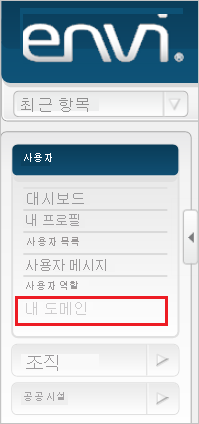
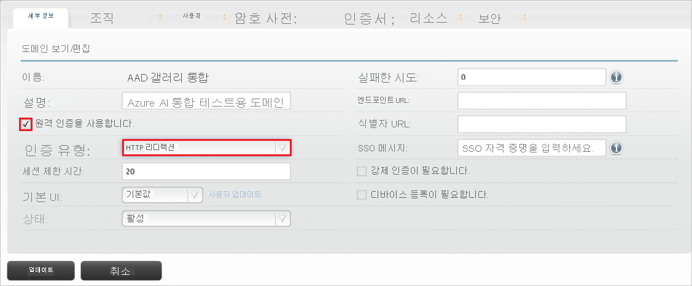
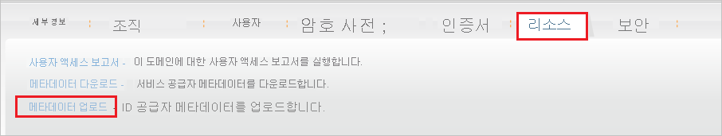
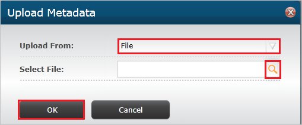
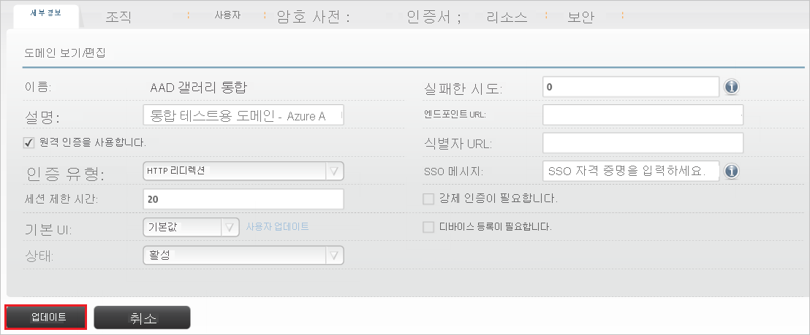
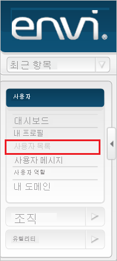
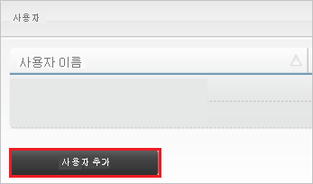
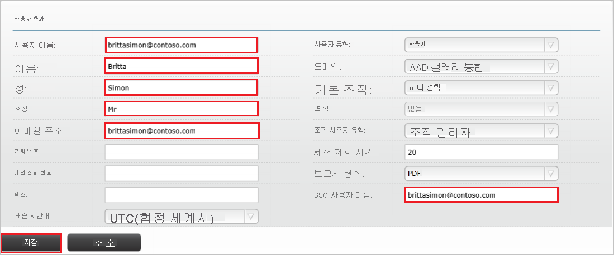

# 자습서: Envi MMIS와 Azure Active Directory 통합

이 자습서에서는 Azure AD(Azure Active Directory)와 Envi MMIS를 통합하는 방법에 대해 알아봅니다. Azure AD와 Envi MMIS를 통합하는 경우 다음을 수행할 수 있습니다.

* Envi MMIS에 대한 액세스 권한이 있는 사용자를 Azure AD에서 제어합니다.
* 사용자가 해당 Azure AD 계정으로 Envi MMIS에 자동으로 로그인되도록 설정할 수 있습니다.
* 단일 중앙 위치인 Azure Portal에서 계정을 관리합니다.

## 사전 요구 사항

시작하려면 다음 항목이 필요합니다.

* Azure AD 구독 구독이 없는 경우 [체험 계정](https://azure.microsoft.com/free/)을 얻을 수 있습니다.
* Envi MMIS SSO(Single Sign-On)가 설정된 구독

## 시나리오 설명

이 자습서에서는 테스트 환경에서 Azure AD Single Sign-On을 구성하고 테스트합니다.

* Envi MMIS는 **SP** 및 **IDP** 시작 SSO를 지원합니다.

## 갤러리에서 Envi MMIS 추가

Envi MMIS의 Azure AD 통합을 구성하려면 갤러리의 Envi MMIS를 관리되는 SaaS 앱 목록에 추가해야 합니다.

1. Azure Portal에 회사 또는 학교 계정, 개인 Microsoft 계정으로 로그인합니다.
1. 왼쪽 탐색 창에서 **Azure Active Directory** 서비스를 선택합니다.
1. **엔터프라이즈 애플리케이션** 으로 이동한 다음, **모든 애플리케이션** 을 선택합니다.
1. 새 애플리케이션을 추가하려면 **새 애플리케이션** 을 선택합니다.
1. **갤러리에서 추가** 섹션의 검색 상자에 **Envi MMIS** 를 입력합니다.
1. 결과 패널에서 **Envi MMIS** 를 선택한 다음, 앱을 추가합니다. 앱이 테넌트에 추가될 때까지 잠시 동안 기다려 주세요.

## Envi MMIS에 대한 Azure AD SSO 구성 및 테스트

**B.Simon** 이라는 테스트 사용자를 사용하여 Envi MMIS에서 Azure AD SSO를 구성하고 테스트합니다. SSO가 작동하려면 Azure AD 사용자와 Envi MMIS의 관련 사용자 간에 연결 관계를 설정해야 합니다.

Envi MMIS에서 Azure AD SSO를 구성하고 테스트하려면 다음 단계를 수행합니다.

1. **[Azure AD SSO 구성](#configure-azure-ad-sso)** - 사용자가 이 기능을 사용할 수 있도록 합니다.
    1. **[Azure AD 테스트 사용자 만들기](#create-an-azure-ad-test-user)** - B.Simon을 사용하여 Azure AD Single Sign-On을 테스트합니다.
    1. **[Azure AD 테스트 사용자 할당](#assign-the-azure-ad-test-user)** - B. Simon이 Azure AD Single Sign-On을 사용할 수 있도록 합니다.
1. **[Envi MMIS SSO 구성](#configure-envi-mmis-sso)** - 애플리케이션 쪽에서 Single Sign-On 설정을 구성합니다.
    1. **[Envi MMIS 테스트 사용자 만들기](#create-envi-mmis-test-user)** - B.Simon의 Azure AD 표현과 연결된 해당 사용자를 Envi MMIS에 만듭니다.
1. **[SSO 테스트](#test-sso)** - 구성이 작동하는지 여부를 확인합니다.

## Azure AD SSO 구성

Azure Portal에서 Azure AD SSO를 사용하도록 설정하려면 다음 단계를 수행합니다.

1. Azure Portal의 **Envi MMIS** 애플리케이션 통합 페이지에서 **관리** 섹션을 찾은 다음, **Single Sign-On** 을 선택합니다.
1. **Single Sign-On 방법 선택** 페이지에서 **SAML** 을 선택합니다.
1. **SAML로 Single Sign-On 설정** 페이지에서 **기본 SAML 구성** 에 대한 연필 아이콘을 클릭하여 설정을 편집합니다.

   

4. **IDP** 시작 모드에서 애플리케이션을 구성하려면 **기본 SAML 구성** 섹션에서 다음 단계를 수행합니다.

    1. **식별자** 텍스트 상자에서 `https://www.<CUSTOMER DOMAIN>.com/Account` 패턴을 사용하여 URL을 입력합니다.

    1. **회신 URL** 텍스트 상자에서 `https://www.<CUSTOMER DOMAIN>.com/Account/Acs` 패턴을 사용하여 URL을 입력합니다.

5. **SP** 시작 모드에서 애플리케이션을 구성하려면 **추가 URL 설정** 를 클릭하고 다음 단계를 수행합니다.

    **로그인 URL** 텍스트 상자에서 `https://www.<CUSTOMER DOMAIN>.com/Account` 패턴을 사용하여 URL을 입력합니다.

    > [!NOTE]
    > 이러한 값은 실제 값이 아닙니다. 실제 식별자, 회신 URL 및 로그온 URL을 사용하여 이러한 값을 업데이트합니다. 이러한 값을 얻으려면 [Envi MMIS 클라이언트 지원 팀](mailto:support@ioscorp.com)에 문의하세요. Azure Portal의 **기본 SAML 구성** 섹션에 표시된 패턴을 참조할 수도 있습니다.

6. **SAML로 Single Sign-On 설정** 페이지의 **SAML 서명 인증서** 섹션에서 **다운로드** 를 클릭하여 요구 사항에 따라 제공된 옵션에서 **페더레이션 메타데이터 XML** 을 다운로드하고 컴퓨터에 저장합니다.

    

7. **Envi MMIS 설정** 섹션에서 요구 사항에 따라 적절한 URL을 복사합니다.

    

### Azure AD 테스트 사용자 만들기 

이 섹션에서는 Azure Portal에서 B.Simon이라는 테스트 사용자를 만듭니다.

1. Azure Portal의 왼쪽 창에서 **Azure Active Directory**, **사용자**, **모든 사용자** 를 차례로 선택합니다.
1. 화면 위쪽에서 **새 사용자** 를 선택합니다.
1. **사용자** 속성에서 다음 단계를 수행합니다.
   1. **이름** 필드에 `B.Simon`을 입력합니다.  
   1. **사용자 이름** 필드에서 username@companydomain.extension을 입력합니다. 예들 들어 `B.Simon@contoso.com`입니다.
   1. **암호 표시** 확인란을 선택한 다음, **암호** 상자에 표시된 값을 적어둡니다.
   1. **만들기** 를 클릭합니다.

### Azure AD 테스트 사용자 할당

이 섹션에서는 Azure Single Sign-On을 사용할 수 있도록 B.Simon에게 Envi MMIS에 대한 액세스 권한을 부여합니다.

1. Azure Portal에서 **엔터프라이즈 애플리케이션** 을 선택한 다음, **모든 애플리케이션** 을 선택합니다.
1. 애플리케이션 목록에서 **Envi MMIS** 를 선택합니다.
1. 앱의 개요 페이지에서 **관리** 섹션을 찾고 **사용자 및 그룹** 을 선택합니다.
1. **사용자 추가** 를 선택한 다음, **할당 추가** 대화 상자에서 **사용자 및 그룹** 을 선택합니다.
1. **사용자 및 그룹** 대화 상자의 사용자 목록에서 **B.Simon** 을 선택한 다음, 화면 아래쪽에서 **선택** 단추를 클릭합니다.
1. 사용자에게 역할을 할당할 것으로 예상되는 경우 **역할 선택** 드롭다운에서 선택할 수 있습니다. 이 앱에 대한 역할이 설정되지 않은 경우 "기본 액세스" 역할이 선택된 것으로 표시됩니다.
1. **할당 추가** 대화 상자에서 **할당** 단추를 클릭합니다.

## Envi MMIS SSO 구성

1. 다른 웹 브라우저 창에서 Envi MMIS 회사 사이트에 관리자로 로그인합니다.

2. **내 도메인** 탭을 클릭합니다.

    

3. **편집** 을 클릭합니다.

    

4. **원격 인증 사용** 확인란을 선택한 다음, **인증 형식** 드롭다운에서 **HTTP 리디렉션** 을 선택합니다.

    

5. **리소스** 탭을 선택한 다음, **메타데이터 업로드** 를 클릭합니다.

    

6. **메타데이터 업로드** 팝업에서 다음 단계를 수행합니다.

    

    1. **업로드 위치** 드롭다운에서 **파일** 옵션을 선택합니다.

    1. **파일 선택 아이콘** 을 선택하여 Azure Portal에서 다운로드한 메타데이터 파일을 업로드합니다.

    1. **Ok** 를 클릭합니다.

7. 다운로드한 메타데이터 파일을 업로드하면 필드가 자동으로 채워집니다. **업데이트** 를 클릭합니다.

    

### Envi MMIS 테스트 사용자 만들기

Azure AD 사용자가 Envi MMIS에 로그인할 수 있도록 하려면 Envi MMIS로 프로비저닝되어야 합니다. Envi MMIS의 경우 프로비전은 수동 작업입니다.

**사용자 계정을 프로비전하려면 다음 단계를 수행합니다.**

1. Envi MMIS 회사 사이트에 관리자 권한으로 로그인합니다.

2. **사용자 목록** 탭을 클릭합니다.

    

3. **사용자 추가** 단추를 클릭합니다.

    

4. **사용자 추가** 섹션에서 다음 단계를 수행합니다.

    

    1. **사용자 이름** 텍스트 상자에 Britta Simon 계정의 사용자 이름(예: **brittasimon\@contoso.com**)을 입력합니다.
    
    1. **이름** 텍스트 상자에 BrittaSimon의 이름(예: **Britta**)을 입력합니다.

    1. **성** 텍스트 상자에 BrittaSimon의 성(예: **Simon**)을 입력합니다.

    1. 텍스트 상자의 **직함** 에 사용자의 직함을 입력합니다.

    1. **이메일 주소** 텍스트 상자에 Britta Simon 계정의 이메일 주소(예: **brittasimon\@contoso.com**)를 입력합니다.

    1. **SSO 사용자 이름** 텍스트 상자에 Britta Simon 계정의 사용자 이름(예: **brittasimon\@contoso.com**)을 입력합니다.

    1. **저장** 을 클릭합니다.

## SSO 테스트

이 섹션에서는 다음 옵션을 사용하여 Azure AD Single Sign-On 구성을 테스트합니다. 

#### SP 시작:

* Azure Portal에서 **이 애플리케이션 테스트** 를 클릭합니다. 그러면 로그인 흐름을 시작할 수 있는 Envi MMIS 로그온 URL로 리디렉션됩니다.  

* Envi MMIS 로그온 URL로 직접 이동하여 해당 위치에서 로그인 흐름을 시작합니다.

#### IDP 시작:

* Azure Portal에서 **이 애플리케이션 테스트** 를 클릭하면 SSO를 설정한 Envi MMIS에 자동으로 로그인됩니다. 

Microsoft 내 앱을 사용하여 모든 모드에서 애플리케이션을 테스트할 수도 있습니다. 내 앱에서 Envi MMIS 타일을 클릭하면 SP 모드로 구성된 경우 로그인 흐름을 시작하기 위해 애플리케이션 로그온 페이지로 리디렉션되고, IDP 모드로 구성된 경우에는 SSO를 설정한 Envi MMIS에 자동으로 로그인됩니다. 내 앱에 대한 자세한 내용은 [내 앱 소개](https://support.microsoft.com/account-billing/sign-in-and-start-apps-from-the-my-apps-portal-2f3b1bae-0e5a-4a86-a33e-876fbd2a4510)를 참조하세요.

## 다음 단계

Envi MMIS를 구성한 후에는 세션 제어를 적용하여 조직의 중요한 데이터의 반출 및 침입을 실시간으로 보호할 수 있습니다. 세션 제어는 조건부 액세스에서 확장됩니다. [Microsoft Cloud App Security를 사용하여 세션 제어를 적용하는 방법을 알아봅니다](/cloud-app-security/proxy-deployment-aad).
