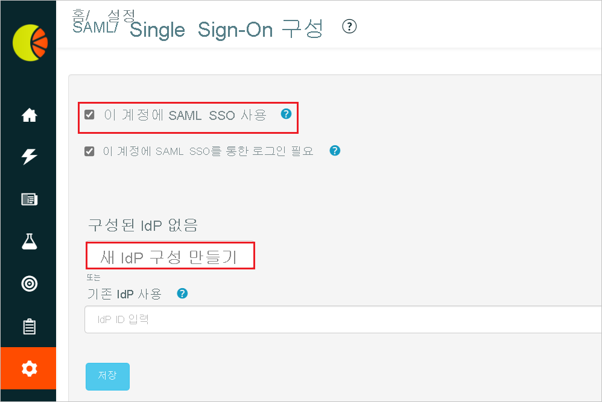
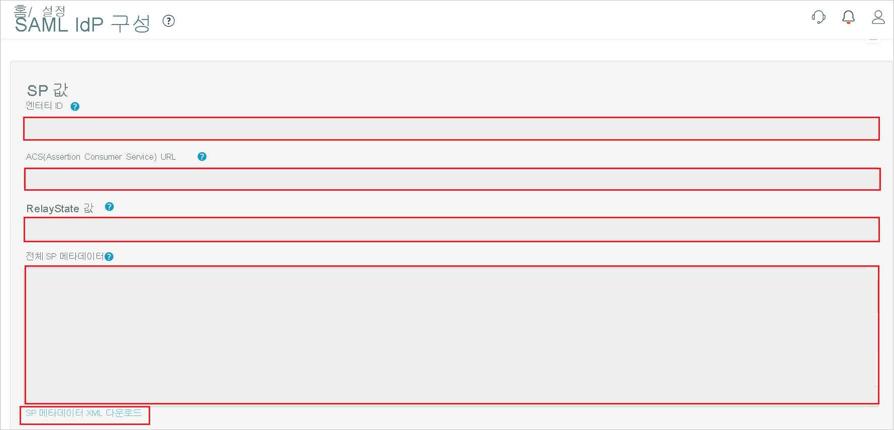
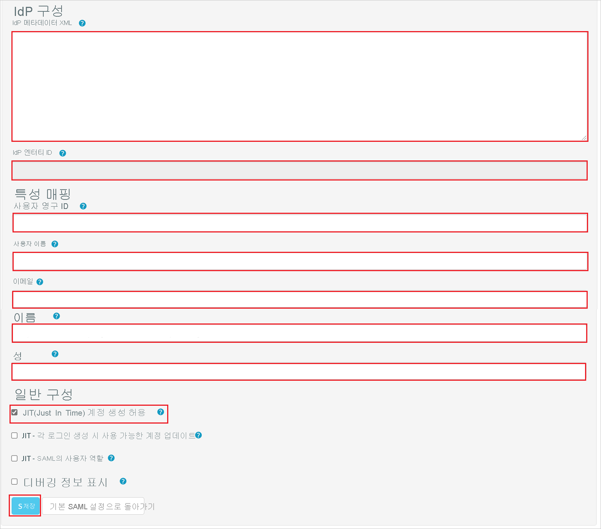

# 자습서: Fresh Relevance와 Azure Active Directory SSO(Single Sign-On) 통합

이 자습서에서는 Azure AD(Azure Active Directory)와 Fresh Relevance를 통합하는 방법에 대해 알아봅니다. Azure AD와 Fresh Relevance를 통합하면 다음 작업을 수행할 수 있습니다.

* Fresh Relevance에 대한 액세스 권한이 있는 사용자를 Azure AD에서 제어할 수 있습니다.
* 사용자가 해당 Azure AD 계정으로 Fresh Relevance에 자동으로 로그인되도록 설정할 수 있습니다.
* 단일 중앙 위치인 Azure Portal에서 계정을 관리합니다.

## 필수 구성 요소

시작하려면 다음 항목이 필요합니다.

* Azure AD 구독 구독이 없는 경우 [체험 계정](https://azure.microsoft.com/free/)을 얻을 수 있습니다.
* Fresh Relevance SSO(Single Sign-On)가 설정된 구독

## 시나리오 설명

이 자습서에서는 테스트 환경에서 Azure AD SSO를 구성하고 테스트합니다.

* Fresh Relevance는 **IDP** 시작 SSO를 지원합니다.

* Fresh Relevance는 **Just In Time** 사용자 프로비저닝을 지원합니다.

## 갤러리의 Fresh Relevance 추가

Azure AD에 대한 Fresh Relevance 통합을 구성하려면 갤러리의 Azure AD를 관리형 SaaS 앱 목록에 추가해야 합니다.

1. Azure Portal에 회사 또는 학교 계정, 개인 Microsoft 계정으로 로그인합니다.
1. 왼쪽 탐색 창에서 **Azure Active Directory** 서비스를 선택합니다.
1. **엔터프라이즈 애플리케이션** 으로 이동한 다음, **모든 애플리케이션** 을 선택합니다.
1. 새 애플리케이션을 추가하려면 **새 애플리케이션** 을 선택합니다.
1. **갤러리에서 추가** 섹션의 검색 상자에 **Fresh Relevance** 를 입력합니다.
1. 결과 패널에서 **Fresh Relevance** 를 선택한 다음, 앱을 추가합니다. 앱이 테넌트에 추가될 때까지 잠시 동안 기다려 주세요.

## Fresh Relevance에 대한 Azure AD SSO 구성 및 테스트

**B.Simon** 이라는 테스트 사용자를 사용하여 Fresh Relevance에서 Azure AD SSO를 구성하고 테스트합니다. SSO가 작동하려면 Azure AD 사용자와 Fresh Relevance의 관련 사용자 간에 연결 관계가 설정되어야 합니다.

Fresh Relevance에서 Azure AD SSO를 구성하고 테스트하려면 다음 단계를 수행합니다.

1. **[Azure AD SSO 구성](#configure-azure-ad-sso)** - 사용자가 이 기능을 사용할 수 있도록 합니다.
    1. **[Azure AD 테스트 사용자 만들기](#create-an-azure-ad-test-user)** - B.Simon을 사용하여 Azure AD Single Sign-On을 테스트합니다.
    1. **[Azure AD 테스트 사용자 할당](#assign-the-azure-ad-test-user)** - B. Simon이 Azure AD Single Sign-On을 사용할 수 있도록 합니다.
1. **[Fresh Relevance SSO 구성](#configure-fresh-relevance-sso)** - 애플리케이션 쪽에서 Single Sign-On 설정을 구성합니다.
    1. **[Fresh Relevance 테스트 사용자 만들기](#create-fresh-relevance-test-user)** - B.Simon의 Azure AD 표현과 연결된 해당 사용자를 Fresh Relevance에 만듭니다.
1. **[SSO 테스트](#test-sso)** - 구성이 작동하는지 여부를 확인합니다.

## Azure AD SSO 구성

Azure Portal에서 Azure AD SSO를 사용하도록 설정하려면 다음 단계를 수행합니다.

1. Azure Portal의 **Fresh Relevance** 애플리케이션 통합 페이지에서 **관리** 섹션을 찾은 후 **Single Sign-On** 을 선택합니다.
1. **Single Sign-On 방법 선택** 페이지에서 **SAML** 을 선택합니다.
1. **SAML로 Single Sign-On 설정** 페이지에서 **기본 SAML 구성** 에 대한 연필 아이콘을 클릭하여 설정을 편집합니다.

   

1. **서비스 공급자 메타데이터 파일** 이 있으면 **기본 SAML 구성** 섹션에서 다음 단계를 수행합니다.

    a. **메타데이터 파일 업로드** 를 클릭합니다.

    

    b. **폴더 로고** 를 클릭하여 메타데이터 파일을 선택하고 **업로드** 를 클릭합니다.

    

    다. 메타데이터 파일이 성공적으로 업로드되면 **식별자** 및 **회신 URL** 값이 기본 SAML 구성 섹션에 자동으로 채워집니다.

    > [!Note]
    > **식별자** 및 **회신 URL** 값이 자동으로 채워지지 않으면 요구 사항에 따라 값을 수동으로 입력합니다.

    d. **릴레이 상태** 텍스트 상자에서 다음 `<ID>` 패턴을 사용하여 값을 입력합니다.

1. **SAML로 Single Sign-On 설정** 페이지의 **SAML 서명 인증서** 섹션에서 복사 단추를 클릭하여 **앱 페더레이션 메타데이터 URL** 을 복사한 후 컴퓨터에 저장합니다.

    

### Azure AD 테스트 사용자 만들기

이 섹션에서는 Azure Portal에서 B.Simon이라는 테스트 사용자를 만듭니다.

1. Azure Portal의 왼쪽 창에서 **Azure Active Directory**, **사용자**, **모든 사용자** 를 차례로 선택합니다.
1. 화면 위쪽에서 **새 사용자** 를 선택합니다.
1. **사용자** 속성에서 다음 단계를 수행합니다.
   1. **이름** 필드에 `B.Simon`을 입력합니다.  
   1. **사용자 이름** 필드에서 username@companydomain.extension을 입력합니다. 예들 들어 `B.Simon@contoso.com`입니다.
   1. **암호 표시** 확인란을 선택한 다음, **암호** 상자에 표시된 값을 적어둡니다.
   1. **만들기** 를 클릭합니다.

### Azure AD 테스트 사용자 할당

이 섹션에서는 Azure Single Sign-On을 사용할 수 있도록 B.Simon에게 Fresh Relevance에 대한 액세스 권한을 부여합니다.

1. Azure Portal에서 **엔터프라이즈 애플리케이션** 을 선택한 다음, **모든 애플리케이션** 을 선택합니다.
1. 애플리케이션 목록에서 **Fresh Relevance** 를 선택합니다.
1. 앱의 개요 페이지에서 **관리** 섹션을 찾고 **사용자 및 그룹** 을 선택합니다.
1. **사용자 추가** 를 선택한 다음, **할당 추가** 대화 상자에서 **사용자 및 그룹** 을 선택합니다.
1. **사용자 및 그룹** 대화 상자의 사용자 목록에서 **B.Simon** 을 선택한 다음, 화면 아래쪽에서 **선택** 단추를 클릭합니다.
1. 사용자에게 역할을 할당할 것으로 예상되는 경우 **역할 선택** 드롭다운에서 선택할 수 있습니다. 이 앱에 대한 역할이 설정되지 않은 경우 &quot;기본 액세스&quot; 역할이 선택된 것으로 표시됩니다.
1. **할당 추가** 대화 상자에서 **할당** 단추를 클릭합니다.

## Fresh Relevance SSO 구성

1. Fresh Relevance 회사 사이트에 관리자 권한으로 로그인합니다.

1. **설정** > **모든 설정** > **보안 및 개인 정보** 로 이동하고 **SAML/Azure AD Single Sign-On** 을 클릭합니다.

    

1. **SAML/Single Sign-On 구성** 페이지에서 **이 계정에 SAML SSO 사용** 확인란을 선택하고 **새 IdP 구성 만들기** 단추를 클릭합니다. 

    

1. **SAML IdP 구성** 페이지에서 다음 단계를 수행합니다.

    

    

    a. **엔터티 ID** 값을 복사하여 Azure Portal의 **기본 SAML 구성** 섹션에 있는 **식별자(엔터티 ID)** 텍스트 상자에 붙여넣습니다.

    b. **ACS(Assertion Consumer Service) URL** 값을 복사하고, 이 값을 Azure Portal의 **기본 SAML 구성** 섹션에 있는 **회신 URL** 텍스트 상자에 붙여넣습니다.

    다. **RelayState 값** 을 복사하고, 이 값을 Azure Portal의 **기본 SAML 구성** 섹션에 있는 **릴레이 상태** 텍스트 상자에 붙여넣습니다.

    d. **SP 메타데이터 XML 다운로드** 를 클릭하고 Azure Portal의 **기본 SAML 구성** 섹션에서 메타데이터 파일을 업로드합니다.

    e. Azure Portal의 **앱 페더레이션 메타데이터 URL** 을 메모장에 복사하고 **IdP 메타데이터 XML** 텍스트 상자에 콘텐츠를 붙여넣고 **저장** 단추를 클릭합니다.

    f. 성공하면 IdP의 **엔터티 ID** 와 같은 정보가 **IdP 엔터티 ID** 텍스트 상자에 표시됩니다.

    g. **특성 매핑** 섹션에서 Azure Portal에서 복사한 필수 필드를 수동으로 채웁니다.

    h. **일반 구성** 섹션에서 **JIT(Just In Time) 계정 만들기** 를 사용하도록 설정하고 **저장** 을 클릭합니다.

    > [!NOTE]
    > 이러한 매개 변수가 올바르게 매핑되지 않으면 로그인/계정 만들기가 성공하지 못하고 오류가 표시됩니다. 로그온 실패에 대한 향상된 특성 디버깅 정보를 일시적으로 표시하려면 **디버깅 정보 표시** 확인란을 사용하도록 설정합니다.

### Fresh Relevance 테스트 사용자 만들기

이 섹션에서는 Fresh Relevance에서 Britta Simon이라는 사용자를 만듭니다. Fresh Relevance는 Just-In-Time 사용자 프로비저닝을 지원하며, 이는 기본적으로 사용하도록 설정되어 있습니다. 이 섹션에 작업 항목이 없습니다. Fresh Relevance에 사용자가 아직 없는 경우 인증 후에 새 사용자가 만들어집니다.

## SSO 테스트 

이 섹션에서는 다음 옵션을 사용하여 Azure AD Single Sign-On 구성을 테스트합니다.

* Azure Portal에서 이 애플리케이션 테스트를 클릭하면 SSO를 설정한 Fresh Relevance에 자동으로 로그인됩니다.

* Microsoft 내 앱을 사용할 수 있습니다. 내 앱에서 Fresh Relevance 타일을 클릭하면 SSO를 설정한 Fresh Relevance에 자동으로 로그인됩니다. 내 앱에 대한 자세한 내용은 [내 앱 소개](https://support.microsoft.com/account-billing/sign-in-and-start-apps-from-the-my-apps-portal-2f3b1bae-0e5a-4a86-a33e-876fbd2a4510)를 참조하세요.

## 다음 단계

Fresh Relevance가 구성되면 세션 제어를 적용하여 조직의 중요한 데이터의 반출 및 반입을 실시간으로 보호할 수 있습니다. 세션 제어는 조건부 액세스에서 확장됩니다. [Microsoft Cloud App Security를 사용하여 세션 제어를 적용하는 방법을 알아봅니다](/cloud-app-security/proxy-deployment-aad).