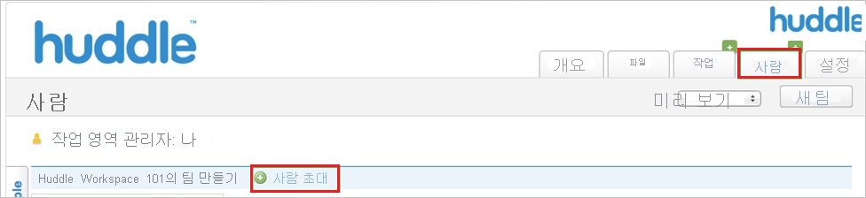
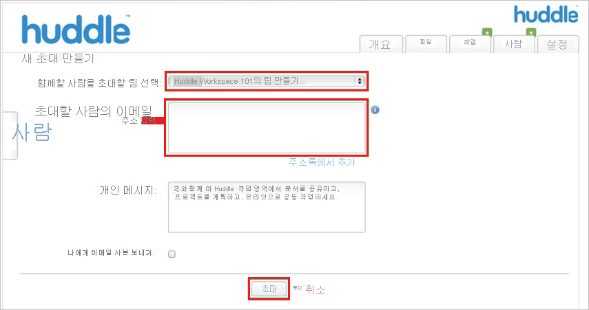

# 자습서: Huddle과 Azure AD SSO 통합

이 자습서에서는 Azure AD(Azure Active Directory)와 Huddle을 통합하는 방법에 대해 알아봅니다. Azure AD와 Huddle을 통합하면 다음을 수행할 수 있습니다.

* Azure AD에서 Huddle에 액세스할 수 있는 사용자를 제어합니다.
* 사용자가 해당 Azure AD 계정으로 Huddle에 자동으로 로그인되도록 설정합니다.
* 단일 중앙 위치인 Azure Portal에서 계정을 관리합니다.

## 필수 구성 요소

시작하려면 다음 항목이 필요합니다.

* Azure AD 구독 구독이 없는 경우 [체험 계정](https://azure.microsoft.com/free/)을 얻을 수 있습니다.
* Huddle SSO(Single Sign-On)를 사용하도록 설정된 구독

## 시나리오 설명

이 자습서에서는 테스트 환경에서 Azure AD Single Sign-On을 구성하고 테스트합니다.

* Huddle에서 **SP 및 IDP** 시작 SSO를 지원합니다.

> [!NOTE]
> 이 애플리케이션의 식별자는 고정 문자열 값이므로 하나의 테넌트에서 하나의 인스턴스만 구성할 수 있습니다.

## 갤러리에서 Huddle 추가

Huddle의 Azure AD 통합을 구성하려면 갤러리의 Huddle을 관리되는 SaaS 앱 목록에 추가해야 합니다.

1. Azure Portal에 회사 또는 학교 계정, 개인 Microsoft 계정으로 로그인합니다.
1. 왼쪽 탐색 창에서 **Azure Active Directory** 서비스를 선택합니다.
1. **엔터프라이즈 애플리케이션** 으로 이동한 다음, **모든 애플리케이션** 을 선택합니다.
1. 새 애플리케이션을 추가하려면 **새 애플리케이션** 을 선택합니다.
1. **갤러리에서 추가** 섹션의 검색 상자에서 **Huddle** 을 입력합니다.
1. 결과 패널에서 **Huddle** 을 선택한 다음, 앱을 추가합니다. 앱이 테넌트에 추가될 때까지 잠시 동안 기다려 주세요.

## Huddle에 대한 Azure AD SSO 구성 및 테스트

**B.Simon** 이라는 테스트 사용자를 사용하여 Huddle에서 Azure AD SSO를 구성하고 테스트합니다. SSO가 작동하려면 Azure AD 사용자와 Huddle의 관련 사용자 간에 연결 관계를 설정해야 합니다.

Huddle에서 Azure AD SSO를 구성하고 테스트하려면 다음 단계를 수행합니다.

1. 사용자가 이 기능을 사용할 수 있도록 **[Azure AD SSO를 구성](#configure-azure-ad-sso)** 합니다.
    1. **[Azure AD 테스트 사용자 만들기](#create-an-azure-ad-test-user)** - B. Simon을 사용하여 Azure AD Single Sign-On을 테스트합니다.
    1. **[Azure AD 테스트 사용자 할당](#assign-the-azure-ad-test-user)** - B. Simon이 Azure AD Single Sign-on을 사용할 수 있도록 합니다.
1. **[Huddle SSO 구성](#configure-huddle-sso)** - 애플리케이션 쪽에서 SSO 설정을 구성합니다.
    1. **[Huddle 테스트 사용자 만들기](#create-huddle-test-user)** - B. Simon의 Azure AD 표현과 연결된 해당 사용자를 Huddle에 만듭니다.
1. **[SSO를 테스트](#test-sso)** 하여 구성이 작동하는지 여부를 확인합니다.

## Azure AD SSO 구성

Azure Portal에서 Azure AD SSO를 사용하도록 설정하려면 다음 단계를 수행합니다.

1. Azure Portal의 **Huddle** 애플리케이션 통합 페이지에서 **관리** 섹션을 찾고, **Single Sign-On** 을 선택합니다.
1. **Single Sign-On 방법 선택** 페이지에서 **SAML** 을 선택합니다.
1. **SAML로 Single Sign-On 설정** 페이지에서 **기본 SAML 구성** 에 대한 연필 아이콘을 클릭하여 설정을 편집합니다.

   

4. **IDP** 시작 모드에서 애플리케이션을 구성하려면 **기본 SAML 구성** 섹션에서 다음 단계를 수행합니다.

    > [!NOTE]
    > 아래에 입력하는 도메인에서 Huddle 인스턴스가 자동으로 검색됩니다.

    a. **식별자** 텍스트 상자에서 다음 URL 중 하나를 입력합니다.

    | **식별자** |
    |------|
    | `https://login.huddle.net` |
    | `https://login.huddle.com` |

    b. **회신 URL** 텍스트 상자에서 다음 URL 중 하나를 입력합니다.

    | **회신 URL** |
    |----|
    | `https://login.huddle.net/saml/browser-sso` |
    | `https://login.huddle.com/saml/browser-sso` |
    | `https://login.huddle.com/saml/idp-initiated-sso` |

5. **SP** 시작 모드에서 애플리케이션을 구성하려면 **추가 URL 설정** 를 클릭하고 다음 단계를 수행합니다.

    **로그온 URL** 텍스트 상자에서 다음 패턴을 사용하여 URL을 입력합니다.

    | **로그온 URL** |
    |----|
    | `https://<customsubdomain>.huddle.com` |
    | `https://us.huddle.com` |
      
    > [!NOTE]
    > 로그온 URL 값은 실제 값이 아닙니다. 이 값을 실제 로그온 URL로 업데이트합니다. 이 값을 얻으려면 [Huddle 클라이언트 지원 팀](https://huddle.zendesk.com)에 문의하세요.

6. **SAML로 Single Sign-On 설정** 페이지의 **SAML 서명 인증서** 섹션에서 **다운로드** 를 클릭하여 요구 사항에 따라 제공된 옵션에서 **인증서(Base64)** 를 다운로드한 다음, 컴퓨터에 저장합니다.

    

7. **Huddle 설정** 섹션에서 요구 사항에 따라 적절한 URL을 복사합니다.

    

### Azure AD 테스트 사용자 만들기

이 섹션에서는 Azure Portal에서 B. Simon이라는 테스트 사용자를 만듭니다.

1. Azure Portal의 왼쪽 창에서 **Azure Active Directory**, **사용자**, **모든 사용자** 를 차례로 선택합니다.
1. 화면 위쪽에서 **새 사용자** 를 선택합니다.
1. **사용자** 속성에서 다음 단계를 수행합니다.
   1. **이름** 필드에 `B. Simon`을 입력합니다.  
   1. **사용자 이름** 필드에서 username@companydomain.extension을 입력합니다. 예들 들어 `B. Simon@contoso.com`입니다.
   1. **암호 표시** 확인란을 선택한 다음, **암호** 상자에 표시된 값을 적어둡니다.
   1. **만들기** 를 클릭합니다.

### Azure AD 테스트 사용자 할당

이 섹션에서는 B.Simon에게 Huddle에 대한 액세스 권한을 부여하여 해당 사용자가 Azure Single Sign-On을 사용하도록 설정합니다.

1. Azure Portal에서 **엔터프라이즈 애플리케이션** 을 선택한 다음, **모든 애플리케이션** 을 선택합니다.
1. 애플리케이션 목록에서 **Huddle** 을 선택합니다.
1. 앱의 개요 페이지에서 **관리** 섹션을 찾고 **사용자 및 그룹** 을 선택합니다.
1. **사용자 추가** 를 선택한 다음, **할당 추가** 대화 상자에서 **사용자 및 그룹** 을 선택합니다.
1. **사용자 및 그룹** 대화 상자의 사용자 목록에서 **B. Simon** 을 선택한 다음, 화면 아래쪽에서 **선택** 단추를 클릭합니다.
1. SAML 어설션에 역할 값이 필요한 경우 **역할 선택** 대화 상자의 목록에서 사용자에 대한 적절한 역할을 선택한 다음, 화면의 아래쪽에 있는 **선택** 단추를 클릭합니다.
1. **할당 추가** 대화 상자에서 **할당** 단추를 클릭합니다.

## Huddle SSO 구성

**Huddle** 쪽에서 Single Sign-On을 구성하려면 Azure Portal에서 다운로드한 **인증서(Base64)** 와 적절히 복사한 URL을 [Huddle 지원 팀](https://huddle.zendesk.com/)으로 보내야 합니다. 이렇게 설정하면 SAML SSO 연결이 양쪽에서 제대로 설정됩니다.

> [!NOTE]
> Single Sign-on은 Huddle 지원팀에서 사용할 수 있어야 합니다. 구성이 완료되면 알림을 받아 볼 수 있습니다.

### Huddle 테스트 사용자 만들기

Azure AD 사용자가 Huddle에 로그인할 수 있도록 하려면 Huddle로 프로비전되어야 합니다. Huddle의 경우 프로비전은 수동 작업입니다.

**사용자 프로비전을 구성하려면 다음 단계를 수행합니다.**

1. **Huddle** 회사 사이트에 관리자 권한으로 로그인합니다.

2. **작업 영역** 을 클릭합니다.

3. **피플 \> 피플 초대** 를 클릭합니다.

    

4. **새 초대 만들기** 섹션에서 다음 단계를 수행합니다.
  
    
  
    a. **팀을 선택하여 참여할 사용자 초대** 목록에서 **팀** 을 선택합니다.

    b. 프로비전할 유효한 Azure AD 계정의 **메일 주소** 를 **Enter email address for people you'd like to invite**(초대할 사람의 메일 주소 입력) 텍스트 상자에 입력합니다.

    다. **초대** 를 클릭합니다.

    > [!NOTE]
    > Azure AD 계정 보유자는 활성화되기 전에 계정을 확인하기 위한 링크를 포함한 전자 메일을 받습니다.

> [!NOTE]
> 다른 Huddle 사용자 계정 생성 도구 또는 Huddle이 제공한 API를 사용하여 Azure AD 사용자 계정을 프로비전할 수 있습니다.

## SSO 테스트

이 섹션에서는 다음 옵션을 사용하여 Azure AD Single Sign-On 구성을 테스트합니다. 

#### SP 시작:

* Azure Portal에서 **이 애플리케이션 테스트** 를 클릭합니다. 그러면 로그인 흐름을 시작할 수 있는 Huddle 로그온 URL로 리디렉션됩니다.  

* Huddle 로그온 URL로 직접 이동하여 해당 위치에서 로그인 흐름을 시작합니다.

#### IDP 시작:

* Azure Portal에서 **이 애플리케이션 테스트** 를 클릭하면 SSO를 설정한 Huddle에 자동으로 로그인됩니다. 

Microsoft 내 앱을 사용하여 모든 모드에서 애플리케이션을 테스트할 수도 있습니다. 내 앱에서 Huddle 타일을 클릭하면 SP 모드로 구성된 경우 로그인 흐름을 시작하기 위해 애플리케이션 로그온 페이지로 리디렉션되고, IDP 모드로 구성된 경우 SSO를 설정한 Huddle에 자동으로 로그인됩니다. 내 앱에 대한 자세한 내용은 [내 앱 소개](../user-help/my-apps-portal-end-user-access.md)를 참조하세요.

## 다음 단계

Huddle이 구성되면 세션 제어를 적용하여 조직의 중요한 데이터의 반출 및 반입을 실시간으로 보호할 수 있습니다. 세션 제어는 조건부 액세스에서 확장됩니다. [Microsoft Cloud App Security를 사용하여 세션 제어를 적용하는 방법을 알아봅니다](/cloud-app-security/proxy-deployment-aad).