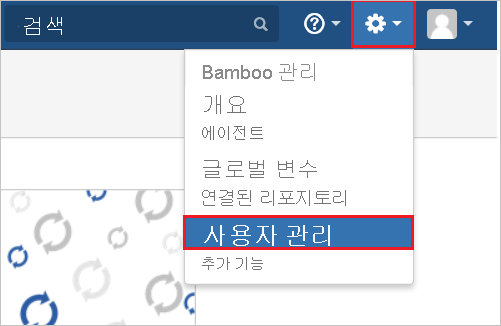

# 자습서: Kantega SSO for Bamboo와 Azure AD SSO 통합

이 자습서에서는 Kantega SSO for Bamboo를 Azure AD(Azure Active Directory)와 통합하는 방법에 대해 알아봅니다. Azure AD와 Kantega SSO for Bamboo를 통합하면 다음을 수행할 수 있습니다.

* Kantega SSO for Bamboo에 대한 액세스 권한이 있는 사용자를 Azure AD에서 제어합니다.
* 사용자가 자신의 Azure AD 계정으로 Kantega SSO for Bamboo에 자동으로 로그인되도록 설정합니다.
* 단일 중앙 위치인 Azure Portal에서 계정을 관리합니다.

## 사전 요구 사항

Kantega SSO for Bamboo와 Azure AD 통합을 구성하려면 다음 항목이 필요합니다.

* Azure AD 구독 Azure AD 환경이 없으면 [체험 계정](https://azure.microsoft.com/free/)을 얻을 수 있습니다.
* Kantega SSO for Bamboo Single Sign-On이 설정된 구독

## 시나리오 설명

이 자습서에서는 테스트 환경에서 Azure AD Single Sign-On을 구성하고 테스트합니다.

* Kantega SSO for Bamboo는 **SP 및 IDP** 시작 SSO를 지원합니다.

## 갤러리에서 Kantega SSO for Bamboo 추가

Kantega SSO for Bamboo가 Azure AD에 통합되도록 구성하려면 갤러리에서 Kantega SSO for Bamboo를 관리되는 SaaS 앱 목록에 추가해야 합니다.

1. Azure Portal에 회사 또는 학교 계정, 개인 Microsoft 계정으로 로그인합니다.
1. 왼쪽 탐색 창에서 **Azure Active Directory** 서비스를 선택합니다.
1. **엔터프라이즈 애플리케이션** 으로 이동한 다음, **모든 애플리케이션** 을 선택합니다.
1. 새 애플리케이션을 추가하려면 **새 애플리케이션** 을 선택합니다.
1. **갤러리에서 추가** 섹션의 검색 상자에서 **Kantega SSO for Bamboo** 를 입력합니다.
1. 결과 패널에서 **Kantega SSO for Bamboo** 를 선택한 다음, 앱을 추가합니다. 앱이 테넌트에 추가될 때까지 잠시 동안 기다려 주세요.

## Kantega SSO for Bamboo에 대한 Azure AD SSO 구성 및 테스트

**B.Simon** 이라는 테스트 사용자를 사용하여 Kantega SSO for Bamboo에서 Azure AD SSO를 구성하고 테스트합니다. SSO가 작동하려면 Azure AD 사용자와 Kantega SSO for Bamboo의 관련 사용자 간에 연결 관계를 설정해야 합니다.

Kantega SSO for Bamboo에서 Azure AD SSO를 구성하고 테스트하려면 다음 단계를 수행합니다.

1. **[Azure AD SSO 구성](#configure-azure-ad-sso)** - 사용자가 이 기능을 사용할 수 있도록 합니다.
    1. **[Azure AD 테스트 사용자 만들기](#create-an-azure-ad-test-user)** - B.Simon을 사용하여 Azure AD Single Sign-On을 테스트합니다.
    1. **[Azure AD 테스트 사용자 할당](#assign-the-azure-ad-test-user)** - B. Simon이 Azure AD Single Sign-On을 사용할 수 있도록 합니다.
1. **[Kantega SSO for Bamboo Single Sign-On 구성](#configure-kantega-sso-for-bamboo-sso)** - 애플리케이션 쪽에서 Single Sign-On 설정을 구성합니다.
    1. **[Kantega SSO for Bamboo 테스트 사용자 만들기](#create-kantega-sso-for-bamboo-test-user)** - B.Simon의 Azure AD 표현과 연결되는 대응 사용자를 Kantega SSO for Bamboo에 만듭니다.
1. **[SSO 테스트](#test-sso)** - 구성이 작동하는지 여부를 확인합니다.

## Azure AD SSO 구성

Azure Portal에서 Azure AD SSO를 사용하도록 설정하려면 다음 단계를 수행합니다.

1. Azure Portal의 **Kantega SSO for Bamboo** 애플리케이션 통합 페이지에서 **관리** 섹션을 찾은 후 **Single Sign-On** 을 선택합니다.
1. **Single Sign-On 방법 선택** 페이지에서 **SAML** 을 선택합니다.
1. **SAML로 Single Sign-On 설정** 페이지에서 **기본 SAML 구성** 에 대한 연필 아이콘을 클릭하여 설정을 편집합니다.

   

4. **IDP** 시작 모드에서 애플리케이션을 구성하려면 **기본 SAML 구성** 섹션에서 다음 단계를 수행합니다.

    a. **식별자** 텍스트 상자에서 `https://<server-base-url>/plugins/servlet/no.kantega.saml/sp/<uniqueid>/login` 패턴을 사용하여 URL을 입력합니다.

    b. **회신 URL** 텍스트 상자에서 `https://<server-base-url>/plugins/servlet/no.kantega.saml/sp/<uniqueid>/login` 패턴을 사용하여 URL을 입력합니다.

5. **SP** 시작 모드에서 애플리케이션을 구성하려면 **추가 URL 설정** 를 클릭하고 다음 단계를 수행합니다.

    **로그인 URL** 텍스트 상자에서 `https://<server-base-url>/plugins/servlet/no.kantega.saml/sp/<uniqueid>/login` 패턴을 사용하여 URL을 입력합니다.

    > [!NOTE]
    > 이러한 값은 실제 값이 아닙니다. 실제 식별자, 회신 URL 및 로그온 URL을 사용하여 이러한 값을 업데이트합니다. 이러한 값은 Bamboo 플러그 인 구성 중에 수신되며 자습서의 뒷부분에 설명되어 있습니다.

6. **SAML로 Single Sign-On 설정** 페이지의 **SAML 서명 인증서** 섹션에서 **다운로드** 를 클릭하여 요구 사항에 따라 제공된 옵션에서 **페더레이션 메타데이터 XML** 을 다운로드하고 컴퓨터에 저장합니다.

    

7. **Kantega SSO for Bamboo 설정** 섹션에서 요구 사항에 따라 적절한 URL을 복사합니다.

    

### Azure AD 테스트 사용자 만들기

이 섹션에서는 Azure Portal에서 B.Simon이라는 테스트 사용자를 만듭니다.

1. Azure Portal의 왼쪽 창에서 **Azure Active Directory**, **사용자**, **모든 사용자** 를 차례로 선택합니다.
1. 화면 위쪽에서 **새 사용자** 를 선택합니다.
1. **사용자** 속성에서 다음 단계를 수행합니다.
   1. **이름** 필드에 `B.Simon`을 입력합니다.  
   1. **사용자 이름** 필드에서 username@companydomain.extension을 입력합니다. 예들 들어 `B.Simon@contoso.com`입니다.
   1. **암호 표시** 확인란을 선택한 다음, **암호** 상자에 표시된 값을 적어둡니다.
   1. **만들기** 를 클릭합니다.

### Azure AD 테스트 사용자 할당

이 섹션에서는 Azure Single Sign-On을 사용할 수 있도록 B.Simon에게 Kantega SSO for Bamboo에 대한 액세스 권한을 부여합니다.

1. Azure Portal에서 **엔터프라이즈 애플리케이션** 을 선택한 다음, **모든 애플리케이션** 을 선택합니다.
1. 애플리케이션 목록에서 **Kantega SSO for Bamboo** 를 선택합니다.
1. 앱의 개요 페이지에서 **관리** 섹션을 찾고 **사용자 및 그룹** 을 선택합니다.
1. **사용자 추가** 를 선택한 다음, **할당 추가** 대화 상자에서 **사용자 및 그룹** 을 선택합니다.
1. **사용자 및 그룹** 대화 상자의 사용자 목록에서 **B.Simon** 을 선택한 다음, 화면 아래쪽에서 **선택** 단추를 클릭합니다.
1. 사용자에게 역할을 할당할 것으로 예상되는 경우 **역할 선택** 드롭다운에서 선택할 수 있습니다. 이 앱에 대한 역할이 설정되지 않은 경우 "기본 액세스" 역할이 선택된 것으로 표시됩니다.
1. **할당 추가** 대화 상자에서 **할당** 단추를 클릭합니다.

## Kantega SSO for Bamboo SSO 구성

1. 다른 웹 브라우저 창에서 Bamboo 온-프레미스 서버에 관리자로 로그인합니다.

1. 마우스로 선 위를 가리키고 **추가 기능** 을 클릭합니다.

    

1. [추가 기능] 탭 섹션에서 **새 추가 기능 찾기** 를 클릭합니다. **Kantega SSO for Bamboo(SAML & Kerberos)** 를 검색하고 **설치** 단추를 클릭하여 새 SAML 플러그 인을 설치합니다.

    

1. 플러그 인 설치가 시작됩니다.

    

1. 설치가 완료되면 **닫기** 를 클릭합니다.

    

1. **관리** 를 클릭합니다.

    

1. **구성** 을 클릭하여 새 플러그 인을 구성합니다.

    

1. **SAML** 섹션의 **ID 공급자 추가** 드롭다운에서 **Azure AD(Azure Active Directory)** 를 선택합니다.

    

1. 구독 수준을 **기본** 으로 선택합니다.

    

1. **앱 속성** 섹션에서 다음 단계를 수행합니다.

    

    a. **앱 ID URI** 를 복사하여 Azure Portal의 **기본 SAML 구성** 섹션에서 **식별자, 회신 URL 및 로그온 URL** 로 사용합니다.

    b. **다음** 을 클릭합니다.

1. **Metadata import**(메타데이터 가져오기) 섹션에서 다음 단계를 수행합니다.

    

    a. **Metadata file on my computer**(내 컴퓨터의 메타데이터 파일)를 클릭하여 Azure Portal에서 다운로드한 메타데이터 파일을 업로드합니다.

    b. **다음** 을 클릭합니다.

1. **Name and SSO location**(이름 및 SSO 위치) 섹션에서 다음 단계를 수행합니다.

    

    a. **ID 공급자 이름** 텍스트 상자에 ID 공급자의 이름(예: Azure AD)을 입력합니다.

    b. **다음** 을 클릭합니다.

1. 서명 인증서를 확인하고 **다음** 을 클릭합니다.

    

1. **Bamboo 사용자 계정** 섹션에서 다음 단계를 수행합니다.

    

    a. **필요한 경우 Bamboo의 내부 디렉터리에 사용자 만들기** 를 선택하고 사용자에 대한 적절한 그룹 이름을 입력합니다(그룹이 여러 개인 경우 쉼표로 구분 가능).

    b. **다음** 을 클릭합니다.

1. **Finish** 를 클릭합니다.

    

1. **Known domains for Azure AD**(Azure AD에 알려진 도메인) 섹션에서 다음 단계를 수행합니다.

    

    a. 페이지의 왼쪽 창에서 **Known domains**(알려진 도메인)를 선택합니다.

    b. **Known domains**(알려진 도메인) 텍스트 상자에 도메인 이름을 입력합니다.

    다. **저장** 을 클릭합니다.

### Kantega SSO for Bamboo 테스트 사용자 만들기

Azure AD 사용자가 Bamboo에 로그인하려면 Bamboo에 프로비저닝되어야 합니다. Kantega SSO for Bamboo에서는 프로비저닝이 수동 작업입니다.

**사용자 계정을 프로비전하려면 다음 단계를 수행합니다.**

1. Bamboo 온-프레미스 서버에 관리자로 로그인합니다.

1. 마우스로 선 위를 가리키고 **사용자 관리** 를 클릭합니다.

    

1. **사용자** 를 클릭합니다. **사용자 추가** 섹션에서 다음 단계를 수행합니다.

    

    a. **사용자 이름** 텍스트 상자에서 Brittasimon@contoso.com과 같은 사용자의 이메일 주소를 입력합니다.

    b. **암호** 텍스트 상자에서 사용자에 대한 암호를 입력합니다.

    다. **암호 확인** 텍스트 상자에 사용자의 암호를 다시 입력합니다.

    d. **전체 이름** 텍스트 상자에서 Britta Simon과 같은 사용자의 전체 이름을 입력합니다.

    e. **전자 메일** 텍스트 상자에서 Brittasimon@contoso.com과 같은 사용자의 이메일 주소를 입력합니다.

    f. **저장** 을 클릭합니다.

## SSO 테스트

이 섹션에서는 다음 옵션을 사용하여 Azure AD Single Sign-On 구성을 테스트합니다. 

#### SP 시작:

* Azure Portal에서 **이 애플리케이션 테스트** 를 클릭합니다. 그러면 로그인 흐름을 시작할 수 있는 Kantega SSO for Bamboo 로그온 URL로 리디렉션됩니다.  

* Kantega SSO for Bamboo 로그온 URL로 직접 이동하여 해당 위치에서 로그인 흐름을 시작합니다.

#### IDP 시작:

* Azure Portal에서 **이 애플리케이션 테스트** 를 클릭하면 SSO를 설정한 Kantega SSO for Bamboo에 자동으로 로그인됩니다. 

Microsoft 내 앱을 사용하여 모든 모드에서 애플리케이션을 테스트할 수도 있습니다. 내 앱에서 Kantega SSO for Bamboo 타일을 클릭하면 SP 모드로 구성된 경우 로그인 흐름을 시작하기 위해 애플리케이션 로그온 페이지로 리디렉션되고, IDP 모드로 구성된 경우에는 SSO를 설정한 Kantega SSO for Bamboo에 자동으로 로그인됩니다. 내 앱에 대한 자세한 내용은 [내 앱 소개](../user-help/my-apps-portal-end-user-access.md)를 참조하세요.

## 다음 단계

Kantega SSO for Bamboo가 구성되면 세션 제어를 적용하여 조직의 중요한 데이터의 반출 및 반입을 실시간으로 보호할 수 있습니다. 세션 제어는 조건부 액세스에서 확장됩니다. [Microsoft Cloud App Security를 사용하여 세션 제어를 적용하는 방법을 알아봅니다](/cloud-app-security/proxy-deployment-aad).