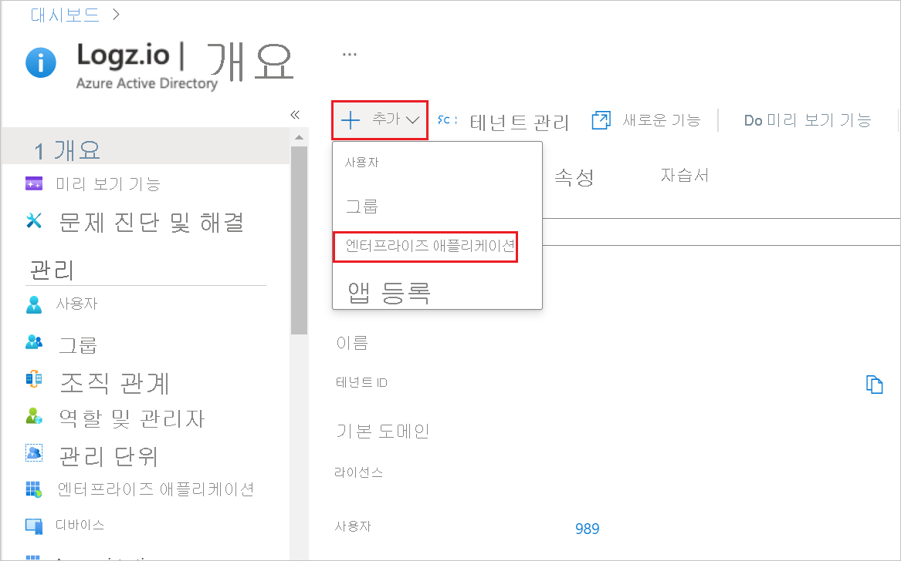
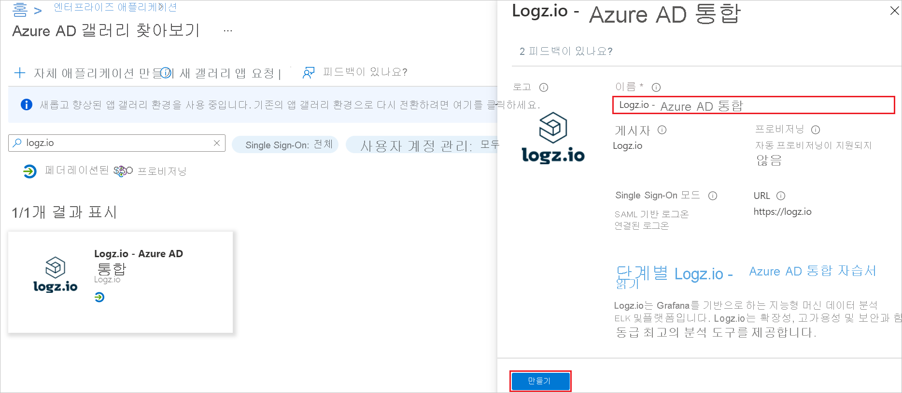
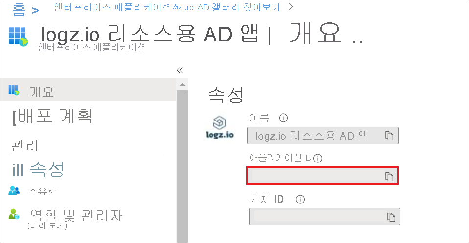
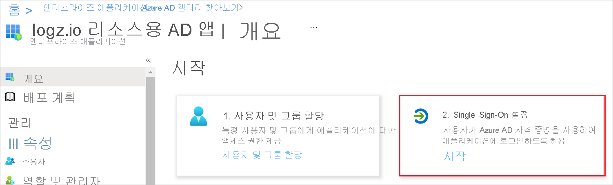
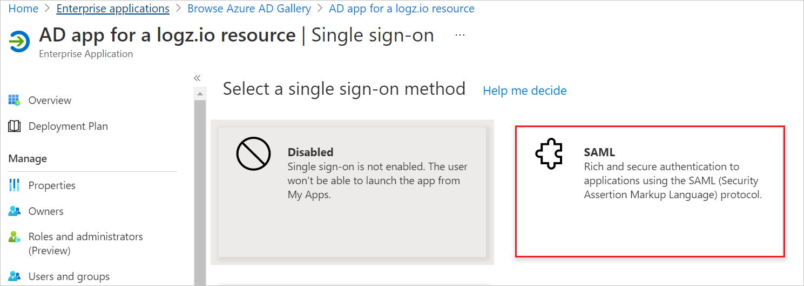
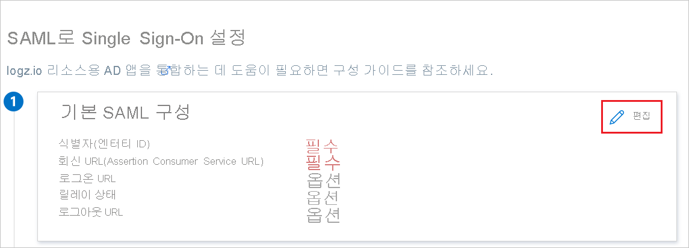
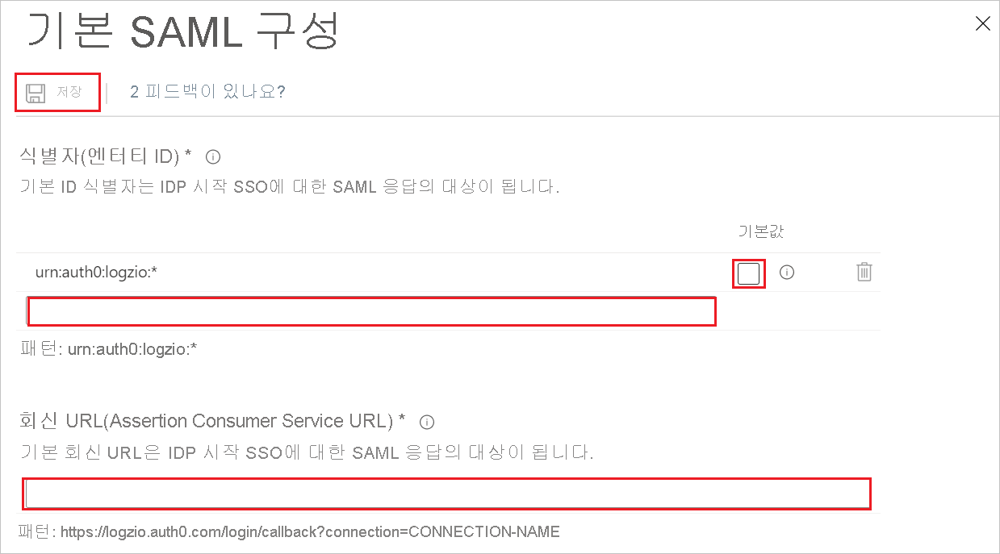
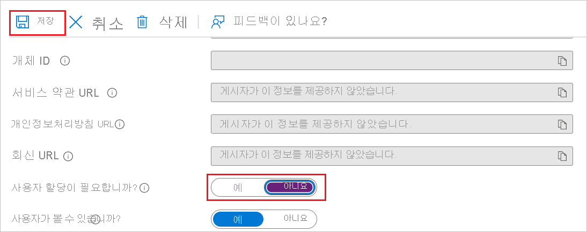
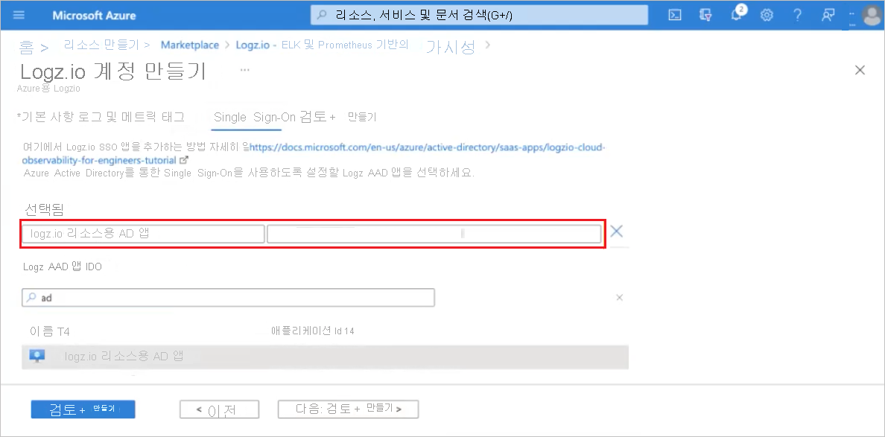
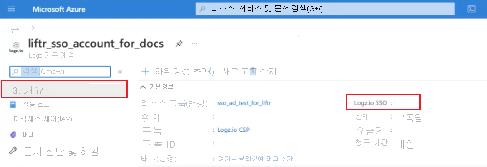

# 자습서: Logz.io - Azure AD Integration의 Azure Active Directory SSO(Single Sign-On) 설정

## Logz.io - Azure Portal 통합을 위한 SSO(Single Sign-On)

Logz.io는 Azure Marketplace와의 통합을 제공합니다. 이 토픽에서는 관리자가 Logz.io-Azure Portal 통합을 위해 SSO를 설정하는 지침을 제공합니다. 이렇게 하면 Microsoft Azure Marketplace를 통해 Logz.io 리소스에 액세스하는 사용자에게 SSO 링크를 사용할 수 있습니다.

### 이점

사용자에게 SSO를 통해 Logz.io Azure 리소스에 대한 액세스를 제공하면 다음과 같은 이점이 있습니다. 

+ 사용자마다 고유한 사용자 이름 및 암호를 미리 정의할 필요가 없습니다. SSO 링크가 있는 사용자는 애플리케이션에 로그인할 수 있습니다.
+ 사용자 제어 향상: Azure 계정에서 정의한 사용자만이 SSO 링크를 사용할 수 있습니다.

Logz.io에 대한 Azure 리소스를 설정하려면 먼저 SSO 연결을 준비하세요. 리소스를 설정하려면 이 프로세스에서 만드는 자격 증명이 필요합니다. 

### Azure Active Directory에서 Logz.io 리소스에 대한 SSO 연결 만들기 

SSO를 사용하여 Azure 리소스에서 Logz.io 계정에 연결할 수 있도록 Azure AD(Active Directory) 엔터프라이즈 애플리케이션을 만듭니다. 

### 필수 조건: 

시작하려면 다음 권한이 필요합니다.

* AAD(Azure Active Directory) 액세스 권한
* 새 엔터프라이즈 애플리케이션을 만드는 권한
* Logz.io 리소스를 만들 Azure 구독의 소유자 역할 권한 

사용자가 Logz.io 통합 리소스에 대해 생성된 SSO 링크에 액세스하고 사용할 수 있으려면 연결된 Azure 계정에서 사용자를 정의해야 합니다. 

#### Logz.io에 대한 SSO 링크 설정 - Azure Portal 리소스

##### 갤러리에서 Logz.io-Azure Active Directory Integration 추가

Azure Portal에서 Logz.io 리소스에 대한 SSO를 구성하려면 갤러리의 Logz.io - Azure AD Integration을 관리형 SaaS 앱 목록에 추가해야 합니다.

1. Microsoft 계정을 사용하여 Azure Portal에 로그인합니다.
2. Azure Portal에 있는 **Logz.io | 개요** 의 **+ 추가** 메뉴에서 **엔터프라이즈 애플리케이션** 을 선택합니다.

   
   
3. Azure Active Directory 갤러리에서 **Logz.io-Azure AD Integration** 애플리케이션을 찾아 선택합니다.
4. 통합 이름을 관련 이름으로 바꾸고 **만들기** 를 클릭합니다. (후속 단계에서 **AD app for a logz.io resource** 라는 이름 사용)

   

##### 애플리케이션 ID를 복사합니다.

**AD app for a logz.io resource | 개요 > 속성** 에서 **애플리케이션 ID** 속성을 복사합니다.

##### Azure AD SSO 구성

1. **AD app for a logz.io resource | 개요 > 시작** 의 **2. Single Sign-On 설정** 에서 **시작** 을 클릭하여 **Single Sign-On** 을 엽니다.

   

2. **AD app for a logz.io resource | Single Sign-On** 에서 **SAML** 방법을 선택합니다.

   

##### 기본 SAML 구성   

1. **AD app for a logz.io resource | SAML 기반 로그온** 에서 **편집** 을 클릭하여 **기본 SAML 구성** 창을 엽니다.

   

2. **식별자(엔터티 ID)** 텍스트 상자에서 값을 `urn:auth0:logzio:*` 패턴으로 입력하고, `*`를 절차 2에서 복사한 **애플리케이션 ID** 로 바꾸고, **기본** 옵션을 클릭합니다. 

3. **회신 URL(Assertion Consumer Service URL)** 텍스트 상자에 URL을 `https://logzio.auth0.com/login/callback?connection=` 패턴으로 입력하고, `CONNECTION_NAME`을 절차 2에서 복사한 **애플리케이션 ID** 로 바꿉니다.

4. 패널 위쪽에서 **저장** 을 클릭합니다.

    

##### 사용자 할당 옵션 구성    

**AD app for a logz.io resource|속성(관리 > 속성)** 에서 **사용자 할당 필요?** 를 **아니요** 로 설정하고 **저장** 을 클릭합니다.  
이 단계를 수행하면 관리자가 Active Directory에서 각 사용자를 미리 정의하지 않아도 SSO 링크에 대한 액세스 권한이 있는 사용자는 Microsoft Azure Portal을 통해 Logz.io에 로그인할 수 있습니다.

이 옵션을 사용하면 방금 만든 AD 앱을 통해 사용자마다 특정 액세스 권한을 정의하지 않아도 Active Directory에 정의된 사용자는 SSO 링크를 사용할 수 있습니다. 

이 옵션을 구성하지 않으려면 조직에서는 Logz.io에 대한 특정 액세스 권한을 각 사용자에게 할당해야 합니다.

### Azure Active Directory를 통해 Logz.io 리소스에 대해 SSO를 사용하도록 설정

Logz.io 계정을 만들 때 Logz.io 리소스에 대해 만든 AD 앱을 사용하여 Azure Active Directory Single Sign-On을 사용하도록 설정합니다.  

사용자가 입력할 때 Logz.io AAD 앱 리소스 이름이 자동으로 채워집니다.

Logz.io 리소스에 로그인하면 SSO 링크가 표시됩니다.   
Logz.io에서 계정에 액세스하려면 이 링크를 클릭합니다. 

Logz.io 리소스를 만드는 동안 SSO를 구성하지 않는 경우 나중에 Single Sign-On 블레이드를 통해 구성할 수 있습니다.

Logz.io에 전송되도록 Azure에서 로그를 구성해야 합니다.

## 기존 Logz.io 계정에 대한 Azure Active Directory Single Sign-On

이 섹션에서는 Azure AD(Azure Active Directory)와 Logz.io - Azure AD Integration을 통합하는 방법에 대해 알아봅니다. Azure AD와 Logz.io - Azure AD Integration을 통합하면 다음을 수행할 수 있습니다.

* Logz.io - Azure AD Integration에 대한 액세스 권한이 있는 사용자를 Azure AD에서 제어합니다.
* 사용자가 자신의 Azure AD 계정으로 Logz.io - Azure AD Integration에 자동으로 로그인되도록 설정합니다.
* 단일 중앙 위치인 Azure Portal에서 계정을 관리합니다.

### 사전 요구 사항

시작하려면 다음 항목이 필요합니다.

* Azure AD 구독 구독이 없는 경우 [체험 계정](https://azure.microsoft.com/free/)을 얻을 수 있습니다.
* Logz.io - Azure AD Integration SSO(Single Sign-On)가 설정된 구독

### 시나리오 설명

이 자습서에서는 테스트 환경에서 Azure AD SSO를 구성하고 테스트합니다.

* Logz.io - Azure AD Integration에서 **IDP** 시작 SSO를 지원합니다.

### 갤러리에서 Logz.io - Azure AD Integration 추가

Logz.io - Azure AD Integration의 Azure AD 통합을 구성하려면 갤러리의 Logz.io - Azure AD Integration을 관리형 SaaS 앱 목록에 추가해야 합니다.

1. Azure Portal에 회사 또는 학교 계정, 개인 Microsoft 계정으로 로그인합니다.
1. 왼쪽 탐색 창에서 **Azure Active Directory** 서비스를 선택합니다.
1. **엔터프라이즈 애플리케이션** 으로 이동한 다음, **모든 애플리케이션** 을 선택합니다.
1. 새 애플리케이션을 추가하려면 **새 애플리케이션** 을 선택합니다.
1. **갤러리에서 추가** 섹션의 검색 상자에 **Logz.io - Azure AD Integration** 을 입력합니다.
1. 결과 패널에서 **Logz.io - Azure AD Integration** 을 선택한 다음, 앱을 추가합니다. 앱이 테넌트에 추가될 때까지 잠시 동안 기다려 주세요.

### Logz.io - Azure AD Integration에 대한 Azure AD SSO 구성 및 테스트

**B.Simon** 이라는 테스트 사용자를 사용하여 Logz.io - Azure AD Integration에서 Azure AD SSO를 구성하고 테스트합니다. SSO가 작동하려면 Azure AD 사용자와 Logz.io - Azure AD Integration의 관련 사용자 간에 연결 관계를 설정해야 합니다.

Logz.io - Azure AD integration에서 Azure AD SSO를 구성하고 테스트하려면 다음 단계를 수행합니다.

1. **[Azure AD SSO 구성](#configure-azure-ad-sso)** - 사용자가 이 기능을 사용할 수 있도록 합니다.
    1. **[Azure AD 테스트 사용자 만들기](#create-an-azure-ad-test-user)** - B.Simon을 사용하여 Azure AD Single Sign-On을 테스트합니다.
    1. **[Azure AD 테스트 사용자 할당](#assign-the-azure-ad-test-user)** - B. Simon이 Azure AD Single Sign-On을 사용할 수 있도록 합니다.
1. **[Logz.io - Azure AD Integration SSO 구성](#configure-logzio-azure-ad-integration-sso)** - 애플리케이션 쪽에서 Single Sign-On 설정을 구성합니다.
    1. **[Logz.io - Azure AD Integration 테스트 사용자 만들기](#create-logzio-azure-ad-integration-test-user)** - Britta Simon의 Azure AD 표현과 연결된 해당 사용자를 Logz.io - Azure AD Integration에 만듭니다.
1. **[SSO 테스트](#test-sso)** - 구성이 작동하는지 여부를 확인합니다.

### Azure AD SSO 구성

Azure Portal에서 Azure AD SSO를 사용하도록 설정하려면 다음 단계를 수행합니다.

1. Azure Portal의 **Logz.io - Azure AD Integration** 애플리케이션 통합 페이지에서 **관리** 섹션을 찾아 **Single Sign-On** 을 선택합니다.
1. **Single Sign-On 방법 선택** 페이지에서 **SAML** 을 선택합니다.
1. **SAML로 Single Sign-On 설정** 페이지에서 **기본 SAML 구성** 에 대한 연필 아이콘을 클릭하여 설정을 편집합니다.

   

1. **SAML로 Single Sign-On 설정** 페이지에서 다음 단계를 수행합니다.

    a. **식별자** 텍스트 상자에 `urn:auth0:logzio:CONNECTION-NAME` 패턴을 사용하여 값을 입력합니다.

    b. **회신 URL** 텍스트 상자에서 `https://logzio.auth0.com/login/callback?connection=CONNECTION-NAME` 패턴을 사용하여 URL을 입력합니다.

    > [!NOTE]
    > 이러한 값은 실제 값이 아닙니다. 실제 식별자 및 회신 URL로 해당 값을 업데이트합니다. 이러한 값을 얻으려면 [Logz.io - Azure AD Integration 클라이언트 지원 팀](mailto:help@logz.io)에 문의하세요. Azure Portal의 **기본 SAML 구성** 섹션에 표시된 패턴을 참조할 수도 있습니다.

1. Logz.io - Azure AD Integration 애플리케이션에는 특정 형식의 SAML 어설션이 필요하기 때문에, SAML 토큰 특성 구성에 사용자 지정 특성 매핑을 추가해야 합니다. 다음 스크린샷에서는 기본 특성의 목록을 보여 줍니다.

    

1. 위에서 언급한 특성 외에도 Logz.io - Azure AD Integration 애플리케이션에는 아래에 표시된 SAML 응답에서 다시 전달되어야 하는 몇 가지 특성이 추가로 필요합니다. 이러한 특성도 미리 채워져 있지만 요구 사항에 따라 검토할 수 있습니다.
    
    | Name |  원본 특성|
    | ---------------| --------- |
    | session-expiration | user.session-expiration |
    | 이메일 | user.mail |
    | 그룹 | user.groups |

1. **SAML로 Single Sign-On 설정** 페이지의 **SAML 서명 인증서** 섹션에서 **인증서(Base64)** 를 찾은 후 **다운로드** 를 선택하여 인증서를 다운로드하고 컴퓨터에 저장합니다.

    

1. **Logz.io - Azure AD Integration 설정** 섹션에서 요구 사항에 따라 적절한 URL을 복사합니다.

    

#### Azure AD 테스트 사용자 만들기

이 섹션에서는 Azure Portal에서 B.Simon이라는 테스트 사용자를 만듭니다.

1. Azure Portal의 왼쪽 창에서 **Azure Active Directory**, **사용자**, **모든 사용자** 를 차례로 선택합니다.
1. 화면 위쪽에서 **새 사용자** 를 선택합니다.
1. **사용자** 속성에서 다음 단계를 수행합니다.
   1. **이름** 필드에 `B.Simon`을 입력합니다.  
   1. **사용자 이름** 필드에서 username@companydomain.extension을 입력합니다. 예들 들어 `B.Simon@contoso.com`입니다.
   1. **암호 표시** 확인란을 선택한 다음, **암호** 상자에 표시된 값을 적어둡니다.
   1. **만들기** 를 클릭합니다.

#### Azure AD 테스트 사용자 할당

이 섹션에서는 Azure Single Sign-On을 사용할 수 있도록 B. Simon에게 Logz.io - Azure AD Integration에 대한 액세스 권한을 부여합니다.

1. Azure Portal에서 **엔터프라이즈 애플리케이션** 을 선택한 다음, **모든 애플리케이션** 을 선택합니다.
1. 애플리케이션 목록에서 **Logz.io - Azure AD Integration** 을 선택합니다.
1. 앱의 개요 페이지에서 **관리** 섹션을 찾고 **사용자 및 그룹** 을 선택합니다.
1. **사용자 추가** 를 선택한 다음, **할당 추가** 대화 상자에서 **사용자 및 그룹** 을 선택합니다.
1. **사용자 및 그룹** 대화 상자의 사용자 목록에서 **B.Simon** 을 선택한 다음, 화면 아래쪽에서 **선택** 단추를 클릭합니다.
1. SAML 어설션에 역할 값이 필요한 경우 **역할 선택** 대화 상자의 목록에서 사용자에 대한 적절한 역할을 선택한 다음, 화면의 아래쪽에 있는 **선택** 단추를 클릭합니다.
1. **할당 추가** 대화 상자에서 **할당** 단추를 클릭합니다.

### Logz.io Azure AD Integration SSO 구성

**Logz.io - Azure AD Integration** 쪽에서 Single Sign-On을 구성하려면 Azure Portal에서 다운로드한 **인증서(Base64)** 와 적절히 복사한 URL을 [Logz.io - Azure AD Integration 지원 팀](mailto:help@logz.io)으로 보내야 합니다. 이렇게 설정하면 SAML SSO 연결이 양쪽에서 제대로 설정됩니다.

#### Logz.io Azure AD Integration 테스트 사용자 만들기

이 섹션에서는 Logz.io - Azure AD Integration에서 Britta Simon이라는 사용자를 만듭니다. Logz.io - Azure AD Integration 플랫폼에서 사용자를 추가하려면 [Logz.io - Azure AD Integration 지원 팀](mailto:help@logz.io)에 문의하세요. Single Sign-On을 사용하려면 먼저 사용자를 만들고 활성화해야 합니다.

### SSO 테스트 

이 섹션에서는 다음 옵션을 사용하여 Azure AD Single Sign-On 구성을 테스트합니다.

* Azure Portal에서 이 애플리케이션 테스트를 클릭하면 SSO를 설정한 Logz.io - Azure AD Integration에 자동으로 로그인됩니다.

* Microsoft 내 앱을 사용할 수 있습니다. 내 앱에서 Logz.io - Azure AD Integration 타일을 클릭하면 SSO를 설정한 Logz.io - Azure AD Integration에 자동으로 로그인됩니다. 내 앱에 대한 자세한 내용은 [내 앱 소개](https://support.microsoft.com/account-billing/sign-in-and-start-apps-from-the-my-apps-portal-2f3b1bae-0e5a-4a86-a33e-876fbd2a4510)를 참조하세요.

### 다음 단계

Logz.io - Azure AD Integration이 구성되면 세션 제어를 적용하여 조직의 중요한 데이터의 반출 및 반입을 실시간으로 보호할 수 있습니다. 세션 제어는 조건부 액세스에서 확장됩니다. [Microsoft Cloud App Security를 사용하여 세션 제어를 적용하는 방법을 알아봅니다](/cloud-app-security/proxy-deployment-aad).