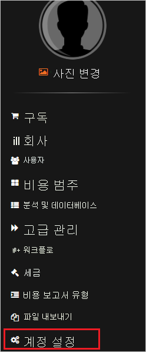
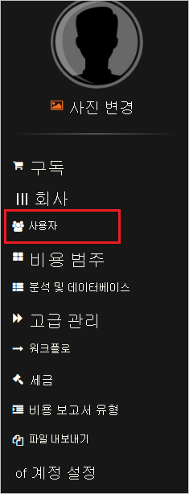

# 자습서: N2F - Expense Reports와 Azure AD SSO 통합

이 자습서에서는 N2F - Expense Reports를 Azure AD(Azure Active Directory)와 통합하는 방법에 대해 알아봅니다. Azure AD와 N2F - Expense Reports를 통합하면 다음을 수행할 수 있습니다.

* Azure AD에서 N2F - Expense Reports에 액세스할 수 있는 사용자를 제어합니다.
* 사용자가 해당 Azure AD 계정으로 N2F - Expense Reports에 자동으로 로그인되도록 설정합니다.
* 단일 중앙 위치인 Azure Portal에서 계정을 관리합니다.

## 사전 요구 사항

시작하려면 다음 항목이 필요합니다.

* Azure AD 구독 구독이 없는 경우 [체험 계정](https://azure.microsoft.com/free/)을 얻을 수 있습니다.
* N2F - Expense Reports SSO(Single Sign-On)를 사용하도록 설정된 구독

## 시나리오 설명

이 자습서에서는 테스트 환경에서 Azure AD Single Sign-On을 구성하고 테스트합니다.

* N2F - Expense Reports에서 **SP** 및 **IDP** 시작 SSO를 지원합니다.

## 갤러리에서 N2F - Expense Reports 추가

N2F - Expense Reports를 Azure AD애 통합하도록 구성하려면 갤러리에서 N2F - Expense Reports를 관리되는 SaaS 앱 목록에 추가해야 합니다.

1. Azure Portal에 회사 또는 학교 계정, 개인 Microsoft 계정으로 로그인합니다.
1. 왼쪽 탐색 창에서 **Azure Active Directory** 서비스를 선택합니다.
1. **엔터프라이즈 애플리케이션** 으로 이동한 다음, **모든 애플리케이션** 을 선택합니다.
1. 새 애플리케이션을 추가하려면 **새 애플리케이션** 을 선택합니다.
1. **갤러리에서 추가** 섹션의 검색 상자에서 **N2F - Expense Reports** 를 입력합니다.
1. 결과 패널에서 **N2F - Expense Reports** 를 선택한 다음, 앱을 추가합니다. 앱이 테넌트에 추가될 때까지 잠시 동안 기다려 주세요.

## N2F - Expense Reports에 대한 Azure AD SSO 구성 및 테스트

**B.Simon** 이라는 테스트 사용자를 사용하여 N2F - Expense Reports에서 Azure AD SSO를 구성하고 테스트합니다. SSO가 작동하려면 Azure AD 사용자와 N2F - Expense Reports의 관련 사용자 간에 연결 관계를 설정해야 합니다.

N2F - Expense Reports에서 Azure AD SSO를 구성하고 테스트하려면 다음 단계를 수행합니다.

1. **[Azure AD SSO 구성](#configure-azure-ad-sso)** - 사용자가 이 기능을 사용할 수 있도록 합니다.
    1. **[Azure AD 테스트 사용자 만들기](#create-an-azure-ad-test-user)** - B.Simon을 사용하여 Azure AD Single Sign-On을 테스트합니다.
    1. **[Azure AD 테스트 사용자 할당](#assign-the-azure-ad-test-user)** - B. Simon이 Azure AD Single Sign-On을 사용할 수 있도록 합니다.
1. **[N2F - Expense Reports SSO 구성](#configure-n2f---expense-reports-sso)** - 애플리케이션 쪽에서 Single Sign-On 설정을 구성합니다.
    1. **[N2F - Expense Reports 테스트 사용자 만들기](#create-n2f---expense-reports-test-user)** - B.Simon의 Azure AD 표현과 연결된 해당 사용자를 N2F - Expense Reports에 만듭니다.
1. **[SSO 테스트](#test-sso)** - 구성이 작동하는지 여부를 확인합니다.

## Azure AD SSO 구성

Azure Portal에서 Azure AD SSO를 사용하도록 설정하려면 다음 단계를 수행합니다.

1. Azure Portal의 **N2F - Expense Reports** 애플리케이션 통합 페이지에서 **관리** 섹션을 찾고, **Single Sign-On** 을 선택합니다.
1. **Single Sign-On 방법 선택** 페이지에서 **SAML** 을 선택합니다.
1. **SAML로 Single Sign-On 설정** 페이지에서 **기본 SAML 구성** 에 대한 연필 아이콘을 클릭하여 설정을 편집합니다.

   

4. **기본 SAML 구성** 섹션에서 **IDP** 시작 모드로 애플리케이션을 구성하려는 경우에는 앱이 이미 Azure와 사전 통합되어 있으므로 사용자가 수행해야 하는 단계가 없습니다.

5. **SP** 시작 모드에서 애플리케이션을 구성하려면 **추가 URL 설정** 를 클릭하고 다음 단계를 수행합니다.

    **로그온 URL** 텍스트 상자에 `https://www.n2f.com/app/` URL을 입력합니다.

6. **SAML로 Single Sign-On 설정** 페이지의 **SAML 서명 인증서** 섹션에서 복사 단추를 클릭하여 **앱 페더레이션 메타데이터 URL** 을 복사한 후 컴퓨터에 저장합니다.

    

7. **myPolicies 설정** 섹션에서 요구 사항에 따라 적절한 URL을 복사합니다.

    

### Azure AD 테스트 사용자 만들기 

이 섹션에서는 Azure Portal에서 B.Simon이라는 테스트 사용자를 만듭니다.

1. Azure Portal의 왼쪽 창에서 **Azure Active Directory**, **사용자**, **모든 사용자** 를 차례로 선택합니다.
1. 화면 위쪽에서 **새 사용자** 를 선택합니다.
1. **사용자** 속성에서 다음 단계를 수행합니다.
   1. **이름** 필드에 `B.Simon`을 입력합니다.  
   1. **사용자 이름** 필드에서 username@companydomain.extension을 입력합니다. 예들 들어 `B.Simon@contoso.com`입니다.
   1. **암호 표시** 확인란을 선택한 다음, **암호** 상자에 표시된 값을 적어둡니다.
   1. **만들기** 를 클릭합니다.

### Azure AD 테스트 사용자 할당

이 섹션에서는 B.Simon에게 N2F - Expense Reports에 대한 액세스 권한을 부여하여 해당 사용자가 Azure Single Sign-On을 사용하도록 설정합니다.

1. Azure Portal에서 **엔터프라이즈 애플리케이션** 을 선택한 다음, **모든 애플리케이션** 을 선택합니다.
1. 애플리케이션 목록에서 **N2F - Expense Reports** 를 선택합니다.
1. 앱의 개요 페이지에서 **관리** 섹션을 찾고 **사용자 및 그룹** 을 선택합니다.
1. **사용자 추가** 를 선택한 다음, **할당 추가** 대화 상자에서 **사용자 및 그룹** 을 선택합니다.
1. **사용자 및 그룹** 대화 상자의 사용자 목록에서 **B.Simon** 을 선택한 다음, 화면 아래쪽에서 **선택** 단추를 클릭합니다.
1. 사용자에게 역할을 할당할 것으로 예상되는 경우 **역할 선택** 드롭다운에서 선택할 수 있습니다. 이 앱에 대한 역할이 설정되지 않은 경우 "기본 액세스" 역할이 선택된 것으로 표시됩니다.
1. **할당 추가** 대화 상자에서 **할당** 단추를 클릭합니다.

## N2F - Expense reports SSO 구성

1. 다른 웹 브라우저 창에서 N2F - Expense Reports 회사 사이트에 관리자로 로그인합니다.

2. **설정** 을 클릭한 다음, 드롭다운에서 **고급 설정** 을 선택합니다.

    

3. **계정 설정** 을 선택합니다.

    

4. **인증** 을 선택한 다음, **+ Add an authentication method**(인증 방법 추가) 탭을 선택합니다.

    

5. **SAML Microsoft Office 365** 를 인증 방법으로 선택합니다.

    

6. **인증 방법** 섹션에서 다음 단계를 수행합니다.

    

    a. Azure Portal에서 복사한 **Azure AD 식별자** 값을 **엔터티 ID** 텍스트 상자에 붙여넣습니다.

    b. Azure Portal에서 복사한 **앱 페더레이션 메타데이터 URL** 값을 **메타데이터 URL** 텍스트 상자에 붙여넣습니다.

    다. **저장** 을 클릭합니다.

### N2F - Expense Reports 테스트 사용자 만들기

Azure AD 사용자가 N2F - Expense Reports에 로그인할 수 있도록 하려면 사용자가 N2F - Expense Reports에 프로비전되어야 합니다. N2F - Expense Reports의 경우 프로비전은 수동 작업입니다.

**사용자 계정을 프로비전하려면 다음 단계를 수행합니다.**

1. N2F - Expense Reports 회사 사이트에 관리자로 로그인합니다.

2. **설정** 을 클릭한 다음, 드롭다운에서 **고급 설정** 을 선택합니다.

    

3. 왼쪽 탐색 창에서 **사용자** 탭을 선택합니다.

    

4. **+ 새 사용자** 탭을 선택합니다.

    

5. **사용자** 섹션에서 다음 단계를 수행합니다.

    

    a. **이메일 주소** 텍스트 상자에 사용자의 이메일 주소(예: **brittasimon\@contoso.com**)를 입력합니다.

    b. **이름** 텍스트 상자에 사용자의 이름(예: **Britta**)을 입력합니다.

    다. **이름** 텍스트 상자에 **BrittaSimon** 과 같은 사용자의 이름을 입력합니다.

    d. 조직 요구 사항에 따라 **역할, 직속 관리자(N+1)** 및 **부서** 를 선택합니다.

    e. **Validate and send invitation**(유효성 검사 및 초대장 보내기)을 클릭합니다.

    > [!NOTE]
    > 사용자를 추가하는 동안 문제가 발생하면 [N2F - Expense Reports 지원 팀](mailto:support@n2f.com)에 문의하세요.

## SSO 테스트

이 섹션에서는 다음 옵션을 사용하여 Azure AD Single Sign-On 구성을 테스트합니다. 

#### SP 시작:

* Azure Portal에서 **이 애플리케이션 테스트** 를 클릭합니다. 그러면 로그인 흐름을 시작할 수 있는 N2F - Expense Reports 로그온 URL로 리디렉션됩니다.  

* N2F - Expense Reports 로그온 URL로 직접 이동하여 해당 위치에서 로그인 흐름을 시작합니다.

#### IDP 시작:

* Azure Portal에서 **이 애플리케이션 테스트** 를 클릭하면 SSO를 설정한 N2F - Expense Reports에 자동으로 로그인됩니다. 

Microsoft 내 앱을 사용하여 모든 모드에서 애플리케이션을 테스트할 수도 있습니다. 내 앱에서 N2F - Expense Reports 타일을 클릭하면 SP 모드로 구성된 경우 로그인 흐름을 시작하기 위해 애플리케이션 로그온 페이지로 리디렉션되고, IDP 모드로 구성된 경우 SSO를 설정한 N2F - Expense Reports에 자동으로 로그인됩니다. 내 앱에 대한 자세한 내용은 [내 앱 소개](../user-help/my-apps-portal-end-user-access.md)를 참조하세요.

## 다음 단계

N2F - Expense Reports가 구성되면 세션 제어를 적용하여 조직의 중요한 데이터의 반출 및 반입을 실시간으로 보호할 수 있습니다. 세션 제어는 조건부 액세스에서 확장됩니다. [Microsoft Defender for Cloud Apps를 사용하여 세션 제어를 적용하는 방법을 알아봅니다](/cloud-app-security/proxy-deployment-aad).
