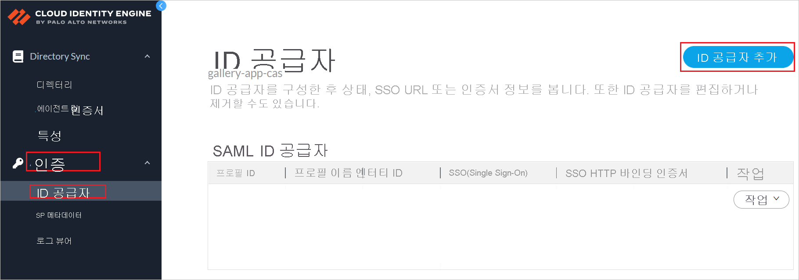
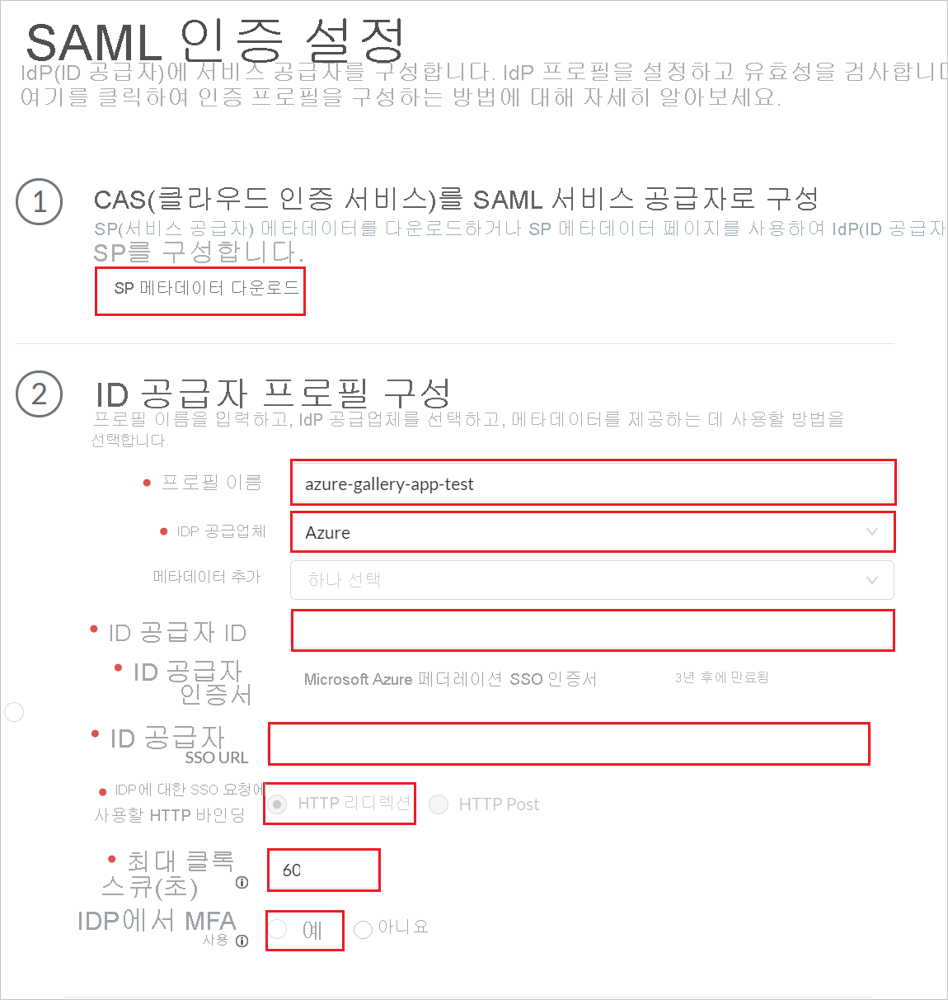
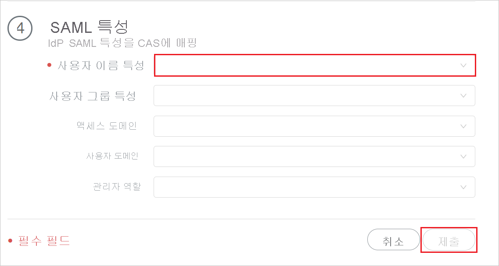

# 자습서: Palo Alto Networks 클라우드 ID 엔진 - 클라우드 인증 서비스와 Azure Active Directory SSO(Single Sign-On) 통합

이 자습서에서는 Palo Alto Networks 클라우드 ID 엔진 - 클라우드 인증 서비스를 Azure AD(Azure Active Directory)와 통합하는 방법을 배웁니다. Palo Alto Networks 클라우드 ID 엔진 - 클라우드 인증 서비스를 Azure AD와 통합하면 다음을 수행할 수 있습니다.

* Palo Alto Networks 클라우드 ID 엔진 - 클라우드 인증 서비스에 대한 액세스 권한이 있는 Azure AD에서 제어합니다.
* 사용자가 Azure AD 계정을 사용하여 Palo Alto Networks 클라우드 ID 엔진 - 클라우드 인증 서비스에 자동으로 로그인할 수 있도록 합니다.
* 단일 중앙 위치인 Azure Portal에서 계정을 관리합니다.

## 사전 요구 사항

시작하려면 다음 항목이 필요합니다.

* Azure AD 구독 구독이 없는 경우 [체험 계정](https://azure.microsoft.com/free/)을 얻을 수 있습니다.
* Palo Alto Networks 클라우드 ID 엔진 - 클라우드 인증 서비스 SSO(Single Sign-On) 지원 구독

## 시나리오 설명

이 자습서에서는 테스트 환경에서 Azure AD SSO를 구성하고 테스트합니다.

* Palo Alto Networks 클라우드 ID 엔진 - 클라우드 인증 서비스는 **SP** 시작 SSO를 지원합니다.

* Palo Alto Networks 클라우드 ID 엔진 - 클라우드 인증 서비스는 **Just In Time** 사용자 프로비저닝을 지원합니다.

## 갤러리에서 Palo Alto Networks 클라우드 ID 엔진 - 클라우드 인증 서비스 추가

Palo Alto Networks 클라우드 ID 엔진 - 클라우드 인증 서비스를 Azure AD에 통합하도록 구성하려면 갤러리에서 관리되는 SaaS 앱 목록에 Palo Alto Networks 클라우드 ID 엔진 - 클라우드 인증 서비스를 추가해야 합니다.

1. Azure Portal에 회사 또는 학교 계정, 개인 Microsoft 계정으로 로그인합니다.
1. 왼쪽 탐색 창에서 **Azure Active Directory** 서비스를 선택합니다.
1. **엔터프라이즈 애플리케이션** 으로 이동한 다음, **모든 애플리케이션** 을 선택합니다.
1. 새 애플리케이션을 추가하려면 **새 애플리케이션** 을 선택합니다.
1. **갤러리에서 추가** 섹션의 검색 상자에 **Palo Alto Networks 클라우드 ID 엔진 - 클라우드 인증 서비스** 를 입력합니다.
1. 결과 패널에서 **Palo Alto Networks 클라우드 ID 엔진 - 클라우드 인증 서비스** 를 선택한 다음 앱을 추가합니다. 앱이 테넌트에 추가될 때까지 잠시 동안 기다려 주세요.

## Palo Alto Networks 클라우드 ID 엔진 - 클라우드 인증 서비스에 대한 Azure AD SSO 구성 및 테스트

**B.Simon** 이라는 테스트 사용자를 사용하여 Palo Alto Networks 클라우드 ID 엔진 - 클라우드 인증 서비스로 Azure AD SSO를 구성하고 테스트합니다. SSO가 작동하려면 Azure AD 사용자와 Palo Alto Networks 클라우드 ID 엔진 - 클라우드 인증 서비스의 관련 사용자 간의 링크 관계를 설정해야 합니다.

Palo Alto Networks 클라우드 ID 엔진 - 클라우드 인증 서비스를 사용하여 Azure AD SSO를 구성하고 테스트하려면 다음 단계를 수행합니다.

1. **[Azure AD SSO 구성](#configure-azure-ad-sso)** - 사용자가 이 기능을 사용할 수 있도록 합니다.
    1. **[Azure AD 테스트 사용자 만들기](#create-an-azure-ad-test-user)** - B.Simon을 사용하여 Azure AD Single Sign-On을 테스트합니다.
    1. **[Azure AD 테스트 사용자 할당](#assign-the-azure-ad-test-user)** - B. Simon이 Azure AD Single Sign-On을 사용할 수 있도록 합니다.
1. **[Palo Alto Networks 클라우드 ID 엔진 - 클라우드 인증 서비스 SSO 구성](#configure-palo-alto-networks-cloud-identity-engine---cloud-authentication-service-sso)** - 애플리케이션 측에서 Single Sign-On 설정을 구성합니다.
    1. **[Palo Alto Networks 클라우드 ID 엔진 - 클라우드 인증 서비스 테스트 사용자 만들기](#create-palo-alto-networks-cloud-identity-engine---cloud-authentication-service-test-user)** - B.Simon의 Azure AD 표현과 연결된 해당 사용자를 Palo Alto Networks 클라우드 ID 엔진 - 클라우드 인증 서비스에 만듭니다.
1. **[SSO 테스트](#test-sso)** - 구성이 작동하는지 여부를 확인합니다.

## Azure AD SSO 구성

Azure Portal에서 Azure AD SSO를 사용하도록 설정하려면 다음 단계를 수행합니다.

1. Azure Portal의 **Palo Alto Networks 클라우드 ID 엔진 - 클라우드 인증 서비스** 애플리케이션 통합 페이지에서 **관리** 섹션을 찾아 **Single Sign-On** 을 선택합니다.
1. **Single Sign-On 방법 선택** 페이지에서 **SAML** 을 선택합니다.
1. **SAML로 Single Sign-On 설정** 페이지에서 **기본 SAML 구성** 에 대한 연필 아이콘을 클릭하여 설정을 편집합니다.

   

1. **서비스 공급자 메타데이터 파일** 이 있으면 **기본 SAML 구성** 섹션에서 다음 단계를 수행합니다.

    a. **메타데이터 파일 업로드** 를 클릭합니다.

    

    b. **폴더 로고** 를 클릭하여 메타데이터 파일을 선택하고 **업로드** 를 클릭합니다.

    

    다. 메타데이터 파일이 성공적으로 업로드되면 **식별자** 값이 [기본 SAML 구성] 섹션에 자동으로 채워집니다.

    d. **로그인 URL** 텍스트 상자에서 `https://<RegionUrl>.paloaltonetworks.com/sp/acs` 패턴을 사용하여 URL을 입력합니다.

    > [!Note]
    > **식별자** 값이 자동으로 입력되지 않으면 요구 사항에 따라 수동으로 값을 입력합니다. 로그온 URL 값은 실제 값이 아닙니다. 이 값을 실제 로그온 URL로 업데이트합니다. 이 값을 얻으려면 [Palo Alto Networks 클라우드 ID 엔진 - 클라우드 인증 서비스 클라이언트 지원팀](mailto:support@paloaltonetworks.com)에 문의하세요. Azure Portal의 **기본 SAML 구성** 섹션에 표시된 패턴을 참조할 수도 있습니다.

1. Palo Alto Networks 클라우드 ID 엔진 - 클라우드 인증 서비스 애플리케이션에는 특정 형식의 SAML 어설션이 필요하므로, SAML 토큰 특성 구성에 사용자 지정 특성 매핑을 추가해야 합니다. 다음 스크린샷에서는 기본 특성의 목록을 보여 줍니다.

    

1. 위에서 언급한 특성 외에도 Palo Alto Networks 클라우드 ID 엔진 - 클라우드 인증 서비스 애플리케이션에는 아래에 표시된 SAML 응답에서 다시 전달되어야 하는 몇 가지 특성이 추가로 필요합니다. 이러한 특성도 미리 채워져 있지만 요구 사항에 따라 검토할 수 있습니다.
    
    | Name | 원본 특성|
    | ---------------| --------- |
    | 그룹 |  user.groups |
    | 사용자 이름 | user.userprincipalname |

1. **SAML로 Single Sign-On 설정** 페이지의 **SAML 서명 인증서** 섹션에서 복사 단추를 클릭하여 **앱 페더레이션 메타데이터 URL** 을 복사한 후 컴퓨터에 저장합니다.

    

### Azure AD 테스트 사용자 만들기

이 섹션에서는 Azure Portal에서 B.Simon이라는 테스트 사용자를 만듭니다.

1. Azure Portal의 왼쪽 창에서 **Azure Active Directory**, **사용자**, **모든 사용자** 를 차례로 선택합니다.
1. 화면 위쪽에서 **새 사용자** 를 선택합니다.
1. **사용자** 속성에서 다음 단계를 수행합니다.
   1. **이름** 필드에 `B.Simon`을 입력합니다.  
   1. **사용자 이름** 필드에서 username@companydomain.extension을 입력합니다. 예들 들어 `B.Simon@contoso.com`입니다.
   1. **암호 표시** 확인란을 선택한 다음, **암호** 상자에 표시된 값을 적어둡니다.
   1. **만들기** 를 클릭합니다.

### Azure AD 테스트 사용자 할당

이 섹션에서는 B.Simon이 Azure Single Sign-On을 사용할 수 있도록 Palo Alto Networks 클라우드 ID 엔진 - 클라우드 인증 서비스에 대한 액세스 권한을 부여합니다.

1. Azure Portal에서 **엔터프라이즈 애플리케이션** 을 선택한 다음, **모든 애플리케이션** 을 선택합니다.
1. 애플리케이션 목록에서 **Palo Alto Networks 클라우드 ID 엔진 - 클라우드 인증 서비스** 를 선택합니다.
1. 앱의 개요 페이지에서 **관리** 섹션을 찾고 **사용자 및 그룹** 을 선택합니다.
1. **사용자 추가** 를 선택한 다음, **할당 추가** 대화 상자에서 **사용자 및 그룹** 을 선택합니다.
1. **사용자 및 그룹** 대화 상자의 사용자 목록에서 **B.Simon** 을 선택한 다음, 화면 아래쪽에서 **선택** 단추를 클릭합니다.
1. 사용자에게 역할을 할당할 것으로 예상되는 경우 **역할 선택** 드롭다운에서 선택할 수 있습니다. 이 앱에 대한 역할이 설정되지 않은 경우 "기본 액세스" 역할이 선택된 것으로 표시됩니다.
1. **할당 추가** 대화 상자에서 **할당** 단추를 클릭합니다.

## Palo Alto Networks 클라우드 ID 엔진 - 클라우드 인증 서비스 SSO 구성

1. Palo Alto Networks 클라우드 ID 엔진 - 클라우드 인증 서비스 회사 사이트에 관리자로 로그인합니다.

1. **인증** > **ID 공급자** 로 이동하여 **ID 공급자 추가** 를 클릭합니다.

     

1. **SAML 인증 설정** 페이지에서 다음 단계를 수행합니다.

     

    a. 1단계에서 **SP 메타데이터 다운로드** 를 클릭하여 메타데이터 파일을 다운로드하고 컴퓨터에 저장합니다.

    b. 2단계에서 Azure Portal에서 복사한 **ID 공급자 프로필 구성** 에 필요한 필드를 채웁니다. 

    c. 3단계에서 **SAML 설정 테스트** 를 클릭하여 프로필 구성을 확인하고 **IDP에서 MFA가 사용하도록 설정됨** 을 선택합니다.

    

    > [!NOTE]
    > **Palo Alto Networks 클라우드 ID 엔진 - 클라우드 인증 서비스** SSO를 테스트하려면 **Palo Alto Networks 클라우드 ID 엔진 - 클라우드 인증 서비스** 콘솔을 열고 **연결 테스트** 단추를 클릭하고, **Azure AD 테스트 사용자 만들기** 섹션에서 만든 테스트 계정을 사용하여 인증합니다. 

    d. 4단계에서 **USERNAME ATTRIBUTE** 를 입력하고 **제출** 을 클릭합니다. 

    

### Palo Alto Networks 클라우드 ID 엔진 - 클라우드 인증 서비스 테스트 사용자 만들기

이 섹션에서는 **Palo Alto Networks 클라우드 ID 엔진 - 클라우드 인증 서비스** 에서 Britta Simon이라는 사용자를 만듭니다. **Palo Alto Networks 클라우드 ID 엔진 - 클라우드 인증 서비스** 는 기본적으로 사용하도록 설정되어 있는 Just-In-Time 사용자 프로비저닝을 지원합니다. 이 섹션에 작업 항목이 없습니다. **Palo Alto Networks 클라우드 ID 엔진 - 클라우드 인증 서비스** 에 사용자가 아직 없는 경우 인증 후 새 사용자가 만들어집니다.

## SSO 테스트 

**Palo Alto Networks 클라우드 ID 엔진 - 클라우드 인증 서비스** SSO를 테스트하려면 **Palo Alto Networks 클라우드 ID 엔진 - 클라우드 인증 서비스** 콘솔을 열고 **연결 테스트** 단추를 클릭하고 **Azure AD 테스트 사용자 만들기** 섹션에서 만든 테스트 계정을 사용하여 인증합니다.

## 다음 단계

**Palo Alto Networks 클라우드 ID 엔진 - 클라우드 인증 서비스** 를 구성하면 조직의 중요한 데이터의 반출 및 반입을 실시간으로 보호하는 세션 제어를 적용할 수 있습니다. 세션 제어는 조건부 액세스에서 확장됩니다. [Microsoft Defender for Cloud Apps를 사용하여 세션 제어를 적용하는 방법을 알아봅니다](/cloud-app-security/proxy-deployment-aad).
