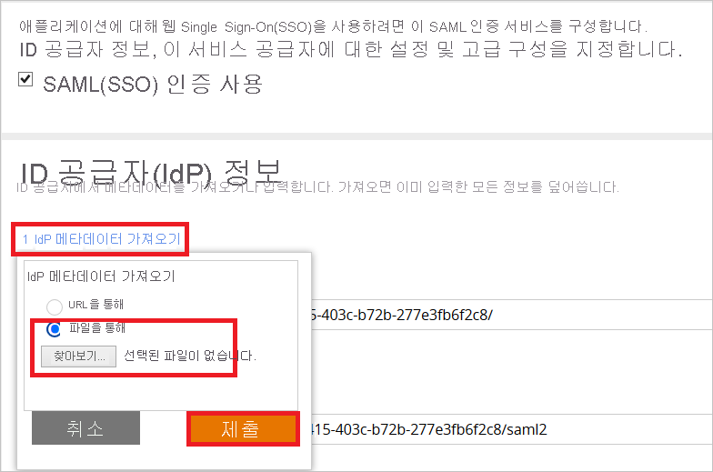
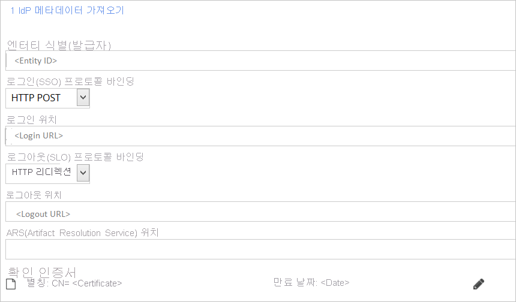
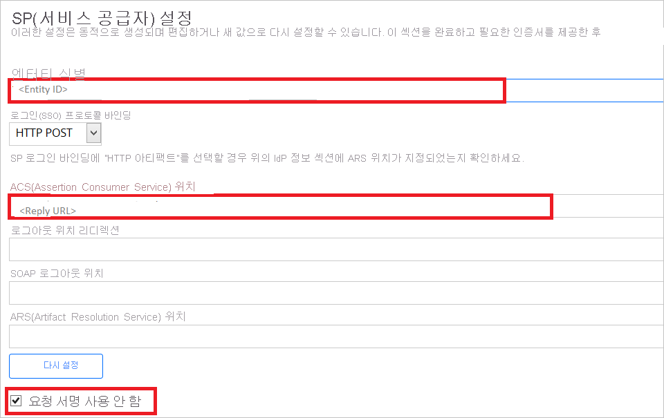

# 자습서: Pega Systems와 Azure AD SSO 통합

이 자습서에서는 Azure AD(Azure Active Directory)와 Pega Systems를 통합하는 방법에 대해 알아봅니다. Azure AD와 Pega Systems를 통합하면 다음을 수행할 수 있습니다.

* Pega Systems에 대한 액세스 권한이 있는 사용자를 Azure AD에서 제어합니다.
* 사용자가 자신의 Azure AD 계정으로 Pega Systems에 자동으로 로그인되도록 설정합니다.
* 단일 중앙 위치인 Azure Portal에서 계정을 관리합니다.

## 사전 요구 사항

시작하려면 다음 항목이 필요합니다.

* Azure AD 구독 구독이 없는 경우 [체험 계정](https://azure.microsoft.com/free/)을 얻을 수 있습니다.
* Pega Systems SSO(Single Sign-On)가 설정된 구독

## 시나리오 설명

이 자습서에서는 테스트 환경에서 Azure AD Single Sign-On을 구성하고 테스트합니다.

* Pega Systems에서 SP 및 IdP 시작 SSO를 지원합니다.

## 갤러리에서 Pega Systems 추가

Pega Systems와 Azure AD의 통합을 구성하려면 갤러리에서 Pega Systems를 관리되는 SaaS 앱 목록에 추가해야 합니다.

1. Azure Portal에 회사 또는 학교 계정, 개인 Microsoft 계정으로 로그인합니다.
1. 왼쪽 탐색 창에서 **Azure Active Directory** 서비스를 선택합니다.
1. **엔터프라이즈 애플리케이션** 으로 이동한 다음, **모든 애플리케이션** 을 선택합니다.
1. 새 애플리케이션을 추가하려면 **새 애플리케이션** 을 선택합니다.
1. **갤러리에서 추가** 섹션의 검색 상자에 **Pega Systems** 를 입력합니다.
1. 결과 패널에서 **Pega Systems** 를 선택한 다음, 앱을 추가합니다. 앱이 테넌트에 추가될 때까지 잠시 동안 기다려 주세요.

## Pega Systems에 대한 Azure AD SSO 구성 및 테스트

**B.Simon** 이라는 테스트 사용자를 사용하여 Pega Systems에서 Azure AD SSO를 구성하고 테스트합니다. SSO가 작동하려면 Azure AD 사용자와 Pega Systems의 관련 사용자 간에 연결 관계를 설정해야 합니다.

Pega Systems에서 Azure AD SSO를 구성하고 테스트하려면 다음 단계를 수행합니다.

1. **[Azure AD SSO 구성](#configure-azure-ad-sso)** - 사용자가 이 기능을 사용할 수 있도록 합니다.
    1. **[Azure AD 테스트 사용자 만들기](#create-an-azure-ad-test-user)** - B.Simon을 사용하여 Azure AD Single Sign-On을 테스트합니다.
    1. **[Azure AD 테스트 사용자 할당](#assign-the-azure-ad-test-user)** - B. Simon이 Azure AD Single Sign-On을 사용할 수 있도록 합니다.
1. **[Pega Systems SSO 구성](#configure-pega-systems-sso)** - 애플리케이션 쪽에서 Single Sign-On 설정을 구성합니다.
    1. **[Pega Systems 테스트 사용자 만들기](#create-pega-systems-test-user)** - Azure AD의 B.Simon 사용자에 연결된 Pega Systems 사용자를 만듭니다.
1. **[SSO 테스트](#test-sso)** - 구성이 작동하는지 여부를 확인합니다.

## Azure AD SSO 구성

Azure Portal에서 Azure AD SSO를 사용하도록 설정하려면 다음 단계를 수행합니다.

1. Azure Portal의 **Pega Systems** 애플리케이션 통합 페이지에서 **관리** 섹션을 찾아 **Single Sign-On** 을 선택합니다.
1. **Single Sign-On 방법 선택** 페이지에서 **SAML** 을 선택합니다.
1. **SAML로 Single Sign-On 설정** 페이지에서 **기본 SAML 구성** 에 대한 연필 아이콘을 클릭하여 설정을 편집합니다.

   

4. **기본 SAML 구성** 대화 상자에서 IdP 시작 모드로 애플리케이션을 구성하려면 다음 단계를 수행합니다.

    1. **식별자** 텍스트 상자에서 다음 패턴을 사용하는 URL을 입력합니다.

       `https://<customername>.pegacloud.io:443/prweb/sp/<instanceID>`

    1. **회신 URL** 상자에  패턴을 사용하여 URL을 입력합니다.

       `https://<customername>.pegacloud.io:443/prweb/PRRestService/WebSSO/SAML/AssertionConsumerService`

5. SP 시작 모드에서 애플리케이션을 구성하려면 **추가 URL 설정** 을 선택하고, 다음 단계를 수행합니다.

    1. **로그온 URL** 상자에서 로그온 URL 값을 입력합니다.

    1. **릴레이 상태** 상자에서 URL을 `https://<customername>.pegacloud.io/prweb/sso` 패턴으로 입력합니다.

    > [!NOTE]
    > 여기서 제공하는 값은 자리 표시자입니다. 실제 식별자, 회신 URL, 로그온 URL 및 릴레이 상태 URL을 사용해야 합니다. 이 자습서의 뒷부분에서 설명하는 대로 Pega 애플리케이션에서 식별자 및 회신 URL 값을 가져올 수 있습니다. 릴레이 상태 값을 얻으려면 [Pega Systems 지원 팀](https://www.pega.com/contact-us)에 문의하세요. Azure Portal의 **기본 SAML 구성** 섹션에 표시된 패턴을 참조할 수도 있습니다.

6. Pega Systems 애플리케이션에는 특정 형식의 SAML 어설션이 필요합니다. SAML 어설션을 올바른 형식으로 가져오려면 사용자 지정 특성 매핑을 SAML 토큰 특성 구성에 추가해야 합니다. 다음 스크린샷에서는 기본 특성을 보여 줍니다. **편집** 아이콘을 사용하여 **사용자 특성** 대화 상자를 엽니다.

    

7. 이전 스크린샷에 표시된 특성 외에도 Pega Systems 애플리케이션에는 SAML 응답에 다시 전달할 몇 가지 속성이 추가로 필요합니다. **사용자 특성** 대화 상자의 **사용자 클레임** 섹션에서 다음 단계를 수행하여 이러한 SAML 토큰 특성을 추가합니다.
    
   - `uid`
   - `cn`
   - `mail`
   - `accessgroup`  
   - `organization`  
   - `orgdivision`
   - `orgunit`
   - `workgroup`  
   - `Phone`

    > [!NOTE]
    > 이러한 값은 조직에 따라 다릅니다. 적절한 값을 제공하세요.

    1. **새 클레임 추가** 를 선택하여 **사용자 클레임 관리** 대화 상자를 엽니다.

    

    ![[사용자 클레임 관리] 대화 상자](common/new-attribute-details.png)

    1. **이름** 상자에서 해당 행에 표시된 특성 이름을 입력합니다.

    1. **네임스페이스** 상자를 비워 둡니다.

    1. **원본** 에서 **특성** 을 선택합니다.

    1. **원본 특성** 목록에서 해당 행에 표시된 특성 값을 선택합니다.

    1. **확인** 을 선택합니다.

    1. **저장** 을 선택합니다.

8. **SAML로 Single Sign-On 설정** 페이지의 **SAML 서명 인증서** 섹션에서 요구 사항에 따라 **페더레이션 메타데이터 XML** 옆의 **다운로드** 링크를 선택하고, 해당 인증서를 컴퓨터에 저장합니다.

    

9. **Pega Systems 설정** 섹션에서 요구 사항에 따라 적절한 URL을 복사합니다.

    

### Azure AD 테스트 사용자 만들기

이 섹션에서는 Azure Portal에서 B.Simon이라는 테스트 사용자를 만듭니다.

1. Azure Portal의 왼쪽 창에서 **Azure Active Directory**, **사용자**, **모든 사용자** 를 차례로 선택합니다.
1. 화면 위쪽에서 **새 사용자** 를 선택합니다.
1. **사용자** 속성에서 다음 단계를 수행합니다.
   1. **이름** 필드에 `B.Simon`을 입력합니다.  
   1. **사용자 이름** 필드에서 username@companydomain.extension을 입력합니다. 예들 들어 `B.Simon@contoso.com`입니다.
   1. **암호 표시** 확인란을 선택한 다음, **암호** 상자에 표시된 값을 적어둡니다.
   1. **만들기** 를 클릭합니다.

### Azure AD 테스트 사용자 할당

이 섹션에서는 Azure Single Sign-On을 사용할 수 있도록 B.Simon에게 Pega Systems에 대한 액세스 권한을 부여합니다.

1. Azure Portal에서 **엔터프라이즈 애플리케이션** 을 선택한 다음, **모든 애플리케이션** 을 선택합니다.
1. 애플리케이션 목록에서 **Pega Systems** 를 선택합니다.
1. 앱의 개요 페이지에서 **관리** 섹션을 찾고 **사용자 및 그룹** 을 선택합니다.
1. **사용자 추가** 를 선택한 다음, **할당 추가** 대화 상자에서 **사용자 및 그룹** 을 선택합니다.
1. **사용자 및 그룹** 대화 상자의 사용자 목록에서 **B.Simon** 을 선택한 다음, 화면 아래쪽에서 **선택** 단추를 클릭합니다.
1. 사용자에게 역할을 할당할 것으로 예상되는 경우 **역할 선택** 드롭다운에서 선택할 수 있습니다. 이 앱에 대한 역할이 설정되지 않은 경우 "기본 액세스" 역할이 선택된 것으로 표시됩니다.
1. **할당 추가** 대화 상자에서 **할당** 단추를 클릭합니다.

## Pega Systems SSO 구성

1. **Pega Systems** 쪽에서 Single Sign-On을 구성하려면 다른 브라우저 창에서 관리자 계정을 사용하여 Pega 포털을 엽니다.

1. **만들기** > **SysAdmin** > **인증 서비스** 를 차례로 선택합니다.

    
    
1. **인증 서비스 만들기** 화면에서 다음 단계를 수행합니다.

    

    1. **형식** 목록에서 **SAML 2.0** 을 선택합니다.

    1. **이름** 상자에서 이름(예: **Azure AD SSO**)을 입력합니다.

    1. **간단한 설명** 상자에서 설명을 입력합니다.  

    1. **만들기 및 열기** 를 선택합니다.
    
1. **ID 공급자(IdP) 정보** 섹션에서 **IdP 메타데이터 가져오기** 를 선택하고, Azure Portal에서 다운로드한 메타데이터 파일을 찾습니다. **제출** 을 클릭하여 메타데이터를 로드합니다.

    
    
    가져오기에서 IdP 데이터가 다음과 같이 채워집니다.

    
    
1. **SP(서비스 공급자) 설정** 섹션에서 다음 단계를 수행합니다.

    

    1. **엔터티 ID** 값을 복사하고, Azure Portal의 **기본 SAML 구성** 에 있는 **식별자** 텍스트 상자에 붙여넣습니다.

    1. **ACS(Assertion Consumer Service) 위치** 값을 복사하고. Azure Portal의 **기본 SAML 구성** 에 있는 **회신 URL** 상자에 붙여넣습니다.

    1. **요청 서명 사용 안 함** 을 선택합니다.

1. **저장** 을 선택합니다.

### Pega Systems 테스트 사용자 만들기

다음으로, Pega Systems에서 Britta Simon이라는 사용자를 만들어야 합니다. [Pega Systems 지원 팀](https://www.pega.com/contact-us)과 협력하여 사용자를 만듭니다.

## SSO 테스트

이 섹션에서는 다음 옵션을 사용하여 Azure AD Single Sign-On 구성을 테스트합니다. 

#### SP 시작:

* Azure Portal에서 **이 애플리케이션 테스트** 를 클릭합니다. 그러면 로그인 흐름을 시작할 수 있는 Pega Systems 로그온 URL로 리디렉션됩니다.  

* Pega Systems 로그온 URL로 직접 이동하여 해당 위치에서 로그인 흐름을 시작합니다.

#### IDP 시작:

* Azure Portal에서 **이 애플리케이션 테스트** 를 클릭하면 SSO를 설정한 Pega Systems에 자동으로 로그인됩니다. 

Microsoft 내 앱을 사용하여 모든 모드에서 애플리케이션을 테스트할 수도 있습니다. 내 앱에서 Pega Systems 타일을 클릭하면 SP 모드로 구성된 경우 로그인 흐름을 시작하기 위한 애플리케이션 로그온 페이지로 리디렉션되고, IDP 모드로 구성된 경우에는 SSO를 설정한 Pega Systems에 자동으로 로그인됩니다. 내 앱에 대한 자세한 내용은 [내 앱 소개](https://support.microsoft.com/account-billing/sign-in-and-start-apps-from-the-my-apps-portal-2f3b1bae-0e5a-4a86-a33e-876fbd2a4510)를 참조하세요.

## 다음 단계

Pega Systems가 구성되면 세션 제어를 적용하여 조직의 중요한 데이터의 반출 및 반입을 실시간으로 보호할 수 있습니다. 세션 제어는 조건부 액세스에서 확장됩니다. [Microsoft Cloud App Security를 사용하여 세션 제어를 적용하는 방법을 알아봅니다](/cloud-app-security/proxy-deployment-aad).