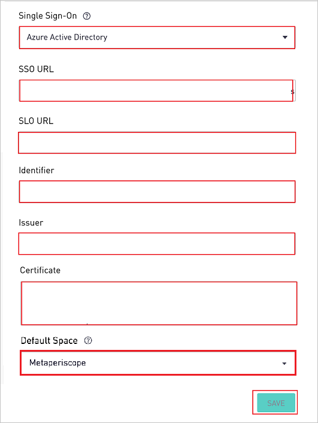
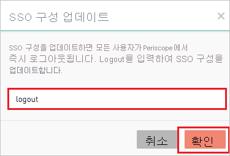
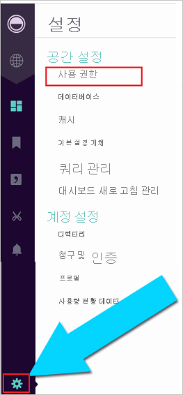
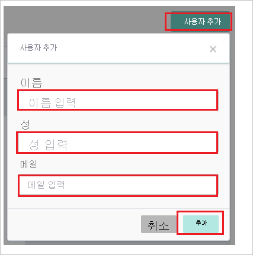

# 자습서: Periscope Data와 Azure AD SSO 통합

이 자습서에서는 Azure AD(Azure Active Directory)와 Periscope Data를 통합하는 방법에 대해 알아봅니다. Azure AD와 Periscope Data를 통합하면 다음을 수행할 수 있습니다.

* Periscope Data에 대한 액세스 권한이 있는 사용자를 Azure AD에서 제어합니다.
* 사용자가 자신의 Azure AD 계정으로 Periscope Data에 자동으로 로그인되도록 설정합니다.
* 단일 중앙 위치인 Azure Portal에서 계정을 관리합니다.

## 필수 구성 요소

시작하려면 다음 항목이 필요합니다.

* Azure AD 구독 구독이 없는 경우 [체험 계정](https://azure.microsoft.com/free/)을 얻을 수 있습니다.
* Periscope Data SSO(Single Sign-On)가 설정된 구독.

## 시나리오 설명

이 자습서에서는 테스트 환경에서 Azure AD Single Sign-On을 구성하고 테스트합니다.

* Periscope Data에서 **SP** 시작 SSO를 지원합니다.

## 갤러리에서 Periscope Data 추가

Periscope Data의 Azure AD 통합을 구성하려면 갤러리의 Periscope Data를 관리되는 SaaS 앱 목록에 추가해야 합니다.

1. Azure Portal에 회사 또는 학교 계정, 개인 Microsoft 계정으로 로그인합니다.
1. 왼쪽 탐색 창에서 **Azure Active Directory** 서비스를 선택합니다.
1. **엔터프라이즈 애플리케이션** 으로 이동한 다음, **모든 애플리케이션** 을 선택합니다.
1. 새 애플리케이션을 추가하려면 **새 애플리케이션** 을 선택합니다.
1. **갤러리에서 추가** 섹션의 검색 상자에 **Periscope Data** 를 입력합니다.
1. 결과 패널에서 **Periscope Data** 를 선택한 다음, 앱을 추가합니다. 앱이 테넌트에 추가될 때까지 잠시 동안 기다려 주세요.

## Periscope Data에 대한 Azure AD SSO 구성 및 테스트

**B.Simon** 이라는 테스트 사용자를 사용하여 Periscope Data에서 Azure AD SSO를 구성하고 테스트합니다. SSO가 작동하려면 Azure AD 사용자와 Periscope Data의 관련 사용자 간에 연결 관계를 설정해야 합니다.

Periscope Data에서 Azure AD SSO를 구성하고 테스트하려면 다음 단계를 수행합니다.

1. **[Azure AD SSO 구성](#configure-azure-ad-sso)** - 사용자가 이 기능을 사용할 수 있도록 합니다.
    1. **[Azure AD 테스트 사용자 만들기](#create-an-azure-ad-test-user)** - B.Simon을 사용하여 Azure AD Single Sign-On을 테스트합니다.
    1. **[Azure AD 테스트 사용자 할당](#assign-the-azure-ad-test-user)** - B. Simon이 Azure AD Single Sign-On을 사용할 수 있도록 합니다.
1. **[Periscope Data SSO 구성](#configure-periscope-data-sso)** - 애플리케이션 쪽에서 Single Sign-On 설정을 구성합니다.
    1. **[Periscope Data 테스트 사용자 만들기](#create-periscope-data-test-user)** - B.Simon의 Azure AD 표현과 연결된 해당 사용자를 Periscope Data에 만듭니다.
1. **[SSO 테스트](#test-sso)** - 구성이 작동하는지 여부를 확인합니다.

## Azure AD SSO 구성

Azure Portal에서 Azure AD SSO를 사용하도록 설정하려면 다음 단계를 수행합니다.

1. Azure Portal의 **Periscope Data** 애플리케이션 통합 페이지에서 **관리** 섹션을 찾아 **Single Sign-On** 을 선택합니다.
1. **Single Sign-On 방법 선택** 페이지에서 **SAML** 을 선택합니다.
1. **SAML로 Single Sign-On 설정** 페이지에서 **기본 SAML 구성** 에 대한 연필 아이콘을 클릭하여 설정을 편집합니다.

   

4. **기본 SAML 구성** 섹션에서 다음 단계를 수행합니다.

    a. **식별자(엔터티 ID)** 텍스트 상자에서 `https://app.periscopedata.com/<SITENAME>/sso` 패턴을 사용하는 URL을 입력합니다.

    b. **로그온 URL** 텍스트 상자에서 다음 패턴 중 하나를 사용하여 URL을 입력합니다.
    
    | **URL에 로그인** |
    |--------|
    | `https://app.periscopedata.com/` |
    | `https://app.periscopedata.com/app/<SITENAME>` |

    > [!NOTE]
    > 로그온 URL 값은 실제 값이 아닙니다. 이러한 값을 실제 로그온 URL로 업데이트합니다. 이 값 및 **Periscope Data Single Sign-On 구성** 에서 필요한 식별자 값(자습서 뒷부분에서 설명됨)을 얻으려면 [Periscope Data 클라이언트 지원 팀](mailto:support@periscopedata.com)에 문의하세요. Azure Portal의 **기본 SAML 구성** 섹션에 표시된 패턴을 참조할 수도 있습니다.

5. **SAML로 Single Sign-On 설정** 페이지의 **SAML 서명 인증서** 섹션에서 복사 단추를 클릭하여 **앱 페더레이션 메타데이터 URL** 을 복사한 후 컴퓨터에 저장합니다.

    

### Azure AD 테스트 사용자 만들기 

이 섹션에서는 Azure Portal에서 B.Simon이라는 테스트 사용자를 만듭니다.

1. Azure Portal의 왼쪽 창에서 **Azure Active Directory**, **사용자**, **모든 사용자** 를 차례로 선택합니다.
1. 화면 위쪽에서 **새 사용자** 를 선택합니다.
1. **사용자** 속성에서 다음 단계를 수행합니다.
   1. **이름** 필드에 `B.Simon`을 입력합니다.  
   1. **사용자 이름** 필드에서 username@companydomain.extension을 입력합니다. 예들 들어 `B.Simon@contoso.com`입니다.
   1. **암호 표시** 확인란을 선택한 다음, **암호** 상자에 표시된 값을 적어둡니다.
   1. **만들기** 를 클릭합니다.

### Azure AD 테스트 사용자 할당

이 섹션에서는 Azure Single Sign-On을 사용할 수 있도록 B.Simon에게 Periscope Data에 대한 액세스 권한을 부여합니다.

1. Azure Portal에서 **엔터프라이즈 애플리케이션** 을 선택한 다음, **모든 애플리케이션** 을 선택합니다.
1. 애플리케이션 목록에서 **Periscope Data** 를 선택합니다.
1. 앱의 개요 페이지에서 **관리** 섹션을 찾고 **사용자 및 그룹** 을 선택합니다.
1. **사용자 추가** 를 선택한 다음, **할당 추가** 대화 상자에서 **사용자 및 그룹** 을 선택합니다.
1. **사용자 및 그룹** 대화 상자의 사용자 목록에서 **B.Simon** 을 선택한 다음, 화면 아래쪽에서 **선택** 단추를 클릭합니다.
1. 사용자에게 역할을 할당할 것으로 예상되는 경우 **역할 선택** 드롭다운에서 선택할 수 있습니다. 이 앱에 대한 역할이 설정되지 않은 경우 "기본 액세스" 역할이 선택된 것으로 표시됩니다.
1. **할당 추가** 대화 상자에서 **할당** 단추를 클릭합니다.

## Periscope Data SSO 구성

1. 다른 웹 브라우저 창에서 Periscope Data에 관리자로 로그인합니다.

2. 왼쪽 아래에 있는 기어 메뉴를 열고 **청구** > **보안** 메뉴를 연 후 다음 단계를 수행합니다. 관리자만 이러한 설정에 액세스할 수 있습니다.

    

    a. 5단계 **SAML 서명 인증서** 에서 **앱 페더레이션 메타데이터 URL** 을 복사하고 브라우저에서 엽니다. 그러면 XML 문서가 열립니다.

    b. **Single Sign-On** 텍스트 상자에서 **Azure Active Directory** 를 선택합니다.

    다. **SingleSignOnService** 태그를 찾고 **위치** 값을 **SSO URL** 텍스트 상자에 붙여넣습니다.

    d. **SingleLogoutService** 태그를 찾고 **위치** 값을 **SLO URL** 텍스트 상자에 붙여넣습니다.

    e. 인스턴스의 **식별자** 값을 복사하여 Azure Portal의 **기본 SAML 구성** 섹션에 있는 **식별자(엔터티 ID)** 텍스트 상자에 붙여넣습니다.

    f. XML 파일의 첫 번째 태그를 찾고 **entityID** 값을 복사하여 **발급자** 텍스트 상자에 붙여넣습니다.

    g. SAML 프로토콜이 포함된 **IDPSSODescriptor** 태그를 찾습니다. 해당 섹션 내에서 **use=signing** 이 포함된 **KeyDescriptor** 태그를 찾습니다. **X509Certificate** 값을 복사하고 **인증서** 텍스트 상자에 붙여넣습니다.

    h. 여러 공간을 사용한 사이트의 경우 **기본 공간** 드롭다운에서 기본 공간을 선택할 수 있습니다. 이 공간은 Periscope Data에 처음으로 로그인할 때 새 사용자가 추가되는 공간이 되며 Active Directory Single Sign On을 통해 프로비저닝됩니다.

    i. 마지막으로, **저장** 을 클릭하고 **로그아웃** 을 입력하여 SSO 설정 변경 사항을 **확인** 합니다.

    

### Periscope Data 테스트 사용자 만들기

Azure AD 사용자가 Periscope Data에 로그인할 수 있도록 하려면 이 사용자를 Periscope Data로 프로비저닝해야 합니다. Periscope Data에서는 수동으로 프로비저닝합니다.

**사용자 계정을 프로비전하려면 다음 단계를 수행합니다.**

1. Periscope Data에 관리자로 로그인합니다.

2. 메뉴의 왼쪽 아래에서 **설정** 아이콘을 클릭하고 **권한** 으로 이동합니다.

    

3. **사용자 추가** 를 클릭하여 다음 단계를 수행합니다.

      

    a. **이름** 텍스트 상자에 사용자의 이름(예: **Britta**)을 입력합니다.

    b. **성** 텍스트 상자에 사용자의 성(예: **Simon**)을 입력합니다.

    다. **이메일** 텍스트 상자에 사용자의 이메일 주소(예: **brittasimon\@contoso.com**)를 입력합니다.

    d. **추가** 를 클릭합니다.

## SSO 테스트 

이 섹션에서는 다음 옵션을 사용하여 Azure AD Single Sign-On 구성을 테스트합니다. 

* Azure Portal에서 **이 애플리케이션 테스트** 를 클릭합니다. 그러면 로그인 흐름을 시작할 수 있는 Periscope Data 로그온 URL로 리디렉션됩니다. 

* Periscope Data 로그온 URL로 직접 이동하여 해당 위치에서 로그인 흐름을 시작합니다.

* Microsoft 내 앱을 사용할 수 있습니다. 내 앱에서 Periscope Data 타일을 클릭하면 Periscope Data 로그온 URL로 리디렉션됩니다. 내 앱에 대한 자세한 내용은 [내 앱 소개](../user-help/my-apps-portal-end-user-access.md)를 참조하세요.

## 다음 단계

Periscope Data가 구성되면 세션 제어를 적용하여 조직의 중요한 데이터의 반출 및 반입을 실시간으로 보호할 수 있습니다. 세션 제어는 조건부 액세스에서 확장됩니다. [Microsoft Defender for Cloud Apps를 사용하여 세션 제어를 적용하는 방법을 알아봅니다](/cloud-app-security/proxy-deployment-aad).
