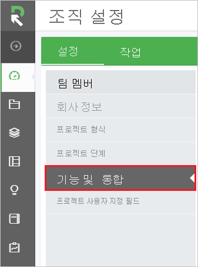
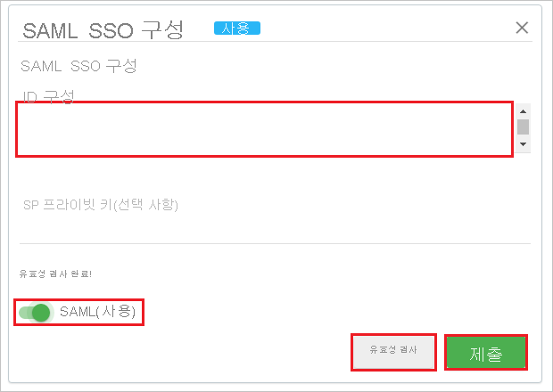
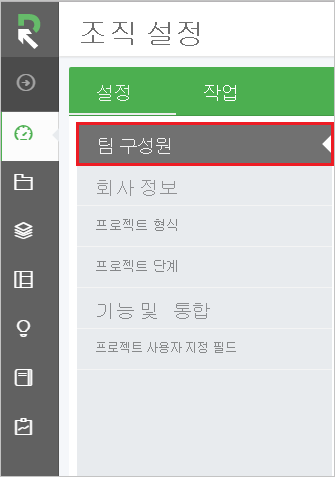

# 자습서: RFPIO와 Azure AD SSO 통합

이 자습서에서는 Azure AD(Azure Active Directory)와 RFPIO를 통합하는 방법에 대해 알아봅니다. Azure AD와 RFPIO를 통합하면 다음을 수행할 수 있습니다.

* Azure AD에서 RFPIO에 액세스할 수 있는 사용자를 제어합니다.
* 사용자가 Azure AD 계정으로 RFPIO에 자동으로 로그인되도록 설정합니다.
* 단일 중앙 위치인 Azure Portal에서 계정을 관리합니다.

## 사전 요구 사항

RFPIO와 Azure AD 통합을 구성하려면 다음 항목이 필요합니다.

* Azure AD 구독 Azure AD 환경이 없으면 [체험 계정](https://azure.microsoft.com/free/)을 얻을 수 있습니다.
* RFPIO Single Sign-On이 설정된 구독

## 시나리오 설명

이 자습서에서는 테스트 환경에서 Azure AD Single Sign-On을 구성하고 테스트합니다.

* RFPIO는 **SP 및 IDP** 시작 SSO를 지원합니다.

* RFPIO는 [자동화된 사용자 프로비저닝](rfpio-provisioning-tutorial.md)을 지원합니다.

> [!NOTE]
> 이 애플리케이션의 식별자는 고정 문자열 값이므로 하나의 테넌트에서 하나의 인스턴스만 구성할 수 있습니다.

## 갤러리에서 RFPIO 추가

RFPIO의 Azure AD 통합을 구성하려면 갤러리의 RFPIO를 관리되는 SaaS 앱 목록에 추가해야 합니다.

1. Azure Portal에 회사 또는 학교 계정, 개인 Microsoft 계정으로 로그인합니다.
1. 왼쪽 탐색 창에서 **Azure Active Directory** 서비스를 선택합니다.
1. **엔터프라이즈 애플리케이션** 으로 이동한 다음, **모든 애플리케이션** 을 선택합니다.
1. 새 애플리케이션을 추가하려면 **새 애플리케이션** 을 선택합니다.
1. **갤러리에서 추가** 섹션의 검색 상자에 **RFPIO** 를 입력합니다.
1. 결과 패널에서 **RFPIO** 를 선택한 다음, 앱을 추가합니다. 앱이 테넌트에 추가될 때까지 잠시 동안 기다려 주세요.

## RFPIO에서 Azure AD SSO 구성 및 테스트

**B.Simon** 이라는 테스트 사용자를 사용하여 RFPIO에서 Azure AD SSO를 구성하고 테스트합니다. SSO가 작동하려면 Azure AD 사용자와 RFPIO의 관련 사용자 간에 연결 관계를 설정해야 합니다.

RFPIO에서 Azure AD SSO를 구성하고 테스트하려면 다음 단계를 수행합니다.

1. **[Azure AD SSO 구성](#configure-azure-ad-sso)** - 사용자가 이 기능을 사용할 수 있도록 합니다.
    1. **[Azure AD 테스트 사용자 만들기](#create-an-azure-ad-test-user)** - B.Simon을 사용하여 Azure AD Single Sign-On을 테스트합니다.
    1. **[Azure AD 테스트 사용자 할당](#assign-the-azure-ad-test-user)** - B. Simon이 Azure AD Single Sign-On을 사용할 수 있도록 합니다.
1. **[RFPIO SSO 구성](#configure-rfpio-sso)** - 애플리케이션 쪽에서 Single Sign-On 설정을 구성합니다.
    1. **[RFPIO 테스트 사용자 만들기](#create-rfpio-test-user)** - B.Simon의 Azure AD 표현과 연결된 해당 사용자를 RFPIO에 만듭니다.
1. **[SSO 테스트](#test-sso)** - 구성이 작동하는지 여부를 확인합니다.

## Azure AD SSO 구성

Azure Portal에서 Azure AD SSO를 사용하도록 설정하려면 다음 단계를 수행합니다.

1. Azure Portal의 **RFPIO** 애플리케이션 통합 페이지에서 **관리** 섹션을 찾은 후 **Single Sign-On** 을 선택합니다.
1. **Single Sign-On 방법 선택** 페이지에서 **SAML** 을 선택합니다.
1. **SAML로 Single Sign-On 설정** 페이지에서 **기본 SAML 구성** 에 대한 연필 아이콘을 클릭하여 설정을 편집합니다.

   

1. **IDP** 시작 모드에서 애플리케이션을 구성하려면 **기본 SAML 구성** 섹션에서 다음 단계를 수행합니다.

    a. **식별자** 텍스트 상자에서 `https://www.rfpio.com` URL을 입력합니다.

    b. **추가 URL 설정** 을 클릭합니다.

    다. **릴레이 상태** 텍스트 상자에 문자열 값을 입력합니다. 이 값을 얻으려면 [RFPIO 지원 팀](https://www.rfpio.com/contact/)에 문의하세요.

1. **SP** 시작 모드에서 애플리케이션을 구성하려면 **추가 URL 설정** 를 클릭하고 다음 단계를 수행합니다.

    **로그온 URL** 텍스트 상자에 `https://www.app.rfpio.com` URL을 입력합니다.

1. RFPIO 애플리케이션에는 특정 형식의 SAML 어설션이 필요하므로, SAML 토큰 특성 구성에 사용자 지정 특성 매핑을 추가해야 합니다. 다음 스크린샷에서는 기본 특성의 목록을 보여 줍니다.

    

1. 위에서 언급한 특성 외에도 RFPIO 애플리케이션에는 아래에 표시된 SAML 응답에서 다시 전달되어야 하는 몇 가지 특성이 추가로 필요합니다. 이러한 특성도 미리 채워져 있지만 요구 사항에 따라 검토할 수 있습니다.

    | Name | 원본 특성|
    | ------- | --------- |
    | first_name | user.givenname |
    | last_name | user.surname |

1. **SAML로 Single Sign-On 설정** 페이지의 **SAML 서명 인증서** 섹션에서 **다운로드** 를 클릭하여 요구 사항에 따라 제공된 옵션에서 **페더레이션 메타데이터 XML** 을 다운로드하고 컴퓨터에 저장합니다.

    

1. **RFPIO 설정** 섹션에서 요구 사항에 따라 적절한 URL을 복사합니다.

    

### Azure AD 테스트 사용자 만들기

이 섹션에서는 Azure Portal에서 B.Simon이라는 테스트 사용자를 만듭니다.

1. Azure Portal의 왼쪽 창에서 **Azure Active Directory**, **사용자**, **모든 사용자** 를 차례로 선택합니다.
1. 화면 위쪽에서 **새 사용자** 를 선택합니다.
1. **사용자** 속성에서 다음 단계를 수행합니다.
   1. **이름** 필드에 `B.Simon`을 입력합니다.  
   1. **사용자 이름** 필드에서 username@companydomain.extension을 입력합니다. 예들 들어 `B.Simon@contoso.com`입니다.
   1. **암호 표시** 확인란을 선택한 다음, **암호** 상자에 표시된 값을 적어둡니다.
   1. **만들기** 를 클릭합니다.

### Azure AD 테스트 사용자 할당

이 섹션에서는 Azure Single Sign-On을 사용할 수 있도록 B.Simon에게 RFPIO에 대한 액세스 권한을 부여합니다.

1. Azure Portal에서 **엔터프라이즈 애플리케이션** 을 선택한 다음, **모든 애플리케이션** 을 선택합니다.
1. 애플리케이션 목록에서 **RFPIO** 를 선택합니다.
1. 앱의 개요 페이지에서 **관리** 섹션을 찾고 **사용자 및 그룹** 을 선택합니다.
1. **사용자 추가** 를 선택한 다음, **할당 추가** 대화 상자에서 **사용자 및 그룹** 을 선택합니다.
1. **사용자 및 그룹** 대화 상자의 사용자 목록에서 **B.Simon** 을 선택한 다음, 화면 아래쪽에서 **선택** 단추를 클릭합니다.
1. 사용자에게 역할을 할당할 것으로 예상되는 경우 **역할 선택** 드롭다운에서 선택할 수 있습니다. 이 앱에 대한 역할이 설정되지 않은 경우 "기본 액세스" 역할이 선택된 것으로 표시됩니다.
1. **할당 추가** 대화 상자에서 **할당** 단추를 클릭합니다.

## RFPIO SSO 구성

1. 다른 웹 브라우저 창에서 **RFPIO** 웹 사이트에 관리자로 로그인합니다.

1. 왼쪽 아래 모서리 드롭다운을 클릭합니다.

    

1. **조직 설정** 을 클릭합니다. 

    

1. **기능 및 통합** 을 클릭합니다.

    

1. **SAML SSO 구성** 에서 **편집** 을 클릭합니다.

    

1. 이 섹션에서 다음 작업을 수행합니다.

    
    
    a. **다운로드한 메타데이터 XML** 의 내용을 복사하여 **ID 구성** 필드에 붙여넣습니다.

    > [!NOTE]
    > 다운로드한 **페더레이션 메타데이터 XML** 의 콘텐츠를 복사하려면 **메모장++** 또는 적절한 **XML 편집기** 를 사용합니다.

    b. **유효성 검사** 를 클릭합니다.

    다. **유효성 검사** 를 클릭한 후 **SAML(Enabled)** (SAML(사용))을 설정으로 전환합니다.

    d. **제출** 을 클릭합니다.

### RFPIO 테스트 사용자 만들기

1. RFPIO 회사 사이트에 관리자로 로그인합니다.

1. 왼쪽 아래 모서리 드롭다운을 클릭합니다.

    

1. **조직 설정** 을 클릭합니다. 

    

1. **TEAM MEMBERS**(팀 멤버)를 클릭합니다.

    

1. **멤버 추가** 를 클릭합니다.

    

1. **새 멤버 추가** 섹션에서 다음 작업을 수행합니다.

    

    a. **Enter one email per line**(줄당 하나의 메일 입력) 필드에 **메일 주소** 를 입력합니다.

    b. 요구 사항에 따라 **역할** 을 선택합니다.

    다. **멤버 추가** 를 클릭합니다.

    > [!NOTE]
    > Azure Active Directory 계정 보유자는 활성화되기 전에 메일을 받고 링크를 따라 계정을 확인합니다.

> [!NOTE]
> RFPIO는 자동화된 사용자 프로비저닝도 지원합니다. 자동화된 사용자 프로비저닝 구성 방법에 대한 자세한 내용은 [여기](./rfpio-provisioning-tutorial.md)에서 제공합니다.  

## SSO 테스트

이 섹션에서는 다음 옵션을 사용하여 Azure AD Single Sign-On 구성을 테스트합니다. 

#### SP 시작:

* Azure Portal에서 **이 애플리케이션 테스트** 를 클릭합니다. 그러면 로그인 흐름을 시작할 수 있는 RFPIO 로그온 URL로 리디렉션됩니다.  

* RFPIO 로그온 URL로 직접 이동하여 해당 위치에서 로그인 흐름을 시작합니다.

#### IDP 시작:

* Azure Portal에서 **이 애플리케이션 테스트** 를 클릭하면 SSO를 설정한 RFPIO에 자동으로 로그인됩니다. 

Microsoft 내 앱을 사용하여 모든 모드에서 애플리케이션을 테스트할 수도 있습니다. 내 앱에서 RFPIO 타일을 클릭하면 SP 모드로 구성된 경우에는 로그인 흐름을 시작하기 위해 애플리케이션 로그온 페이지로 리디렉션되고, IDP 모드로 구성된 경우에는 SSO를 설정한 RFPIO에 자동으로 로그인됩니다. 내 앱에 대한 자세한 내용은 [내 앱 소개](https://support.microsoft.com/account-billing/sign-in-and-start-apps-from-the-my-apps-portal-2f3b1bae-0e5a-4a86-a33e-876fbd2a4510)를 참조하세요.

## 다음 단계

RFPIO가 구성되면 세션 제어를 적용하여 조직에서 중요한 데이터의 반출 및 반입을 실시간으로 보호할 수 있습니다. 세션 제어는 조건부 액세스에서 확장됩니다. [Microsoft Cloud App Security를 사용하여 세션 제어를 적용하는 방법을 알아봅니다](/cloud-app-security/proxy-deployment-aad).