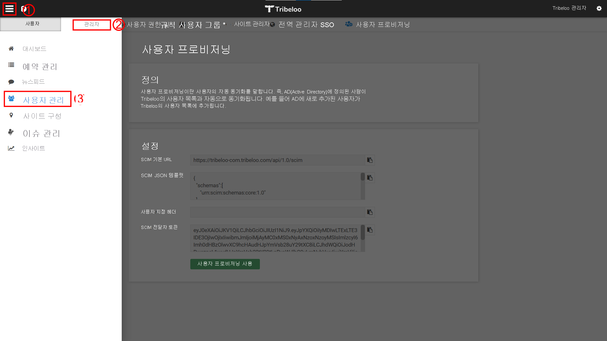
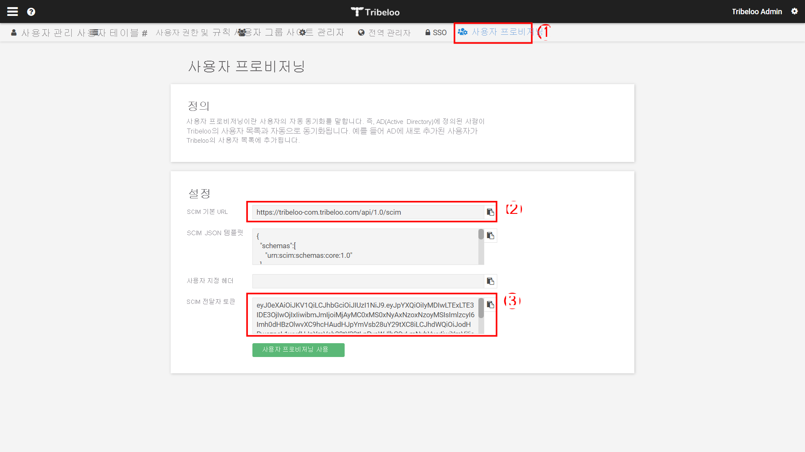
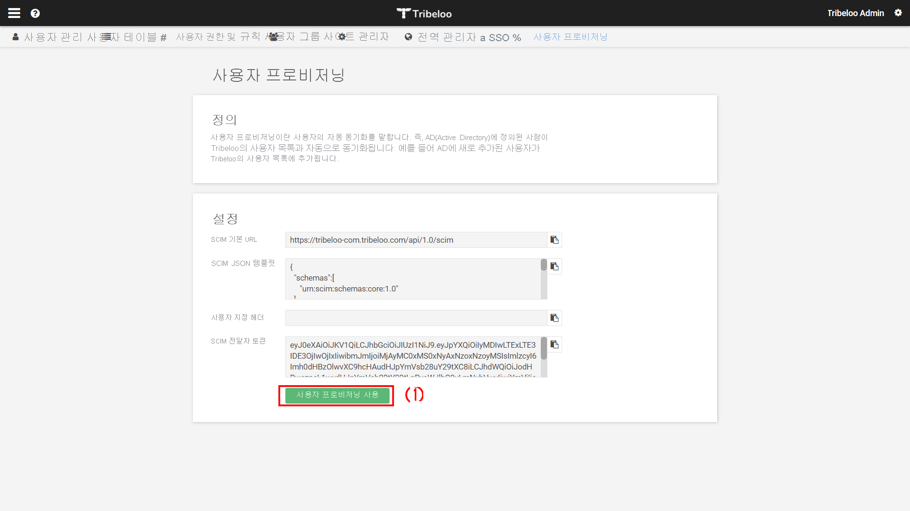

# 자습서: 자동 사용자 프로비저닝을 위한 Tribeloo 구성

이 자습서에서는 자동 사용자 프로비저닝을 구성하기 위해 Tribeloo 및 Azure AD(Azure Active Directory)에서 수행해야 하는 단계를 설명합니다. 구성된 경우 Azure AD는 Azure AD 프로비저닝 서비스를 사용하여 사용자 및 그룹을 [Tribeloo](https://www.tribeloo.com/)로 자동으로 프로비전 및 프로비전 해제합니다. 이 서비스의 기능, 작동 방법 및 질문과 대답에 대한 중요한 내용은 [Azure Active Directory를 사용하여 SaaS 애플리케이션의 사용자를 자동으로 프로비저닝 및 프로비저닝 해제](../app-provisioning/user-provisioning.md)를 참조하세요. 

## 지원되는 기능
> [!div class="checklist"]
> * Tribeloo에서 사용자 만들기
> * Tribeloo에서 더 이상 액세스할 필요가 없는 사용자 제거
> * Azure AD와 Tribeloo 간에 사용자 특성을 동기화된 상태로 유지
> * [Single Sign-On](tribeloo-tutorial.md) 설정을 Tribeloo에 적용(권장)

## 필수 구성 요소

이 자습서에 설명된 시나리오에서는 사용자에게 이미 다음 필수 구성 요소가 있다고 가정합니다.

* [Azure AD 테넌트](../develop/quickstart-create-new-tenant.md) 
* 프로비저닝을 구성할 [권한](../roles/permissions-reference.md)이 있는 Azure AD의 사용자 계정(예: 애플리케이션 관리자, 클라우드 애플리케이션 관리자, 애플리케이션 소유자 또는 전역 관리자). 
* [Tribeloo](https://www.tribeloo.com/) 테넌트
* 관리자 권한이 있는 Tribeloo의 사용자 계정

## 1단계. 프로비저닝 배포 계획
1. [프로비저닝 서비스의 작동 방식](../app-provisioning/user-provisioning.md)에 대해 알아봅니다.
1. [프로비저닝 범위](../app-provisioning/define-conditional-rules-for-provisioning-user-accounts.md)에 있는 사용자를 결정합니다.
1. [Azure AD와 Tribeloo 간에 매핑](../app-provisioning/customize-application-attributes.md)할 데이터를 결정합니다. 

## 2단계. Azure AD에서 프로비저닝을 지원하도록 Tribeloo 구성

[Tribeloo 앱](https://app.tribeloo.com/)으로 이동하고 관리자 권한이 있는 사용자로 로그인합니다.
1. 측면 메뉴(1)를 사용해서 **관리자**(2)로 이동하고 **사용자 관리**(3)를 선택합니다.

    

1. **사용자 프로비저닝**(1) 탭을 선택합니다. 이 탭에서 Azure AD 통합을 구성하기 위해 사용해야 하는 Tribeloo 정보에 액세스할 수 있습니다.
   1. **SCIM 기준 URL** (2)
   1. **SCIM 전달자 토큰**(3)
1. 이러한 값을 클립보드에 복사하고 이를 해당 Azure AD 필드에 붙여넣습니다(5단계 참조). AD 필드는 각각 **테넌트 URL** 및 **비밀 토큰** 이름으로 지정됩니다.

    

1. **사용자 프로비저닝** 탭에서 이제 **사용자 프로비저닝 사용**(1) 단추를 클릭하여 Tribeloo에서 사용자 프로비저닝을 사용하도록 설정할 수 있습니다.

    

## 3단계. Azure AD 애플리케이션 갤러리에서 Tribeloo 추가

Azure AD 애플리케이션 갤러리에서 Tribeloo를 추가하여 Tribeloo의 프로비저닝 관리를 시작합니다. 이전에 SSO용 Tribeloo를 설정했다면 동일한 애플리케이션을 사용할 수 있습니다. 그러나 처음 통합을 테스트하는 경우 별도의 앱을 만드는 것이 좋습니다. [여기](../manage-apps/add-application-portal.md)를 클릭하여 갤러리에서 애플리케이션을 추가하는 방법에 대해 자세히 알아봅니다. 

## 4단계. 프로비저닝 범위에 있는 사용자 정의 

Azure AD 프로비저닝 서비스를 사용하면 애플리케이션에 대한 할당 또는 사용자/그룹의 특성을 기반으로 프로비저닝되는 사용자의 범위를 지정할 수 있습니다. 할당을 기준으로 앱에 프로비저닝할 사용자의 범위를 선택하려면 다음 [단계](../manage-apps/assign-user-or-group-access-portal.md)를 사용하여 애플리케이션에 사용자 및 그룹을 할당할 수 있습니다. 사용자 또는 그룹의 특성만을 기준으로 프로비저닝할 사용자의 범위를 선택하려면 [여기](../app-provisioning/define-conditional-rules-for-provisioning-user-accounts.md) 설명된 대로 범위 지정 필터를 사용할 수 있습니다. 

* 사용자 및 그룹을 Tribeloo에 할당할 때 **기본 액세스** 가 아닌 다른 역할을 선택해야 합니다. 기본 액세스 역할이 있는 사용자는 프로비저닝에서 제외되고 프로비저닝 로그에 실질적으로 권한을 부여받지 않은 것으로 표시됩니다. 애플리케이션에서 사용할 수 있는 유일한 역할이 기본 액세스 역할인 경우에는 [애플리케이션 매니페스트를 업데이트](../develop/howto-add-app-roles-in-azure-ad-apps.md)하여 역할을 더 추가할 수 있습니다. 

* 소규모로 시작합니다. 모든 사용자에게 배포하기 전에 소수의 사용자 및 그룹 집합으로 테스트합니다. 할당된 사용자 및 그룹으로 프로비저닝 범위가 설정된 경우 앱에 하나 또는 두 개의 사용자 또는 그룹을 할당하여 범위를 제어할 수 있습니다. 모든 사용자 및 그룹으로 범위가 설정된 경우 [특성 기반 범위 지정 필터](../app-provisioning/define-conditional-rules-for-provisioning-user-accounts.md)를 지정할 수 있습니다. 

## 5단계. Tribeloo에 대한 자동 사용자 프로비저닝 구성 

이 섹션에서는 Azure AD의 사용자 및/또는 그룹 할당에 따라 Tribeloo에서 사용자 및/또는 그룹을 만들고, 업데이트하고, 사용 해제하도록 Azure AD 프로비저닝 서비스를 구성하는 단계를 안내합니다.

### Azure AD에서 Tribeloo에 대한 자동 사용자 프로비저닝을 구성하려면 다음을 수행합니다.

1. [Azure Portal](https://portal.azure.com)에 로그인합니다. **엔터프라이즈 애플리케이션**, **모든 애플리케이션** 을 차례로 선택합니다.

    

1. 애플리케이션 목록에서 **Tribeloo** 를 선택합니다.

    

1. **프로비전** 탭을 선택합니다.

    

1. **프로비전 모드** 를 **자동** 으로 설정합니다.

    

1. **관리자 자격 증명** 섹션에서 Tribeloo **테넌트 URL** 및 **비밀 토큰** 을 입력합니다. **연결 테스트** 를 클릭하여 Azure AD가 Tribeloo에 연결할 수 있는지 확인합니다. 연결에 실패하면 Tribeloo 계정에 관리자 권한이 있는지 확인하고 다시 시도하세요.

    

1. **알림 이메일** 필드에 프로비저닝 오류 알림을 받을 개인 또는 그룹의 메일 주소를 입력하고, **오류가 발생할 경우 메일 알림 보내기** 확인란을 선택합니다.

    

1. **저장** 을 선택합니다.

1. **매핑** 섹션에서 **Azure Active Directory 사용자를 Tribeloo에 동기화** 를 선택합니다.

1. Azure AD에서 Tribeloo로 동기화되는 사용자 특성을 **특성 매핑** 섹션에서 검토합니다. **일치** 속성으로 선택한 특성은 업데이트 작업 시 Tribeloo의 사용자 계정을 일치시키는 데 사용됩니다. [일치하는 대상 특성](../app-provisioning/customize-application-attributes.md)을 변경하도록 선택하는 경우 Tribeloo API가 해당 특성에 따라 사용자 필터링을 지원하는지 확인해야 합니다. **저장** 단추를 선택하여 변경 내용을 커밋합니다.

   |attribute|Type|필터링에 지원됨|
   |---|---|---|
   |userName|String|&check;
   |emails[type eq "work"].value|String|
   |활성|부울|   
   |displayName|String|
   |name.givenName|String|
   |name.familyName|String|
   |addresses[type eq "work"].formatted|String|

1. 범위 지정 필터를 구성하려면 [범위 지정 필터 자습서](../app-provisioning/define-conditional-rules-for-provisioning-user-accounts.md)에서 제공하는 다음 지침을 참조합니다.

1. Tribeloo에 대한 Azure AD 프로비저닝 서비스를 사용하도록 설정하려면 **설정** 섹션에서 **프로비저닝 상태** 를 **켜기** 로 설정합니다.

    

1. **범위** 를 **설정** 섹션에서 원하는 값으로 선택해 Tribeloo에 프로비전하려는 사용자 및/또는 그룹을 정의합니다.

    

1. 프로비전할 준비가 되면 **저장** 을 클릭합니다.

    

이 작업은 **설정** 의 **범위** 섹션에 정의된 모든 사용자 및/또는 그룹의 초기 동기화 주기를 시작합니다. 초기 주기는 Azure AD 프로비저닝 서비스가 실행되는 동안 약 40분마다 발생하는 후속 주기보다 더 많은 시간이 걸립니다. 

## 6단계. 배포 모니터링
프로비저닝을 구성한 후에는 다음 리소스를 사용하여 배포를 모니터링합니다.

* [프로비저닝 로그](../reports-monitoring/concept-provisioning-logs.md)를 사용하여 어떤 사용자가 성공적으로 프로비저닝되었는지 확인합니다.
* [진행률 표시줄](../app-provisioning/application-provisioning-when-will-provisioning-finish-specific-user.md)을 통해 프로비저닝 주기 상태와 완료 정도를 확인합니다.
* 프로비저닝 구성이 비정상 상태로 보이면 애플리케이션이 격리됩니다. 격리 상태에 대한 자세한 내용은 [여기](../app-provisioning/application-provisioning-quarantine-status.md)를 참조하세요. 

## 로그 변경
* 08/12/2021 - 핵심 사용자 특성 **emails[type eq "work"].value** 및 **addresses[type eq "work"].formatted** 에 대한 지원이 추가되었습니다.

## 추가 리소스

* [엔터프라이즈 앱에 대한 사용자 계정 프로비전 관리](../app-provisioning/configure-automatic-user-provisioning-portal.md)
* [Azure Active Directory로 애플리케이션 액세스 및 Single Sign-On을 구현하는 방법](../manage-apps/what-is-single-sign-on.md)

## 다음 단계

* [프로비저닝 작업에 대한 로그를 검토하고 보고서를 받아보는 방법을 알아봅니다](../app-provisioning/check-status-user-account-provisioning.md).
