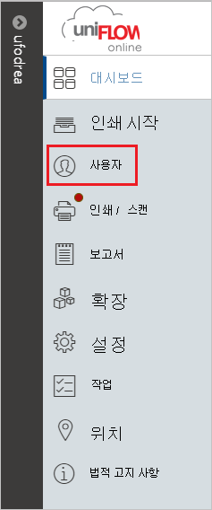
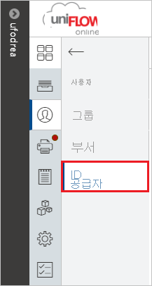
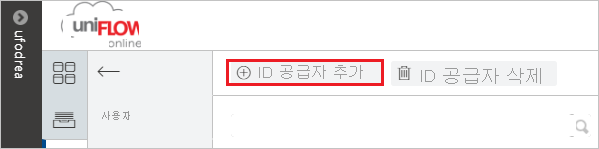
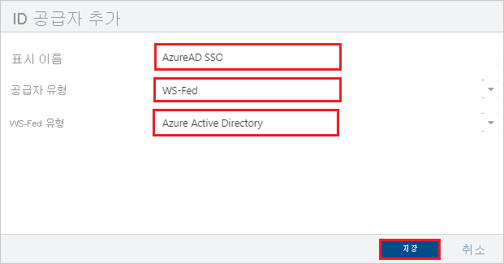
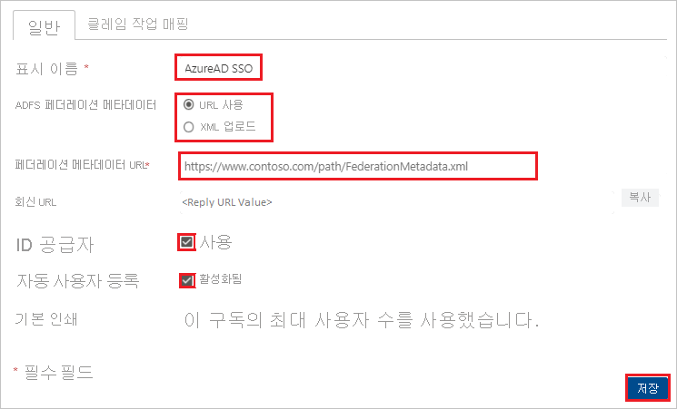

# 자습서: uniFLOW Online과 Azure Active Directory SSO(Single Sign-On) 통합

이 자습서에서는 Azure AD(Azure Active Directory)와 uniFLOW Online을 통합하는 방법에 대해 알아봅니다. uniFLOW Online을 Azure AD와 통합하면 다음을 수행할 수 있습니다.

* Azure AD에서 uniFLOW Online에 액세스할 수 있는 사용자를 제어합니다.
* 사용자가 해당 Azure AD 계정으로 uniFLOW Online에 로그인할 수 있도록 합니다.
* 단일 중앙 위치인 Azure Portal에서 계정을 관리합니다.

## 사전 요구 사항

시작하려면 다음 항목이 필요합니다.

* Azure AD 구독 구독이 없는 경우 [체험 계정](https://azure.microsoft.com/free/)을 얻을 수 있습니다.
* uniFLOW Online 테넌트.

## 시나리오 설명

이 자습서에서는 테스트 환경에서 Azure AD SSO를 구성하고 테스트합니다.

* uniFLOW Online은 **SP** 시작 SSO를 지원합니다.

## 갤러리에서 uniFLOW Online 추가

uniFLOW Online이 Azure AD에 통합되도록 구성하려면 갤러리의 uniFLOW Online을 관리형 SaaS 앱 목록에 추가해야 합니다.

1. Azure Portal에 회사 또는 학교 계정, 개인 Microsoft 계정으로 로그인합니다.
1. 왼쪽 탐색 창에서 **Azure Active Directory** 서비스를 선택합니다.
1. **엔터프라이즈 애플리케이션** 으로 이동한 다음, **모든 애플리케이션** 을 선택합니다.
1. 새 애플리케이션을 추가하려면 **새 애플리케이션** 을 선택합니다.
1. **갤러리에서 추가** 섹션의 검색 상자에서 **uniFLOW Online** 을 입력합니다.
1. 결과 패널에서 **uniFLOW Online** 을 선택한 다음, 앱을 추가합니다. 앱이 테넌트에 추가될 때까지 잠시 동안 기다려 주세요.

## uniFLOW Online에 대한 Azure AD SSO 구성 및 테스트

**B.Simon** 이라는 테스트 사용자를 사용하여 uniFLOW Online에서 Azure AD SSO를 구성하고 테스트합니다. SSO가 작동하려면 Azure AD 사용자와 uniFLOW Online의 관련 사용자 간에 연결 관계를 설정해야 합니다.

uniFLOW Online에서 Azure AD SSO를 구성하고 테스트하려면 다음 단계를 수행합니다.

1. **[Azure AD SSO 구성](#configure-azure-ad-sso)** - 사용자가 이 기능을 사용할 수 있도록 합니다.
   1. **[Azure AD 테스트 사용자 만들기](#create-an-azure-ad-test-user)** - B.Simon을 사용하여 Azure AD Single Sign-On을 테스트합니다.
   1. **[Azure AD 테스트 사용자 할당](#assign-the-azure-ad-test-user)** - B. Simon이 Azure AD Single Sign-On을 사용할 수 있도록 합니다.
1. **[uniFLOW Online SSO 구성](#configure-uniflow-online-sso)** - 애플리케이션 쪽에서 Single Sign-On 설정을 구성합니다.
    1. **[만든 테스트 사용자를 사용하여 uniFLOW Online에 로그인](#sign-in-to-uniflow-online-using-the-created-test-user)** - 애플리케이션 쪽에서 사용자 로그인을 테스트합니다.
1. **[SSO 테스트](#test-sso)** - 구성이 작동하는지 여부를 확인합니다.

## Azure AD SSO 구성

Azure Portal에서 Azure AD SSO를 사용하도록 설정하려면 다음 단계를 수행합니다.

1. Azure Portal의 **uniFLOW Online** 애플리케이션 통합 페이지에서 **관리** 섹션을 찾아 **Single Sign-On** 을 선택합니다.
1. **Single Sign-On 방법 선택** 페이지에서 **SAML** 을 선택합니다.
1. **SAML로 Single Sign-On 설정** 페이지에서 **기본 SAML 구성** 에 대한 연필 아이콘을 클릭하여 설정을 편집합니다.

   

1. **기본 SAML 구성** 섹션에서 다음 단계를 수행합니다.

    a. **식별자(엔터티 ID)** 텍스트 상자에서 다음 패턴 중 하나를 사용하여 URL을 입력합니다.

    | **식별자** |
    |---------|
    | `https://<tenant_domain_name>.eu.uniflowonline.com` |
    | `https://<tenant_domain_name>.us.uniflowonline.com` |
    | `https://<tenant_domain_name>.sg.uniflowonline.com` |
    | `https://<tenant_domain_name>.jp.uniflowonline.com` |
    | `https://<tenant_domain_name>.au.uniflowonline.com` |

    b. **로그온 URL** 텍스트 상자에서 다음 패턴 중 하나를 사용하여 URL을 입력합니다.

    | **URL에 로그인** |
    |---------|
    | `https://<tenant_domain_name>.eu.uniflowonline.com` |
    | `https://<tenant_domain_name>.us.uniflowonline.com` |
    | `https://<tenant_domain_name>.sg.uniflowonline.com` |
    | `https://<tenant_domain_name>.jp.uniflowonline.com` |
    | `https://<tenant_domain_name>.au.uniflowonline.com` |

    > [!NOTE]
    > 이러한 값은 실제 값이 아닙니다. 해당 값을 실제 식별자 및 로그온 URL로 업데이트합니다. 이러한 값을 얻으려면 [uniFLOW Online 클라이언트 지원 팀](mailto:support@nt-ware.com)에 문의하세요. Azure Portal의 **기본 SAML 구성** 섹션에 표시된 패턴을 참조하거나 uniFLOW Online 테넌트에 표시된 회신 URL을 참조할 수도 있습니다.

1. uniFLOW Online 애플리케이션에는 SAML 토큰 특성 구성에 사용자 지정 특성 매핑을 추가해야 하는 특정 형식의 SAML 어설션이 필요합니다. 다음 스크린샷에서는 기본 특성 목록을 보여 주지만, **nameidentifier** 는 **user.userprincipalname** 과 매핑됩니다. uniFLOW Online 애플리케이션에서는 **nameidentifier** 가 **user.objectid** 와 매핑되어야 하기 때문에, **편집** 아이콘을 클릭하여 특성 매핑을 편집하여 특성 매핑을 변경해야 합니다.

    

1. 위에서 언급한 특성 외에도 uniFLOW Online 애플리케이션에는 아래에 표시된 SAML 응답에서 다시 전달되어야 하는 몇 가지 특성이 추가로 필요합니다. 이러한 특성도 미리 채워져 있지만 요구 사항에 따라 검토할 수 있습니다.

    | Name |  원본 특성|
    | -----------| --------------- |
    | displayname | user.displayname |
    | nickname | user.onpremisessamaccountname |

   > [!NOTE]
   > `user.onpremisessamaccountname` 특성은 Azure AD 사용자가 로컬 Windows Active Directory에서 동기화된 경우에만 값을 포함합니다.

1. **SAML로 Single Sign-On 설정** 페이지의 **SAML 서명 인증서** 섹션에서 복사 단추를 클릭하여 **앱 페더레이션 메타데이터 URL** 을 복사한 후 컴퓨터에 저장합니다.

    

### Azure AD 테스트 사용자 만들기

이 섹션에서는 Azure Portal에서 B.Simon이라는 테스트 사용자를 만듭니다.

1. Azure Portal의 왼쪽 창에서 **Azure Active Directory**, **사용자**, **모든 사용자** 를 차례로 선택합니다.
1. 화면 위쪽에서 **새 사용자** 를 선택합니다.
1. **사용자** 속성에서 다음 단계를 수행합니다.
   1. **이름** 필드에 `B.Simon`을 입력합니다.  
   1. **사용자 이름** 필드에서 username@companydomain.extension을 입력합니다. 예들 들어 `B.Simon@contoso.com`입니다.
   1. **암호 표시** 확인란을 선택한 다음, **암호** 상자에 표시된 값을 적어둡니다.
   1. **만들기** 를 클릭합니다.

### Azure AD 테스트 사용자 할당

이 섹션에서는 Azure Single Sign-On을 사용할 수 있도록 B.Simon에게 uniFLOW Online에 대한 액세스 권한을 부여합니다.

1. Azure Portal에서 **엔터프라이즈 애플리케이션** 을 선택한 다음, **모든 애플리케이션** 을 선택합니다.
1. 애플리케이션 목록에서 **uniFLOW Online** 을 선택합니다.
1. 앱의 개요 페이지에서 **관리** 섹션을 찾고 **사용자 및 그룹** 을 선택합니다.
1. **사용자 추가** 를 선택한 다음, **할당 추가** 대화 상자에서 **사용자 및 그룹** 을 선택합니다.
1. **사용자 및 그룹** 대화 상자의 사용자 목록에서 **B.Simon** 을 선택한 다음, 화면 아래쪽에서 **선택** 단추를 클릭합니다.
1. 사용자에게 역할을 할당할 것으로 예상되는 경우 **역할 선택** 드롭다운에서 선택할 수 있습니다. 이 앱에 대한 역할이 설정되지 않은 경우 "기본 액세스" 역할이 선택된 것으로 표시됩니다.
1. **할당 추가** 대화 상자에서 **할당** 단추를 클릭합니다.

> [!NOTE]
> 모든 사용자가 수동 할당 없이 애플리케이션에 액세스할 수 있도록 하려면 **관리** 섹션으로 이동하여 **속성** 을 선택합니다. 그런 다음, **사용자 할당 필요** 매개 변수를 **아니오** 로 변경합니다.

## uniFLOW Online SSO 구성

1. 다른 브라우저 창에서 uniFLOW Online 웹 사이트에 관리자 권한으로 로그온합니다.

1. 왼쪽 탐색 패널에서 **User**(사용자)를 클릭합니다.

    

1. **ID 공급자** 를 클릭합니다.

    

1. **Add identity provider**(ID 공급자 추가)를 클릭합니다.

    

1. **ADD IDENTITY PROVIDER**(ID 공급자 추가) 섹션에서 다음 단계를 수행합니다.

    

    a. Display name(표시 이름)을 입력합니다(예: **AzureAD SSO**).

    b. **Provider type**(공급자 유형)의 드롭다운에서 **WS-Fed** 옵션을 선택합니다.

    다. **WS-Fed type**(WS-Fed 유형)의 드롭다운에서 **Azure Active Directory** 옵션을 선택합니다.

    d. **저장** 을 클릭합니다.

1. **General**(일반) 탭에서 다음 단계를 수행합니다.

    

    a. Display name(표시 이름)을 입력합니다(예: **AzureAD SSO**).

    b. **ADFS 페더레이션 메타데이터** 에 대해 **From URL** 옵션을 선택합니다.

    다. Azure Portal에서 복사한 **앱 페더레이션 메타데이터 URL** 값을 **Federation Metadata URl**(페더레이션 메타데이터 URl) 텍스트 상자에 붙여넣습니다.

    d. **Identity provider**(ID 공급자)를 **Enabled**(사용)로 선택합니다.

    e. **Automatic user registration**(자동 사용자 등록)을 **Activated**(활성화됨)로 선택합니다.

    f. **저장** 을 클릭합니다.

### 만든 테스트 사용자를 사용하여 uniFLOW Online에 로그인

1. 다른 웹 브라우저 창에서 테넌트의 uniFLOW Online URL로 이동합니다.

1. 이전에 만든 ID 공급자를 선택하여 Azure AD 인스턴스를 통해 로그인합니다.

1. 테스트 사용자를 사용하여 로그인합니다.

## SSO 테스트

이 섹션에서는 다음 옵션을 사용하여 Azure AD Single Sign-On 구성을 테스트합니다. 

* Azure Portal에서 **이 애플리케이션 테스트** 를 클릭합니다. 그러면 로그인 흐름을 시작할 수 있는 uniFLOW Online 로그온 URL로 리디렉션됩니다. 

* uniFLOW Online 로그온 URL로 직접 이동하여 해당 위치에서 로그인 흐름을 시작합니다.

* Microsoft 내 앱을 사용할 수 있습니다. 내 앱에서 uniFLOW Online 타일을 클릭하면 uniFLOW Online 로그온 URL로 리디렉션됩니다. 내 앱에 대한 자세한 내용은 [내 앱 소개](https://support.microsoft.com/account-billing/sign-in-and-start-apps-from-the-my-apps-portal-2f3b1bae-0e5a-4a86-a33e-876fbd2a4510)를 참조하세요.

## 다음 단계

uniFLOW Online이 구성되면 세션 제어를 적용하여 조직의 중요한 데이터의 반출 및 반입을 실시간으로 보호할 수 있습니다. 세션 제어는 조건부 액세스에서 확장됩니다. [Microsoft Defender for Cloud Apps를 사용하여 세션 제어를 적용하는 방법을 알아봅니다](/cloud-app-security/proxy-deployment-any-app).
