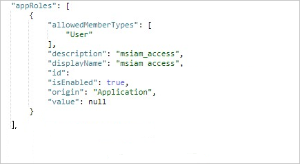

# <a name="tutorial-azure-ad-sso-integration-with-vida"></a>자습서: VIDA와 Azure AD SSO 통합

이 자습서에서는 Azure AD(Azure Active Directory)와 VIDA를 통합하는 방법을 알아봅니다. Azure AD와 VIDA를 통합하면 다음을 수행할 수 있습니다.

* Azure AD에서 VIDA에 대한 액세스 권한이 있는 사용자를 제어합니다.
* 사용자가 자신의 Azure AD 계정으로 VIDA에 자동으로 로그인되도록 설정합니다.
* 단일 중앙 위치인 Azure Portal에서 계정을 관리합니다.

## <a name="prerequisites"></a>사전 요구 사항

시작하려면 다음 항목이 필요합니다.

* Azure AD 구독 구독이 없는 경우 [체험 계정](https://azure.microsoft.com/free/)을 얻을 수 있습니다.
* VIDA SSO(Single Sign-On) 지원 구독

## <a name="scenario-description"></a>시나리오 설명

이 자습서에서는 테스트 환경에서 Azure AD SSO를 구성하고 테스트합니다.

* VIDA는 **SP** 시작 SSO를 지원합니다.

* VIDA는 **Just-In-Time** 사용자 프로비저닝을 지원합니다.

## <a name="adding-vida-from-the-gallery"></a>갤러리에서 VIDA 추가

VIDA가 Azure AD에 통합되도록 구성하려면 갤러리에서 VIDA를 관리형 SaaS 앱 목록에 추가해야 합니다.

1. Azure Portal에 회사 또는 학교 계정, 개인 Microsoft 계정으로 로그인합니다.
1. 왼쪽 탐색 창에서 **Azure Active Directory** 서비스를 선택합니다.
1. **엔터프라이즈 애플리케이션** 으로 이동한 다음, **모든 애플리케이션** 을 선택합니다.
1. 새 애플리케이션을 추가하려면 **새 애플리케이션** 을 선택합니다.
1. **갤러리에서 추가** 섹션의 검색 상자에 **VIDA** 를 입력합니다.
1. 결과 패널에서 **VIDA** 를 선택한 다음, 앱을 추가합니다. 앱이 테넌트에 추가될 때까지 잠시 동안 기다려 주세요.


## <a name="configure-and-test-azure-ad-sso-for-vida"></a>VIDA에 대한 Azure AD SSO 구성 및 테스트

**B.Simon** 이라는 테스트 사용자를 사용하여 VIDA에서 Azure AD SSO를 구성하고 테스트합니다. SSO가 작동하려면 Azure AD 사용자와 VIDA의 관련 사용자 간에 연결 관계를 설정해야 합니다.

VIDA에서 Azure AD SSO를 구성하고 테스트하려면 다음 단계를 수행합니다.

1. **[Azure AD SSO 구성](#configure-azure-ad-sso)** - 사용자가 이 기능을 사용할 수 있도록 합니다.
    1. **[Azure AD 테스트 사용자 만들기](#create-an-azure-ad-test-user)** - B.Simon을 사용하여 Azure AD Single Sign-On을 테스트합니다.
    1. **[Azure AD 테스트 사용자 할당](#assign-the-azure-ad-test-user)** - B. Simon이 Azure AD Single Sign-On을 사용할 수 있도록 합니다.
1. **[VIDA SSO 구성](#configure-vida-sso)** - 애플리케이션 쪽에서 Single Sign-On 설정을 구성합니다.
    1. **[VIDA 테스트 사용자 만들기](#create-vida-test-user)** - B.Simon의 Azure AD 표현과 연결된 해당 사용자를 VIDA에 만듭니다.
1. **[SSO 테스트](#test-sso)** - 구성이 작동하는지 여부를 확인합니다.

## <a name="configure-azure-ad-sso"></a>Azure AD SSO 구성

Azure Portal에서 Azure AD SSO를 사용하도록 설정하려면 다음 단계를 수행합니다.

1. Azure Portal의 **VIDA** 애플리케이션 통합 페이지에서 **관리** 섹션을 찾고 **Single Sign-On** 을 선택합니다.
1. **Single Sign-On 방법 선택** 페이지에서 **SAML** 을 선택합니다.
1. **SAML로 Single Sign-On 설정** 페이지에서 **기본 SAML 구성** 에 대한 연필 아이콘을 클릭하여 설정을 편집합니다.

   

1. **기본 SAML 구성** 섹션에서 다음 필드에 대한 값을 입력합니다.

    a. **식별자(엔터티 ID)** 텍스트 상자에 값을 `urn:amazon:cognito:sp:eu-west-2_IDmTxjGr6`로 입력합니다.
    
    b. **회신 URL** 텍스트 상자에서 URL `https://vitruevida.auth.eu-west-2.amazoncognito.com/saml2/idpresponse`을 입력합니다.
    
    다. **로그온 URL** 텍스트 상자에 다음 패턴을 사용하여 URL을 입력합니다.
    
    `https://vitruevida.com/?teamid=<ID>&idp=<IDP_NAME>`

    > [!NOTE]
    > 로그온 URL 값은 실제 값이 아닙니다. 이 값을 실제 로그온 URL로 업데이트합니다. 이 값을 가져오려면 [VIDA 클라이언트 지원 팀](mailto:support@vitruehealth.com)에 문의하세요. Azure Portal의 **기본 SAML 구성** 섹션에 표시된 패턴을 참조할 수도 있습니다.

1. VIDA 애플리케이션에는 특정 형식에서 SAML 어설션이 필요하므로 SAML 토큰 특성 구성에 사용자 지정 특성 매핑을 추가해야 합니다. 다음 스크린샷에서는 기본 특성의 목록을 보여 줍니다.

    

1. 위에서 언급한 특성 외에도 VIDA 애플리케이션에서는 아래 나와 있는 몇 가지 추가 특성을 SAML 응답으로 다시 전달해야 합니다. 이러한 특성도 미리 채워져 있지만 요구 사항에 따라 검토할 수 있습니다.
    
    | Name | 원본 특성|
    | ---------------- | --------- |
    | assignedroles | user.assignedroles |

1. **SAML로 Single Sign-On 설정** 페이지의 **SAML 서명 인증서** 섹션에서 **페더레이션 메타데이터 XML** 을 찾고, **다운로드** 를 선택하여 인증서를 컴퓨터에 다운로드 및 저장합니다.

    

1. **VIDA 설정** 섹션에서 요구 사항에 따라 적절한 URL을 복사합니다.

    

### <a name="create-an-azure-ad-test-user"></a>Azure AD 테스트 사용자 만들기

이 섹션에서는 Azure Portal에서 B.Simon이라는 테스트 사용자를 만듭니다.

1. Azure Portal의 왼쪽 창에서 **Azure Active Directory**, **사용자**, **모든 사용자** 를 차례로 선택합니다.
1. 화면 위쪽에서 **새 사용자** 를 선택합니다.
1. **사용자** 속성에서 다음 단계를 수행합니다.
   1. **이름** 필드에 `B.Simon`을 입력합니다.  
   1. **사용자 이름** 필드에서 username@companydomain.extension을 입력합니다. 예들 들어 `B.Simon@contoso.com`입니다.
   1. **암호 표시** 확인란을 선택한 다음, **암호** 상자에 표시된 값을 적어둡니다.
   1. **만들기** 를 클릭합니다.

### <a name="assign-the-azure-ad-test-user"></a>Azure AD 테스트 사용자 할당

이 섹션에서는 Azure Single Sign-On을 사용할 수 있도록 B.Simon에게 VIDA에 대한 액세스 권한을 부여합니다.

1. Azure Portal에서 **엔터프라이즈 애플리케이션** 을 선택한 다음, **모든 애플리케이션** 을 선택합니다.
1. 애플리케이션 목록에서 **VIDA** 를 선택합니다.
1. 앱의 개요 페이지에서 **관리** 섹션을 찾고 **사용자 및 그룹** 을 선택합니다.
1. **사용자 추가** 를 선택한 다음, **할당 추가** 대화 상자에서 **사용자 및 그룹** 을 선택합니다.
1. **사용자 및 그룹** 대화 상자의 사용자 목록에서 **B.Simon** 을 선택한 다음, 화면 아래쪽에서 **선택** 단추를 클릭합니다.
1. 사용자에게 역할을 할당할 것으로 예상되는 경우 **역할 선택** 드롭다운에서 선택할 수 있습니다. 이 앱에 대한 역할이 설정되지 않은 경우 "기본 액세스" 역할이 선택된 것으로 표시됩니다.
1. **할당 추가** 대화 상자에서 **할당** 단추를 클릭합니다.

## <a name="configure-role-based-single-sign-on-in-vida"></a>VIDA에서 역할 기반 Single Sign-On 구성

1. VIDA 역할을 Azure AD 사용자와 연결하려면 다음 단계를 수행하여 Azure AD에서 역할을 만들어야 합니다.

    a. [Microsoft Graph 탐색기](https://developer.microsoft.com/graph/graph-explorer)에 로그인합니다.

    b. **권한 수정** 을 클릭하여 역할 만들기에 필요한 권한을 획득합니다.

    

    다. 다음 그림처럼 목록에서 다음 권한을 선택하고 **권한 수정** 을 클릭합니다.

    

    >[!NOTE]
    >권한을 부여한 후에는 Graph 탐색기에 다시 로그온합니다.

    d. Graph 탐색기 페이지의 첫 번째 드롭다운 목록에서 **GET** 을 선택하고, 두 번째 드롭다운 목록에서 **베타** 를 선택합니다. 드롭다운 목록 옆에 있는 필드에 `https://graph.microsoft.com/beta/servicePrincipals`를 입력하고, **쿼리 실행** 을 클릭합니다.

    

    >[!NOTE]
    >여러 디렉터리를 사용하는 경우 쿼리 필드에 `https://graph.microsoft.com/beta/contoso.com/servicePrincipals`를 입력할 수 있습니다.

    e. **응답 미리 보기** 섹션에서, 나중에 사용할 수 있도록 '서비스 주체'에서 appRoles 속성을 추출합니다.

    

    >[!NOTE]
    >appRoles 속성은 쿼리 필드에 `https://graph.microsoft.com/beta/servicePrincipals/<objectID>`를 입력하여 찾을 수 있습니다. `objectID`는 Azure AD **속성** 페이지에서 복사한 개체 ID입니다.

    f. Graph 탐색기로 돌아가서 메서드를 **GET** 에서 **PATCH** 로 변경하고, 다음 콘텐츠를 **요청 본문** 섹션에 붙여넣고, **쿼리 실행** 을 클릭합니다.
    
   ```
   { 
   "appRoles": [
       {
           "allowedMemberTypes": [
           "User"
           ],
           "description": "User",
           "displayName": "User",
           "id": "18d14569-c3bd-439b-9a66-3a2aee01****",
           "isEnabled": true,
           "origin": "Application",
           "value": null
       },
       {
           "allowedMemberTypes": [
           "User"
           ],
           "description": "msiam_access",
           "displayName": "msiam_access",
           "id": "b9632174-c057-4f7e-951b-be3adc52****",
           "isEnabled": true,
           "origin": "Application",
           "value": null
       },
       {
       "allowedMemberTypes": [
           "User"
       ],
       "description": "VIDACompanyAdmin",
       "displayName": "VIDACompanyAdmin",
       "id": "293414bb-2215-48b4-9864-64520937d437",
       "isEnabled": true,
       "origin": "ServicePrincipal",
       "value": "VIDACompanyAdmin"
       },
       {
       "allowedMemberTypes": [
           "User"
       ],
       "description": "VIDATeamAdmin",
       "displayName": "VIDATeamAdmin",
       "id": "2884f1ae-5c0d-4afd-bf28-d7d11a3d7b2c",
       "isEnabled": true,
       "origin": "ServicePrincipal",
       "value": "VIDATeamAdmin"
       },
       {
       "allowedMemberTypes": [
           "User"
       ],
       "description": "VIDAUser",
       "displayName": "VIDAUser",
       "id": "37b3218c-0c06-484f-90e6-4390ce5a8787",
       "isEnabled": true,
       "origin": "ServicePrincipal",
       "value": "VIDAUser"
       }
   ]
   }
   ```
   > [!NOTE]
   > Azure AD는 이러한 역할의 값을 SAML 응답의 클레임 값으로 보냅니다. 그러나 패치 작업의 `msiam_access` 부분 뒤에만 새 역할을 추가할 수 있습니다. 만들기 프로세스를 원활하게 수행하려면 GUID 생성기 같은 ID 생성기를 사용하여 실시간으로 ID를 생성하는 것이 좋습니다.

   g. '서비스 주체'가 필요한 역할로 패치되면 자습서의 **Azure AD 테스트 사용자 할당** 섹션에 설명된 단계를 수행하여 역할을 Azure AD 사용자(B.Simon)와 연결합니다.

## <a name="configure-vida-sso"></a>VIDA SSO 구성

**VIDA** 쪽에서 Single Sign-On을 구성하려면 Azure Portal에서 다운로드한 **페더레이션 메타데이터 XML** 과 적절히 복사한 URL을 [VIDA 지원 팀](mailto:support@vitruehealth.com)으로 보내야 합니다. 이렇게 설정하면 SAML SSO 연결이 양쪽에서 제대로 설정됩니다.

### <a name="create-vida-test-user"></a>VIDA 테스트 사용자 만들기

이 섹션에서는 VIDA에서 Britta Simon이라는 사용자를 만듭니다. VIDA는 기본적으로 사용하도록 설정되는 Just-In-Time 사용자 프로비저닝을 지원합니다. 이 섹션에 작업 항목이 없습니다. VIDA에 사용자가 아직 없는 경우 인증 후에 새 사용자가 만들어집니다.

## <a name="test-sso"></a>SSO 테스트 

이 섹션에서는 다음 옵션을 사용하여 Azure AD Single Sign-On 구성을 테스트합니다. 

* Azure Portal에서 **이 애플리케이션 테스트** 를 클릭합니다. 그러면 로그인 흐름을 시작할 수 있는 VIDA 로그온 URL로 리디렉션됩니다. 

* VIDA 로그온 URL로 직접 이동하여 해당 위치에서 로그인 흐름을 시작합니다.

* Microsoft 내 앱을 사용할 수 있습니다. 내 앱에서 VIDA 타일을 클릭하면 VIDA 로그온 URL로 리디렉션됩니다. 내 앱에 대한 자세한 내용은 [내 앱 소개](../user-help/my-apps-portal-end-user-access.md)를 참조하세요.

## <a name="next-steps"></a>다음 단계

VIDA가 구성되면 세션 제어를 적용하여 조직의 중요한 데이터의 반출 및 반입을 실시간으로 보호할 수 있습니다. 세션 제어는 조건부 액세스에서 확장됩니다. [Microsoft Defender for Cloud Apps를 사용하여 세션 제어를 적용하는 방법을 알아봅니다](/cloud-app-security/proxy-deployment-aad).
