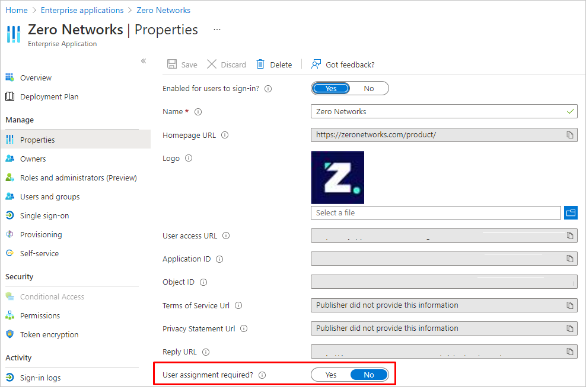

# 자습서: Zero Networks와 Azure AD SSO 통합

이 자습서에서는 Azure AD(Azure Active Directory)와 Zero Networks를 통합하는 방법을 알아봅니다. Azure AD와 Zero Networks를 통합하면 다음을 수행할 수 있습니다.

* Zero Networks에 대한 액세스 권한이 있는 사용자를 Azure AD에서 제어합니다.
* 사용자가 자신의 Azure AD 계정으로 Zero Networks에 자동으로 로그인되도록 설정할 수 있습니다.
* 단일 중앙 위치인 Azure Portal에서 계정을 관리합니다.

## 필수 구성 요소

시작하려면 다음 항목이 필요합니다.

* Azure AD 구독 구독이 없는 경우 [체험 계정](https://azure.microsoft.com/free/)을 얻을 수 있습니다.
* Zero Networks SSO(Single Sign-On)가 설정된 구독

## 시나리오 설명

이 자습서에서는 Zero Networks 관리 포털 및 액세스 포털에 대해 Azure AD SSO를 구성합니다.

* Zero Networks에서 **SP** 시작 SSO를 지원합니다.

> [!NOTE]
> 이 애플리케이션의 식별자는 고정 문자열 값이므로 하나의 테넌트에서 하나의 인스턴스만 구성할 수 있습니다.

## 갤러리에서 Zero Networks 추가

Zero Networks의 Azure AD 통합을 구성하려면 갤러리의 Zero Networks를 관리형 SaaS 앱 목록에 추가해야 합니다.

1. 회사 Microsoft 계정을 사용하여 Azure Portal에 로그인합니다.
1. 왼쪽 탐색 창에서 **Azure Active Directory** 서비스를 선택합니다.
1. **엔터프라이즈 애플리케이션** 으로 이동한 다음, **모든 애플리케이션** 을 선택합니다.
1. 새 애플리케이션을 추가하려면 **새 애플리케이션** 을 선택합니다.
1. **갤러리에서 추가** 섹션의 검색 상자에 **Zero Networks** 를 입력합니다.
1. 결과 패널에서 **Zero Networks** 를 선택한 다음, 앱을 추가합니다. 앱이 테넌트에 추가될 때까지 잠시 동안 기다려 주세요.

## Azure AD SSO 구성

Azure Portal에서 Azure AD SSO를 사용하도록 설정하려면 다음 단계를 수행합니다.

1. Azure Portal의 **Zero Networks** 애플리케이션 통합 페이지에서 **관리** 섹션을 찾아 **Single Sign-On** 을 선택합니다.
1. **Single Sign-On 방법 선택** 페이지에서 **SAML** 을 선택합니다.
1. **SAML로 Single Sign-On 설정** 페이지에서 **기본 SAML 구성** 에 대한 연필 아이콘을 클릭하여 설정을 편집합니다.

   

1. **기본 SAML 구성** 섹션에서 다음 단계를 수행합니다.

    a. **로그온 URL** 텍스트 상자에 `https://portal.zeronetworks.com/#/login` URL을 입력합니다.

1. **SAML로 Single Sign-On 설정** 페이지의 **SAML 서명 인증서** 섹션에서 **인증서(Base64)** 를 찾은 후 **다운로드** 를 선택하여 인증서를 다운로드하고 컴퓨터에 저장합니다.

    

1. **설정** 섹션에서 요구 사항에 따라 적절한 URL을 복사합니다.

    

## Zero Networks SSO 구성

1. Zero Networks 관리 포털에 관리자 권한으로 로그인합니다.

1. **설정** > **ID 공급자** 로 이동합니다.

1. **Microsoft Azure** 를 클릭하고 다음 단계를 수행합니다.
    
    

    1. **Identifier(Entity ID)** (식별자(엔터티 ID)) 값을 복사하고, 이 값을 Azure Portal의 **Basic SAML Configuration**(기본 SAML 구성) 섹션에 있는 **Identifier**(식별자) 텍스트 상자에 붙여넣습니다.

    1. **회신 URL(Assertion Consumer Service URL)** 값을 복사하여 Azure Portal의 **기본 SAML 구성** 섹션에 있는 **회신 URL** 텍스트 상자에 이 값을 붙여넣습니다.

    1. **로그인 URL** 텍스트 상자에 Azure Portal에서 복사한 **로그인 URL** 값을 붙여넣습니다.

    1. **로그아웃 URL** 텍스트 상자에 Azure Portal에서 복사한 **로그아웃 URL** 값을 붙여넣습니다.

    1. Azure Portal에서 다운로드한 **인증서(Base64)** 를 메모장으로 열고, 그 내용을 **인증서(Base64)** 텍스트 상자에 붙여넣습니다.

    1. **Save** 을 클릭합니다.

## 사용자 할당 요구 사항 구성

1. Azure Portal의 **Zero Networks** 애플리케이션 통합 페이지에서 **관리** 섹션을 찾아 **속성** 을 선택합니다.
1. **사용자 할당 필요** 를 **아니요** 로 변경합니다.

## SSO 테스트 

이 섹션에서는 다음 옵션을 사용하여 Azure AD Single Sign-On 구성을 테스트합니다. 

* Azure Portal에서 **이 애플리케이션 테스트** 를 클릭합니다. 그러면 로그인 흐름을 시작할 수 있는 Zero Networks 로그온 URL로 리디렉션됩니다. 

* Zero Networks 로그온 URL로 직접 이동하여 해당 위치에서 로그인 흐름을 시작합니다.

* Microsoft 내 앱을 사용할 수 있습니다. 내 앱에서 Zero Networks 타일을 클릭하면 Zero Networks 로그온 URL로 리디렉션됩니다. 내 앱에 대한 자세한 내용은 [내 앱 소개](../user-help/my-apps-portal-end-user-access.md)를 참조하세요.
