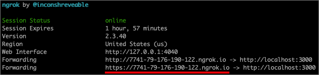
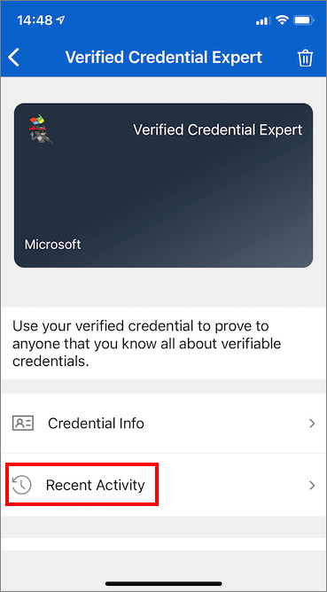

# <a name="issue-azure-ad-verifiable-credentials-from-an-application-preview"></a>애플리케이션에서 Azure AD 확인 가능한 자격 증명 발급(미리 보기)

이 자습서에서는 Azure AD(Azure Active Directory) 테넌트에 연결하는 로컬 컴퓨터에서 샘플 애플리케이션을 실행합니다. 애플리케이션을 사용하여 확인된 자격 증명 전문가 카드를 발급하고 확인합니다.

이 문서에서는 다음 방법을 설명합니다.

> [!div class="checklist"]
>
> - 확인 가능한 자격 증명 구성 파일을 저장할 Azure Blob 스토리지를 설정합니다.
> - 확인 가능한 자격 증명 구성 파일을 만들고 업로드합니다.
> - Azure에서 확인된 자격 증명 전문가 카드를 만듭니다.
> - 샘플 애플리케이션을 설정하기 위한 자격 증명 및 환경 세부 정보를 수집합니다.
> - 샘플 애플리케이션 코드를 로컬 컴퓨터에 다운로드합니다.
> - 샘플 애플리케이션을 확인된 자격 증명 전문가 카드 및 환경 세부 정보로 업데이트합니다.
> - 샘플 애플리케이션을 실행하고, 첫 번째 확인된 자격 증명 전문가 카드를 발급합니다.
> - 확인된 자격 증명 전문가 카드를 확인합니다.

다음 다이어그램에서는 Azure AD 확인 가능한 자격 증명 아키텍처와 구성 요소를 보여 줍니다.


## <a name="prerequisites"></a>사전 요구 사항

- 시작하기 전에 [Azure AD 확인 가능한 자격 증명에 대한 테넌트를 설정](/azure/active-directory/verifiable-credentials/verifiable-credentials-configure-tenant)해야 합니다.
- 샘플 앱을 호스트하는 리포지토리를 복제하려면 [GIT](https://git-scm.com/downloads)을 설치합니다.
- [Visual Studio Code](https://code.visualstudio.com/Download) 또는 이와 비슷한 코드 편집기
- [.NET 5.0](https://dotnet.microsoft.com/download/dotnet/5.0)
- [NGROK](https://ngrok.com/) 시험판
- Microsoft Authenticator가 포함된 모바일 디바이스
  - Android 버전 6.2108.5654 이상이 설치되어 있어야 합니다.
  - iOS 버전 6.5.82 이상이 설치되어 있어야 합니다.

## <a name="create-a-storage-account"></a>스토리지 계정 만들기

Azure Blob Storage는 클라우드를 위한 Microsoft의 개체 스토리지 솔루션입니다. Azure AD 확인 가능한 자격 증명 서비스는 확인 가능한 자격 증명을 발급할 때 [Azure Blob Storage](/azure/storage/blobs/storage-blobs-introduction)를 사용하여 확인 가능한 자격 증명 구성 파일을 저장합니다.

다음 단계에 따라 Azure Blob Storage를 만들고 구성합니다.

1. Azure Blob Storage 계정이 없는 경우 [스토리지 계정을 만듭니다](/azure/storage/common/storage-account-create).
1. 스토리지 계정이 만들어지면 컨테이너를 만듭니다. 스토리지 계정의 왼쪽 메뉴에서 **데이터 스토리지** 섹션으로 스크롤한 다음, **컨테이너** 를 선택합니다.
1. **+ 컨테이너** 단추를 선택합니다.
1. 새 컨테이너의 **이름** 을 입력합니다. 컨테이너 이름은 소문자여야 하고, 문자 또는 숫자로 시작해야 하며, 문자, 숫자 및 대시(-) 문자만 포함할 수 있습니다. 예를 들어 *vc-container* 입니다.
1. **공용 액세스 수준** 을 **프라이빗**(익명 액세스 없음)으로 설정합니다.
1. **만들기** 를 선택합니다.  

    다음 스크린샷에서는 컨테이너를 만드는 방법을 보여 줍니다.  

   

## <a name="grant-access-to-the-container"></a>컨테이너에 대한 액세스 권한 부여

컨테이너가 만들어지면 Storage Blob의 파일에 액세스할 수 있도록 로그인한 사용자에게 올바른 역할 할당을 부여합니다.

1. 컨테이너 목록에서 *vc-container* 를 선택합니다.

1. 메뉴에서 **액세스 제어(IAM)** 를 선택합니다.

1. **+ 추가** 를 선택한 다음, **역할 할당 추가** 를 선택합니다.

     

1. **역할 할당 추가** 페이지에서 다음을 수행합니다.

    1. **역할** 에 대해 **Storage Blob 데이터 읽기 권한자** 를 선택합니다.

    1. **다음에 대한 액세스 할당** 에서 **사용자, 그룹 또는 서비스 주체** 를 선택합니다.

    1. 그런 다음, 이러한 단계를 수행하는 데 사용하는 계정을 검색하여 선택합니다.

        

>[!IMPORTANT]
>기본적으로 컨테이너 생성자는 소유자 역할을 할당받습니다. 소유자 역할만으로는 충분하지 않습니다. 사용 중인 계정에 Storage Blob 데이터 읽기 권한자 역할이 필요합니다. 자세한 내용은 [Azure Portal을 사용하여 Blob 및 큐 데이터에 액세스하기 위한 Azure 역할 할당](/azure/storage/blobs/assign-azure-role-data-access)을 참조하세요.

### <a name="upload-the-configuration-files"></a>구성 파일 업로드

Azure AD 확인 가능한 자격 증명 서비스는 규칙 파일과 표시 파일이라는 두 개의 JSON 구성 파일을 사용합니다. 

- 규칙 파일은 확인 가능한 자격 증명의 중요한 속성을 설명합니다. 특히 확인 가능한 자격 증명이 발급되기 전에 주체(사용자)가 제공해야 하는 클레임을 설명합니다. 
- 표시 파일은 자격 증명의 브랜딩과 클레임의 스타일을 제어합니다.

이 섹션에서는 샘플 규칙을 업로드하고 파일을 스토리지에 표시합니다. 이러한 파일을 사용자 지정하는 방법에 대한 자세한 내용은 [확인 가능한 자격 증명을 사용자 지정하는 방법](credential-design.md)을 참조하세요.

구성 파일을 업로드하려면 다음 단계를 수행합니다.

1. 다음 JSON을 복사하고, 콘텐츠를 VerifiedCredentialExpertDisplay.json이라는 파일에 저장합니다.

    ```json
    {
      "default": {
        "locale": "en-US",
        "card": {
          "title": "Verified Credential Expert",
          "issuedBy": "Microsoft",
          "backgroundColor": "#2E4053",
          "textColor": "#ffffff",
          "logo": {
            "uri": "https://didcustomerplayground.blob.core.windows.net/public/VerifiedCredentialExpert_icon.png",
            "description": "Verified Credential Expert Logo"
          },
          "description": "Use your verified credential to prove to anyone that you know all about verifiable credentials."
        },
        "consent": {
          "title": "Do you want to get your Verified Credential?",
          "instructions": "Sign in with your account to get your card."
        },
        "claims": {
          "vc.credentialSubject.firstName": {
            "type": "String",
            "label": "First name"
          },
          "vc.credentialSubject.lastName": {
            "type": "String",
            "label": "Last name"
          }
        }
      }
    }
    ```

1. 다음 JSON을 복사하고, 콘텐츠를 VerifiedCredentialExpertRules.json이라는 파일에 저장합니다. 다음 확인 가능한 자격 증명은 firstName 및 lastName이라는 두 개의 간단한 클레임을 정의합니다.

    ```json
    {
      "attestations": {
        "idTokens": [
          {
            "id": "https://self-issued.me",
            "mapping": {
              "firstName": { "claim": "$.given_name" },
              "lastName": { "claim": "$.family_name" }
            },
            "configuration": "https://self-issued.me",
            "client_id": "",
            "redirect_uri": ""
          }
        ]
      },
      "validityInterval": 2592001,
      "vc": {
        "type": [ "VerifiedCredentialExpert" ]
      }
    }
    ```
    
1. Azure Portal에서 [만든](#create-a-storage-account) Azure Blob Storage 컨테이너로 이동합니다.

1. 왼쪽 메뉴에서 **컨테이너** 를 선택하여 포함된 Blob 목록을 표시합니다. 그런 다음, 앞에서 만든 **vc-container** 를 선택합니다.

1. **업로드** 단추를 선택하여 업로드 블레이드를 열고, 로컬 파일 시스템을 탐색하여 업로드할 파일을 찾습니다. **VerifiedCredentialExpertDisplay.json** 및 **VerifiedCredentialExpertRules.json** 파일을 선택합니다. 그런 다음, **업로드** 를 선택하여 파일을 컨테이너에 업로드합니다.

## <a name="create-the-verifiable-credential-expert-card-in-azure"></a>Azure에서 확인 가능한 자격 증명 전문가 카드 만들기

이 단계에서는 Azure AD 확인 가능한 자격 증명을 사용하여 확인 가능한 자격 증명 전문가 카드를 만듭니다. 확인된 자격 증명이 만들어지면 Azure AD 테넌트에서 확인 가능한 자격 증명 발급 프로세스를 시작하는 사용자에게 이 자격 증명을 발급할 수 있습니다.

1. [Azure Portal](https://portal.azure.com/) 기본 검색 입력을 사용하여 **확인 가능한 자격 증명** 을 검색합니다. 그런 다음, **확인 가능한 자격 증명(미리 보기)** 을 선택합니다.
1. [테넌트가 설정](verifiable-credentials-configure-tenant.md)되면 **새 자격 증명 만들기** 옵션 화면이 표시됩니다. 열려 있지 않거나 자격 증명을 더 만들려면 왼쪽 메뉴에서 **자격 증명** 을 선택합니다. 그런 다음, **+ 자격 증명** 을 선택합니다.
1. 새 자격 증명 만들기 페이지에서 다음을 수행합니다.

    1. 자격 증명 **이름** 에 대해 **VerifiedCredentialExpert** 를 입력합니다. 해당 이름은 포털에서 확인 가능한 자격 증명을 식별하는 데 사용됩니다. 확인 가능한 자격 증명 계약의 일부로 포함됩니다.

    1. Azure Blob Storage를 만든 Azure AD **구독** 을 선택합니다.

    1. **표시 파일** 아래에서 **표시 파일을 선택** 합니다. Storage 계정 섹션에서 **vc-container** 를 선택합니다. 그런 다음, **VerifiedCredentialExpertDisplay.json** 파일을 선택하고, **선택** 을 클릭합니다.

    1. **규칙 파일** 아래에서 **규칙 파일을 선택** 합니다. Storage 계정 섹션에서 **vc-container** 를 선택합니다. 그런 다음, **VerifiedCredentialExpertRules.json** 파일을 선택하고, **선택** 을 클릭합니다.

    다음 스크린샷에서는 새 자격 증명을 만드는 방법을 보여 줍니다.

    

1. 새 자격 증명 만들기 화면에서 **만들기** 를 선택합니다.

## <a name="gather-credentials-and-environment-details-to-set-up-your-sample-application"></a>샘플 애플리케이션을 설정하기 위한 자격 증명 및 환경 세부 정보 수집

이제 새 자격 증명이 있으므로 환경 및 사용자가 만든 자격 증명에 대한 몇 가지 정보를 수집합니다. 이러한 정보는 샘플 애플리케이션을 설정할 때 사용합니다.

1. 확인 가능한 자격 증명에서 **자격 증명** 을 선택한 다음, 자격 증명 목록에서 앞에서 만든 VerifiedCredentialExpert를 선택합니다.

    

1. **자격 증명 발급 URL** 을 복사합니다. 이 URL은 규칙 파일과 표시 파일의 조합입니다. Authenticator가 사용자에게 확인 가능한 자격 증명 발급 요구 사항을 표시하기 전에 평가하는 URL입니다. 나중에 사용할 수 있도록 기록해 둡니다.

1. **탈중앙화 ID** 를 복사하여 나중에 사용할 수 있도록 기록해 둡니다.

1. **테넌트 ID** 를 복사하여 나중에 사용할 수 있도록 기록해 둡니다. 다음 스크린샷에서는 필요한 값을 복사하는 방법을 보여 줍니다.

    

## <a name="download-the-sample-code"></a>샘플 코드 다운로드

샘플 애플리케이션은 .NET에서 사용할 수 있으며, 코드는 GitHub 리포지토리에서 유지 관리됩니다. [여기](https://github.com/Azure-Samples/active-directory-verifiable-credentials-dotnet)서 GitHub의 샘플 코드를 다운로드하거나 리포지토리를 로컬 컴퓨터에 복제합니다.


```bash
git clone git@github.com:Azure-Samples/active-directory-verifiable-credentials-dotnet.git
```

## <a name="configure-the-verifiable-credentials-app"></a>확인 가능한 자격 증명 앱 구성

사용자가 만든 등록된 애플리케이션에 대한 클라이언트 암호를 만듭니다. 샘플 애플리케이션은 토큰을 요청할 때 클라이언트 암호를 사용하여 ID를 증명합니다.

1. **Azure Active Directory** 에 있는 **앱 등록** 페이지로 이동합니다.

1. 앞에서 만든 **verifiable-credentials-app** 애플리케이션을 선택합니다.

1. 이름을 선택하여 앱 등록 세부 정보로 이동합니다.

1. **애플리케이션(클라이언트) ID** 를 복사하여 나중에 사용할 수 있도록 저장합니다.  

     

1. 앱 등록 세부 정보에 있는 주 메뉴의 **관리** 아래에서 **인증서 및 비밀** 을 선택합니다.

1. **새 클라이언트 암호** 를 선택합니다.

    1. **설명** 상자에서 클라이언트 암호에 대한 설명을 입력합니다(예: **vc-sample-secret**).

    1. **만료** 아래에서 비밀이 유효한 기간(예: 6개월)을 선택한 다음, **추가** 를 선택합니다.

    1. 비밀의 **값** 을 기록합니다. 이후 단계에서 구성에 이 값을 사용합니다. 비밀의 값은 다시 표시되지 않으며 다른 방법으로 검색할 수 없으므로 표시되는 즉시 기록해 두세요.

이 시점에서 샘플 애플리케이션을 설정하는 데 필요한 모든 필수 정보가 있어야 합니다.

## <a name="update-the-sample-application"></a>샘플 애플리케이션 업데이트

이제 샘플 앱의 발급자 코드를 수정하여 확인 가능한 자격 증명 URL로 업데이트합니다. 이 단계를 수행하면 자체 테넌트를 사용하여 확인 가능한 자격 증명을 발급할 수 있습니다.

1. *active-directory-verifiable-credentials-dotnet-main* 폴더 아래에서 Visual Studio Code를 열고, **1.asp-net-core-api-idtokenhint** 폴더 내에서 프로젝트를 선택합니다.

1. 프로젝트 루트 폴더에서 appsettings.json 파일을 엽니다. 이 파일에는 Azure AD 확인 가능한 자격 증명에 대한 정보가 포함되어 있습니다. 다음 속성을 이전에 위의 단계에서 기록한 정보로 업데이트합니다.

    1. **테넌트 ID:** 사용자의 테넌트 ID
    1. **클라이언트 ID:** 사용자의 클라이언트 ID
    1. **클라이언트 암호**: 사용자의 클라이언트 암호
    1. **IssuerAuthority**: 사용자의 탈중앙화 ID
    1. **VerifierAuthority**: 사용자의 탈중앙화 ID
    1. **자격 증명 매니페스트**: 사용자의 자격 증명 발급 URL

1. *appsettings.json* 파일을 저장합니다.

다음 JSON은 전체 appsettings.json 파일을 보여 줍니다.

```json
{
  "AppSettings": {
    "Endpoint": "https://beta.did.msidentity.com/v1.0/{0}/verifiablecredentials/request",
    "VCServiceScope": "bbb94529-53a3-4be5-a069-7eaf2712b826/.default",
    "Instance": "https://login.microsoftonline.com/{0}",

    "TenantId": "12345678-0000-0000-0000-000000000000",
    "ClientId": "33333333-0000-0000-0000-000000000000",
    "ClientSecret": "123456789012345678901234567890",
    "CertificateName": "[Or instead of client secret: Enter here the name of a certificate (from the user cert store) as registered with your application]",
    "IssuerAuthority": "did:ion:EiCcn9dz_OC6HY60AYBXF2Dd8y5_2UYIx0Ni6QIwRarjzg:eyJkZWx0YSI6eyJwYXRjaGVzIjpbeyJhY3Rpb24iOiJyZXBsYWNlIiwiZG9jdW1lbnQiOnsicHVibGljS2V5cyI6W3siaWQiOiJzaWdfN2U4MmYzNjUiLCJwdWJsaWNLZXlKd2siOnsiY3J2Ijoic2VjcDI1NmsxIiwia3R5IjoiRUMiLCJ4IjoiaUo0REljV09aWVA...",
    "VerifierAuthority": " did:ion:EiCcn9dz_OC6HY60AYBXF2Dd8y5_2UYIx0Ni6QIwRarjzg:eyJkZWx0YSI6eyJwYXRjaGVzIjpbeyJhY3Rpb24iOiJyZXBsYWNlIiwiZG9jdW1lbnQiOnsicHVibGljS2V5cyI6W3siaWQiOiJzaWdfN2U4MmYzNjUiLCJwdWJsaWNLZXlKd2siOnsiY3J2Ijoic2VjcDI1NmsxIiwia3R5IjoiRUMiLCJ4IjoiaUo0REljV09aWVA...",
    "CredentialManifest":  "https://beta.did.msidentity.com/v1.0/12345678-0000-0000-0000-000000000000/verifiableCredential/contracts/VerifiedCredentialExpert"
  }
}
```

## <a name="issuing-your-first-verified-expert-card"></a>첫 번째 확인된 전문가 카드 발급

이제 샘플 애플리케이션을 실행하여 첫 번째 확인된 전문가 카드를 발급할 준비가 되었습니다.

1. Visual Studio Code에서 Verifiable_credentials_DotNet 프로젝트를 실행합니다. 또는 명령 셸에서 다음 명령을 실행합니다.

    ```bash
    cd active-directory-verifiable-credentials-dotnet/1. asp-net-core-api-idtokenhint  dotnet build "asp-net-core-api-idtokenhint.csproj" -c Debug -o .\\bin\\Debug\\netcoreapp3.  dotnet run
    ```

1. 다른 터미널에서 다음 명령을 실행합니다. 이 명령은 [ngrok](https://ngrok.com/)를 실행하여 3000에서 URL을 설정하고, 이를 인터넷에서 공개적으로 사용할 수 있도록 합니다.

    ```bash
    ngrok http 3000
    ```

    >[!NOTE]
    > 일부 컴퓨터에서는 명령을 `./ngrok http 3000` 형식으로 실행해야 할 수 있습니다.

1. ngrok에서 생성된 HTTPS URL을 엽니다.

     

1. 웹 브라우저에서 **자격 증명 얻기** 를 선택합니다.

     

1. 모바일 디바이스를 사용하여 Authenticator 앱을 통해 QR 코드를 스캔합니다. 카메라에서 직접 QR 코드를 스캔합니다. 그러면 Authenticator 앱이 열립니다.

    

1. 이때 이 앱 또는 웹 사이트는 위험할 수 있다는 경고 메시지가 표시되면 **고급** 을 선택합니다.

     

1. 위험한 웹 사이트 경고에서 **계속 진행(안전하지 않음)** 을 선택합니다. 도메인이 DID에 연결되지 않았으므로 이 경고가 표시됩니다. 도메인을 확인하려면 [도메인을 DID(탈중앙화 ID)에 연결](how-to-dnsbind.md) 문서의 지침을 따릅니다. 이 자습서에서는 도메인 등록을 건너뛰고, **계속 진행(안전하지 않음)** 을 선택할 수 있습니다.

     

1. QR 코드를 스캔한 화면에 표시된 PIN 코드를 입력하라는 메시지가 표시됩니다. PIN은 추가 보호 계층을 발급 페이로드에 추가하는 데 사용합니다. 발급 QR 코드가 표시될 때마다 PIN 코드가 임의로 생성됩니다.

     

1. PIN 번호가 입력되면 **자격 증명 추가** 화면이 표시됩니다. 화면의 위쪽에 빨간색 **확인되지 않음** 메시지가 표시됩니다. 이 경고는 위에서 언급한 도메인 유효성 검사와 관련이 있습니다.

1. **추가** 를 선택하여 새 확인 가능한 자격 증명을 수락합니다.

    

1. 축하합니다! 이제 확인된 자격 증명 전문가의 확인 가능한 자격 증명이 있습니다.

    

샘플 앱으로 돌아갑니다. 자격 증명이 성공적으로 발급되었음을 보여 줍니다.

  

## <a name="verifying-the-verified-expert-card"></a>확인된 전문가 카드 확인

이제 샘플 애플리케이션을 다시 실행하여 확인된 전문가 카드를 확인할 준비가 되었습니다.

1. 브라우저에서 뒤로 단추를 눌러 샘플 앱 홈페이지로 돌아갑니다.

1. **자격 증명 확인** 을 선택합니다.  

   

1. Authenticator 앱을 사용하여 QR 코드를 스캔하거나 모바일 카메라에서 직접 스캔합니다.

1. 이 앱 또는 웹 사이트는 위험할 수 있다는 경고 메시지가 표시되면 **고급** 을 선택합니다. 그런 다음, **계속 진행(안전하지 않음)** 을 선택합니다.

1. **허용** 을 선택하여 프레젠테이션 요청을 승인합니다.

    

1. 프레젠테이션 요청을 승인하면 해당 요청이 승인되었음을 확인할 수 있습니다. 로그를 확인할 수도 있습니다. 로그를 확인하려면 확인 가능한 자격 증명을 선택합니다.  

    

1. 그런 다음, **최근 기록** 을 선택합니다.  

    

1. **최근 작업** 은 확인 가능한 자격 증명의 최근 작업을 보여 줍니다.

    

1. 샘플 앱으로 돌아갔습니다. 받은 확인 가능한 자격 증명에 대한 프레젠테이션이 표시됩니다.  
    

## <a name="verifiable-credential-names&quot;></a>확인 가능한 자격 증명 이름 

확인 가능한 자격 증명에는 **Megan Bowen** 이 자격 증명의 이름과 성 값으로 포함되어 있습니다. 이러한 값은 샘플 애플리케이션에서 하드 코딩되었으며, 페이로드에서 발급할 때 확인 가능한 자격 증명에 추가되었습니다. 

실제 시나리오에서 애플리케이션은 ID 공급자에서 사용자 세부 정보를 가져옵니다. 다음 코드 조각에서는 샘플 애플리케이션에서 이름이 설정되는 위치를 보여 줍니다. 후속 예제에서는 ID 공급자의 값을 확인 가능한 자격 증명에 직접 삽입하는 방법을 보여 줍니다.

```csharp
//file: IssuerController.cs
[HttpGet(&quot;/api/issuer/issuance-request")]
public async Task<ActionResult> issuanceRequest()
  {
    ...

    // Here you could change the payload manifest and change the first name and last name.
    payload["issuance"]["claims"]["given_name"] = "Megan";
    payload["issuance"]["claims"]["family_name"] = "Bowen";
    ...
}
  ```

## <a name="next-steps"></a>다음 단계

이 문서에서는 다음 방법에 대해 알아보았습니다.

> [!div class="checklist"]
> * Azure AD 확인 가능한 자격 증명 서비스 구성
> * 동일한 Azure AD 테넌트를 사용하여 자격 증명 발급 및 확인

[다음 단계](verifiable-credentials-configure-verifier.md)에서는 신뢰 당사자 애플리케이션이라고도 하는 타사 애플리케이션에서 자체 Azure AD 테넌트 확인 가능한 자격 증명 API 서비스를 사용하여 자격 증명을 확인하는 방법을 알아봅니다.
