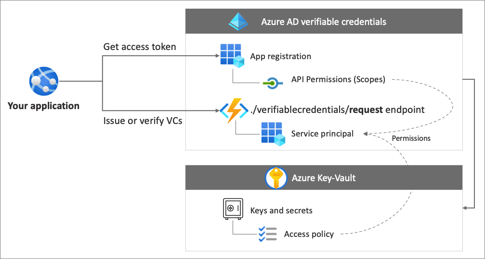
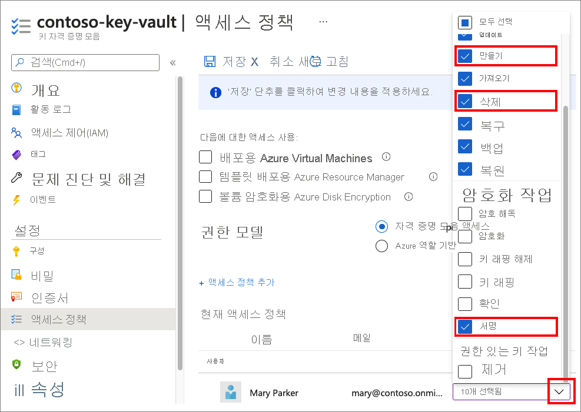
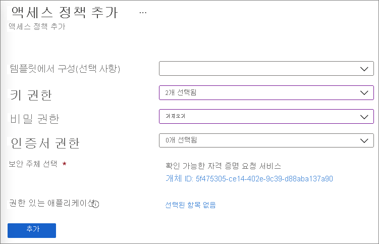
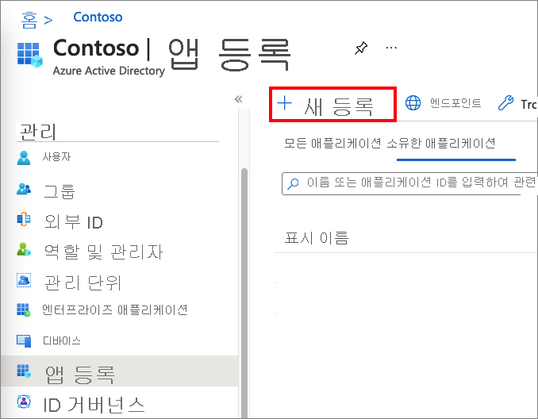
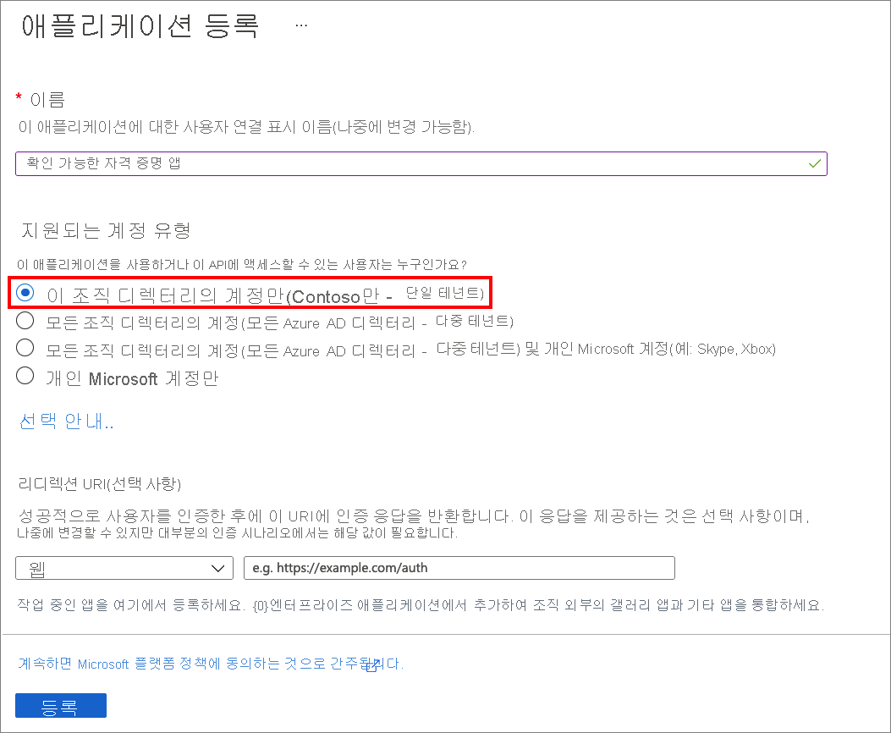
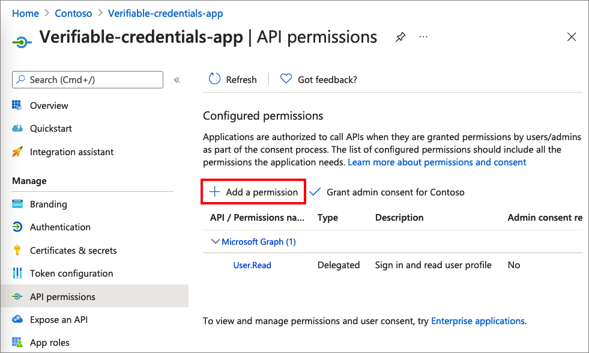
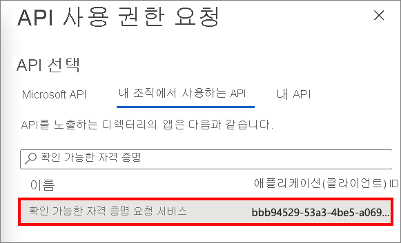
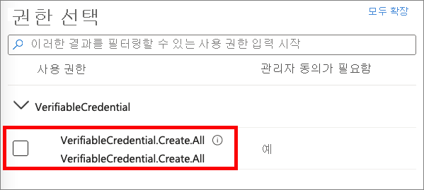
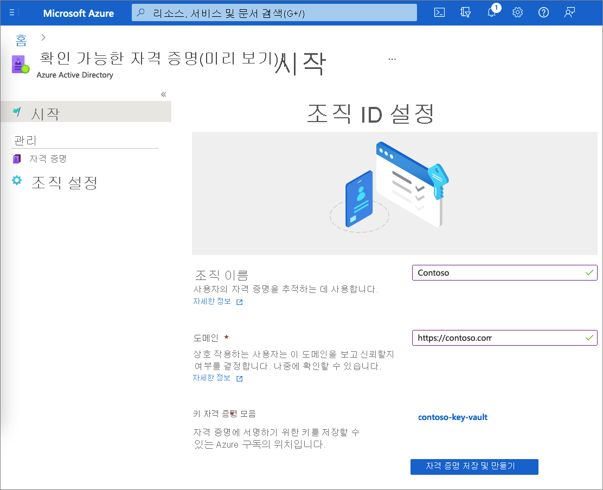

# <a name="configure-your-tenant-for-azure-ad-verifiable-credentials-preview"></a>Azure AD 확인 가능한 자격 증명에 대한 테넌트 구성(미리 보기)

Azure AD(Azure Active Directory) 확인 가능한 자격 증명 서비스를 사용하면 자격 증명을 발급하고 확인할 수 있습니다. 발급하려면 자격 증명(또는 둘 다)을 확인하고 이 자습서의 지침을 따릅니다.

이 자습서에서는 Azure AD 확인 가능한 자격 증명을 사용할 수 있도록 Azure AD 테넌트를 구성하는 데 필요한 단계를 검토합니다.

이 문서에서는 다음 방법을 설명합니다.

> [!div class="checklist"]
>
> - 서비스 주체 설정
> - Azure Key Vault 만들기
> - Azure AD에서 애플리케이션 등록
> - 확인 가능한 자격 증명 미리 보기 서비스 설정

다음 다이어그램에서는 Azure AD 확인 가능한 자격 증명 아키텍처와 구성 요소를 보여 줍니다.



## <a name="prerequisites"></a>사전 요구 사항

- Azure 구독이 없는 경우 [체험 구독](https://azure.microsoft.com/free/?WT.mc_id=A261C142F)을 만듭니다.
- 테넌트에서 [Azure Active Directory Premium 버전](../../active-directory/fundamentals/active-directory-get-started-premium.md) 구독에 가입합니다.
- 구성하려는 디렉터리에 대한 [전역 관리자](../../active-directory/roles/permissions-reference.md#global-administrator) 권한입니다.
- [PowerShell](/powershell/scripting/install/installing-powershell) 7.0.6 LTS-x64, PowerShell 7.1.3-x64 이상이 설치되어 있어야 합니다.

## <a name="step-1-set-up-a-service-principal"></a>1단계. 서비스 주체 설정

요청 서비스 API에 대한 서비스 주체를 만듭니다. 서비스 API는 Azure AD 확인 가능한 자격 증명을 발급하거나 확인하는 데 사용하는 Microsoft 서비스입니다.

서비스 주체를 만들려면 다음을 수행합니다.

1. 다음 PowerShell 명령을 실행합니다. 이러한 명령은 AzureAD 모듈(아직 설치되지 않은 경우)을 설치하고 [AzureAD 모듈](/powershell/azure/install-az-ps#installation)을 가져옵니다. 모듈을 설치하는 데 문제가 발생하는 경우 [Azure Az PowerShell 모듈 설치](/powershell/azure/install-az-ps#installation) 문서를 참조하세요.

    ```powershell
    if ((Get-Module -ListAvailable -Name "AzureAD") -eq $null) {  Install-Module "AzureAD" -Scope CurrentUser }  Import-Module AzureAD
    ```

1. 다음 PowerShell 명령을 실행하여 Azure AD 테넌트에 연결합니다. \<*your-tenant-ID*>를 [Azure AD 테넌트 ID](../../active-directory/fundamentals/active-directory-how-to-find-tenant.md)로 바꿉니다.

    ```powershell
    Connect-AzureAD -TenantId <your-tenant-ID>
    ```

1. 동일한 PowerShell 세션에서 다음 명령을 실행합니다. AppId "bbb94529-53a3-4be5-a069-7eaf2712b826"은 확인 가능한 자격 증명 Microsoft 서비스를 참조합니다.

    ```powershell
    New-AzureADServicePrincipal -AppId "bbb94529-53a3-4be5-a069-7eaf2712b826" -DisplayName "Verifiable Credential Request Service" 
    ```

## <a name="step-2-create-a-key-vault"></a>2단계. 주요 자격 증명 모음 만들기

[Azure Key Vault](../../key-vault/general/basic-concepts.md)는 비밀 및 키의 보안 스토리지 및 액세스를 가능하게 하는 클라우드 서비스입니다. 확인 가능한 자격 증명 서비스는 Azure Key Vault에 공개 키 및 프라이빗 키를 저장합니다. 이러한 키는 자격 증명에 서명하고 확인하는 데 사용됩니다.

Azure Key Vault 인스턴스가 없는 경우 Azure Portal을 사용하여 다음 단계에 따라 키 자격 증명 모음을 만듭니다.

>[!NOTE]
>기본적으로 키 자격 증명 모음을 만드는 계정에만 액세스 권한이 있습니다. 확인 가능한 자격 증명 서비스에는 키 자격 증명 모음에 대한 액세스 권한이 필요합니다. 키 자격 증명 모음은 구성 중에 사용된 계정에서 **키를 만들고**, 옵트아웃하는 경우 **키를 삭제** 할 수 있도록 허용하고, 확인 가능한 자격 증명 서비스에 대한 도메인 바인딩을 만들기 위한 **서명** 권한을 허용하는 액세스 정책으로 구성해야 합니다. 테스트하는 동안 동일한 계정을 사용하는 경우에는 자격 증명 모음 생성자에게 부여된 기본 권한 외에도 계정 **서명** 권한을 부여하도록 기본 정책을 수정합니다.

### <a name="step-21-set-access-policies-for-the-key-vault"></a>2\.1단계 Key Vault에 대한 액세스 정책 설정

Azure 확인 가능한 자격 증명 서비스가 온보딩되면 서비스에서 메시지 보안을 제공하는 데 사용되는 키 세트를 생성합니다. 이러한 키는 키 자격 증명 모음에 저장됩니다. 키 세트를 발급하거나 확인하는지 여부는 확인 가능한 자격 증명의 서명, 업데이트 및 복구에 계속 사용됩니다.

Key Vault [액세스 정책](../../key-vault/general/assign-access-policy.md)은 지정된 보안 주체에서 Key Vault 비밀 및 키에 대한 작업을 수행할 수 있는지 여부를 정의합니다. Azure Key Vault에서 Azure AD 확인 가능한 자격 증명 서비스의 관리자 계정과 만든 요청 서비스 API 보안 주체 모두에 대한 액세스 정책을 설정합니다.

1. [Azure Portal](https://portal.azure.com/)에서 이 자습서에 사용하는 **Key Vault** 로 이동합니다.

1. **설정** 에서 **액세스 정책** 을 선택합니다.

1. **액세스 정책 추가** 페이지의 **사용자** 아래에서 이 자습서를 수행하는 데 사용할 계정을 선택합니다.

1. **키 권한** 에 대해 **만들기, 삭제** 및 **서명** 권한이 선택되어 있는지 확인합니다. 기본적으로 만들기와 삭제는 이미 사용하도록 설정되어 있습니다. 서명 키 권한만 업데이트하면 됩니다.
    
    다음 스크린샷에서는 관리자 액세스 정책을 구성하는 방법을 보여 줍니다.

    

1. 변경 내용을 저장하려면 **저장** 을 선택합니다.

1. **+ 액세스 정책 추가** 를 선택하여 확인 가능한 자격 증명 요청 서비스의 서비스 주체에 대한 권한을 추가합니다.

1. **액세스 정책 추가** 페이지에서,

    1. **키 권한** 에 대해 **가져오기** 및 **서명** 을 선택합니다.

    1. **비밀 권한** 에 대해 **가져오기** 를 선택합니다.

    1. **보안 주체 선택** 에 대해 **확인 가능한 자격 증명 요청 서비스** 를 선택합니다.

    1. **추가** 를 선택합니다.  
        
       다음 스크린샷에서는 확인 가능한 자격 증명 요청 서비스에 대한 액세스 정책을 추가하는 방법을 보여 줍니다. 
    
       

1. **저장** 을 선택하여 만든 새 정책을 저장합니다.

## <a name="step-3-register-an-application-in-azure-ad"></a>3단계. Azure AD에서 애플리케이션 등록

Azure AD 확인 가능한 자격 증명 요청 서비스는 발급 및 검증 도구에 대한 액세스 토큰을 얻을 수 있어야 합니다. 액세스 토큰을 얻으려면 웹 애플리케이션을 등록하고 이전 단계에서 설정한 API 확인 가능한 자격 증명 요청 서비스에 대한 API 권한을 부여합니다.

1. 관리자 계정으로 [Azure Portal](https://portal.azure.com/)에 로그인합니다.

1. 여러 테넌트에 대한 액세스 권한이 있는 경우 **디렉터리 + 구독** :::image type="icon" source="media/verifiable-credentials-configure-tenant/portal-directory-subscription-filter.png" border="false"::: 아이콘을 선택합니다. 그런 다음, **Azure Active Directory** 를 검색하여 선택합니다.

1. **관리** 아래에서 **앱 등록** 을 선택한 다음, **새 등록** 을 선택합니다.  

   

1. 애플리케이션의 표시 **이름** 을 입력합니다. 예를 들어 **verifiable-credentials-app** 입니다.

1. **지원되는 계정 유형** 에 대해 **이 조직 디렉터리의 계정만(기본 디렉터리만 - 단일 테넌트)** 를 선택합니다.

1. **등록** 을 선택하여 애플리케이션을 만듭니다.
  
   다음 스크린샷에서는 애플리케이션을 등록하는 방법을 보여 줍니다.

   

### <a name="31-grant-permissions-to-get-access-tokens"></a>3.1 액세스 토큰을 얻을 수 있는 권한 부여

이 단계에서는 권한을 [1단계](#step-1-set-up-a-service-principal)에서 만든 확인 가능한 자격 증명 요청 서비스 주체에 부여합니다.

필요한 권한을 추가하려면 다음 단계를 수행합니다.

1. **verifiable-credentials-app** 애플리케이션 세부 정보 페이지에 남아 있습니다. **API 권한** 을 선택한 다음, **권한 추가** 를 선택합니다.
    
    

1. **내 조직에서 사용하는 API** 를 선택합니다.

1. 이전에 만든 서비스 주체인 **확인 가능한 자격 증명 요청 서비스** 를 검색하여 선택합니다.
    
    

1. **애플리케이션 권한** 을 선택하고, **VerifiableCredential.Create.All** 을 펼칩니다.

    

1. **권한 추가** 를 선택합니다.

1. **\<your tenant name\>에 대한 관리자 동의 허용** 을 선택합니다.

## <a name="step-4-set-up-verifiable-credentials-preview-service"></a>4단계. 확인 가능한 자격 증명 미리 보기 서비스 설정

Azure AD 확인 가능한 자격 증명 서비스는 원활한 탈중앙화 ID 솔루션을 사용하여 조직을 보호합니다. 발급자의 경우 Azure AD는 사용자 지정하고 자체의 확인 가능한 자격 증명을 발급하는 데 사용할 수 있는 서비스를 제공합니다. 검증 도구의 경우 확인 가능한 자격 증명 서비스는 앱과 서비스에서 확인 가능한 자격 증명을 쉽게 요청하고 수락할 수 있는 REST API 서비스를 무료로 제공합니다.

Azure AD 확인 가능한 자격 증명을 설정하려면 다음 단계를 수행합니다.

1. [Azure Portal](https://portal.azure.com/)에서 **확인 가능한 자격 증명** 을 검색합니다. 그런 다음, **확인 가능한 자격 증명(미리 보기)** 을 선택합니다.

1. 왼쪽 메뉴에서 **시작** 을 선택합니다.

1. 다음 정보를 제공하여 조직을 설정합니다.

    1. **조직 이름**: 확인 가능한 자격 증명 내에서 비즈니스를 참조할 이름을 입력합니다. 이 값은 고객에게 표시되지 않습니다.

    1. **도메인**: DID 문서의 서비스 엔드포인트에 추가되는 도메인을 입력합니다. 도메인은 DID를 사용자가 해당 비즈니스에 대해 알 수 있는 유형의 무언가에 바인딩하는 것입니다. Microsoft Authenticator 및 기타 디지털 지갑에서 이 정보를 사용하여 DID가 도메인에 연결되어 있는지 확인합니다. 월렛이 DID를 확인할 수 있으면 확인된 기호가 표시됩니다. 월렛이 DID를 확인할 수 없는 경우 유효성을 검사할 수 없는 조직에서 자격 증명이 발급되었음을 사용자에게 알립니다.   
            
        >[!IMPORTANT]
        > 도메인은 리디렉션이 될 수 없습니다. 리디렉션이 가능한 경우에는 DID와 도메인을 연결할 수 없습니다. HTTPS를 도메인(예: <https://contoso.com>)에 사용해야 합니다.

    1. **키 자격 증명 모음**: 이전에 만든 키 자격 증명 모음의 이름을 입력합니다.

1. **자격 증명 저장 및 만들기** 를 선택합니다.  
    
    다음 스크린샷에서는 확인 가능한 자격 증명을 설정하는 방법을 보여 줍니다.  
    
    

## <a name="next-steps"></a>다음 단계

- [웹 애플리케이션에서 Azure AD 확인 가능한 자격 증명을 발급하는 방법을 알아봅니다](verifiable-credentials-configure-issuer.md).
- [Azure AD 확인 가능한 자격 증명을 확인하는 방법을 알아봅니다](verifiable-credentials-configure-verifier.md).