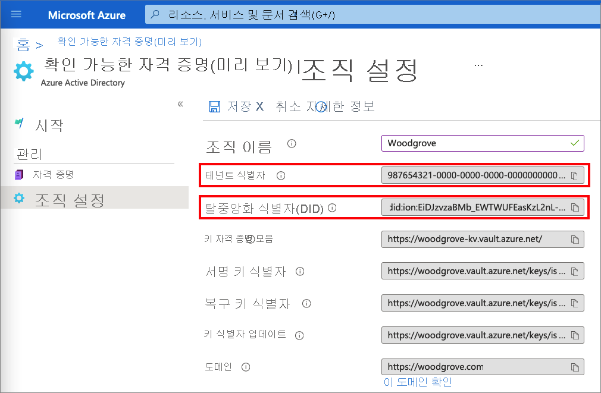
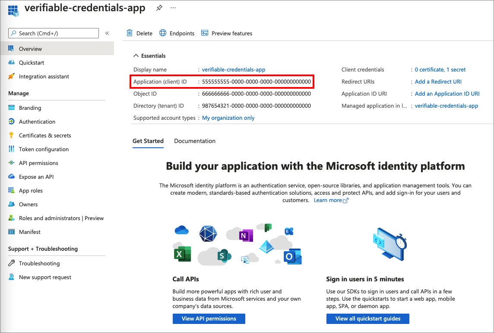
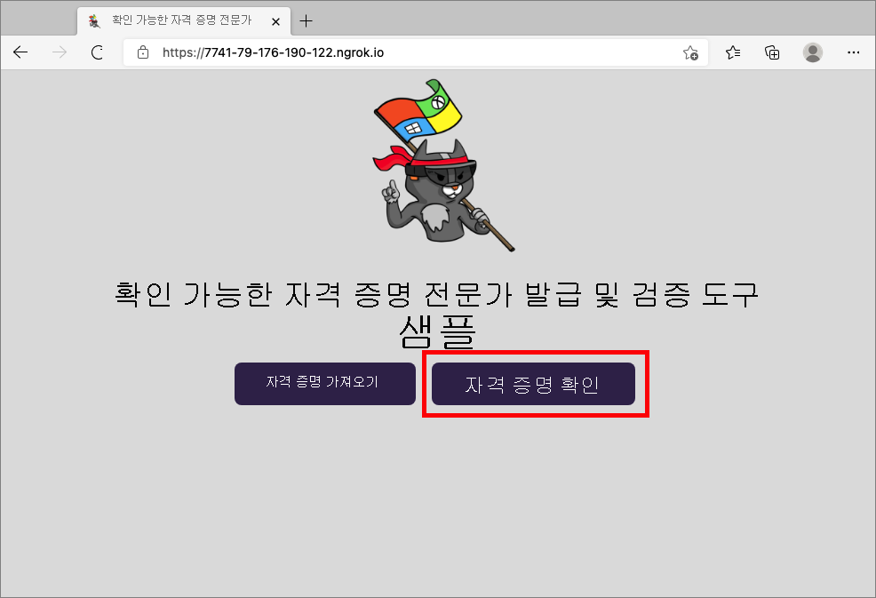
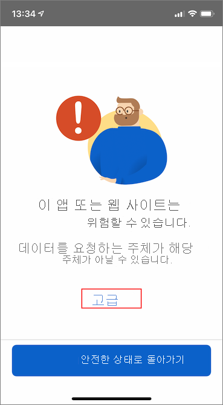
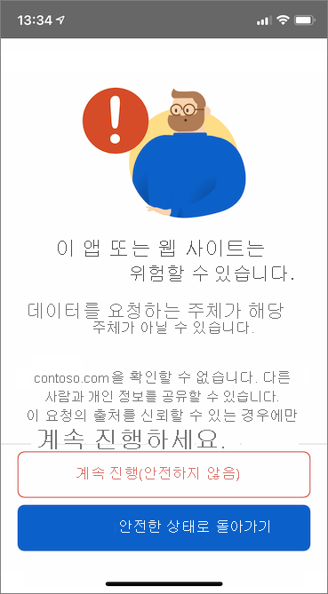
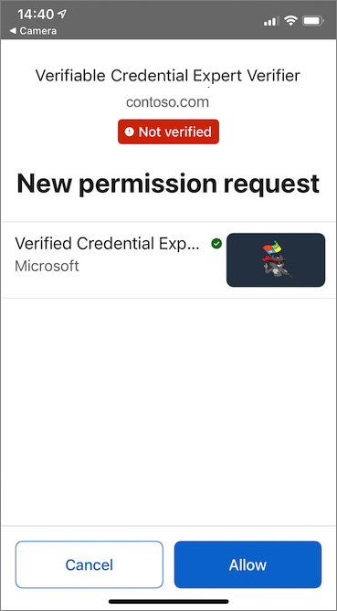
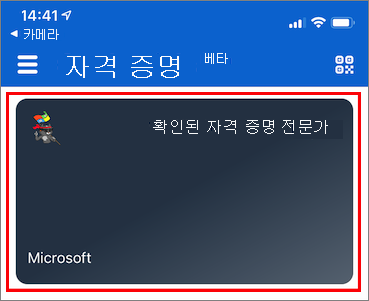
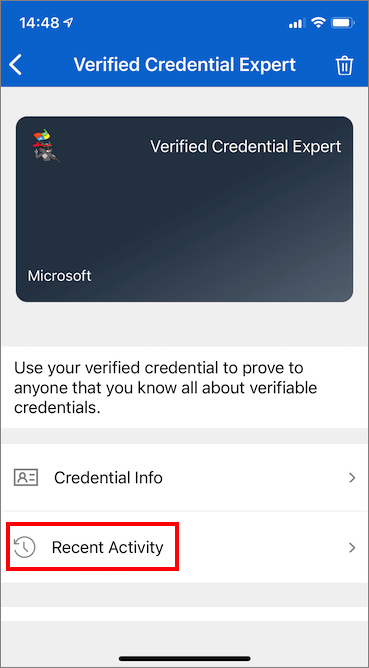
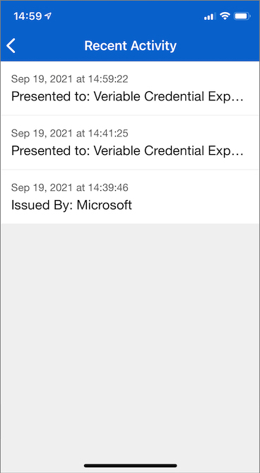

# <a name="configure-azure-ad-verifiable-credentials-verifier-preview"></a>Azure AD 확인 가능한 자격 증명 검증 도구 구성(미리 보기)

[이전 자습서](verifiable-credentials-configure-issuer.md)에서는 동일한 Azure AD(Azure Active Directory) 테넌트를 사용하여 자격 증명을 발급하고 확인하는 방법을 알아보았습니다. 이 자습서에서는 첫 번째 확인 가능한 자격 증명인 확인된 자격 증명 전문가 카드를 제시하고 확인하는 데 필요한 단계를 검토합니다.

검증 도구는 확인된 자격 증명 전문가 카드를 소유하는 주체에 대한 권한의 잠금을 해제합니다. 이 자습서에서는 확인된 자격 증명 전문가 카드를 제시하도록 요청한 다음, 이를 확인하는 샘플 애플리케이션을 로컬 컴퓨터에서 실행합니다.

이 문서에서는 다음 방법을 설명합니다.

> [!div class="checklist"]
>
> - 샘플 애플리케이션 코드를 로컬 컴퓨터에 다운로드합니다.
> - Azure AD 테넌트에서 Azure AD 확인 가능한 자격 증명을 설정합니다.
> - 샘플 애플리케이션을 설정하기 위한 자격 증명 및 환경 세부 정보를 수집하고, 샘플 애플리케이션을 확인된 자격 증명 전문가 카드 세부 정보로 업데이트합니다.
> - 샘플 애플리케이션을 실행하고, 확인 가능한 자격 증명 발급 프로세스를 시작합니다.

## <a name="prerequisites"></a>사전 요구 사항

- 시작하기 전에 [Azure AD 확인 가능한 자격 증명에 대한 테넌트를 설정](verifiable-credentials-configure-tenant.md)해야 합니다.
- 샘플 앱을 호스트하는 리포지토리를 복제하려면 [GIT](https://git-scm.com/downloads)가 설치되어 있어야 합니다.
- [Visual Studio Code](https://code.visualstudio.com/Download) 또는 이와 비슷한 코드 편집기
- [.NET 5.0](https://dotnet.microsoft.com/download/dotnet/5.0)
- [NGROK](https://ngrok.com/) 시험판
- Microsoft Authenticator가 포함된 모바일 디바이스
  - Android 버전 6.2108.5654 이상이 설치되어 있어야 합니다.
  - iOS 버전 6.5.82 이상이 설치되어 있어야 합니다.

## <a name="gather-tenant-details-to-set-up-your-sample-application"></a>샘플 애플리케이션을 설정하기 위한 테넌트 세부 정보 수집

이제 Azure AD 확인 가능한 자격 증명 서비스를 설정했으므로 환경 및 설정한 확인 가능한 자격 증명에 대한 일부 정보를 수집합니다. 이러한 정보는 샘플 애플리케이션을 설정할 때 사용합니다.

1. 확인 가능한 자격 증명에서 **조직 설정** 을 선택합니다.
1. **테넌트 식별자** 를 복사하여 나중에 사용할 수 있도록 기록해 둡니다.
1. **탈중앙화 ID** 를 복사하여 나중에 사용할 수 있도록 기록해 둡니다.

다음 스크린샷에서는 필요한 값을 복사하는 방법을 보여 줍니다.



## <a name="download-the-sample-code"></a>샘플 코드 다운로드

샘플 애플리케이션은 .NET에서 사용할 수 있으며, 코드는 GitHub 리포지토리에서 유지 관리됩니다. [GitHub 리포지토리](https://github.com/Azure-Samples/active-directory-verifiable-credentials-dotnet)에서 샘플 코드를 다운로드하거나 리포지토리를 로컬 컴퓨터에 복제합니다.

```bash
git clone git@github.com:Azure-Samples/active-directory-verifiable-credentials-dotnet.git 
```

## <a name="configure-the-verifiable-credentials-app"></a>확인 가능한 자격 증명 앱 구성

사용자가 만든 등록된 애플리케이션에 대한 클라이언트 암호를 만듭니다. 샘플 애플리케이션은 토큰을 요청할 때 클라이언트 암호를 사용하여 ID를 증명합니다.

1. **Azure Active Directory** 에 있는 **앱 등록** 페이지로 이동합니다.

1. 앞에서 만든 *verifiable-credentials-app* 애플리케이션을 선택합니다.

1. 이름을 선택하여 **앱 등록 세부 정보** 로 이동합니다.

1. **애플리케이션(클라이언트) ID** 를 복사하여 나중에 사용할 수 있도록 저장합니다. 

    

1. 앱 등록 세부 정보에 있는 주 메뉴의 **관리** 아래에서 **인증서 및 비밀** 을 선택합니다.

1. **새 클라이언트 암호** 를 선택합니다.

    1. **설명** 상자에서 클라이언트 암호에 대한 설명을 입력합니다(예: vc-sample-secret).

    1. **만료** 아래에서 비밀이 유효한 기간(예: 6개월)을 선택한 다음, **추가** 를 선택합니다.

    1. 비밀의 **값** 을 기록합니다. 이후 단계에서 구성에 이 값을 사용합니다. 비밀의 값은 다시 표시되지 않으며 다른 방법으로 검색할 수 없으므로 표시되는 즉시 기록해 두세요.

이 시점에서 샘플 애플리케이션을 설정하는 데 필요한 모든 필수 정보가 있어야 합니다.

## <a name="update-the-sample-application"></a>샘플 애플리케이션 업데이트

이제 샘플 앱의 발급자 코드를 수정하여 확인 가능한 자격 증명 URL로 업데이트합니다. 이 단계를 수행하면 자체 테넌트를 사용하여 확인 가능한 자격 증명을 발급할 수 있습니다.

1. *active-directory-verifiable-credentials-dotnet-main* 디렉터리에서 Visual Studio Code를 열고, *1. asp-net-core-api-idtokenhint* 디렉터리 내에서 프로젝트를 선택합니다.

1. 프로젝트 루트 폴더에서 appsettings.json 파일을 엽니다. 이 파일에는 Azure AD 확인 가능한 자격 증명에 대한 정보가 포함되어 있습니다. 다음 속성을 이전에 위의 단계에서 기록한 정보로 업데이트합니다.

    1. **테넌트 ID:** 사용자의 테넌트 ID
    1. **클라이언트 ID:** 사용자의 클라이언트 ID
    1. **클라이언트 암호**: 사용자의 클라이언트 암호
    1. **VerifierAuthority**: 사용자의 탈중앙화 ID
    1. **CredentialManifest**: 사용자의 자격 증명 발급 URL

1. *appsettings.json* 파일을 저장합니다.

다음 JSON은 전체 appsettings.json 파일을 보여 줍니다.

```json
{

 "AppSettings": {
   "Endpoint": "https://beta.did.msidentity.com/v1.0/{0}/verifiablecredentials/request",
   "VCServiceScope": "bbb94529-53a3-4be5-a069-7eaf2712b826/.default",
   "Instance": "https://login.microsoftonline.com/{0}",
   "TenantId": "987654321-0000-0000-0000-000000000000",
   "ClientId": "555555555-0000-0000-0000-000000000000",
   "ClientSecret": "123456789012345678901234567890",
   "VerifierAuthority": "did:ion:EiDJzvzaBMb_EWTWUFEasKzL2nL-BJPhQTzYWjA_rRz3hQ:eyJkZWx0YSI6eyJwYXRjaGVzIjpbeyJhY3Rpb24iOiJyZXBsYWNlIiwiZG9jdW1lbnQiOnsicHVibGljS2V5cyI6W3siaWQiOiJzaWdfMmNhMzY2YmUiLCJwdWJsaWNLZXlKd2siOnsiY3J2Ijoic2VjcDI1NmsxIiwia3R5IjoiRUMiLCJ4IjoiZDhqYmduRkRGRElzR1ZBTWx5aDR1b2RwOGV4Q2dpV3dWUGhqM0N...",
   "CredentialManifest": " https://beta.did.msidentity.com/v1.0/987654321-0000-0000-0000-000000000000/verifiableCredential/contracts/VerifiedCredentialExpert"
 }
}
```

## <a name="run-and-test-the-sample-app"></a>샘플 앱 실행 및 테스트

이제 샘플 애플리케이션을 실행하여 첫 번째 확인된 전문가 카드를 제시하고 확인할 준비가 되었습니다.

1. Visual Studio Code에서 Verifiable_credentials_DotNet 프로젝트를 실행합니다. 또는 명령 셸에서 다음 명령을 실행합니다.

    ```bash
    cd active-directory-verifiable-credentials-dotnet/1. asp-net-core-api-idtokenhint  dotnet build "asp-net-core-api-idtokenhint.csproj" -c Debug -o .\bin\Debug\netcoreapp3.1  
    dotnet run
    ```

1. 다른 터미널에서 다음 명령을 실행합니다. 이 명령은 [ngrok](https://ngrok.com/)를 실행하여 3000에서 URL을 설정하고, 이를 인터넷에서 공개적으로 사용할 수 있도록 합니다.

    ```bash
    ngrok http 3000 
    ```
    
    >[!NOTE]
    > 일부 컴퓨터에서는 명령을 `./ngrok http 3000` 형식으로 실행해야 할 수 있습니다.

1. ngrok에서 생성된 HTTPS URL을 엽니다.

    

1. 웹 브라우저에서 **자격 증명 확인** 을 선택합니다.

    

1. Authenticator 앱을 사용하여 QR 코드를 스캔하거나 모바일 카메라에서 직접 스캔합니다.

1. **이 앱 또는 웹 사이트는 위험할 수 있습니다.** 라는 경고 메시지에서 **고급** 을 선택합니다. 도메인이 확인되지 않았으므로 이 경고가 표시됩니다. 도메인을 확인하려면 [도메인을 DID(탈중앙화 ID)에 연결] 문서의 지침을 따릅니다. 이 자습서에서는 도메인 등록을 건너뛸 수 있습니다.  

    
    

1. 위험한 웹 사이트 경고에서 **계속 진행(안전하지 않음)** 을 선택합니다.  
 
    

1. **허용** 을 선택하여 요청을 승인합니다.

    

1. 요청을 승인하면 해당 요청이 승인되었음을 확인할 수 있습니다. 로그를 확인할 수도 있습니다. 로그를 확인하려면 확인 가능한 자격 증명을 선택합니다.

    

1. 그런 다음, **최근 작업** 을 선택합니다.  

    

1. **최근 작업** 은 확인 가능한 자격 증명의 최근 작업을 보여 줍니다.

    

1. 샘플 앱으로 돌아갑니다. 받은 확인 가능한 자격 증명에 대한 프레젠테이션이 표시됩니다.

    

## <a name="next-steps"></a>다음 단계

[확인 가능한 자격 증명을 사용자 지정하는 방법](credential-design.md)을 알아봅니다.
