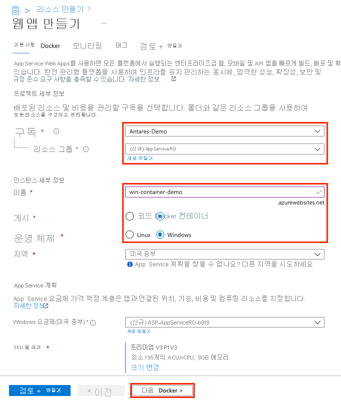
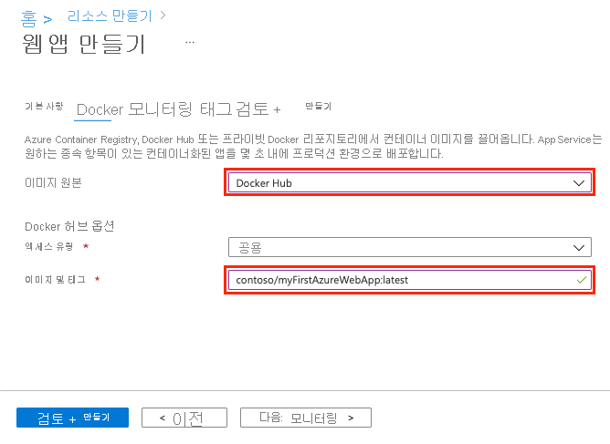
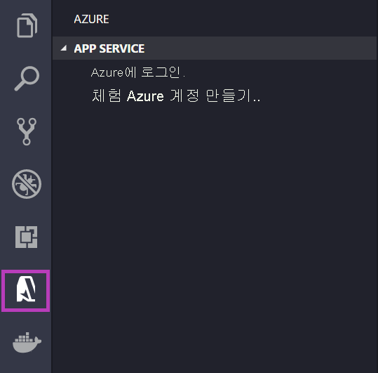
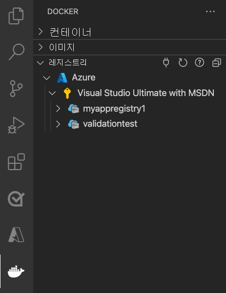
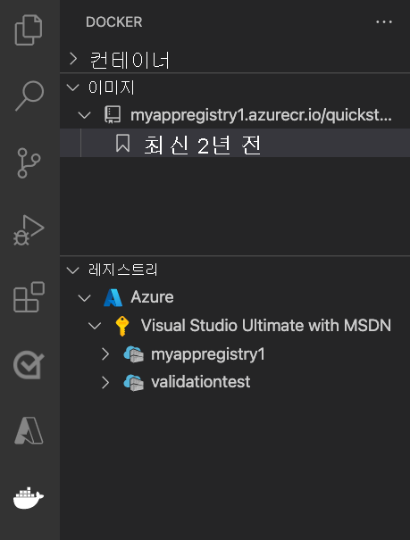
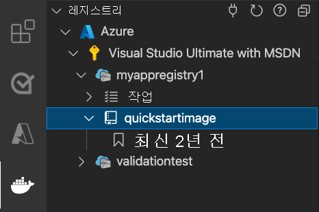

# <a name="run-a-custom-container-in-azure"></a>Azure에서 사용자 지정 컨테이너 실행

::: zone pivot="container-windows"
[Azure App Service](overview.md)는 IIS에서 실행하는 ASP.NET 또는 Node.js와 같은 Windows에서 미리 정의된 애플리케이션 스택을 제공합니다. 그러나 미리 구성된 애플리케이션 스택은 [운영 체제를 잠그고 낮은 수준의 액세스를 차단](operating-system-functionality.md)합니다. 사용자 지정 Windows 컨테이너에는 이러한 제한이 없으므로, 개발자가 컨테이너를 완전히 사용자 지정하고 컨테이너화된 애플리케이션에 Windows 기능에 대한 모든 액세스 권한을 부여할 수 있습니다. 

이 빠른 시작에서는 Windows 이미지의 ASP.NET 앱을 Visual Studio에서 [Azure Container Registry](../container-registry/container-registry-intro.md)로 배포하는 방법을 보여 줍니다. Azure App Service의 사용자 지정 컨테이너에서 앱을 실행합니다.

## <a name="prerequisites"></a>필수 구성 요소

이 자습서를 완료하려면 다음이 필요합니다.

- <a href="https://docs.docker.com/docker-for-windows/install/" target="_blank">Windows용 Docker 설치</a>
- <a href="/virtualization/windowscontainers/quick-start/quick-start-windows-10" target="_blank">Windows 컨테이너를 실행하도록 Docker 전환</a>
- **ASP.NET 및 웹 개발** 및 **Azure 개발** 워크로드가 있는 <a href="https://www.visualstudio.com/downloads/" target="_blank">Visual Studio 2022를 설치</a>합니다. *Visual Studio 2022 Community* 에서 **.NET Framework 프로젝트 및 항목 템플릿** 구성 요소가 **ASP.NET 및 웹 개발 워크로드** 와 함께 선택되어 있는지 확인합니다. Visual Studio 2022를 이미 설치한 경우 다음을 수행합니다.
    - **도움말** > **업데이트 확인** 을 차례로 선택하여 Visual Studio에서 최신 업데이트를 설치합니다.
    - **도구** > **도구 및 기능 가져오기** 를 차례로 선택하여 Visual Studio에서 워크로드를 추가합니다.

## <a name="create-an-aspnet-web-app"></a>ASP.NET 웹앱 만들기

다음 단계에 따라 ASP.NET 웹앱을 만듭니다.

1. Visual Studio를 연 다음, **새 프로젝트 만들기** 를 선택합니다.

1. **새 프로젝트 만들기** 에서 C#용 **ASP.NET 웹 애플리케이션(.NET Framework)** 을 찾아서 선택하고, **다음** 을 선택합니다.

   :::image type="content" source="./media/quickstart-custom-container/create-new-project.png?text=VS create a new project" alt-text="새 프로젝트 만들기":::

1. **새 프로젝트 구성** 의 **프로젝트 이름** 아래에서 애플리케이션 이름을 _myfirstazurewebapp_ 으로 지정합니다. **프레임워크** 아래에서 **.NET Framework 4.8** 을 선택한 다음, **만들기** 를 선택합니다.

    :::image type="content" source="./media/quickstart-custom-container/configure-web-app-project-container.png?text=Configure your web app project" alt-text="웹앱 프로젝트 구성":::

1. 모든 종류의 ASP.NET 웹앱을 Azure에 배포할 수 있습니다. 이 빠른 시작에서는 **MVC** 템플릿을 선택합니다.

1. **인증** 아래에서 **없음** 을 선택합니다. **고급** 아래에서 **Docker 지원** 을 선택하고, **HTTPS로 구성** 을 선택 취소합니다. **만들기** 를 선택합니다.

     :::image type="content" source="./media/quickstart-custom-container/select-mvc-template-for-container.png?text=Create ASP.NET Web Application" alt-text="ASP.NET 웹 애플리케이션 만들기":::

1. _Dockerfile_ 파일이 자동으로 열리지 않으면 **솔루션 탐색기** 에서 엽니다.

1. [지원되는 부모 이미지](configure-custom-container.md#supported-parent-images)가 필요합니다. `FROM` 줄을 다음 코드로 바꾸고 파일을 저장하여 부모 이미지를 변경합니다.

   ```dockerfile
   FROM mcr.microsoft.com/dotnet/framework/aspnet:4.8-windowsservercore-ltsc2019
   ```

1. Visual Studio 메뉴에서 **디버그** > **디버깅하지 않고 시작** 을 차례로 선택하여 웹앱을 로컬로 실행합니다.

    :::image type="content" source="./media/quickstart-custom-container/local-web-app.png?text=Run app locally" alt-text="로컬에서 앱 실행":::

## <a name="publish-to-azure-container-registry"></a>Azure Container Registry에 게시

1. **솔루션 탐색기** 에서 마우스 오른쪽 단추로 **myfirstazurewebapp** 프로젝트를 클릭하고 **게시** 를 선택합니다.

1. **대상** 에서 **Docker 컨테이너 레지스트리** 를 선택하고, **다음** 을 클릭합니다.

    :::image type="content" source="./media/quickstart-custom-container/select-docker-container-registry-visual-studio-2022.png?text=Select Docker Container Registry" alt-text="Docker 컨테이너 레지스트리 선택":::

1. **특정 대상** 에서 **Azure Container Registry** 를 선택하고, **다음** 을 클릭합니다.

    :::image type="content" source="./media/quickstart-custom-container/publish-to-azure-container-registry-visual-studio-2022.png?text=Publish to Azure Container Registry" alt-text="프로젝트 개요 페이지에서 게시":::

1. **게시** 에서 올바른 구독이 선택되어 있는지 확인합니다. **컨테이너 레지스트리** 에서 **+** 단추를 선택하여 새 Azure Container Registry를 만듭니다.

    :::image type="content" source="./media/quickstart-custom-container/create-new-azure-container-registry.png?text=Create new Azure Container Registry" alt-text="새 Azure Container Registry 만들기":::

1. **새로 만들기** 에서 올바른 구독이 선택되어 있는지 확인합니다. **리소스 그룹** 아래에서 **새로 만들기** 를 선택하고, 이름에 대해 *myResourceGroup* 을 입력한 다음, **확인** 을 클릭합니다. **SKU** 아래에서 **기본** 을 선택합니다. **레지스트리 위치** 아래에서 레지스트리의 위치를 선택한 다음, **만들기** 를 선택합니다.

    :::image type="content" source="./media/quickstart-custom-container/new-azure-container-registry-details.png?text=Azure Container Registry details" alt-text="Azure Container Registry 세부 정보":::

1. **게시** 의 **Container Registry** 아래에서 만든 레지스트리를 선택한 다음, **마침** 을 선택합니다.

    :::image type="content" source="./media/quickstart-custom-container/select-existing-azure-container-registry.png?text=Select existing Azure Container Registry" alt-text="기존 Azure Container Registry 선택":::

   배포가 완료될 때가지 기다립니다. 이제 **게시** 페이지에 리포지토리 이름이 표시됩니다. *복사 단추* 를 선택하여 나중에 사용할 **리포지토리** 이름을 복사합니다.

    :::image type="content" source="./media/quickstart-custom-container/published-docker-repository-visual-studio-2022.png?text=Screenshot that highlights the repository name." alt-text="리포지토리 이름을 강조 표시하는 스크린샷.":::

## <a name="create-a-windows-container-app"></a>Windows 컨테이너 앱 만들기

1. [Azure Portal](https://portal.azure.com)에 로그인합니다.

1. Azure Portal의 왼쪽 위 모서리에서 **리소스 만들기** 를 선택합니다.

1. **인기 있는 서비스** 에서 **웹앱** 아래에 있는 **만들기** 를 선택합니다.

1. **웹앱 만들기** 에서 구독 및 **리소스 그룹** 을 선택합니다. 필요한 경우 새 리소스 그룹을 만들 수 있습니다.

1. *win-container-demo* 와 같은 앱 이름을 입력합니다. **게시** 에 **Docker 컨테이너** 를, **운영 체제** 에 **Windows** 를 선택합니다. 완료되면 **다음: Docker** 를 선택하여 계속합니다.

   

1. **이미지 원본** 에 대해 **Docker Hub** 를 선택하고, **이미지 및 태그** 에 대해 [Azure Container Registry에 게시](#publish-to-azure-container-registry)에서 복사한 리포지토리 이름을 입력합니다.

   

    웹 애플리케이션에 대한 사용자 지정 이미지가 [Azure Container Registry](../container-registry/index.yml) 또는 다른 프라이빗 리포지토리와 같이 다른 곳에 있는 경우 여기에서 구성할 수 있습니다.

1. **검토 및 만들기** 를 선택한 다음, **만들기** 를 선택하여 Azure에서 필요한 리소스를 만들 때까지 기다립니다.

## <a name="browse-to-the-container-app"></a>컨테이너 앱으로 이동

Azure 작업이 완료되면 알림 상자가 표시됩니다.


1. **리소스로 이동** 을 클릭합니다.

1. 이 리소스의 개요에서 **URL** 옆에 있는 링크를 따릅니다.

다음 페이지의 새 브라우저 페이지가 열립니다.


기본 ASP.NET 홈 페이지가 표시될 때까지 몇 분 정도 기다렸다가 다시 시도하세요.


**축하합니다.** Azure App Service에서 첫 번째 사용자 지정 Windows 컨테이너를 실행하고 있습니다.

## <a name="see-container-start-up-logs"></a>컨테이너 시작 로그를 참조하세요.

Windows 컨테이너를 로드하는 데 다소 시간이 걸릴 수 있습니다. 진행률을 보려면 *\<app_name>* 을 앱 이름으로 대체하여 다음 URL로 이동합니다.
```
https://<app_name>.scm.azurewebsites.net/api/logstream
```

스트리밍된 로그는 다음과 같이 표시됩니다.

```
2018-07-27T12:03:11  Welcome, you are now connected to log-streaming service.
27/07/2018 12:04:10.978 INFO - Site: win-container-demo - Start container succeeded. Container: facbf6cb214de86e58557a6d073396f640bbe2fdec88f8368695c8d1331fc94b
27/07/2018 12:04:16.767 INFO - Site: win-container-demo - Container start complete
27/07/2018 12:05:05.017 INFO - Site: win-container-demo - Container start complete
27/07/2018 12:05:05.020 INFO - Site: win-container-demo - Container started successfully
```

## <a name="update-locally-and-redeploy"></a>로컬로 업데이트 및 다시 배포

1. Visual Studio의 **솔루션 탐색기** 에서 **보기** > **홈** > **Index.cshtml** 을 차례로 엽니다.

1. 위쪽 가까이에 `<div class="jumbotron">` HTML 태그를 찾아서 전체 요소를 다음 코드로 바꿉니다.

   ```html
   <div class="jumbotron">
       <h1>ASP.NET in Azure!</h1>
       <p class="lead">This is a simple app that we've built that demonstrates how to deploy a .NET app to Azure App Service.</p>
   </div>
   ```

1. Azure에 다시 배포하려면 **솔루션 탐색기** 에서 마우스 오른쪽 단추로 **myfirstazurewebapp** 프로젝트를 클릭하고 **게시** 를 선택합니다.

1. 게시 페이지에서 **게시** 를 선택하고 게시가 완료될 때까지 기다립니다.

1. App Service가 Docker 허브에서 새 이미지를 끌어오도록 하려면, 앱을 다시 시작합니다. 포털의 앱 페이지로 돌아가서 **다시 시작** > **예** 를 클릭합니다.

   

[컨테이너 앱으로 다시 이동](#browse-to-the-container-app)합니다. 웹 페이지를 새로 고치면 처음에는 앱이 '시작' 페이지로 돌아간 다음 몇 분 후에 업데이트된 웹 페이지가 표시됩니다.


## <a name="next-steps"></a>다음 단계

> [!div class="nextstepaction"]
> [Azure에서 Windows 컨테이너로 마이그레이션](tutorial-custom-container.md)

또는 다른 리소스를 확인합니다.

> [!div class="nextstepaction"]
> [사용자 지정 컨테이너 구성](configure-custom-container.md)

::: zone-end  

::: zone pivot="container-linux"
App Service on Linux는 .NET, PHP, Node.js 등의 언어 지원을 통해 Linux에서 미리 정의된 애플리케이션 스택을 제공합니다. 또한 사용자 지정 Docker 이미지를 사용하여 Azure에 아직 정의되지 않은 애플리케이션 스택에 웹앱을 실행할 수도 있습니다. 이 빠른 시작에서는 ACR([Azure Container Registry](../container-registry/index.yml))에서 App Service로 이미지를 배포하는 방법을 보여 줍니다.

## <a name="prerequisites"></a>필수 구성 요소

* [Azure 계정](https://azure.microsoft.com/free/?utm_source=campaign&utm_campaign=vscode-tutorial-docker-extension&mktingSource=vscode-tutorial-docker-extension)
* [Docker](https://www.docker.com/community-edition)
* [Visual Studio Code](https://code.visualstudio.com/)
* [VS Code용 Azure App Service 확장](https://marketplace.visualstudio.com/items?itemName=ms-azuretools.vscode-azureappservice). 이 확장을 사용하여 Azure PaaS(Platform as a Service)에서 Linux Web Apps를 만들고, 관리하고, 배포할 수 있습니다.
* [VS Code용 Docker 확장](https://marketplace.visualstudio.com/items?itemName=ms-azuretools.vscode-docker). 이 확장을 사용하여 로컬 Docker 이미지 및 명령 관리를 간소화하고 빌드된 앱 이미지를 Azure에 배포할 수 있습니다.

## <a name="create-a-container-registry"></a>컨테이너 레지스트리 만들기

이 빠른 시작에서는 Azure Container Registry를 선택한 레지스트리로 사용합니다. 다른 레지스트리도 자유롭게 사용할 수 있지만 단계는 약간 다를 수 있습니다.

[빠른 시작: Azure Portal을 사용하여 프라이빗 컨테이너 레지스트리 만들기](../container-registry/container-registry-get-started-portal.md)의 지침에 따라 컨테이너 레지스트리를 만듭니다.

> [!IMPORTANT]
> Azure 컨테이너 레지스트리를 만들 때 **관리 사용자** 옵션을 **사용** 으로 설정해야 합니다. Azure Portal 레지스트리 페이지의 **액세스 키** 섹션에서 설정할 수도 있습니다. 이 설정은 App Service 액세스에 필요합니다. 관리 ID에 대한 내용은 [ACR에서 배포 자습서](tutorial-custom-container.md?pivots=container-linux#configure-app-service-to-deploy-the-image-from-the-registry)를 참조하세요.

## <a name="sign-in"></a>로그인

1. Visual Studio Code를 시작합니다. 
1. [작업 표시줄](https://code.visualstudio.com/docs/getstarted/userinterface)에서 **Azure** 로고를 선택하고 **APP SERVICE** 탐색기로 이동한 다음, **Azure에 로그인** 을 선택하고 지침을 따릅니다.

    

1. 아래쪽의 [상태 표시줄](https://code.visualstudio.com/docs/getstarted/userinterface)에서 Azure 계정 메일 주소를 확인합니다. **APP SERVICE** 탐색기에 사용자의 구독이 표시되어야 합니다.

1. 작업 표시줄에서 **Docker** 로고를 선택합니다. **REGISTRIES** 탐색기에서 만든 컨테이너 레지스트리가 나타나는지 확인합니다.

    

## <a name="check-prerequisites"></a>필수 구성 요소 확인

Docker가 설치되어 실행 중인지 확인합니다. 다음 명령은 실행 중인 경우 Docker 버전을 표시합니다.

```bash
docker --version
```

## <a name="create-and-build-image"></a>이미지 만들기 및 빌드

1. Visual Studio Code에서 빈 폴더를 열고 `Dockerfile`이라는 파일을 추가합니다. Dockerfile에서 원하는 언어 프레임워크를 기준으로 콘텐츠를 붙여넣습니다.

# <a name="net"></a>[.NET](#tab/dotnet)

<!-- https://mcr.microsoft.com/v2/appsvc%2Fdotnetcore/tags/list -->
```dockerfile
FROM mcr.microsoft.com/appsvc/dotnetcore:lts

ENV PORT 8080
EXPOSE 8080

ENV ASPNETCORE_URLS "http://*:${PORT}"

ENTRYPOINT ["dotnet", "/defaulthome/hostingstart/hostingstart.dll"]
```

이 Dockerfile에서 부모 이미지는 App Service의 기본 제공 .NET 컨테이너 중 하나입니다. 이에 대한 원본 파일은 [GenerateDockerFiles/dotnetcore 아래에 있는 Azure-App-Service/ImageBuilder GitHub 리포지토리에서](https://github.com/Azure-App-Service/ImageBuilder/tree/master/GenerateDockerFiles/dotnetcore) 찾을 수 있습니다. 해당 [Dockerfile](https://github.com/Azure-App-Service/ImageBuilder/blob/master/GenerateDockerFiles/dotnetcore/debian-9/Dockerfile)은 간단한 .NET 앱을 `/defaulthome/hostingstart`로 복사합니다. Dockerfile은 간단히 해당 앱을 시작합니다.

# <a name="nodejs"></a>[Node.js](#tab/node)

<!-- https://mcr.microsoft.com/v2/appsvc%2Fnode/tags/list -->
```dockerfile
FROM mcr.microsoft.com/appsvc/node:10-lts

ENV HOST 0.0.0.0
ENV PORT 8080
EXPOSE 8080

ENTRYPOINT ["pm2", "start", "--no-daemon", "/opt/startup/default-static-site.js"]
```

이 Dockerfile에서 부모 이미지는 App Service의 기본 제공 Node.js 컨테이너 중 하나입니다. 이에 대한 원본 파일은 [GenerateDockerFiles/node/node-template 아래에 있는 Azure-App-Service/ImageBuilder GitHub 리포지토리에서](https://github.com/Azure-App-Service/ImageBuilder/tree/master/GenerateDockerFiles/node/node-template) 찾을 수 있습니다. 해당 [Dockerfile](https://github.com/Azure-App-Service/ImageBuilder/blob/master/GenerateDockerFiles/node/node-template/Dockerfile)은 간단한 Node.js 앱을 `/opt/startup`으로 복사합니다. Dockerfile은 부모 이미지에 이미 설치되어 있는 PM2를 사용하여 간단히 해당 앱을 시작합니다.

# <a name="python"></a>[Python](#tab/python)

<!-- https://mcr.microsoft.com/v2/appsvc%2Fpython/tags/list -->
```dockerfile
FROM mcr.microsoft.com/appsvc/python:latest

ENV PORT 8080
EXPOSE 8080

ENTRYPOINT ["gunicorn", "--timeout", "600", "--access-logfile", "'-'", "--error-logfile", "'-'", "--chdir=/opt/defaultsite", "application:app"]
```

이 Dockerfile에서 부모 이미지는 App Service의 기본 제공 Python 컨테이너 중 하나입니다. 이에 대한 원본 파일은 [GenerateDockerFiles/python/template-3.9 아래에 있는 Azure-App-Service/ImageBuilder GitHub 리포지토리에서](https://github.com/Azure-App-Service/ImageBuilder/tree/master/GenerateDockerFiles/python/template-3.9) 찾을 수 있습니다. 해당 [Dockerfile](https://github.com/Azure-App-Service/ImageBuilder/blob/master/GenerateDockerFiles/python/template-3.9/Dockerfile)은 간단한 Python 앱을 `/opt/defaultsite`로 복사합니다. Dockerfile은 부모 이미지에 이미 설치되어 있는 Gunicorn을 사용하여 간단히 해당 앱을 시작합니다.

# <a name="java"></a>[Java](#tab/java)

<!-- https://mcr.microsoft.com/v2/azure-app-service%2Fjava/tags/list -->
```dockerfile
FROM mcr.microsoft.com/azure-app-service/java:11-java11_stable

ENV PORT 80
EXPOSE 80

ENTRYPOINT ["java", "-Dserver.port=80", "-jar", "/tmp/appservice/parkingpage.jar"]
```

이 Dockerfile에서 부모 이미지는 App Service의 기본 제공 Java 컨테이너 중 하나입니다. 이에 대한 소스 파일은 [java/tree/dev/java11-alpine의 Azure-App-Service/java GitHub 리포지토리에서](https://github.com/Azure-App-Service/java/tree/dev/java11-alpine) 찾을 수 있습니다. 해당 [Dockerfile](https://github.com/Azure-App-Service/java/blob/dev/java11-alpine/Dockerfile)은 간단한 Java 앱을 `/tmp/appservice`로 복사합니다. Dockerfile은 간단히 해당 앱을 시작합니다.

-----

2. [명령 팔레트를 열고](https://code.visualstudio.com/docs/getstarted/userinterface#_command-palette) **Docker Images: Build Image** 를 입력합니다. **Enter** 를 입력하여 명령을 실행합니다.

3. 이미지 태그 상자에서 원하는 태그를 `<acr-name>.azurecr.io/<image-name>/<tag>` 형식으로 지정합니다. 여기서 `<acr-name>`은 사용자가 만든 컨테이너 레지스트리의 이름입니다. **Enter** 키를 누릅니다.

4. 이미지 빌드가 완료되면 **IMAGES** 탐색기 위쪽에서 **새로 고침** 을 클릭하여 이미지가 성공적으로 빌드되었는지 확인합니다.

    

## <a name="deploy-to-container-registry"></a>컨테이너 레지스트리에 배포

1. 작업 표시줄에서 **Docker** 아이콘을 클릭합니다. **IMAGES** 탐색기에서 방금 빌드한 이미지를 찾습니다.
1. 이미지를 확장하고, 원하는 태그를 마우스 오른쪽 단추로 클릭한 후, **푸시** 를 클릭합니다.
1. 이미지 태그가 `<acr-name>.azurecr.io`로 시작하는지 확인하고 **Enter** 키를 누릅니다.
1. Visual Studio Code가 컨테이너 레지스트리에 이미지를 푸시하는 작업을 완료하면 **REGISTRIES** 탐색기의 맨 위에 있는 **새로 고침** 을 클릭하여 이미지가 성공적으로 푸시되었는지 확인합니다.

    

## <a name="deploy-to-app-service"></a>App Service에 배포

1. **REGISTRIES** 탐색기에서 이미지를 확장하고 태그를 마우스 오른쪽 단추로 클릭한 후, **Azure App Service에 이미지 배포** 를 클릭합니다.
1. 표시되는 메시지에 따라 구독, 전역적으로 고유한 앱 이름, 리소스 그룹 및 App Service 요금제를 선택합니다. 가격 책정 계층으로 **B1 기본** 을 선택하고 가까운 지역을 선택합니다.

배포 후에는 `http://<app-name>.azurewebsites.net`에서 앱을 사용할 수 있습니다.

**리소스 그룹** 은 Azure에 있는 모든 애플리케이션 리소스의 명명된 컬렉션입니다. 예를 들어 리소스 그룹에는 웹 사이트, 데이터베이스 및 Azure 함수에 대한 참조가 포함될 수 있습니다.

**App Service 계획** 은 웹 사이트를 호스트하는 데 사용되는 물리적 리소스를 정의합니다. 이 빠른 시작에서는 **Linux** 인프라의 **기본** 호스팅 계획을 사용하므로, 사이트가 다른 웹 사이트와 함께 Linux 머신에 호스트됩니다. **기본** 계획으로 시작하는 경우, Azure Portal을 사용하여 해당 웹 사이트만 머신에서만 실행되도록 강화할 수 있습니다. 가격 책정에 대해서는 [App Service 가격](https://azure.microsoft.com/pricing/details/app-service/linux)을 참조하세요.

## <a name="browse-the-website"></a>웹 사이트 찾아보기

**출력** 패널에 배포 작업의 상태가 표시됩니다. 작업이 완료되면 팝업 알림에 있는 **사이트 열기** 를 클릭하여 브라우저로 사이트를 엽니다.

> [!div class="nextstepaction"]
> [문제가 발생했습니다.](https://www.research.net/r/PWZWZ52?tutorial=quickstart-docker&step=deploy-app)

## <a name="next-steps"></a>다음 단계

축하합니다. 이 빠른 시작을 성공적으로 완료하셨습니다.

App Service 앱은 시작할 때마다 컨테이너 레지스트리에서 이미지를 가져옵니다. 이미지를 다시 빌드하는 경우 컨테이너 레지스트리에 푸시하기만 하면 앱이 다시 시작될 때 업데이트된 이미지를 가져옵니다. 업데이트된 이미지를 즉시 가져오도록 앱에 지시하려면 다시 시작합니다.

> [!div class="nextstepaction"]
> [사용자 지정 컨테이너 구성](configure-custom-container.md)

> [!div class="nextstepaction"]
> [컨테이너 사용자 지정 자습서](tutorial-custom-container.md)

> [!div class="nextstepaction"]
> [다중 컨테이너 앱 자습서](tutorial-multi-container-app.md)

다른 Azure 확장:

* [Cosmos DB](https://marketplace.visualstudio.com/items?itemName=ms-azuretools.vscode-cosmosdb)
* [Azure Functions](https://marketplace.visualstudio.com/items?itemName=ms-azuretools.vscode-azurefunctions)
* [Azure CLI 도구](https://marketplace.visualstudio.com/items?itemName=ms-vscode.azurecli)
* [Azure Resource Manager 도구](https://marketplace.visualstudio.com/items?itemName=msazurermtools.azurerm-vscode-tools)
* [Azure 도구](https://marketplace.visualstudio.com/items?itemName=ms-vscode.vscode-node-azure-pack) 확장 팩에는 위의 확장이 모두 포함되어 있습니다.

::: zone-end
