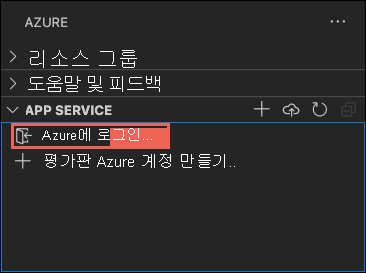
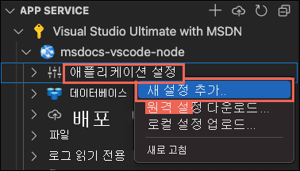
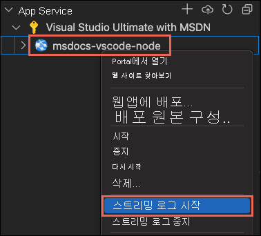

# <a name="create-a-nodejs-web-app-in-azure"></a>Azure에서 Node.js 웹앱 만들기

이 빠른 시작에서는 첫 번째 Node.js([Express](https://www.expressjs.com)) 웹앱을 만들고 [Azure App Service](overview.md)에 배포하는 방법을 알아봅니다. App Service는 Linux 및 Windows에서 다양한 버전의 Node.js를 지원합니다. 

이 빠른 시작에서는 **체험** 계층에서 App Service 앱을 구성하므로 Azure 구독 비용이 발생하지 않습니다.

## <a name="set-up-your-initial-environment"></a>초기 환경 설정

:::zone target="docs" pivot="development-environment-vscode"

- 활성 구독이 포함된 Azure 계정이 있어야 합니다. [체험 계정을 만듭니다](https://azure.microsoft.com/free/?utm_source=campaign&utm_campaign=vscode-tutorial-app-service-extension&mktingSource=vscode-tutorial-app-service-extension).
- [Node.js 및 npm](https://nodejs.org)을 설치합니다. `node --version` 명령을 실행하여 Node.js가 설치되어 있는지 확인합니다.
- [Visual Studio Code](https://code.visualstudio.com/)를 설치합니다.
- Visual Studio Code용 [Azure App Service 확장](https://marketplace.visualstudio.com/items?itemName=ms-azuretools.vscode-azureappservice)
 <!-- - <a href="https://git-scm.com/" target="_blank">Install Git</a> -->

::: zone-end

:::zone target="docs" pivot="development-environment-cli"

- 활성 구독이 포함된 Azure 계정이 있어야 합니다. [체험 계정을 만듭니다](https://azure.microsoft.com/free/?utm_source=campaign&utm_campaign=vscode-tutorial-app-service-extension&mktingSource=vscode-tutorial-app-service-extension).
- [Node.js 및 npm](https://nodejs.org)을 설치합니다. `node --version` 명령을 실행하여 Node.js가 설치되어 있는지 확인합니다.
- <a href="/cli/azure/install-azure-cli" target="_blank">Azure CLI</a>를 설치합니다. 이를 통해 셸에서 명령을 실행하여 Azure 리소스를 프로비저닝하고 구성할 수 있습니다.

::: zone-end

## <a name="create-your-nodejs-application"></a>Node.js 애플리케이션 만들기

이 단계에서는 스타터 Node.js 애플리케이션을 만들고 컴퓨터에서 실행되는지 확인합니다.

> [!TIP]
> [Node.js 자습서](https://code.visualstudio.com/docs/nodejs/nodejs-tutorial)를 이미 완료한 경우 [Azure에 배포](#deploy-to-azure)로 건너뛸 수 있습니다.

1. [Express 생성기](https://expressjs.com/starter/generator.html)를 사용하여 기본적으로 Node.js 및 NPM과 함께 설치되는 간단한 Node.js 애플리케이션을 만듭니다.

    ```bash
    npx express-generator myExpressApp --view pug
    ```

1. 애플리케이션의 디렉터리로 변경하고 NPM 패키지를 설치합니다.

    ```bash
    cd myExpressApp
    npm install
    ```

1. 개발 서버를 시작합니다.

    ```bash
    npm start
    ```

1. 브라우저에서 `http://localhost:3000`로 이동합니다. 다음과 비슷한 결과가 표시됩니다.

    

:::zone target="docs" pivot="development-environment-vscode"
> [!div class="nextstepaction"]
> [문제가 발생했습니다.](https://www.research.net/r/PWZWZ52?tutorial=node-deployment-azure-app-service&step=create-app)
::: zone-end

## <a name="deploy-to-azure"></a>Deploy to Azure

계속하기 전에 모든 필수 구성 요소를 설치하고 구성했는지 확인합니다.

> [!NOTE]
> Node.js 애플리케이션이 Azure에서 실행되려면 환경 변수 `PORT`에서 제공하는 포트에서 수신 대기해야 합니다. 생성된 Express 앱에서, 이 환경 변수는 시작 스크립트 *bin/www* 에서 이미 사용되고 있습니다(`process.env.PORT` 검색).
>

:::zone target="docs" pivot="development-environment-vscode"

#### <a name="sign-in-to-azure"></a>Azure에 로그인

1. 터미널에서 현재 *myExpressApp* 디렉터리에 있는지 확인하고, 다음 명령을 사용하여 Visual Studio Code를 시작합니다.

    ```bash
    code .
    ```

1. Visual Studio Code의 [작업 표시줄](https://code.visualstudio.com/docs/getstarted/userinterface)에서 **Azure** 로고를 선택합니다.

1. **App Service** 탐색기에서 **Azure에 로그인...** 을 선택하고 지침을 따릅니다.

    Visual Studio Code의 상태 표시줄에 Azure 이메일 주소가 표시되고, **AZURE APP SERVICE** 탐색기에는 구독이 표시됩니다.

    

> [!div class="nextstepaction"]
> [문제가 발생했습니다.](https://www.research.net/r/PWZWZ52?tutorial=node-deployment-azure-app-service&step=getting-started)

#### <a name="configure-the-app-service-app-and-deploy-code"></a>App Service 앱 구성 및 코드 배포

1. **App Service** 탐색기에서 **웹앱에 배포** 아이콘을 선택합니다.

    :::image type="content" source="media/quickstart-nodejs/deploy.png" alt-text="Visual Studio Code에서 파란색 화살표 아이콘을 선택한 것을 보여주는 Azure App 서비스의 스크린샷":::
        
1. *myExpressApp* 폴더를 선택합니다.

# <a name="deploy-to-linux"></a>[Linux에 배포](#tab/linux)

3. **새 웹앱 만들기** 를 선택합니다. Linux 컨테이너가 기본적으로 사용됩니다.
1. 웹앱에 대해 전역적으로 고유한 이름을 입력하고, **Enter** 키를 누릅니다. 이름은 모든 Azure에서 고유해야 하며, 영숫자 문자('A-Z', 'a-z' 및 '0-9')와 하이픈('-')만 사용해야 합니다.
1. [런타임 스택 선택]에서 원하는 Node.js 버전을 선택합니다. **LTS** 버전을 권장합니다.
1. [가격 책정 계층 선택]에서 **평가판(F1)** 을 선택하고 Azure에서 리소스가 프로비저닝될 때까지 기다립니다.
1. **항상 "myExpressApp" 작업 영역을 \<app-name>에 배포** 팝업 창에서 **예** 를 선택합니다. 이렇게 하면 동일한 작업 영역에 있는 한 Visual Studio Code가 매번 동일한 App Service 앱에 배포합니다.

    Visual Studio Code는 Azure 리소스를 프로비저닝하고 코드를 배포하는 동안 [진행률 알림](https://code.visualstudio.com/api/references/extension-guidelines#notifications)을 표시합니다.

1. 배포가 완료되면 알림 팝업에서 **웹 사이트 찾아보기** 를 선택합니다. 브라우저에 Express 기본 페이지가 표시됩니다.

# <a name="deploy-to-windows"></a>[Windows에 배포](#tab/windows)

3. **새 웹앱 만들기... 고급** 을 선택합니다.
1. 웹앱에 대해 전역적으로 고유한 이름을 입력하고, **Enter** 키를 누릅니다. 이름은 모든 Azure에서 고유해야 하며, 영숫자 문자('A-Z', 'a-z' 및 '0-9')와 하이픈('-')만 사용해야 합니다.
1. **새 리소스 그룹 만들기** 를 선택한 다음, 리소스 그룹 이름(예: *AppServiceQS-rg*)을 입력합니다.
1. 원하는 Node.js 버전을 선택합니다. **LTS** 버전을 권장합니다.
1. 운영 체제에 대해 **Windows** 를 선택합니다.
1. 앱을 제공하려는 위치를 선택합니다. 예를 들어 *서유럽* 을 선택합니다.
1. **새 App Service 플랜 만들기** 를 선택하고 플랜 이름(예: *AppServiceQS-plan*)을 입력한 다음, 가격 책정 계층으로 **F1 무료 계층** 을 선택합니다.
1. **앱의 Application Insights 리소스 선택** 에서 **지금은 건너뛰기** 를 선택하고 Azure에서 리소스가 프로비저닝될 때까지 기다립니다.
1. **항상 "myExpressApp" 작업 영역을 \<app-name>에 배포** 팝업 창에서 **예** 를 선택합니다. 이렇게 하면 동일한 작업 영역에 있는 한 Visual Studio Code가 매번 동일한 App Service 앱에 배포합니다.

    Visual Studio Code는 Azure 리소스를 프로비저닝하고 코드를 배포하는 동안 [진행률 알림](https://code.visualstudio.com/api/references/extension-guidelines#notifications)을 표시합니다.

    > [!NOTE]
    > 배포가 완료되어도 프로젝트 루트에 *web.config* 가 없기 때문에 아직은 Azure 앱이 실행되지 않습니다. 나머지 단계를 수행하면 자동으로 생성됩니다. 자세한 내용은 [이 디렉터리 또는 페이지를 볼 수 있는 권한이 없습니다](configure-language-nodejs.md#you-do-not-have-permission-to-view-this-directory-or-page)를 참조하세요.

1. Visual Studio Code의 **App Service** 탐색기에서 새 앱의 노드를 펼치고, 마우스 오른쪽 단추로 **애플리케이션 설정** 을 클릭하고, **새 설정 추가** 를 선택합니다.

    

1. 설정 키에 대해 `SCM_DO_BUILD_DURING_DEPLOYMENT`을 입력합니다.
1. 설정 값에 대해 `true`를 입력합니다.

    이 앱 설정은 배포 시 빌드 자동화를 사용하도록 설정합니다. 그러면 시작 스크립트를 자동으로 탐지하고, 탐지된 시작 스크립트를 사용하여 *web.config* 를 생성합니다.

1. **App Service** 탐색기에서 **웹앱에 배포** 아이콘을 다시 선택하고, **배포** 를 다시 클릭하여 확인합니다.
1. 배포가 완료될 때까지 기다렸다가 알림 팝업에서 **웹 사이트 찾아보기** 를 선택합니다. 브라우저에 Express 기본 페이지가 표시됩니다.

-----

> [!div class="nextstepaction"]
> [문제가 발생했습니다.](https://www.research.net/r/PWZWZ52?tutorial=node-deployment-azure-app-service&step=deploy-app)

::: zone-end

:::zone target="docs" pivot="development-environment-cli"

터미널에서 현재 *myExpressApp* 디렉터리에 있는지 확인하고, `az webapp up` 명령을 사용하여 로컬 폴더(*myExpressApp*)에 코드를 배포합니다.

# <a name="deploy-to-linux"></a>[Linux에 배포](#tab/linux)

```azurecli
az webapp up --sku F1 --name <app-name>
```

# <a name="deploy-to-windows"></a>[Windows에 배포](#tab/windows)

```azurecli
az webapp up --sku F1 --name <app-name> --os-type Windows
```

-----

- `az` 명령이 인식되지 않는 경우 [초기 환경 설정](#set-up-your-initial-environment)에서 설명한 대로 Azure CLI가 설치되어 있는지 확인합니다.
- `<app_name>`을 모든 Azure에서 고유한 이름으로 바꿉니다(*유효한 문자는 `a-z`, `0-9` 및 `-`* ). 좋은 패턴은 회사 이름과 앱 식별자의 조합을 사용하는 것입니다.
- `--sku F1` 인수는 체험 가격 책정 계층에 웹앱을 만들기 때문에 비용이 발생하지 않습니다.
- 선택적으로 인수 `--location <location-name>`을 포함할 수 있습니다. 여기서 `<location_name>`은 사용 가능한 Azure 지역입니다. Azure 계정에 허용되는 지역 목록은 [`az account list-locations`](/cli/azure/appservice#az_appservice_list_locations) 명령을 실행하여 검색할 수 있습니다.
- 이 명령은 기본적으로 Node.js용 Linux 앱을 만듭니다. Windows 앱을 만들려면 `--os-type` 인수를 사용합니다. 
- "앱의 런타임 스택을 자동으로 검색할 수 없습니다" 오류가 표시되면 *myExpressApp* 디렉터리에서 명령을 실행하고 있는지 확인합니다([az webapp up으로 자동 검색 문제 해결](https://github.com/Azure/app-service-linux-docs/blob/master/AzWebAppUP/runtime_detection.md) 참조).

이 명령을 완료하는 데 몇 분 정도 걸릴 수 있습니다. 이 명령이 실행되는 동안 리소스 그룹, App Service 플랜 및 앱 리소스 만들기, 로깅 구성, ZIP 배포 수행에 대한 메시지가 제공됩니다. 그런 다음, "http://&lt;app-name&gt;.azurewebsites.net에서 앱을 시작할 수 있습니다."라는 메시지를 제공합니다. 이 메시지는 Azure에서 앱의 URL입니다.

<pre>
The webapp '&lt;app-name>' doesn't exist
Creating Resource group '&lt;group-name>' ...
Resource group creation complete
Creating AppServicePlan '&lt;app-service-plan-name>' ...
Creating webapp '&lt;app-name>' ...
Configuring default logging for the app, if not already enabled
Creating zip with contents of dir /home/cephas/myExpressApp ...
Getting scm site credentials for zip deployment
Starting zip deployment. This operation can take a while to complete ...
Deployment endpoint responded with status code 202
You can launch the app at http://&lt;app-name>.azurewebsites.net
{
  "URL": "http://&lt;app-name>.azurewebsites.net",
  "appserviceplan": "&lt;app-service-plan-name>",
  "location": "centralus",
  "name": "&lt;app-name>",
  "os": "&lt;os-type>",
  "resourcegroup": "&lt;group-name>",
  "runtime_version": "node|10.14",
  "runtime_version_detected": "0.0",
  "sku": "FREE",
  "src_path": "//home//cephas//myExpressApp"
}
</pre>

[!include [az webapp up command note](../../includes/app-service-web-az-webapp-up-note.md)]

::: zone-end

## <a name="redeploy-updates"></a>업데이트 재배포

Visual Studio Code에서 파일을 편집하고 저장한 다음, Azure 앱에 다시 배포하여 이 앱에 변경 내용을 배포할 수 있습니다. 다음은 그 예입니다.

1. 샘플 프로젝트에서 *views/index.pug* 파일을 열고 다음과 같이 변경합니다.

    ```PUG
    p Welcome to #{title}
    ```

    to
    
    ```PUG
    p Welcome to Azure!
    ```

:::zone target="docs" pivot="development-environment-vscode"

2. **App Service** 탐색기에서 **웹앱에 배포** 아이콘을 다시 선택하고, **배포** 를 다시 클릭하여 확인합니다.

1. 배포가 완료될 때까지 기다렸다가 알림 팝업에서 **웹 사이트 찾아보기** 를 선택합니다. `Welcome to Express` 메시지가 `Welcome to Azure!`로 변경된 것을 볼 수 있습니다.

::: zone-end

:::zone target="docs" pivot="development-environment-cli"

2. 변경 내용을 저장한 다음, 인수 없이 `az webapp up` 명령을 사용하여 앱을 다시 배포합니다.

    ```azurecli
    az webapp up
    ```
    
    이 명령은 앱 이름, 리소스 그룹 및 App Service 플랜과 같이 *.azure/config* 파일에 로컬로 캐시된 값을 사용합니다.
    
1. 배포가 완료되면 `http://<app-name>.azurewebsites.net` 웹 페이지를 새로 고칩니다. `Welcome to Express` 메시지가 `Welcome to Azure!`로 변경된 것을 볼 수 있습니다.

::: zone-end

## <a name="stream-logs"></a>로그 스트리밍

:::zone target="docs" pivot="development-environment-vscode"

Visual Studio Code 출력 창에서 직접 Azure 앱의 로그 출력(`console.log()`에 대한 호출)을 스트리밍할 수 있습니다.

1. **App Service** 탐색기에서 마우스 오른쪽 단추로 앱 노드를 클릭하고, **스트리밍 로그 시작** 을 선택합니다.

    

1. 앱을 다시 시작하라는 메시지가 표시되면 **예** 를 클릭합니다. 앱이 다시 시작되면 Visual Studio Code 출력 창이 열리고 로그 스트림에 연결됩니다. 

1. 몇 초 후 출력 창에 로그 스트리밍 서비스에 연결되었다는 메시지가 표시됩니다. 브라우저에서 페이지를 새로 고쳐 더 많은 출력 활동을 생성할 수 있습니다.

    <pre>
    Connecting to log stream...
    2020-03-04T19:29:44  Welcome, you are now connected to log-streaming service. The default timeout is 2 hours.
    Change the timeout with the App Setting SCM_LOGSTREAM_TIMEOUT (in seconds).
    </pre>

> [!div class="nextstepaction"]
> [문제가 발생했습니다.](https://www.research.net/r/PWZWZ52?tutorial=node-deployment-azure-app-service&step=tailing-logs)

::: zone-end

:::zone target="docs" pivot="development-environment-cli"

앱 내부에서 생성되는 콘솔 로그와 앱이 실행되는 컨테이너에 액세스할 수 있습니다. 로그에는 `console.log()` 호출에서 생성된 모든 출력이 포함됩니다.

로그를 스트리밍하려면 [az webapp log tail](/cli/azure/webapp/log#az_webapp_log_tail) 명령을 실행합니다.

```azurecli
az webapp log tail
```

이 명령은 *.azure/config* 파일에 캐시된 리소스 그룹 이름을 사용합니다.

`--logs` 매개 변수를 포함한 다음, `az webapp up` 명령을 포함하여 배포 시 로그 스트림을 자동으로 열 수 있습니다.

브라우저에서 앱을 새로 고쳐서 콘솔 로그를 생성합니다. 여기에는 앱에 대한 HTTP 요청을 설명하는 메시지를 포함합니다. 출력이 즉시 표시되지 않으면 30초 후에 다시 시도합니다.

언제든지 로그 스트리밍을 중지하려면 터미널에서 **Ctrl**+**C** 를 누릅니다.

::: zone-end

## <a name="clean-up-resources"></a>리소스 정리

:::zone target="docs" pivot="development-environment-vscode"

이전 단계에서 Azure 리소스를 리소스 그룹에 만들었습니다. 이 빠른 시작의 만들기 단계에서는 이 리소스 그룹의 모든 리소스를 배치했습니다. 리소스를 정리하려면 리소스 그룹만 제거하면 됩니다.


1. Visual Studio의 Azure 확장에서 **리소스 그룹** 탐색기를 확장합니다.

1. 구독을 확장하고, 앞에서 만든 리소스 그룹을 마우스 오른쪽 단추로 클릭하고, **삭제** 를 선택합니다.

    :::image type="content" source="media/quickstart-nodejs/clean-up.png" alt-text="App Service 리소스가 포함된 리소스를 삭제하는 Visual Studio Code 탐색의 스크린샷":::

1. 메시지가 표시되면 삭제하려는 리소스 그룹의 이름을 입력하여 삭제를 확인합니다. 삭제를 확인하면 리소스 그룹이 삭제되고, 삭제가 완료되면 [알림](https://code.visualstudio.com/api/references/extension-guidelines#notifications)이 표시됩니다.

> [!div class="nextstepaction"]
> [문제가 발생했습니다.](https://www.research.net/r/PWZWZ52?tutorial=node-deployment-azure-app-service&step=clean-up)

::: zone-end

:::zone target="docs" pivot="development-environment-cli"

이전 단계에서 Azure 리소스를 리소스 그룹에 만들었습니다. 리소스 그룹의 이름은 사용자의 위치에 따라 "appsvc_rg_Linux_CentralUS" 등입니다.

나중에 이러한 리소스가 필요하지 않으면 다음 명령을 실행하여 리소스 그룹을 삭제합니다.

```azurecli
az group delete --no-wait
```

이 명령은 *.azure/config* 파일에 캐시된 리소스 그룹 이름을 사용합니다.

`--no-wait` 인수를 사용하면 작업이 완료되기 전에 명령을 반환할 수 있습니다.

::: zone-end

## <a name="next-steps"></a>다음 단계

축하합니다! 이 빠른 시작을 성공적으로 완료했습니다!

> [!div class="nextstepaction"]
> [자습서: MongoDB를 사용하는 Node.js 앱](tutorial-nodejs-mongodb-app.md)

> [!div class="nextstepaction"]
> [Node.js 앱 구성](configure-language-nodejs.md)

다른 Azure 확장을 확인합니다.

* [Cosmos DB](https://marketplace.visualstudio.com/items?itemName=ms-azuretools.vscode-cosmosdb)
* [Azure Functions](https://marketplace.visualstudio.com/items?itemName=ms-azuretools.vscode-azurefunctions)
* [Docker 도구](https://marketplace.visualstudio.com/items?itemName=PeterJausovec.vscode-docker)
* [Azure CLI 도구](https://marketplace.visualstudio.com/items?itemName=ms-vscode.azurecli)
* [Azure Resource Manager 도구](https://marketplace.visualstudio.com/items?itemName=msazurermtools.azurerm-vscode-tools)

또는 [Azure용 Node 팩](https://marketplace.visualstudio.com/items?itemName=ms-vscode.vscode-node-azure-pack) 확장 팩을 설치하여 모두 가져옵니다.
