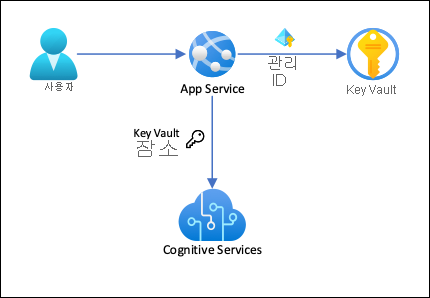
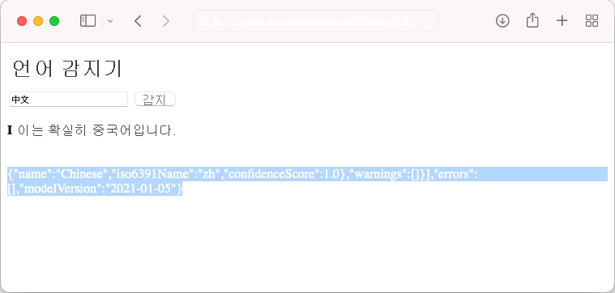

# <a name="tutorial-secure-cognitive-service-connection-from-app-service-using-key-vault"></a>자습서: Key Vault를 사용하여 App Service에서 보안 인식 서비스 연결

[Azure App Service](overview.md)는 [관리 ID](overview-managed-identity.md)를 사용하여 연결 비밀을 제거하여 프로덕션 환경에서 백 엔드 연결을 안전하게 관리하고 유지할 수 있는 연결 문자열 없이 백 엔드 서비스에 연결할 수 있습니다. 관리 ID를 지원하지 않고 여전히 연결 비밀이 필요한 백 엔드 서비스의 경우 Key Vault를 사용하여 연결 비밀을 관리할 수 있습니다. 이 자습서에서는 Cognitive Services를 예로 사용하여 실제로 수행하는 방법을 보여줍니다. 완료되면 App Service 내부에 연결 비밀을 저장하지 않고 Cognitive Services에 프로그래밍 방식으로 호출하는 앱이 있습니다.

> [!TIP]
> Azure Cognitive Services는 [관리 ID를 통한 인증을 지원](../cognitive-services/authentication.md#authorize-access-to-managed-identities)하지만 이 자습서에서는 [구독 키 인증](../cognitive-services/authentication.md#authenticate-with-a-single-service-subscription-key)을 사용하여 App Services에서 관리 ID를 지원하지 않는 Azure 서비스에 연결하는 방법을 보여줍니다.



이 아키텍처를 사용하는 경우: 

- 관리 ID로 Key Vault에 대한 연결을 보호합니다
- App Service는 [Key Vault 참조](app-service-key-vault-references.md)를 앱 설정으로 사용하여 비밀에 액세스합니다.
- 키 자격 증명 모음에 대한 액세스는 앱으로 제한됩니다. 관리자와 같은 앱 contributor는 App Service 리소스를 완전히 컨트롤할 수 있으며 동시에 Key Vault 비밀에 액세스할 수 없습니다.
- 애플리케이션 코드가 앱 설정을 사용하여 연결 비밀에 이미 액세스하는 경우에는 변경이 필요하지 않습니다.

다음을 알아봅니다.

> [!div class="checklist"]
> * 관리 ID 사용
> * 관리 ID를 사용하여 Key Vault에 연결
> * Key Vault 참조 사용
> * Cognitive Services 액세스

## <a name="prerequisites"></a>사전 요구 사항

Azure CLI에 대한 환경을 준비합니다.

[!INCLUDE [azure-cli-prepare-your-environment-no-header.md](../../includes/azure-cli-prepare-your-environment-no-header.md)]

## <a name="create-app-with-connectivity-to-cognitive-services"></a>Cognitive Services에 대한 연결을 사용하여 앱 만들기

1. 모든 리소스를 포함할 리소스 그룹을 만듭니다.

    ```azurecli-interactive
    # Save resource group name as variable for convenience
    groupName=myKVResourceGroup
    region=westeurope

    az group create --name $groupName --location $region
    ```

1. Cognitive Services 리소스를 만드세요. *\<cs-resource-name>* 을 선택한 고유한 이름으로 바꿉니다.

    ```azurecli-interactive
    # Save resource name as variable for convenience. 
    csResourceName=<cs-resource-name>

    az cognitiveservices account create --resource-group $groupName --name $csResourceName --location $region --kind TextAnalytics --sku F0 --custom-domain $csResourceName
    ```

    > [!NOTE]
    > `--sku F0` 무료 계층 Cognitive Services 리소스를 만듭니다. 각 구독은 하나의 무료 계층 `TextAnalytics` 리소스의 할당량으로 제한됩니다. 할당량을 이미 넘어선 경우 대신 `--sku S`를 사용합니다.

1. 샘플 리포지토리를 로컬로 복제하고 App Service에 응용 프로그램 예제를 배포합니다. *\<app-name>* 을 고유한 이름으로 바꿉니다.

    ### <a name="net-5"></a>[.NET 5](#tab/dotnet)

    ```azurecli-interactive
    # Save app name as variable for convenience
    appName=<app-name>

    # Clone sample application
    git clone https://github.com/Azure-Samples/app-service-language-detector.git
    cd app-service-language-detector/dotnet
    
    az webapp up --sku F1 --resource-group $groupName --name $appName --plan $appName --location $region
    ```

    ### <a name="php"></a>[PHP](#tab/php)

    ```azurecli-interactive
    # Clone and prepare sample application
    git clone https://github.com/Azure-Samples/app-service-language-detector.git
    cd app-service-language-detector/php
    zip default.zip index.php
    
    # Save app name as variable for convenience
    appName=<app-name>

    az appservice plan create --resource-group $groupName --name $appName --sku FREE --location $region
    az webapp create --resource-group $groupName --plan $appName --name $appName
    az webapp deployment source config-zip --resource-group $groupName --name $appName --src ./default.zip
    ```

    -----

1. Cognitive Services 비밀을 앱 설정 `CS_ACCOUNT_NAME` 및 `CS_ACCOUNT_KEY`로 구성합니다.

    ```azurecli-interactive
    # Get subscription key for Cognitive Services resource
    csKey1=$(az cognitiveservices account keys list --resource-group $groupName --name $csResourceName --query key1 --output tsv)

    az webapp config appsettings set --resource-group $groupName --name $appName --settings CS_ACCOUNT_NAME="$csResourceName" CS_ACCOUNT_KEY="$csKey1"
    ````

1. 브라우저에서 앱 배포를 `<app-name>.azurewebsites.net`로 이동하여 다양한 언어의 문자열로 언어 감지기를 사용해 보세요.

    

    애플리케이션 코드를 살펴보면 검색 결과에 대한 디버그 출력에서 배경과 동일한 글꼴 색을 확인할 수 있습니다. 결과 바로 아래에 있는 공백을 강조 표시하여 이를 확인할 수 있습니다.

## <a name="secure-back-end-connectivity"></a>안전한 백 엔드 연결

현재 App Service 앱에 연결 비밀이 앱 설정으로 저장됩니다. 이 접근 방식은 애플리케이션 코드베이스에서 이미 연결 비밀을 보호하고 있습니다. 그러나 앱을 관리할 수 있는 모든 contributor는 앱 설정도 볼 수 있습니다. 이 단계에서는 연결 비밀을 키 자격 증명 모음으로 이동하고, 사용자만 관리할 수 있도록 액세스를 잠그고, App Service 앱에서만 관리 ID를 사용하여 읽을 수 있도록 합니다.

1. 키 자격 증명 모음을 만듭니다. *\<vault-name>* 을 고유한 이름으로 바꿉니다.

    ```azurecli-interactive
    # Save app name as variable for convenience
    vaultName=<vault-name>

    az keyvault create --resource-group $groupName --name $vaultName --location $region --sku standard --enable-rbac-authorization
    ```

    `--enable-rbac-authorization` 매개 변수 [ 집합은 Azure 역할 기반 액세스 제어(RBAC)를 권한 모델로 설정합니다](../key-vault/general/rbac-guide.md#using-azure-rbac-secret-key-and-certificate-permissions-with-key-vault). 이 설정은 기본적으로 모든 액세스 정책 사용 권한을 무효화 합니다.

1. 자격 증명 모음에 대한 *Key Vault Secrets Officer* RBAC 역할을 사용자에게 제공합니다.
    
    ```azurecli-interactive
    vaultResourceId=$(az keyvault show --name $vaultName --query id --output tsv)
    myId=$(az ad signed-in-user show --query objectId --output tsv)
    az role assignment create --role "Key Vault Secrets Officer" --assignee-object-id $myId --assignee-principal-type User --scope $vaultResourceId
    ```

1. 앱에 대해 시스템이 할당한 관리 ID를 사용하도록 설정하 고 자격 증명 모음에 대한 *Key Vault Secrets User* RBAC 역할을 제공합니다.

    ```azurecli-interactive
    az webapp identity assign --resource-group $groupName --name $appName --scope $vaultResourceId --role  "Key Vault Secrets User"
    ```

1. 자격 증명 모음에 비밀로 Cognitive Services 리소스 이름 및 구독 키를 추가하고 다음 단계에서 해당 ID를 환경 변수로 저장합니다.

    ```azurecli-interactive
    csResourceKVUri=$(az keyvault secret set --vault-name $vaultName --name csresource --value $csResourceName --query id --output tsv)
    csKeyKVUri=$(az keyvault secret set --vault-name $vaultName --name cskey --value $csKey1 --query id --output tsv)
    ```

1. 이전에는 앱에서 비밀을 앱 설정 `CS_ACCOUNT_NAME` 및 `CS_ACCOUNT_KEY`로 설정합니다. 이제 대신 [키 자격 증명 모음 참조](app-service-key-vault-references.md)로 설정합니다.

    ```azurecli-interactive
    az webapp config appsettings set --resource-group $groupName --name $appName --settings CS_ACCOUNT_NAME="@Microsoft.KeyVault(SecretUri=$csResourceKVUri)" CS_ACCOUNT_KEY="@Microsoft.KeyVault(SecretUri=$csKeyKVUri)"
    ```

1. 브라우저에서 `<app-name>.azurewebsites.net`으로 다시 이동합니다. 검색 결과가 다시 수신되면 키 자격 증명 모음 참조를 사용하여 Cognitive Services 엔드포인트에 연결하게 됩니다.

축하합니다. 앱은 이제 애플리케이션 코드를 변경하지 않고 키 자격 증명 모음에 보관된 비밀을 사용하여 Cognitive Services에 연결하고 있습니다.

## <a name="clean-up-resources"></a>리소스 정리

이전 단계에서 Azure 리소스를 리소스 그룹에 만들었습니다. 나중에 이러한 리소스가 필요하지 않을 것 같으면 Cloud Shell에서 다음 명령을 실행하여 리소스 그룹을 삭제합니다.

```azurecli-interactive
az group delete --name $groupName
```

이 명령을 실행하는 데 1분 정도 걸릴 수 있습니다.

## <a name="next-steps"></a>다음 단계

- [자습서: Virtual Network 통합을 통해 백 엔드 통신 격리](tutorial-networking-isolate-vnet.md)
- [Azure 가상 네트워크에 앱 통합](overview-vnet-integration.md)
- [App Service 네트워킹 기능](networking-features.md)