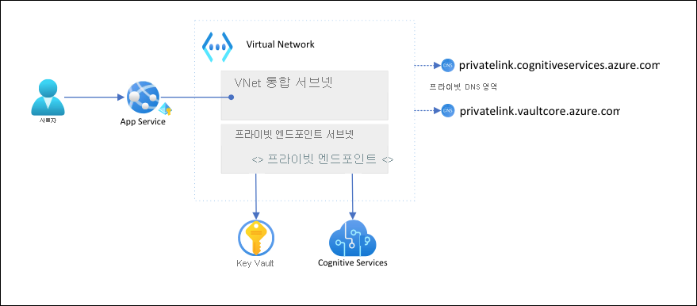

# <a name="tutorial-isolate-back-end-communication-in-azure-app-service-with-virtual-network-integration"></a>자습서: Virtual Network 통합으로 Azure App Service의 백 엔드 통신 격리

이 문서에서는 안전한 네트워크 격리 통신을 사용하여 백 엔드 서비스에 대한 App Service 앱을 구성합니다. 사용되는 예제 시나리오는 [자습서: Key Vault를 사용하 App Service에서 보안 인식 서비스 연결](tutorial-connect-msi-key-vault.md)에 있습니다. 완료되면 [Azure VNet](../virtual-network/virtual-networks-overview.md)(virtual network)을 통해 Key Vault와 Cognitive Services에 모두 액세스하는 App Service 앱이 있으며, 다른 트래픽은 이러한 백 엔드 리소스에 액세스할 수 없습니다. [Vnet 통합](web-sites-integrate-with-vnet.md) 및 [프라이빗 엔드포인트](../private-link/private-endpoint-overview.md)를 사용하여 VNet 내에서 모든 트래픽이 격리됩니다.

멀티 테넌트 서비스로서, App Service 앱에서 다른 Azure 서비스로의 아웃바운드 네트워크 트래픽은 다른 앱 또는 다른 구독과 동일한 환경을 공유합니다. 트래픽 자체는 암호화할 수 있지만, 특정 시나리오에는 다른 네트워크 트래픽과의 백 엔드 통신을 격리하여 추가 수준의 보안이 필요할 수 있습니다. 이러한 시나리오는 일반적으로 높은 수준의 전문 지식을 갖춘 대기업에서 액세스할 수 있지만, App Service가 VNet 통합을 통해 연결할 수 있도록 합니다.  



이 아키텍처를 사용하는 경우: 

- 백 엔드 서비스에 대한 공용 트래픽이 차단됩니다.
- App Service의 아웃바운드 트래픽은 VNet으로 라우팅되고 백 엔드 서비스에 연결할 수 있습니다.
- App Service는 프라이빗 DNS 영역을 통해 백 엔드 서비스에 대한 DNS 해결을 수행할 수 있습니다.

다음을 알아봅니다.

> [!div class="checklist"]
> * App Service VNet 통합을 위한 VNet 및 서브넷 만들기
> * 프라이빗 DNS 영역 만들기
> * 프라이빗 엔드포인트 만들기
> * App Service에서 VNet 통합 구성

## <a name="prerequisites"></a>사전 요구 사항

이 자습서에서는 [Key Vault를 사용하여 App Service에서 보안 인식 서비스 연결 자습서](tutorial-connect-msi-key-vault.md)를 따르고 언어 탐지기 앱을 만들었다고 가정합니다. 

이 자습서에서는 이전 자습서의 다음 환경 변수를 계속 사용합니다. 올바르게 설정했는지 확인합니다.

```azurecli-interactive
    groupName=myKVResourceGroup
    region=westeurope
    csResourceName=<cs-resource-name>
    appName=<app-name>
    vaultName=<vault-name>
```

## <a name="create-vnet-and-subnets"></a>VNet 및 서브넷 만들기

1. VNet 만들기 *\<virtual-network-name>* 을 고유한 이름으로 바꿉니다.

    ```azurecli-interactive
    # Save vnet name as variable for convenience
    vnetName=<virtual-network-name>

    az network vnet create --resource-group $groupName --location $region --name $vnetName --address-prefixes 10.0.0.0/16
    ```

1. App Service VNet 통합에 대한 서브넷을 만듭니다.

    ```azurecli-interactive
    az network vnet subnet create --resource-group $groupName --vnet-name $vnetName --name vnet-integration-subnet --address-prefixes 10.0.0.0/24 --delegations Microsoft.Web/serverfarms
    ```

    App Service의 경우 VNet 통합 서브넷은 `/26` 최소한의 CIDR 블록을 포함하는 것이 좋습니다 ([VNet 통합 서브넷 요구 사항](overview-vnet-integration.md#subnet-requirements) 참조). `/24`가 충분합니다. `--delegations Microsoft.Web/serverfarms`이 [App Service VNet 통합을 위해 서브넷을 위임](../virtual-network/subnet-delegation-overview.md)하도록 지정합니다.

1. 프라이빗 엔드포인트에 대한 다른 서브넷을 만듭니다.

    ```azurecli-interactive
    az network vnet subnet create --resource-group $groupName --vnet-name $vnetName --name private-endpoint-subnet --address-prefixes 10.0.1.0/24 --disable-private-endpoint-network-policies
    ```

    프라이빗 엔드포인트 서브넷의 경우 [프라이빗 엔드포인트 네트워크 정책을 사용하지 않도록 설정](../private-link/disable-private-endpoint-network-policy.md)해야 합니다.

## <a name="create-private-dns-zones"></a>프라이빗 DNS 영역 만들기

Key Vault 및 Cognitive Services 리소스가 [프라이빗 엔드포인트](../private-link/private-endpoint-overview.md) 뒤에 있기 때문에 이에 대한 [프라이빗 DNS 영역](../dns/private-dns-privatednszone.md)을 정의해야 합니다. 이러한 영역은 프라이빗 엔드포인트에 대한 DNS 레코드를 호스트하고 클라이언트에서 이름으로 백 엔드 서비스를 찾을 수 있도록 하는 데 사용됩니다. 

1. Cognitive Services 리소스용 및 키 자격 증명 모음용으로 두 개의 프라이빗 DNS 영역을 만듭니다.

    ```azurecli-interactive
    az network private-dns zone create --resource-group $groupName --name privatelink.cognitiveservices.azure.com
    az network private-dns zone create --resource-group $groupName --name privatelink.vaultcore.azure.net
    ```

    이러한 설정에 대한 자세한 내용은 [Azure 프라이빗 엔드포인트 DNS 구성](../private-link/private-endpoint-dns.md#azure-services-dns-zone-configuration)을 참조하세요

1. 프라이빗 DNS 영역을 VNet에 연결합니다.

    ```azurecli-interactive
    az network private-dns link vnet create --resource-group $groupName --name cognitiveservices-zonelink --zone-name privatelink.cognitiveservices.azure.com --virtual-network $vnetName --registration-enabled False
    az network private-dns link vnet create --resource-group $groupName --name vaultcore-zonelink --zone-name privatelink.vaultcore.azure.net --virtual-network $vnetName --registration-enabled False
    ```

## <a name="create-private-endpoints"></a>프라이빗 엔드포인트 만들기

1. VNet의 프라이빗 엔드포인트 서브넷에서 키 자격 증명 모음에 대한 프라이빗 엔드포인트를 만듭니다.

    ```azurecli-interactive
    # Get Cognitive Services resource ID
    csResourceId=$(az cognitiveservices account show --resource-group $groupName --name $csResourceName --query id --output tsv)

    az network private-endpoint create --resource-group $groupName --name securecstext-pe --location $region --connection-name securecstext-pc --private-connection-resource-id $csResourceId --group-id account --vnet-name $vnetName --subnet private-endpoint-subnet
    ```

1. Cognitive Services 프라이빗 엔드포인트에 대한 DNS 영역 그룹을 만듭니다. DNS 영역 그룹은 프라이빗 DNS 영역과 프라이빗 엔드포인트 간의 링크입니다. 이 링크를 사용하면 프라이빗 엔드포인트에 대한 업데이트가 있을 때 프라이빗 DNS 영역을 자동으로 업데이트할 수 있습니다.  

    ```azurecli-interactive
    az network private-endpoint dns-zone-group create --resource-group $groupName --endpoint-name securecstext-pe --name securecstext-zg --private-dns-zone privatelink.cognitiveservices.azure.com --zone-name privatelink.cognitiveservices.azure.com
    ```

1. Cognitive Services 리소스에 대한 공용 트래픽을 블록합니다.

    ```azurecli-interactive
    az rest --uri $csResourceId?api-version=2021-04-30 --method PATCH --body '{"properties":{"publicNetworkAccess":"Disabled"}}' --headers 'Content-Type=application/json'

    # Repeat following command until output is "Succeeded"
    az cognitiveservices account show --resource-group $groupName --name $csResourceName --query properties.provisioningState
    ```

    > [!NOTE]
    > 변경의 프로비전 상태가 `"Succeeded"`인지 확인합니다. 그런 다음 샘플 앱에서 변경된 동작을 관찰할 수 있습니다. 앱을 계속 로드할 수는 있지만, **검색** 단추를 클릭하면 `HTTP 500` 오류가 발생합니다. 앱이 공유 네트워크를 통해 Cognitive Services 리소스에 대 한 연결을 손실했습니다.

1. 다른 키 자격 증명 모음에 대해 위의 단계를 반복합니다.

    ```azurecli-interactive
    # Create private endpoint for key vault
    vaultResourceId=$(az keyvault show --name $vaultName --query id --output tsv)
    az network private-endpoint create --resource-group $groupName --name securekeyvault-pe --location $region --connection-name securekeyvault-pc --private-connection-resource-id $vaultResourceId --group-id vault --vnet-name $vnetName --subnet private-endpoint-subnet
    # Create DNS zone group for the endpoint
    az network private-endpoint dns-zone-group create --resource-group $groupName --endpoint-name securekeyvault-pe --name securekeyvault-zg --private-dns-zone privatelink.vaultcore.azure.net --zone-name privatelink.vaultcore.azure.net
    # Block public traffic to key vault
    az keyvault update --name $vaultName --default-action Deny
    ```

1. 앱 설정을 다시 설정하여 앱에서 [키 자격 증명 모음 참조](app-service-key-vault-references.md)의 즉각적인 다시 가져오기를 강제로 적용합니다(자세한 내용은 [회전](app-service-key-vault-references.md#rotation) 참조).

    ```azurecli-interactive
    az webapp config appsettings set --resource-group $groupName --name $appName --settings CS_ACCOUNT_NAME="@Microsoft.KeyVault(SecretUri=$csResourceKVUri)" CS_ACCOUNT_KEY="@Microsoft.KeyVault(SecretUri=$csKeyKVUri)"
    ```

    <!-- If above is not run then it takes a whole day for references to update? https://docs.microsoft.com/en-us/azure/app-service/app-service-key-vault-references#rotation -->

    > [!NOTE]
    > 다시, 샘플 앱에서 변경된 동작을 관찰할 수 있습니다. 더 이상 키 자격 증명 모음 참조에 액세스할 수 없기 때문에 앱을 더 이상 로드할 수 없습니다. 앱이 공유 네트워크를 통해 키 자격 증명 모음에 대한 연결을 손실했습니다.

두 프라이빗 엔드포인트는 만든 VNet 내의 클라이언트에만 액세스할 수 있습니다. 포털에서 공용 인터넷을 통해 액세스 하므로 Azure Portal의 **비밀** 페이지를 통해 키 자격 증명 모음에서 비밀에 액세스할 수도 없습니다([잠긴 다운 리소스 관리](#manage-the-locked-down-resources) 참조).

## <a name="configure-vnet-integration-in-your-app"></a>앱에서 VNet 통합 구성

1. 앱을 **표준** 계층으로 강화. VNet 통합은 **표준** 계층 이상이 필요합니다([Azure Virtual Network에 앱 통합](overview-vnet-integration.md) 참조).

    ```azurecli-interactive
    az appservice plan update --name $appName --resource-group $groupName --sku S1
    ```

1. 시나리오와 관련이 없지만 중요하며, 인바운드 요청에 대해 HTTPS를 적용해야 합니다.

    ```azurecli-interactive
    az webapp update --resource-group $groupName --name $appName --https-only
    ```

1. 앱에서 VNet 통합을 사용합니다.

    ```azurecli-interactive
    az webapp vnet-integration add --resource-group $groupName --name $appName --vnet $vnetName --subnet vnet-integration-subnet
    ```
    
    VNet 통합은 아웃바운드 트래픽이 VNet으로 직접 전달 되도록 허용합니다. 기본값으로 [RFC-1918](https://tools.ietf.org/html/rfc1918#section-3)에 정의된 로컬 IP 트래픽만 VNet으로 라우팅되며 이는 프라이빗 엔드포인트에 필요 합니다. 모든 트래픽을 VNet으로 라우팅하려면 [가상 네트워크 통합 라우팅 관리](configure-vnet-integration-routing.md)를 참조하세요. [Azure VNet NAT](../virtual-network/nat-gateway/nat-overview.md) 또는 [Azure Firewall](../firewall/overview.md) 등 VNet을 통해 인터넷 트래픽을 라우팅하는 경우에도 모든 트래픽 라우팅을 사용할 수 있습니다.

1. 브라우저에서 `<app-name>.azurewebsites.net`로 다시 이동하여 통합이 적용될 때까지 기다립니다. HTTP 500 오류가 발생하는 경우 몇 분 정도 기다린 후 다시 시도하세요. 페이지를 로드하고 검색 결과를 가져올 수 있는 경우 키 자격 증명 모음 참조를 사용하여 Cognitive Services 엔드포인트에 연결하게 됩니다.

    >[!NOTE]
    > 오랜 시간 후에 HTTP 500 오류가 계속 발생하면 다음과 같이 [키 자격 증명 모음 참조](app-service-key-vault-references.md)를 다시 가져오는 것이 도움이 될 수 있습니다.
    >
    > ```azurecli-interactive
    > az webapp config appsettings set --resource-group $groupName --name $appName --settings CS_ACCOUNT_NAME="@Microsoft.KeyVault(SecretUri=$csResourceKVUri)" CS_ACCOUNT_KEY="@Microsoft.KeyVault(SecretUri=$csKeyKVUri)"
    > ```


## <a name="manage-the-locked-down-resources"></a>잠긴 다운 리소스 관리

시나리오에 따라 Azure Portal, Azure CLI 또는 Azure PowerShell(예: Key Vault)를 통해 프라이빗 엔드포인트 보호 리소스를 관리하지 못할 수 있습니다. 이러한 도구는 모두 공용 인터넷을 통해 리소스에 액세스 하는 REST API 호출을 수행하며, 구성에 의해 블록됩니다. 다음은 잠긴 다운 리소스에 액세스하기 위한 몇 가지 옵션입니다.

- Key Vault의 경우 프라이빗 엔드포인트 보호 비밀을 보거나 업데이트하려면 로컬 컴퓨터의 공용 IP를 추가합니다.
- 온프레미스 네트워크가 [VPN 게이트웨이](../vpn-gateway/vpn-gateway-about-vpngateways.md) 또는 [ExpressRoute](../expressroute/expressroute-introduction.md)를 통해 Azure VNet으로 확장되는 경우 온프레미스 네트워크에서 직접 프라이빗 엔드포인트 보호 리소스를 관리할 수 있습니다. 
- VNet의 [점프 서버](https://wikipedia.org/wiki/Jump_server)에서 프라이빗 엔드포인트 보호 리소스를 관리합니다.
- [VNet에 Cloud Shell을 배포합니다](../cloud-shell/private-vnet.md).

## <a name="clean-up-resources"></a>리소스 정리

이전 단계에서 Azure 리소스를 리소스 그룹에 만들었습니다. 나중에 이러한 리소스가 필요하지 않을 것 같으면 Cloud Shell에서 다음 명령을 실행하여 리소스 그룹을 삭제합니다.

```azurecli-interactive
az group delete --name $groupName
```

이 명령을 실행하는 데 1분 정도 걸릴 수 있습니다.

## <a name="next-steps"></a>다음 단계

- [Azure 가상 네트워크에 앱 통합](overview-vnet-integration.md)
- [App Service 네트워킹 기능](networking-features.md)