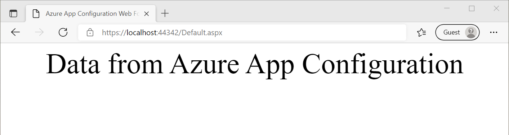
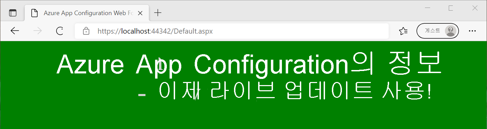

# <a name="tutorial-use-dynamic-configuration-in-an-aspnet-web-application-net-framework"></a>자습서: ASP.NET 웹 애플리케이션에서 동적 구성 사용(.NET Framework)

App Configuration의 데이터는 .NET Framework 애플리케이션에서 앱 설정으로 로드할 수 있습니다. 자세한 내용은 [빠른 시작](./quickstart-dotnet-app.md)을 참조하세요. 그러나 .NET Framework에서 설계한 대로 앱 설정은 애플리케이션을 다시 시작할 때만 새로 고칠 수 있습니다. App Configuration .NET 공급자는 .NET Standard 라이브러리입니다. 애플리케이션을 다시 시작하지 않고 동적으로 구성을 캐싱 및 새로 고치도록 지원합니다. 이 자습서에서는 ASP.NET Web Forms 애플리케이션에서 동적 구성 업데이트를 구현하는 방법을 보여 줍니다. 동일한 기술이 .NET Framework MVC 애플리케이션에 적용됩니다.

이 자습서에서는 다음 작업 방법을 알아봅니다.

> [!div class="checklist"]
> * App Configuration 저장소의 변경에 따라 해당 구성을 업데이트하도록 ASP.NET 웹 애플리케이션을 설정합니다.
> * 요청의 최신 구성을 애플리케이션에 삽입합니다.

## <a name="prerequisites"></a>사전 요구 사항

- Azure 구독 - [체험 구독 만들기](https://azure.microsoft.com/free/)
- [Visual Studio](https://visualstudio.microsoft.com/vs)
- [.NET Framework 4.7.2 이상](https://dotnet.microsoft.com/download/dotnet-framework)

## <a name="create-an-app-configuration-store"></a>App Configuration 저장소 만들기

[!INCLUDE[Azure App Configuration resource creation steps](../../includes/azure-app-configuration-create.md)]

7. **작업** > **구성 탐색기** > **만들기** > **키-값** 을 차례로 선택하여 다음 키-값을 추가합니다.

    | 키                                | 값                               |
    |------------------------------------|-------------------------------------|
    | *TestApp:Settings:BackgroundColor* | *흰색*                             |
    | *TestApp:Settings:FontColor*       | *흑인*                             |
    | *TestApp:Settings:FontSize*        | *40*                                |
    | *TestApp:Settings:Message*         | *Azure App Configuration의 정보* |
    | *TestApp:Settings:Sentinel*        | *v1*                                |

    **레이블** 및 **콘텐츠 형식** 을 비워 둡니다.

## <a name="create-an-aspnet-web-application"></a>ASP.NET 웹 애플리케이션 만들기

1. Visual Studio를 시작하고 **새 프로젝트 만들기** 를 선택합니다.

1. 프로젝트 템플릿 목록에서 C#이 있는 **ASP.NET 웹 애플리케이션(.NET Framework)** 을 선택하고 **다음** 을 누릅니다.

1. **새 프로젝트 구성** 에서 프로젝트 이름을 입력합니다. **프레임워크** 아래에서 **.NET Framework 4.7.2** 이상을 선택합니다. **만들기** 를 누릅니다.

1. **새 ASP.NET 웹 애플리케이션 만들기** 에서 **Web Forms** 를 선택합니다. **만들기** 를 누릅니다.

## <a name="reload-data-from-app-configuration"></a>App Configuration에서 데이터 다시 로드

1. 마우스 오른쪽 단추로 프로젝트를 클릭하고, **NuGet 패키지 관리** 를 선택합니다. **찾아보기** 탭에서 다음 NuGet 패키지의 최신 버전을 검색한 후 프로젝트에 추가합니다.

   *Microsoft.Extensions.Configuration.AzureAppConfiguration*

1. *Global.asax.cs* 파일을 열고 다음 네임스페이스를 추가합니다.
    ```csharp
    using Microsoft.Extensions.Configuration;
    using Microsoft.Extensions.Configuration.AzureAppConfiguration;
    ```

1. `Global` 클래스에 다음 정적 멤버 변수를 추가합니다.
    ```csharp
    public static IConfiguration Configuration;
    private static IConfigurationRefresher _configurationRefresher;
    ```

1. `Global` 클래스에 `Application_Start` 메서드를 추가합니다. 메서드가 이미 있는 경우 다음 코드를 추가합니다.
    ```csharp
    protected void Application_Start(object sender, EventArgs e)
    {
        ConfigurationBuilder builder = new ConfigurationBuilder();
        builder.AddAzureAppConfiguration(options =>
        {
            options.Connect(Environment.GetEnvironmentVariable("ConnectionString"))
                    // Load all keys that start with `TestApp:`.
                    .Select("TestApp:*")
                    // Configure to reload configuration if the registered key 'TestApp:Settings:Sentinel' is modified.
                    .ConfigureRefresh(refresh => 
                    {
                        refresh.Register("TestApp:Settings:Sentinel", refreshAll:true);
                               .SetCacheExpiration(new TimeSpan(0, 5, 0));
                    });
            _configurationRefresher = options.GetRefresher();
        });

        Configuration = builder.Build();
    }
    ```
    `Application_Start` 메서드는 웹 애플리케이션에 대한 첫 번째 요청 시 호출됩니다. 애플리케이션의 수명 주기 동안 한 번만 호출됩니다. 따라서 `IConfiguration` 개체를 초기화하고 App Configuration에서 데이터를 로드하는 것이 좋습니다.

    `ConfigureRefresh` 메서드에서 App Configuration 저장소 내의 키는 변경 모니터링을 위해 등록됩니다. `Register` 메서드에 대한 `refreshAll` 매개 변수는 등록된 키가 변경되면 모든 구성 값을 새로 고쳐야 함을 나타냅니다. 이 예제에서 *TestApp:Settings:Sentinel* 키는 다른 모든 키의 변경을 완료한 후 업데이트하는 *sentinel* 키입니다. 변경이 감지되면 애플리케이션이 모든 구성 값을 새로 고칩니다. 이 방법은 모든 키의 변경 내용을 모니터링하는 것에 비해 애플리케이션의 구성 일관성을 보장하는 데 유용합니다.
    
    `SetCacheExpiration` 메서드는 구성 변경 여부를 확인하기 위해 App Configuration에 새 요청을 하기 전에 경과해야 하는 최소 시간을 지정합니다. 이 예제에서는 기본 만료 시간인 30초 대신 5분이라는 시간을 지정하여 재정의합니다. 이렇게 하면 App Configuration 스토리지에 보내는 잠재적인 요청 수가 줄어듭니다.


1. `Global` 클래스에 `Application_BeginRequest` 메서드를 추가합니다. 메서드가 이미 있는 경우 다음 코드를 추가합니다.
    ```csharp
    protected void Application_BeginRequest(object sender, EventArgs e)
    {
        _ = _configurationRefresher.TryRefreshAsync();
    }
    ```
    `ConfigureRefresh` 메서드만 호출하면 구성이 자동으로 새로 고쳐지지 않습니다. 모든 요청의 시작 부분에서 `TryRefreshAsync` 메서드를 호출하여 새로 고침을 알릴 수 있습니다. 이 디자인은 애플리케이션이 요청을 적극적으로 수신할 때만 App Configuration 요청을 보내도록 합니다. 
    
    `TryRefreshAsync`를 호출하는 것은 구성된 캐시 만료 시간이 경과하기 전에 작동하지 않으므로 성능에 미치는 영향은 최소화됩니다. App Configuration에 대해 요청이 수행되면 작업을 기다리지 않기 때문에 현재 요청의 실행을 차단하지 않으면서 구성이 비동기적으로 새로 고쳐집니다. 현재 요청은 업데이트된 구성 값을 얻지 못할 수도 있지만 후속 요청은 이러한 값을 얻을 수 있습니다.

    어떤 이유로 `TryRefreshAsync` 호출이 실패하더라도 애플리케이션은 캐시된 구성을 계속 사용합니다. 구성된 캐시 만료 시간이 다시 경과하고 `TryRefreshAsync` 호출이 애플리케이션에 대한 새 요청에 의해 트리거되는 경우 다른 시도가 수행됩니다.

## <a name="use-the-latest-configuration-data"></a>최신 구성 데이터 사용

1. *Default.aspx* 를 열고 해당 콘텐츠를 다음 태그로 바꿉니다. *Inherits* 특성이 애플리케이션의 네임스페이스 및 클래스 이름과 일치하는지 확인합니다.
    ```xml
    <%@ Page Language="C#" AutoEventWireup="true" CodeBehind="Default.aspx.cs" Inherits="WebFormApp.Default" %>

    <!DOCTYPE html>

    <html xmlns="http://www.w3.org/1999/xhtml">
    <head runat="server">
        <title>Azure App Configuration Web Forms Demo</title>
    </head>
    <body id="body" runat="server">
        <form id="form1" runat="server">
            <div style="text-align: center">
                <asp:Label ID="message" runat="server" />
            </div>
        </form>
    </body>
    </html>
    ```

1. *Default.aspx.cs* 를 열고 다음 코드로 업데이트합니다.
    ```cs
    using System;
    using System.Web.UI.WebControls;

    namespace WebFormApp
    {
        public partial class Default : System.Web.UI.Page
        {
            protected void Page_Load(object sender, EventArgs e)
            {
                // Read configuration from the IConfiguration object loaded from Azure App Configuration
                string messageText = Global.Configuration["TestApp:Settings:Message"] ?? "Please add the key \"TestApp:Settings:Message\" in your Azure App Configuration store.";
                string messageFontSize = Global.Configuration["TestApp:Settings:FontSize"] ?? "20";
                string messageFontColor = Global.Configuration["TestApp:Settings:FontColor"] ?? "Black";
                string backgroundColor = Global.Configuration["TestApp:Settings:BackgroundColor"] ?? "White";

                message.Text = messageText;
                message.Font.Size = FontUnit.Point(int.Parse(messageFontSize));
                message.ForeColor = System.Drawing.Color.FromName(messageFontColor);
                body.Attributes["bgcolor"] = backgroundColor;
            }
        }
    }
    ```

## <a name="build-and-run-the-application"></a>애플리케이션 빌드 및 실행

1. **ConnectionString** 이라는 환경 변수를 App Configuration 저장소 생성 중에 획득한 읽기 전용 키 연결 문자열로 설정합니다.

    Windows 명령 프롬프트를 사용하는 경우 다음 명령을 실행합니다.
    ```console
    setx ConnectionString "connection-string-of-your-app-configuration-store"
    ```

    Windows PowerShell을 사용하는 경우 다음 명령을 실행합니다.
    ```powershell
    $Env:ConnectionString = "connection-string-of-your-app-configuration-store"
    ```

1. Visual Studio를 다시 시작하여 변경 내용을 적용합니다. 

1. Ctrl+F5를 눌러 웹 애플리케이션을 빌드 및 실행합니다.

    

1. Azure Portal에서 App Configuration 저장소의 **구성 탐색기** 로 이동하여 다음 키의 값을 업데이트합니다. 마지막으로 Sentinel 키 *TestApp:Settings:Sentinel* 을 업데이트해야 합니다.

    | 키                                | 값                                                        |
    |------------------------------------|--------------------------------------------------------------|
    | *TestApp:Settings:BackgroundColor* | *Green*                                                      |
    | *TestApp:Settings:FontColor*       | *LightGray*                                                  |
    | *TestApp:Settings:Message*         | *이제 라이브 업데이트를 사용하여 Azure App Configuration 데이터 업데이트!* |
    | *TestApp:Settings:Sentinel*        | *v2*                                                         |

1. 새 구성 설정을 확인하려면 브라우저 페이지를 새로 고칩니다. 변경 내용을 반영하려면 두 번 이상 새로 고치거나 캐시 만료 시간을 5분 미만으로 변경해야 할 수 있습니다. 

    

> [!NOTE]
> 이 자습서에 사용된 예제 코드는 [Azure App Configuration GitHub 리포지토리](https://github.com/Azure/AppConfiguration/tree/main/examples/DotNetFramework/WebFormApp)에서 다운로드할 수 있습니다.

## <a name="clean-up-resources"></a>리소스 정리

[!INCLUDE [azure-app-configuration-cleanup](../../includes/azure-app-configuration-cleanup.md)]

## <a name="next-steps"></a>다음 단계

이 자습서에서는 ASP.NET Web Forms 애플리케이션을 사용하도록 설정하여 App Configuration에서 구성 설정을 동적으로 새로 고칩니다. .NET Framework 앱에서 동적 구성을 사용하도록 설정하는 방법을 알아보려면 다음 자습서를 계속 진행하세요.

> [!div class="nextstepaction"]
> [.NET Framework 앱에서 동적 구성을 사용하도록 설정](./enable-dynamic-configuration-dotnet.md)

Azure 관리 ID를 사용하여 App Configuration에 대한 액세스를 간소화하는 방법을 알아보려면 다음 자습서로 계속 진행하세요.

> [!div class="nextstepaction"]
> [관리 ID 통합](./howto-integrate-azure-managed-service-identity.md)
