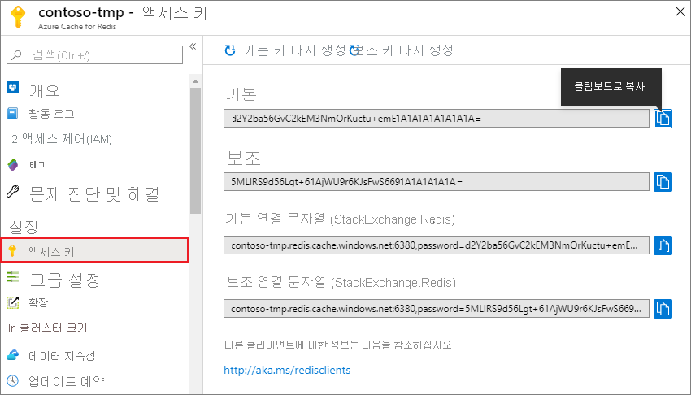
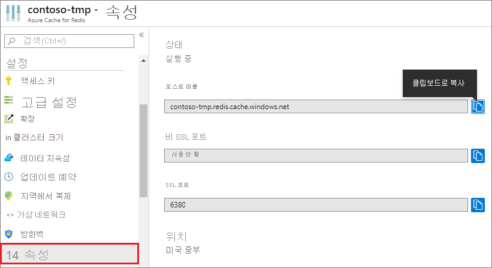

### Azure Portal에서 호스트 이름, 포트 및 액세스 키를 검색합니다.

Azure Cache for Redis 인스턴스에 연결하려면 캐시 클라이언트에 캐시의 호스트 이름, 포트 및 키가 필요합니다. 일부 클라이언트는 약간 다른 이름으로 이러한 항목을 참조할 수 있습니다. [Azure Portal](https://portal.azure.com)에서 호스트 이름, 포트 및 키를 가져올 수 있습니다.

- 액세스 키를 가져오려면 캐시의 왼쪽 탐색 영역에서 **액세스 키** 를 선택합니다. 
  
  

- 호스트 이름 및 포트를 가져오려면 캐시의 왼쪽 탐색 영역에서 **속성** 을 선택합니다. 호스트 이름은 *\<DNS name>.redis.cache.windows.net* 형식입니다.

  

