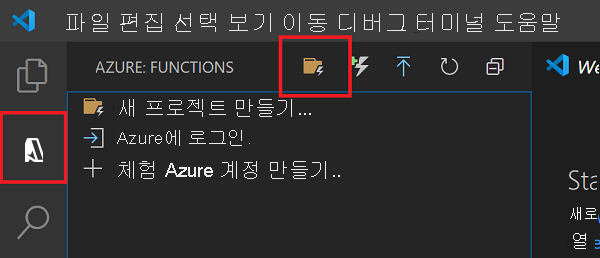

# 빠른 시작: Visual Studio Code를 사용하여 Azure에서 C# 함수 만들기

[!INCLUDE [functions-runtime-version-dotnet](../../includes/functions-runtime-version-dotnet.md)]

이 문서에서는 Visual Studio Code를 사용하여 HTTP 요청에 응답하는 C# 함수를 만듭니다. 코드를 로컬로 테스트한 후 서버리스 Azure Functions 환경에 배포합니다.

::: zone pivot="programming-runtime-functions-v3"
[!INCLUDE [functions-dotnet-execution-model](../../includes/functions-dotnet-execution-model.md)]    
::: zone-end
::: zone pivot="programming-runtime-functions-v4"
> [!NOTE]
> 현재 Visual Studio Code에서 [In Process 실행 모델](functions-dotnet-class-library.md)을 사용하여 .NET 6에서만 실행되는 C# 함수를 만들 수 있습니다.
::: zone-end

이 빠른 시작을 완료하면 Azure 계정에서 USD 센트 이하의 작은 비용이 발생합니다.

이 문서의 [CLI 기반 버전](create-first-function-cli-csharp.md)도 있습니다.

## 환경 구성

시작하기 전에 다음 요구 사항을 갖추었는지 확인합니다.

::: zone pivot="programming-runtime-functions-v3"
# [In-Process](#tab/in-process)

+ [.NET Core 3.1 SDK](https://dotnet.microsoft.com/download)

+ [Azure Functions Core Tools](functions-run-local.md#install-the-azure-functions-core-tools) 버전 3.x

+ [지원되는 플랫폼](https://code.visualstudio.com/docs/supporting/requirements#_platforms) 중 하나인 [Visual Studio Code](https://code.visualstudio.com/).

+ Visual Studio Code용 [C# 확장](https://marketplace.visualstudio.com/items?itemName=ms-dotnettools.csharp)  

+ Visual Studio Code용 [Azure Functions 확장](https://marketplace.visualstudio.com/items?itemName=ms-azuretools.vscode-azurefunctions)

# [격리된 프로세스](#tab/isolated-process)

+ [.NET 5.0 SDK](https://dotnet.microsoft.com/download)

+ [.NET Core 3.1 SDK](https://dotnet.microsoft.com/download). 빌드 프로세스에 필요합니다.

+ [Azure Functions Core Tools](functions-run-local.md#install-the-azure-functions-core-tools) 버전 3.x

+ [지원되는 플랫폼](https://code.visualstudio.com/docs/supporting/requirements#_platforms) 중 하나인 [Visual Studio Code](https://code.visualstudio.com/).

+ Visual Studio Code용 [C# 확장](https://marketplace.visualstudio.com/items?itemName=ms-dotnettools.csharp)  

+ Visual Studio Code용 [Azure Functions 확장](https://marketplace.visualstudio.com/items?itemName=ms-azuretools.vscode-azurefunctions)

---
::: zone-end
::: zone pivot="programming-runtime-functions-v4"
+ [.NET 6.0 SDK](https://dotnet.microsoft.com/download/dotnet/6.0)

+ [Azure Functions Core Tools](functions-run-local.md#install-the-azure-functions-core-tools) 버전 4.x

+ [지원되는 플랫폼](https://code.visualstudio.com/docs/supporting/requirements#_platforms) 중 하나인 [Visual Studio Code](https://code.visualstudio.com/).

+ Visual Studio Code용 [C# 확장](https://marketplace.visualstudio.com/items?itemName=ms-dotnettools.csharp)  

+ Visual Studio Code용 [Azure Functions 확장](https://marketplace.visualstudio.com/items?itemName=ms-azuretools.vscode-azurefunctions)
::: zone-end

활성 구독이 있는 Azure 계정도 필요합니다. [체험 계정을 만듭니다](https://azure.microsoft.com/free/?ref=microsoft.com&utm_source=microsoft.com&utm_medium=docs&utm_campaign=visualstudio).

## 로컬 프로젝트 만들기

이 섹션에서는 Visual Studio Code를 사용하여 C#에서 로컬 Azure Functions 프로젝트를 만듭니다. 이 문서의 뒷부분에서 함수 코드를 Azure에 게시합니다.

1. 작업 막대에서 Azure 아이콘을 선택한 다음, **Azure: Functions** 영역에서 **새 프로젝트 만들기...** 아이콘을 선택합니다.

    

1. 프로젝트 작업 영역에 대한 디렉터리 위치를 선택하고 **선택** 을 선택합니다.

    > [!NOTE]
    > 다음 단계는 작업 영역 외부에서 완료하도록 설계되었습니다. 이 경우 작업 영역에 포함된 프로젝트 폴더를 선택하지 마십시오.

1. 프롬프트에서 다음 정보를 제공합니다.

    ::: zone pivot="programming-runtime-functions-v3"
    # [In-Process](#tab/in-process) 

    |prompt|선택 영역|
    |--|--|
    |**함수 프로젝트에 대한 언어 선택**|`C#`을 선택합니다.|
    | **.NET 런타임 선택** | `.NET Core 3.1 LTS`을 선택합니다.|
    |**프로젝트의 첫 번째 함수에 사용할 템플릿 선택**|`HTTP trigger`을 선택합니다.|
    |**함수 이름 제공**|`HttpExample`.|
    |**네임스페이스 제공** | `My.Functions`. |
    |**권한 부여 수준**|누구나 함수 엔드포인트를 호출할 수 있도록 하는 `Anonymous`를 선택합니다. 권한 부여 수준에 대해 알아보려면 [권한 부여 키](functions-bindings-http-webhook-trigger.md#authorization-keys)를 참조하세요.|
    |**프로젝트를 여는 방법 선택**|`Add to workspace`을 선택합니다.|

    # [격리된 프로세스](#tab/isolated-process)

    |prompt|선택 영역|
    |--|--|
    |**함수 프로젝트에 대한 언어 선택**|`C#`을 선택합니다.|
    | **.NET 런타임 선택** | `.NET 5.0 Isolated`을 선택합니다.|
    |**프로젝트의 첫 번째 함수에 사용할 템플릿 선택**|`HTTP trigger`을 선택합니다.|
    |**함수 이름 제공**|`HttpExample`.|
    |**네임스페이스 제공** | `My.Functions`. |
    |**권한 부여 수준**|누구나 함수 엔드포인트를 호출할 수 있도록 하는 `Anonymous`를 선택합니다. 권한 부여 수준에 대해 알아보려면 [권한 부여 키](functions-bindings-http-webhook-trigger.md#authorization-keys)를 참조하세요.|
    |**프로젝트를 여는 방법 선택**|`Add to workspace`을 선택합니다.|

    ---
    ::: zone-end
    ::: zone pivot="programming-runtime-functions-v4"
    |prompt|선택 영역|
    |--|--|
    |**함수 프로젝트에 대한 언어 선택**|`C#`을 선택합니다.|
    | **.NET 런타임 선택** | `.NET 6.0`을 선택합니다.*|
    |**프로젝트의 첫 번째 함수에 사용할 템플릿 선택**|`HTTP trigger`을 선택합니다.|
    |**함수 이름 제공**|`HttpExample`.|
    |**네임스페이스 제공** | `My.Functions`. |
    |**권한 부여 수준**|누구나 함수 엔드포인트를 호출할 수 있도록 하는 `Anonymous`를 선택합니다. 권한 부여 수준에 대해 알아보려면 [권한 부여 키](functions-bindings-http-webhook-trigger.md#authorization-keys)를 참조하세요.|
    |**프로젝트를 여는 방법 선택**|`Add to workspace`을 선택합니다.|

    *`.NET 6`이 런타임 옵션으로 표시되지 않으면 Azure Functions Core Tools 버전 4.x를 설치했는지 확인합니다.
    ::: zone-end
    
1. Visual Studio Code는 이 정보를 사용하여 HTTP 트리거를 통해 Azure Functions 프로젝트를 생성합니다. 탐색기에서 로컬 프로젝트 파일을 볼 수 있습니다. 생성된 파일에 대한 자세한 내용은 [생성된 프로젝트 파일](functions-develop-vs-code.md#generated-project-files)을 참조하세요.

[!INCLUDE [functions-run-function-test-local-vs-code-csharp](../../includes/functions-run-function-test-local-vs-code-csharp.md)]

함수가 로컬 컴퓨터에서 제대로 실행되는지 확인한 후에 Visual Studio Code를 사용하여 프로젝트를 Azure에 직접 게시합니다.

[!INCLUDE [functions-sign-in-vs-code](../../includes/functions-sign-in-vs-code.md)]

[!INCLUDE [functions-publish-project-vscode](../../includes/functions-publish-project-vscode.md)]

[!INCLUDE [functions-vs-code-run-remote](../../includes/functions-vs-code-run-remote.md)]

[!INCLUDE [functions-cleanup-resources-vs-code.md](../../includes/functions-cleanup-resources-vs-code.md)]

## 다음 단계

[Visual Studio Code](functions-develop-vs-code.md?tabs=csharp)를 사용하여 간단한 HTTP 트리거 함수가 있는 함수 앱을 만들었습니다. 다음 문서에서는 Azure Cosmos DB 또는 Azure Queue Storage에 연결하여 해당 함수를 확장합니다. 다른 Azure 서비스에 연결하는 방법에 대한 자세한 내용은 [Azure Functions의 기존 함수에 바인딩 추가](add-bindings-existing-function.md?tabs=csharp)를 참조하세요. 

::: zone pivot="programming-runtime-functions-v3"
# [In-Process](#tab/in-process) 

> [!div class="nextstepaction"]
> [Azure Cosmos DB에 연결](functions-add-output-binding-cosmos-db-vs-code.md?pivots=programming-language-csharp&tabs=in-process)
> [Azure Queue Storage에 연결](functions-add-output-binding-storage-queue-vs-code.md?pivots=programming-language-csharp&tabs=in-process)

# [격리된 프로세스](#tab/isolated-process)

> [!div class="nextstepaction"]
> [Azure Cosmos DB에 연결](functions-add-output-binding-cosmos-db-vs-code.md?pivots=programming-language-csharp&tabs=isolated-process)
> [Azure Queue Storage에 연결](functions-add-output-binding-storage-queue-vs-code.md?pivots=programming-language-csharp&tabs=isolated-process)

---
::: zone-end
::: zone pivot="programming-runtime-functions-v4"
> [!div class="nextstepaction"]
> [Azure Cosmos DB에 연결](functions-add-output-binding-cosmos-db-vs-code.md?pivots=programming-language-csharp&tabs=in-process)
> [Azure Queue Storage에 연결](functions-add-output-binding-storage-queue-vs-code.md?pivots=programming-language-csharp&tabs=in-process)
::: zone-end

[Azure Functions Core Tools]: functions-run-local.md
[Azure Functions extension for Visual Studio Code]: https://marketplace.visualstudio.com/items?itemName=ms-azuretools.vscode-azurefunctions
