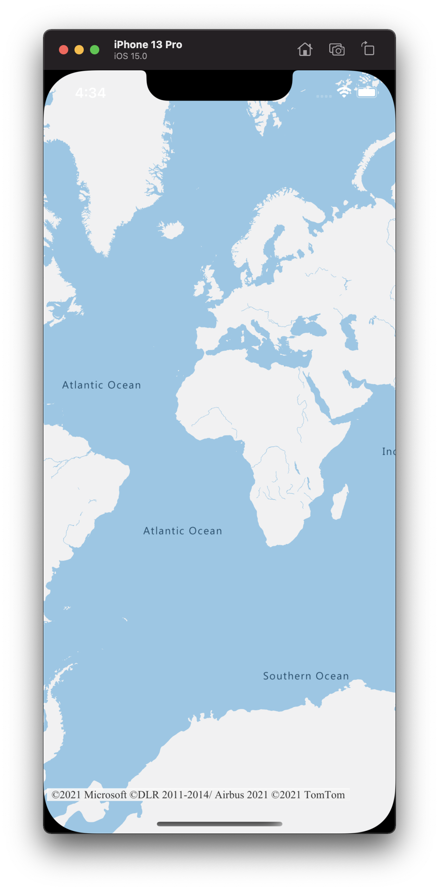

# iOS 앱 만들기(공개 미리 보기)

이 문서에서는 iOS 앱에 Azure Maps를 추가하는 방법을 보여 줍니다. 여기서는 다음 기본 단계를 단계별로 안내합니다.

* 개발 환경을 설정합니다.
* 사용자 고유의 Azure Maps 계정을 만듭니다.
* 앱에서 사용할 기본 Azure Maps 키를 가져옵니다.
* 프로젝트에서 Azure Maps 라이브러리를 참조합니다.
* 앱에 Azure Maps 컨트롤을 추가합니다.

## 필수 조건

* [Azure Portal](https://portal.azure.com/)에 로그인하여 Azure Maps 계정을 만듭니다. Azure를 구독하고 있지 않다면 시작하기 전에 [체험 계정](https://azure.microsoft.com/free/)을 만듭니다.
* [Azure Maps 계정을 만듭니다](quick-demo-map-app.md#create-an-azure-maps-account).
* 기본 키 또는 구독 키라고도 하는 [기본 구독 키를 가져옵니다](quick-demo-map-app.md#get-the-primary-key-for-your-account). Azure Maps의 인증에 대한 자세한 내용은 [Azure Maps의 인증 관리](how-to-manage-authentication.md)를 참조하세요.
* [Mac App Store에서 Xcode](https://apps.apple.com/cz/app/xcode/id497799835?mt=12)를 무료로 다운로드합니다.

## Azure Maps 계정 만들기

다음 단계에 따라 새 Azure Maps 계정을 만듭니다.

1. [Azure Portal](https://portal.azure.com/)의 왼쪽 위 모서리에서 **리소스 만들기** 를 선택합니다.

2. _Marketplace 검색_ 상자에서 **Azure Maps** 를 입력합니다.

3. _결과_ 에서 **Azure Maps** 를 선택한 다음, 맵 아래에 표시되는 **만들기** 단추를 선택합니다.

4. **Maps 계정 만들기** 페이지에서 다음 값을 입력합니다.

   * 이 계정에 사용하려는 _구독_.
   * 이 계정에 대한 _리소스 그룹_ 이름. _새로 만들기_ 또는 _기존_ 리소스 그룹 사용을 선택할 수도 있습니다.
   * 새 계정의 _이름_.
   * 이 계정에 대한 _가격 책정 계층_ 입니다.
   * _라이선스_ 및 _개인정보처리방침_ 을 읽고 조건에 동의하는 확인란을 선택합니다.
   * **만들기** 단추를 선택합니다.

    

## 사용자 계정에 대한 기본 키 가져오기

Maps 계정이 성공적으로 만들어지면 Maps API를 쿼리할 수 있는 기본 키를 검색합니다.

1. 포털에서 Maps 계정을 엽니다.

2. 설정 섹션에서 **인증** 을 선택합니다.

3. **기본 키** 를 클립보드로 복사합니다. 이 자습서의 뒷부분에서 사용하기 위해 로컬로 저장합니다.

>[!NOTE]
> 이 빠른 시작에서는 데모용 [공유 키](azure-maps-authentication.md#shared-key-authentication) 인증 방법을 사용하지만, 프로덕션 환경에 사용되는 기본 방법은 [Azure Active Directory](azure-maps-authentication.md#azure-ad-authentication) 인증입니다.
<!--
> If you use the Azure subscription key instead of the Azure Maps primary key, your map won't render properly. Also, for security purposes, it is recommended that you rotate between your primary and secondary keys. To rotate keys, update your app to use the secondary key, deploy, then press the cycle/refresh button beside the primary key to generate a new primary key. The old primary key will be disabled. For more information on key rotation, see [Set up Azure Key Vault with key rotation and auditing](../key-vault/secrets/tutorial-rotation-dual.md)
-->

## Xcode에서 프로젝트 만들기

먼저 새 iOS 앱 프로젝트를 만듭니다. Xcode 프로젝트를 만들려면 다음 단계를 완료합니다.

1. **파일** 에서 **새로 만들기** -> **프로젝트** 를 선택합니다.

2. **iOS** 탭에서 **앱**, **다음** 을 차례로 선택합니다.

3. 앱 이름, 번들 ID를 입력한 다음, **다음** 을 선택합니다.

새 프로젝트 만들기에 대한 자세한 도움말은 [앱에 대한 Xcode Project 만들기](https://developer.apple.com/documentation/xcode/creating-an-xcode-project-for-an-app)를 참조하세요.

## Azure Maps iOS SDK 설치

애플리케이션을 빌드하는 다음 단계에서 Azure Maps iOS SDK를 설치합니다. SDK를 설치하려면 다음 단계를 완료합니다.

1. **프로젝트 탐색기** 에서 원하는 Xcode iOS 프로젝트를 선택한 상태에서 **+** 단추를 선택하여 **패키지 종속성을 추가** 합니다.

   

2. 결과 대화 상자에 다음을 입력합니다.
   * 오른쪽 위 모서리에 표시되는 검색 창에 `https://github.com/Azure/azure-maps-ios-sdk-distribution.git`을 입력합니다.
   * `Up to Next Major Version`종속성 규칙 **필드에서** 를 선택합니다.
   * **종속성 규칙** 버전 필드에 `1.0.0-pre.1`을 입력합니다.

   

3. 패키지가 해당 종속성과 함께 확인되면 **패키지 추가** 단추를 선택하여 종속성 설정을 완료합니다.

   

## MapControl 보기 추가

1. 사용자 지정 `UIView`를 추가하여 컨트롤러 보기

1. `AzureMapsControl` 모듈에서 `MapControl` 클래스 선택

   

1. **AppDelegate.swift** 파일에서 다음을 수행해야 합니다.

   * Azure Maps SDK에 대한 가져오기 추가
   * Azure Maps 인증 정보 설정

`AzureMaps.configure(subscriptionKey:)` 또는 `AzureMaps.configure(aadClient:aadAppId:aadTenant:)` 메서드를 사용하여 AzureMaps 클래스에 대한 인증 정보를 전역적으로 설정하면 보기마다 인증 정보를 추가할 필요가 없습니다.

1. 다음 그래픽에 표시된 대로 실행 단추를 선택하여(또는 `CMD` + `R`을 누름) 애플리케이션을 빌드합니다.

   

Xcode에서 애플리케이션을 빌드하는 데 몇 초 정도 걸립니다. 빌드가 완료되면 시뮬레이션된 iOS 디바이스에서 애플리케이션을 테스트할 수 있습니다. 다음과 같은 맵이 표시됩니다.

## 리소스 정리

<!--
> [!WARNING]
> The tutorials listed in the [Next Steps](#next-steps) section detail how to use and configure Azure Maps with your account. Don't clean up the resources created in this quickstart if you plan to continue to the tutorials.
-->

이 빠른 시작에서 만든 리소스를 정리하려면 다음 단계를 수행합니다.

1. Xcode를 닫고 만든 프로젝트를 삭제합니다.

2. 외부 디바이스에서 애플리케이션을 테스트한 경우 해당 디바이스에서 애플리케이션을 제거합니다.

Azure Maps iOS SDK를 사용하여 계속 개발할 계획이 없는 경우:

1. Azure Portal 페이지로 이동합니다. 기본 포털 페이지에서 **모든 리소스** 를 선택합니다. 또는 왼쪽 상단의 메뉴 아이콘을 선택한 다음, **모든 리소스** 를 선택합니다.

2. Azure Maps 계정을 선택합니다. 페이지 위쪽에서 **삭제** 를 선택합니다.

3. 경우에 따라 iOS 앱을 계속 개발할 계획이 없는 경우 Xcode를 제거합니다.

## 추가 정보

추가 코드 예제는 다음 문서를 참조하세요.

* [Azure Maps의 인증 관리](how-to-manage-authentication.md)

<!--
## Additional information

See the following articles for additional code examples:

* [Manage authentication in Azure Maps](how-to-manage-authentication.md)
* [Change map styles in iOS maps](set-map-style-ios-sdk.md)
* [Add a symbol layer](add-symbol-layer-ios.md)
* [Add a line layer](add-line-layer-to-map-ios.md)
* [Add a polygon layer](add-polygon-layer-map-ios.md)

## Next steps

In this quickstart, you created your Azure Maps account and created a demo application. Take a look at the following tutorials to learn more about Azure Maps:

> [!div class="nextstepaction"]

> [Load GeoJSON data into Azure Maps](tutorial-load-geojson-file-ios.md)
-->