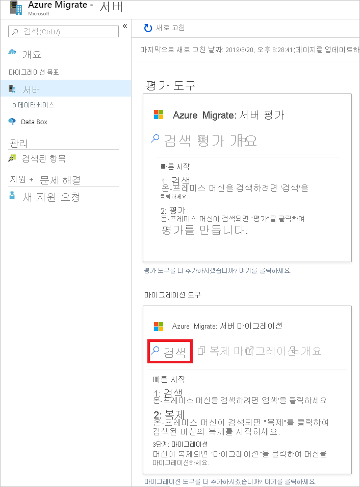
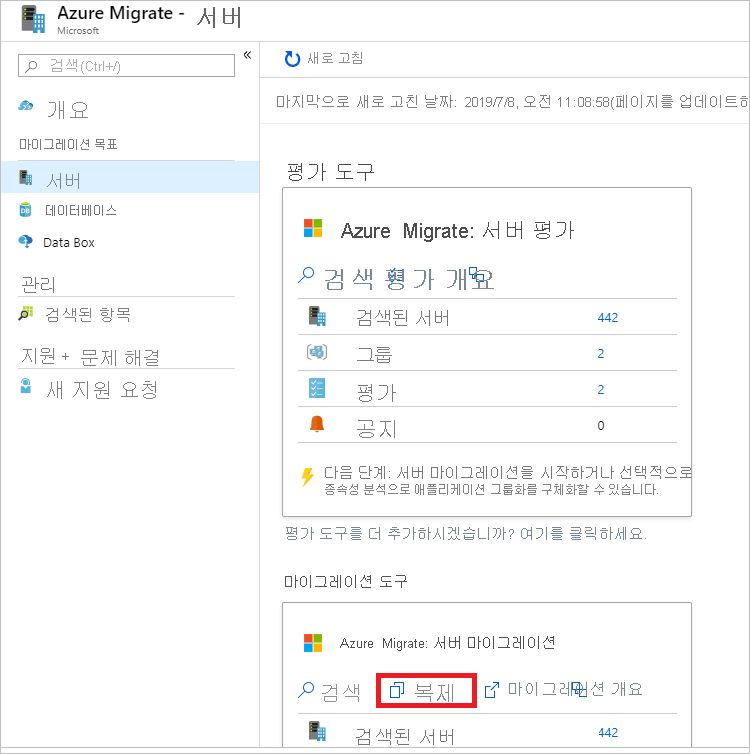
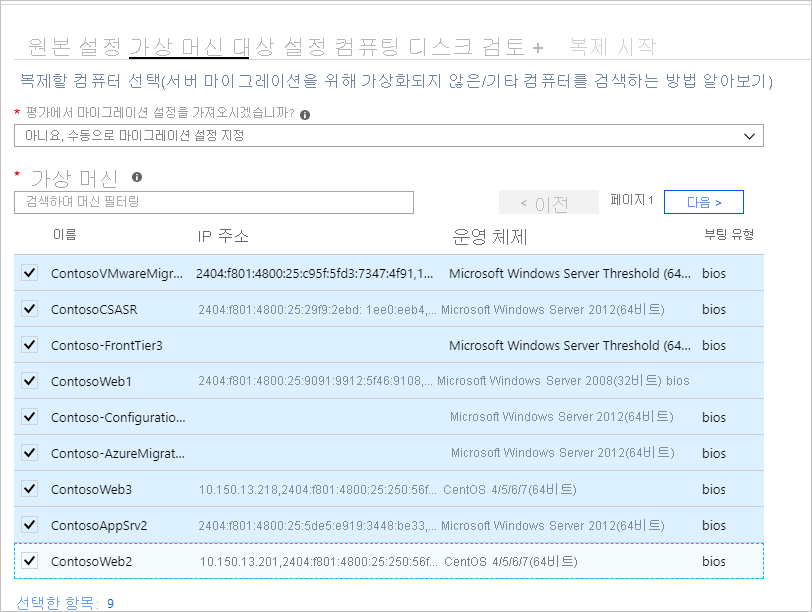
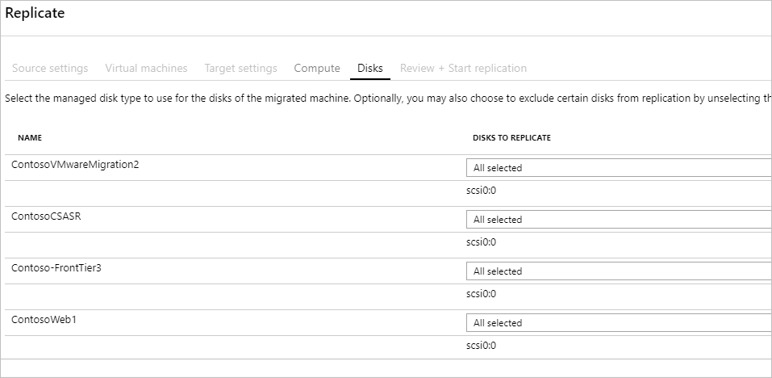
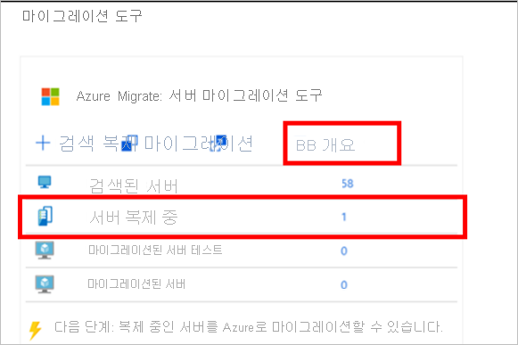
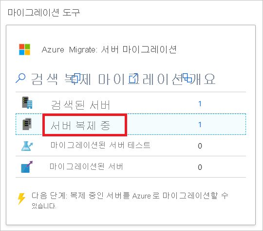

# <a name="migrate-availability-group-to-sql-server-on-azure-vm"></a>Azure VM의 SQL Server로 가용성 그룹 마이그레이션

이 문서에서는 [Azure Migrate: 서버 마이그레이션 도구](../../../migrate/migrate-services-overview.md#azure-migrate-server-migration-tool)를 사용하여 SQL Server Always On 가용성 그룹을 Azure VM의 SQL Server로 마이그레이션하는 방법을 설명합니다. 마이그레이션 도구를 사용하여 가용성 그룹의 각 복제본을 SQL Server를 호스트하는 Azure VM과 클러스터 메타데이터, 가용성 그룹 메타데이터 및 기타 필요한 고가용성 구성 요소에 마이그레이션할 수 있습니다. 

이 문서에서는 다음 방법을 설명합니다. 

> [!div class="checklist"]
> * 마이그레이션을 위해 Azure 및 원본 환경을 준비합니다.
> * 서버 복제를 시작합니다.
> * 복제를 모니터링합니다.
> * 전체 서버 마이그레이션을 실행합니다.
> * Always On 가용성 그룹을 구성합니다. 


이 가이드에서는 서버 또는 가상 머신을 물리적 서버로 처리하는 Azure Migrate의 에이전트 기반 마이그레이션 방법을 사용합니다. 물리적 머신을 마이그레이션할 때 Azure Migrate: 서버 마이그레이션은 Azure Site Recovery 서비스의 에이전트 기반 재해 복구와 동일한 복제 아키텍처를 사용하며, 일부 구성 요소는 동일한 코드 베이스를 공유합니다. 일부 콘텐츠는 Site Recovery 설명서에 연결될 수 있습니다.


## <a name="prerequisites"></a>사전 요구 사항


이 자습서를 시작하기 전에 다음 사전 요구 사항을 완료해야 합니다.

1. Azure 구독 필요한 경우 [체험 계정](https://azure.microsoft.com/pricing/free-trial/)을 만듭니다. 
1. [Azure PowerShell `Az` 모듈](/powershell/azure/install-az-ps)을 설치합니다. 
1. GitHub 리포지토리에서 [PowerShell 샘플 스크립트](https://github.com/Azure/azure-docs-powershell-samples/tree/master/azure-migrate/SQL%20Migration)를 다운로드합니다.

## <a name="prepare-azure"></a>Azure 준비

[서버 마이그레이션 도구](../../../migrate/migrate-services-overview.md#azure-migrate-server-migration-tool)를 사용하여 마이그레이션을 위해 Azure를 준비합니다.

|**Task** | **세부 정보**|
|--- | ---
|**Azure Migrate 프로젝트 만들기** | Azure 계정에는 [새 프로젝트를 생성](../../../migrate/create-manage-projects.md)할 수 있는 기여자 또는 소유자 권한이 있어야 합니다.|
|**Azure 계정에 대한 사용 권한 확인** | Azure 계정에는 Azure 구독에 대한 기여자 또는 소유자 권한, AAD(Azure Active Directory) 앱을 등록할 권한, Key Vault를 만들고 VM을 만들고 Azure 관리 디스크에 쓸 수 있도록 Azure 구독에 대한 사용자 액세스 관리자 권한이 필요합니다. |
|**Azure 가상 네트워크 설정** | Azure VNet(가상 네트워크)을 [설정](../../../virtual-network/virtual-networks-overview.md)합니다. Azure에 복제하면 Azure VM이 만들어지고 마이그레이션을 설정할 때 지정한 Azure VNet에 조인됩니다.|


적절한 권한이 있는지 확인하려면 다음 단계를 수행합니다. 

1. Azure Portal에서 구독을 열고, **액세스 제어(IAM)** 를 선택합니다.
2. **액세스 확인** 에서 관련 계정을 찾아 선택하여 권한을 확인합니다.
3. **기여자** 또는 **소유자** 권한이 있어야 합니다.
    - Azure 체험 계정을 방금 만든 경우 자신이 구독에 대한 소유자입니다.
    - 구독 소유자가 아닌 경우 해당 역할을 할당해 주도록 소유자에게 문의합니다.

권한을 할당해야 하는 경우 [Azure 사용자 계정 준비](../../../migrate/tutorial-discover-vmware.md#prepare-an-azure-user-account)의 단계를 따르세요.


## <a name="prepare-for-migration"></a>마이그레이션 준비

서버 마이그레이션을 준비하려면 물리적 서버 설정을 확인하고 복제 어플라이언스 배포를 준비합니다.

### <a name="check-machine-requirements"></a>머신 요구 사항 확인 


원본 머신이 Azure로 마이그레이션하기 위한 요구 사항을 준수하는지 확인합니다. 다음 단계를 수행합니다. 

1. 서버 요구 사항을 [확인](../../../migrate/migrate-support-matrix-physical-migration.md#physical-server-requirements)합니다.
1. Azure에 복제하는 원본 머신이 [Azure VM 요구 사항](../../../migrate/migrate-support-matrix-physical-migration.md#azure-vm-requirements)을 준수하는지 확인합니다.
1. 일부 [Windows](../../../migrate/prepare-for-migration.md#windows-machines) 원본에는 몇 가지 추가 변경이 필요합니다. 변경을 수행하기 전에 원본을 마이그레이션하면 Azure에서 VM이 부팅되지 않을 수 있습니다. 일부 운영 체제의 경우 이러한 변경은 Azure Migrate에서 자동으로 수행합니다. 


### <a name="prepare-for-replication"></a>복제 준비 

Azure Migrate: 서버 마이그레이션에서 복제 어플라이언스를 사용하여 컴퓨터를 Azure에 복제합니다. 복제 어플라이언스에서 실행하는 구성 요소는 다음과 같습니다. 

- **구성 서버**: 구성 서버는 온-프레미스와 Azure 간의 통신을 조정하여 데이터 복제를 관리합니다.
- **프로세스 서버**: 프로세스 서버는 복제 게이트웨이의 역할을 합니다. 복제 데이터를 수신하여 캐싱, 압축 및 암호화를 사용하여 최적화한 후 Azure의 캐시 스토리지 계정으로 보냅니다. 

다음과 같이 어플라이언스 배포를 준비합니다.

- 복제 어플라이언스를 호스트할 Windows Server 2016 머신을 만듭니다. [머신 요구 사항](../../../migrate/migrate-replication-appliance.md#appliance-requirements)을 검토합니다.
- 복제 어플라이언스는 MySQL을 사용합니다. MySQL을 어플라이언스에 설치하는 [옵션](../../../migrate/migrate-replication-appliance.md#mysql-installation)을 검토합니다.
- 복제 어플라이언스가 [퍼블릭](../../../migrate/migrate-replication-appliance.md#url-access) 및 [정부](../../../migrate/migrate-replication-appliance.md#azure-government-url-access) 클라우드에 액세스하는 데 필요한 Azure URL을 검토합니다.
- 복제 어플라이언스에 대한 [포트](../../../migrate/migrate-replication-appliance.md#port-access) 액세스 요구 사항을 검토합니다.

> [!NOTE]
> 복제 어플라이언스는 복제하거나 마이그레이션하는 원본 머신이 아닌 다른 머신에 설치해야 하며, 이전에 Azure Migrate 검색 및 평가 어플라이언스를 설치한 머신에는 설치하지 않아야 합니다.

### <a name="download-replication-appliance-installer"></a>복제 어플라이언스 설치 관리자 다운로드

복제 어플라이언스 설치 관리자를 다운로드하려면 다음 단계를 수행합니다. 

1. Azure Migrate 프로젝트 > **서버** 의 **Azure Migrate: 서버 마이그레이션** 에서 **검색** 을 선택합니다.

    

1. **머신 검색** > **머신이 가상화되어 있나요?** 에서 **물리적 또는 기타(AWS, GCP, Xen 등)** 를 선택합니다.
1. **대상 지역** 에서 머신을 마이그레이션하려는 Azure 지역을 선택합니다.
1. **마이그레이션의 대상 지역이 region-name인지 확인합니다.** 를 선택합니다.
1. **리소스 만들기** 를 선택합니다. 그러면 Azure Site Recovery 자격 증명 모음이 백그라운드에서 만들어집니다.
    - 이미 Azure Migrate : Server Migration을 사용하여 마이그레이션을 설정한 경우 이전에 리소스가 설정되었으므로 대상 옵션을 구성할 수 없습니다.    
    - 이 단추를 선택한 후에는 이 프로젝트의 대상 지역을 변경할 수 없습니다.
    - 이후의 모든 마이그레이션은 이 지역으로 수행됩니다.

1. **새 복제 어플라이언스를 설치하거나 기존 설치를 확장하시겠어요?** 에서 **복제 어플라이언스 설치** 를 선택합니다.
1. **복제 어플라이언스 소프트웨어를 다운로드하고 설치합니다.** 에서 어플라이언스 설치 관리자 및 등록 키를 다운로드합니다. 어플라이언스를 등록하려면 키가 필요합니다. 키는 다운로드한 후 5일 동안 유효합니다.

    

1. 어플라이언스 설정 파일 및 키 파일을 어플라이언스용으로 만든 Windows Server 2016 머신에 복사합니다.
1. 설치가 완료되면 어플라이언스 구성 마법사가 자동으로 시작됩니다(어플라이언스 머신의 바탕 화면에 만들어진 cspsconfigtool 바로 가기를 사용하여 마법사를 수동으로 시작할 수도 있음). 마법사의 **계정 관리** 탭을 사용하여 다음과 같은 세부 정보가 포함된 더미 계정을 만들 수 있습니다.

   -  식별 이름: “guest”
   -  사용자 이름: “username”
   -  계정 암호: “password” 
   
   이 더미 계정은 복제 사용 단계에서 사용됩니다. 

1. 설정이 완료되고 어플라이언스가 다시 시작되면 **머신 검색** 의 **구성 서버 선택** 에서 새 어플라이언스를 선택하고 **등록 완료** 를 선택합니다. 등록 완료에서는 복제 어플라이언스를 준비하기 위한 몇 가지 최종 작업이 수행됩니다.

    


## <a name="install-mobility-service"></a>Mobility Service 설치

마이그레이션할 서버에 Mobility Service 에이전트를 설치합니다. 에이전트 설치 관리자는 복제 어플라이언스에서 사용할 수 있습니다. 올바른 설치 관리자를 찾고 마이그레이션하려는 각 머신에 에이전트를 설치합니다. 


Mobility Service를 설치하려면 다음 단계를 수행합니다. 

1. 복제 어플라이언스에 로그인합니다.
1. **%ProgramData%\ASR\home\svsystems\pushinstallsvc\repository** 로 이동합니다.
1. 머신 운영 체제 및 버전에 맞는 설치 관리자를 찾습니다. [지원되는 운영 체제](../../../site-recovery/vmware-physical-azure-support-matrix.md#replicated-machines)를 검토하세요. 
1. 설치 관리자 파일을 마이그레이션하려는 머신에 복사합니다.
1. 어플라이언스를 배포할 때 생성된 암호가 있는지 확인합니다.
    - 파일을 머신의 임시 텍스트 파일에 저장합니다.
    - 복제 어플라이언스에서 암호를 가져올 수 있습니다. 명령줄에서 **C:\ProgramData\ASR\home\svsystems\bin\genpassphrase.exe -v** 를 실행하여 현재 암호를 확인합니다.
    - 암호는 다시 생성하지 않습니다. 다시 생성하는 경우 연결이 끊어지므로 복제 어플라이언스를 다시 등록해야 합니다.
    - */Platform* 매개 변수에서 VMware 머신과 물리적 머신 모두에 대해 *VMware* 를 지정합니다. 

1. 머신에 연결하고 설치 관리자 파일의 내용을 로컬 폴더(예: c:\temp)에 추출합니다. 관리자 명령 프롬프트에서 다음을 실행합니다. 

    ```
    ren Microsoft-ASR_UA*Windows*release.exe MobilityServiceInstaller.exe
    MobilityServiceInstaller.exe /q /x:C:\Temp\Extracted
    cd C:\Temp\Extracted
    ```

2. Mobility Service 설치 관리자를 실행합니다.

    ```
   UnifiedAgent.exe /Role "MS" /Platform "VmWare" /Silent
    ```

3. 에이전트를 복제 어플라이언스에 등록합니다.

    ```
    cd C:\Program Files (x86)\Microsoft Azure Site Recovery\agent
    UnifiedAgentConfigurator.exe  /CSEndPoint <replication appliance IP address> /PassphraseFilePath <Passphrase File Path>
    ```

설치 후 검색된 머신이 Azure Migrate: 서버 마이그레이션에 표시될 때까지 약간의 시간이 걸릴 수 있습니다. VM이 검색됨에 따라 **검색된 서버** 수가 증가합니다.


## <a name="prepare-source-machines"></a>원본 머신 준비

원본 머신을 준비하려면 클러스터 노드에서 `Get-ClusterInfo.ps1` 스크립트를 실행하여 클러스터 리소스에 대한 정보를 검색합니다. 스크립트는 `Cluster-Config.csv` 파일의 역할 이름, 리소스 이름, IP 및 프로브 포트를 출력합니다. 

```powershell
./Get-ClusterInfo.ps1
```

## <a name="create-load-balancer"></a>부하 분산 장치 만들기

클러스터 및 클러스터 역할이 요청에 올바르게 응답하려면 Azure Load balancer가 필요합니다. 부하 분산 장치가 없으면 다른 VM은 네트워크 또는 클러스터에 속하는 것으로 인식되지 않기 때문에 클러스터 IP 주소에 연결할 수 없습니다. 

부하 분산 장치를 만들려면 다음 단계를 수행합니다. 

1. `Cluster-Config.csv` 파일의 열을 작성합니다.

**열 머리글** | **설명**
--- | ---
NewIP | CSV 파일의 각 리소스에 대한 Azure 가상 네트워크(또는 서브넷)의 IP 주소를 지정합니다.
ServicePort | CSV 파일의 각 리소스에서 사용할 서비스 포트를 지정합니다. SQL 클러스터형 리소스의 경우 CSV의 프로브 포트와 동일한 서비스 포트 값을 사용합니다. 다른 클러스터 역할의 경우 사용되는 기본값은 1433이지만 현재 설정에서 구성된 포트 번호를 계속 사용할 수 있습니다. 


2. `Create-ClusterLoadBalancer.ps1` 스크립트를 실행하여 다음 매개 변수를 사용해 부하 분산 장치를 만듭니다. 

**매개 변수** | **형식** | **설명**
--- | --- | ---
ConfigFilePath | 필수| 이전 단계에서 작성한 `Cluster-Config.csv` 파일의 경로를 지정합니다.
ResourceGroupName | 필수|부하 분산 장치를 만들 리소스 그룹의 이름을 지정합니다. 
VNetName | 필수|부하 분산 장치를 연결하려는 Azure 가상 네트워크의 이름을 지정합니다. 
SubnetName | 필수|부하 분산 장치를 연결하려는 Azure 가상 네트워크의 서브넷 이름을 지정합니다. 
VNetResourceGroupName | 필수|부하 분산 장치를 연결하려는 Azure 가상 네트워크의 리소스 그룹 이름을 지정합니다. 
Location | 필수|부하 분산 장치를 만들 위치를 지정합니다. 
LoadBalancerName | 필수|생성할 부하 분산 장치의 이름을 지정합니다. 


```powershell
./Create-ClusterLoadBalancer.ps1 -ConfigFilePath ./clsuterinfo.csv -ResourceGroupName $resoucegroupname -VNetName $vnetname -subnetName $subnetname -VnetResourceGroupName $vnetresourcegroupname -Location "eastus" -LoadBalancerName $loadbalancername
```

## <a name="replicate-machines"></a>머신 복제

이제 마이그레이션할 머신을 선택합니다. 최대 10대의 머신을 함께 복제할 수 있습니다. 추가로 복제해야 하는 경우 10개씩 일괄 처리로 동시에 복제합니다.

머신을 복제하려면 다음 단계를 수행합니다. 

1. Azure Migrate 프로젝트 > **서버** 의 **Azure Migrate: 서버 마이그레이션** 에서 **복제** 를 선택합니다.

    

1. **복제** > **원본 설정** > **머신이 가상화되어 있나요?** 에서 **물리적 또는 기타(AWS, GCP, Xen 등)** 를 선택합니다.
1. **온-프레미스 어플라이언스** 에서 설정한 Azure Migrate 어플라이언스의 이름을 선택합니다.
1. **프로세스 서버** 에서 복제 어플라이언스의 이름을 선택합니다.
1. **게스트 자격 증명** 에서 이 문서의 앞부분에 있는 [복제 설치 관리자 설정](#download-replication-appliance-installer) 중에 이전에 만든 더미 계정을 선택합니다. 그런 다음, **다음: 가상 머신** 을 선택합니다.   

    

1. **Virtual Machines** 의 **평가에서 마이그레이션 설정을 가져오시겠어요?** 에서 기본 설정인 **아니요, 수동으로 마이그레이션 설정 지정** 을 그대로 유지합니다.
1. 마이그레이션하려는 각 VM을 선택합니다. 그런 다음, **다음: 대상 설정** 을 선택합니다.

    


1. **대상 설정** 에서 마이그레이션할 구독 및 대상 지역을 선택하고, 마이그레이션 후 Azure VM이 상주할 리소스 그룹을 지정합니다.
1. **Virtual Network** 에서 마이그레이션 후 Azure VM이 조인될 Azure VNet/서브넷을 선택합니다.
1. **가용성 옵션** 에서 다음을 선택합니다.
    -  마이그레이션된 머신을 지역의 특정 가용성 영역에 고정하는 가용성 영역. 이 옵션을 사용하여 가용성 영역에서 다중 노드 애플리케이션 계층을 구성하는 서버를 배포합니다. 이 옵션을 선택하는 경우 컴퓨팅 탭에서 선택한 각 머신에 사용할 가용성 영역을 지정해야 합니다. 이 옵션은 마이그레이션을 위해 선택한 대상 지역이 가용성 영역을 지원하는 경우에만 사용할 수 있습니다.
    -  마이그레이션된 머신을 가용성 집합에 배치하기 위한 가용성 집합입니다. 이 옵션을 사용하려면 선택한 대상 리소스 그룹에 하나 이상의 가용성 집합이 있어야 합니다.
    - 마이그레이션된 머신에 대해 이러한 가용성 구성이 필요하지 않은 경우에는 인프라 중복이 필요하지 않습니다.
    
1. **디스크 암호화 유형** 에서 다음을 선택합니다.
    - 플랫폼 관리형 키를 사용하여 저장 데이터 암호화
    - 고객 관리형 키를 사용하여 미사용 데이터 암호화
    - 플랫폼 관리형 키 및 고객 관리형 키를 사용한 이중 암호화

    > [!NOTE]
    > CMK를 사용하여 VM을 복제하려면 대상 리소스 그룹 아래에 [디스크 암호화 집합을 생성](../../../virtual-machines/disks-enable-customer-managed-keys-portal.md#set-up-your-disk-encryption-set)해야 합니다. 디스크 암호화 집합 개체는 SSE에 사용할 CMK가 포함된 Key Vault에 Managed Disks를 매핑됩니다.
  
1. **Azure 하이브리드 혜택** 에서

    - Azure 하이브리드 혜택을 적용하지 않으려면 **아니요** 를 선택합니다. **다음** 을 선택합니다.
    - 활성 Software Assurance 또는 Windows Server 구독이 적용되는 Windows Server 머신이 있고 마이그레이션할 머신에 이 혜택을 적용하려면 **예** 를 선택합니다. **다음** 을 선택합니다.

    :::image type="content" source="../../../migrate/media/tutorial-migrate-vmware/target-settings.png" alt-text="대상 설정":::

1. **Compute** 에서 VM 이름, 크기, OS 디스크 유형 및 가용성 구성을 검토합니다(이전 단계에서 선택한 경우). VM은 [Azure 요구 사항](../../../migrate/migrate-support-matrix-physical-migration.md#azure-vm-requirements)을 준수해야 합니다.

    - **VM 크기**: 평가 권장 사항을 사용하는 경우 VM 크기 드롭다운에서 권장 크기를 표시합니다. 그렇지 않으면 Azure Migrate는 Azure 구독에서 가장 일치하는 항목을 기준으로 크기를 선택합니다. 또는 **Azure VM 크기** 에서 수동 크기를 선택합니다.
    - **OS 디스크**: VM에 맞는 OS(부팅) 디스크를 지정합니다. OS 디스크는 운영 체제 부팅 로더 및 설치 관리자가 있는 디스크입니다.
    - **가용성 영역**: 사용할 가용성 영역을 지정합니다.
    - **가용성 집합**: 사용할 가용성 집합을 지정합니다.

   

1. **디스크** 에서 VM 디스크를 Azure에 복제해야 하는지 여부를 지정하고, Azure에서 디스크 유형(표준 SSD/HDD 또는 프리미엄 관리 디스크)을 선택합니다. **다음** 을 선택합니다.  

    

1. **복제 검토 및 시작** 에서 설정을 검토하고 **복제** 를 선택하여 서버에 대한 초기 복제를 시작합니다.

> [!NOTE]
> 복제가 시작되기 전에 언제든지 **관리** > **머신 복제 중** 에서 복제 설정을 업데이트할 수 있습니다. 복제가 시작된 후에는 설정을 변경할 수 없습니다.

## <a name="track-and-monitor"></a>추적 및 모니터링

복제는 다음 순서대로 진행됩니다. 

- **복제** 를 선택하면 _복제 시작_ 작업이 시작됩니다. 
- ‘복제 시작’ 작업이 완료되면 머신에서 Azure로의 초기 복제를 시작합니다.
- 초기 복제가 완료되면 델타 복제가 시작됩니다. 온-프레미스 디스크에 대한 증분 변경 내용은 Azure의 복제본 디스크에 주기적으로 복제됩니다.


작업 상태는 포털 알림에서 추적할 수 있습니다.

**Azure Migrate: 서버 마이그레이션** 에서 **서버 복제** 를 선택하여 복제 상태를 모니터링할 수 있습니다.



## <a name="migrate-vms"></a>VM 마이그레이션

머신이 복제되면 마이그레이션할 준비가 된 것입니다. 서버를 마이그레이션하려면 다음 단계를 수행합니다. 


1. Azure Migrate 프로젝트 > **서버** > **Azure Migrate: 서버 마이그레이션** 에서 **서버 복제** 를 선택합니다.

    

2. 마이그레이션된 서버가 원본 서버와 동기화되도록 하려면 SQL 데이터를 호스트하는 디스크가 온라인 상태인지 확인하면서 보조 복제본(**SQL Server 구성 관리자** > **서비스**)부터 가용성 그룹의 모든 복제본에서 SQL Server 서비스를 중지합니다.   
3. **머신 복제 중** > 서버 이름 선택 > **개요** 에서 다음 단계로 이동하기 전에 마이그레이션할 서버에서 SQL Server 서비스를 중지한 후 마지막으로 동기화된 타임스탬프가 있는지 확인합니다. 몇 분밖에 안 걸립니다. 
2. **머신 복제 중** 에서 마우스 오른쪽 단추로 VM > **마이그레이션** 을 차례로 클릭합니다.
3. **마이그레이션** > **가상 머신을 종료하고 데이터 손실 없이 계획된 마이그레이션을 수행하시겠어요?** 에서 **아니요** > **확인** 을 차례로 선택합니다.
   
    > [!NOTE]
    > 물리적 서버 마이그레이션의 경우 원본 머신이 자동으로 종료되지 않습니다. 애플리케이션을 마이그레이션 창의 일부로 중단한 다음(애플리케이션에서 연결을 허용하지 않도록 함), 마이그레이션이 완료되기 전에 마이그레이션을 시작하는 것이 좋습니다(서버를 계속 실행해야 하므로 나머지 변경 내용을 동기화할 수 있음).

4. VM에 대한 마이그레이션 작업이 시작됩니다. Azure 알림에서 작업을 추적합니다.
5. 작업이 완료되면 **Virtual Machines** 페이지에서 VM을 보고 관리할 수 있습니다.

## <a name="reconfigure-cluster"></a>클러스터 다시 구성 

VM이 마이그레이션된 후 클러스터를 다시 구성합니다. 다음 단계를 수행합니다. 

1. Azure에서 마이그레이션된 서버를 종료합니다.
1.  마이그레이션된 머신을 부하 분산 장치의 백 엔드 풀에 추가합니다. **Load Balancer** > **백 엔드 풀** > 백 엔드 풀 선택 > **마이그레이션된 머신 추가** 로 이동합니다. 3. Azure에서 마이그레이션된 서버를 시작하고 모든 노드에 로그인합니다. 
1. `ClusterConfig.csv` 파일을 복사하고 CSV를 매개 변수로 전달하는 `Update-ClusterConfig.ps1` 스크립트를 실행합니다. 이렇게 하면 클러스터 리소스가 Azure에서 작동하도록 클러스터의 새 구성으로 업데이트됩니다. 

   ```powershell
   ./Update-ClusterConfig.ps1 -ConfigFilePath $filepath
   ```

Always On 가용성 그룹이 준비되었습니다. 

## <a name="complete-the-migration"></a>마이그레이션 완료

1. 마이그레이션이 완료되면 마우스 오른쪽 단추로 VM > **마이그레이션 중지** 를 차례로 클릭합니다. 다음을 수행합니다.
    - 온-프레미스 머신에 대한 복제를 중지합니다.
    - Azure Migrate의 **서버 복제** 수에서 머신을 제거합니다. Server Migration에 연결합니다.
    - 머신에 대한 복제 상태 정보를 정리합니다.
2. 마이그레이션된 머신에 Azure VM [Windows](../../../virtual-machines/extensions/agent-windows.md) 에이전트를 설치합니다.
3. 데이터베이스 연결 문자열 업데이트, 웹 서버 구성 등의 마이그레이션 후 앱 조정을 수정합니다.
4. 이제 Azure에서 실행 중인 마이그레이션된 애플리케이션에서 최종 애플리케이션 및 마이그레이션 수용 테스트를 수행합니다.
5. 트래픽을 마이그레이션된 Azure VM 인스턴스로 전환합니다.
6. 로컬 VM 인벤토리에서 온-프레미스 VM을 제거합니다.
7. 로컬 백업 작업에서 온-프레미스 VM을 제거합니다.
8. 내부 문서를 업데이트하여 Azure VM의 새 위치 및 IP 주소를 표시합니다. 

## <a name="post-migration-best-practices"></a>마이그레이션 후 작업 모범 사례

- SQL Server의 경우.
    -  [SQL Server IaaS 에이전트 확장](../../virtual-machines/windows/sql-server-iaas-agent-extension-automate-management.md)을 설치하여 관리 및 관리 작업을 자동화합니다. 
    - Azure VM에서 SQL Server 성능을 [최적화](../../virtual-machines/windows/performance-guidelines-best-practices-checklist.md)합니다. 
    - Azure의 SQL Server에 대한 [가격 책정](../../virtual-machines/windows/pricing-guidance.md#free-licensed-sql-server-editions)을 이해합니다. 
- 복원력 개선:
    - [Azure Backup 서비스](../../../backup/quick-backup-vm-portal.md)를 통해 Azure VM을 백업하면 데이터 보안을 유지할 수 있습니다. 
    - [Site Recovery](../../../site-recovery/azure-to-azure-tutorial-enable-replication.md)를 통해 Azure VM을 보조 지역에 복제하면 워크로드를 계속 실행하고 지속적으로 사용할 수 있습니다.
- 보안 강화:
    - [Azure Security Center - Just-In-Time 관리](../../../security-center/security-center-just-in-time.md)를 사용하여 인바운드 트래픽 액세스를 잠그고 제한합니다.
    - [네트워크 보안 그룹](../../../virtual-network/network-security-groups-overview.md)을 사용하여 관리 엔드포인트에 대한 네트워크 트래픽을 제한합니다.
    - [Azure Disk Encryption](../../../security/fundamentals/azure-disk-encryption-vms-vmss.md)을 배포하여 디스크를 보호하고 데이터를 도난 및 무단 액세스로부터 안전하게 유지합니다.
    - [IaaS 리소스 보호](https://azure.microsoft.com/services/virtual-machines/secure-well-managed-iaas/)에 대해 자세히 알아보고 [Azure Security Center](https://azure.microsoft.com/services/security-center/)를 방문하세요.
- 모니터링 및 관리 앱:
    - 리소스 사용량과 비용을 모니터링하려면 [Azure Cost Management](../../../cost-management-billing/cost-management-billing-overview.md)를 배포하는 것이 좋습니다.


## <a name="next-steps"></a>다음 단계

Azure 클라우드 채택 프레임워크에서 [클라우드 마이그레이션 과정](/azure/architecture/cloud-adoption/getting-started/migrate)을 조사합니다.