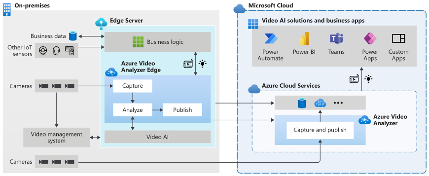

# Azure Video Analyzer란? (미리 보기)
 
Azure Video Analyzer는 Edge 및 클라우드를 포괄하는 인텔리전트 비디오 애플리케이션을 빌드하기 위한 플랫폼을 제공합니다. 플랫폼은 IoT Edge 모듈과 Azure 서비스로 구성됩니다. 라이브 비디오를 캡처, 녹화, 분석하는 기능이 제공되며, 결과와 비디오, 인사이트를 비디오에서 에지 또는 클라우드에 게시할 수 있습니다.

Video Analyzer 에지 모듈은 Stream Analytics, Cognitive Services 및 강력한 하이브리드(에지+클라우드) 애플리케이션을 빌드하는 Event Hub와 Cognitive Services 같은 기타 Azure 클라우드 서비스 등의 Azure IoT Edge 모듈과 함께 사용할 수 있습니다. 이 확장 가능한 에지 모듈은 오픈 소스 기계 학습 모델 및 학습 데이터로 빌드된 Azure Cognitive Services 컨테이너 또는 사용자 지정 에지 모듈과 같은 다양한 AI 에지 모듈에 원활하게 통합됩니다. Video Analyzer 플랫폼을 기반으로 하여 복잡한 시스템을 빌드, 운영 및 유지 관리해야 하는 복잡성을 걱정하지 않고도 라이브 비디오를 분석할 수 있습니다.

사용 중인 비디오를 분석하는 것 외에도 에지 모듈을 사용하면 필요에 따라 비디오를 에지나 클라우드에서 로컬로 녹화하고 비디오 인사이트를 Azure 서비스(에지 및/또는 클라우드에서)에 게시할 수 있습니다. 비디오 및 비디오 인사이트를 클라우드에 기록할 경우 Video Analyzer 클라우드 서비스를 사용하여 관리할 수 있습니다.

따라서 Video Analyzer 클라우드 서비스는 녹화, 재생, 내보내기(외부에 공유할 수 있는 비디오 파일 생성) 같은 [비디오 관리 시스템(VMS)](https://en.wikipedia.org/wiki/Video_management_system) 기능으로 IoT 솔루션을 강화하는 데 사용할 수도 있습니다. 또한 아래 다이어그램에 표시된 것처럼 클라우드에 직접 연결된 카메라를 사용하여 동일한 기능을 갖춘 클라우드 네이티브 솔루션을 빌드하는 데 사용할 수도 있습니다.

## IoT 솔루션 개발 가속화 

다른 IoT 센서 및/또는 비즈니스 데이터의 신호와 비디오 분석을 결합하는 IoT 솔루션으로 비즈니스 의사 결정을 자동화하거나 반자동화하여 생산성을 향상시킬 수 있습니다. Video Analyzer를 사용하면 이러한 솔루션을 더 빠르게 빌드할 수 있습니다. 비즈니스와 관련된 비디오 분석 모듈 및 논리를 구축하는 데 중점을 둘 수 있으며, 이를 통해 플랫폼에서 비디오 파이프라인을 관리하고 실행하는 복잡성을 숨길 수 있습니다.

Video Analyzer를 사용하면 기존 [VMS(비디오 관리 시스템)](https://en.wikipedia.org/wiki/Video_management_system)에서 [CCTV 카메라](https://en.wikipedia.org/wiki/Closed-circuit_television_camera)를 계속 사용하고 비디오 분석 앱을 독립적으로 빌드할 수 있습니다. Video Analyzer를 Computer Vision SDK 및 도구 키트와 함께 사용하여 최첨단 IoT 솔루션을 빌드할 수 있습니다. 아래 다이어그램에서 이를 보여 줍니다.

### 개념

* [파이프라인](pipeline.md)
* [비디오 녹화 없는 Video Analyzer](analyze-live-video-without-recording.md)
* [비디오 녹화](video-recording.md)

## 규정 준수, 개인 정보 보호 및 보안

중요한 알림을 사용하는 경우 Video Analyzer 사용 시 적용 가능한 모든 법률을 준수해야 하며, 다른 사용자의 권리를 위반하거나 다른 사용자에게 해로운 방법으로 Video Analyzer 또는 Azure 서비스를 사용해서는 안됩니다.

비디오를 Video Analyzer에서 처리하기 전에, Video Analyzer와 Azure에서 데이터를 사용하고, 처리하고, 저장하는 데 대한 비디오/이미지에 포함된 개인(있는 경우)의 모든 필요한 동의(법에서 요구되는 경우)를 비롯하여 비디오를 사용할 수 있는 모든 적절한 권한이 있어야 합니다. 일부 관할 지역에서는 생체 데이터와 같은 특정 범주의 데이터를 수집하고 온라인으로 처리하고 저장하는 데 대해 특별한 법적 요구 사항이 적용될 수 있습니다. Video Analyzer와 Azure를 특별한 법적 요구 사항이 적용되는 데이터를 처리하고 저장하는 데 사용하기 전에, 귀하에게 적용될 수 있는 이러한 법적 요구 사항을 반드시 준수해야 합니다.

Video Analyzer의 규정 준수, 개인 정보 보호 및 보안에 대해 알아보려면 Microsoft [보안 센터](https://www.microsoft.com/TrustCenter/CloudServices/Azure/default.aspx)를 참조하세요. Microsoft의 개인 정보 보호 의무, 데이터 삭제 방법을 비롯한 데이터 처리 및 보존 방식에 대한 자세한 내용은 Microsoft의 [개인정보처리방침](https://privacy.microsoft.com/PrivacyStatement), [제품 사용 약관](https://www.microsoft.com/licensing/terms/welcome/welcomepage), [Microsoft 제품 및 서비스 데이터 보호 부록](https://www.microsoft.com/licensing/docs/view/Microsoft-Products-and-Services-Data-Protection-Addendum-DPA)("DPA")을 검토하세요. Video Analyzer를 사용하면 제품 사용 약관, DPA 및 개인정보처리방침을 준수할 것에 동의하는 것입니다.

## 다음 단계

* 라이브 비디오에서 동작 감지를 실행하는 방법에 대해서는 [빠른 시작: Azure Video Analyzer 시작](get-started-detect-motion-emit-events.md) 문서를 따르세요.
* [용어](terminology.md)를 검토하세요.
