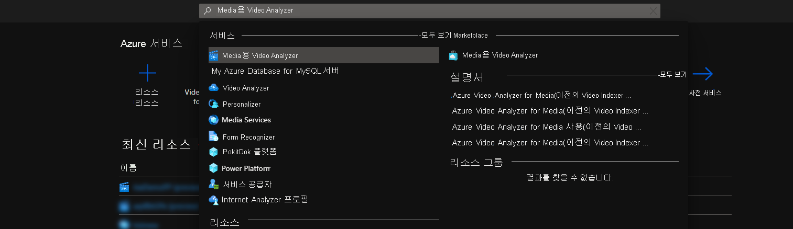
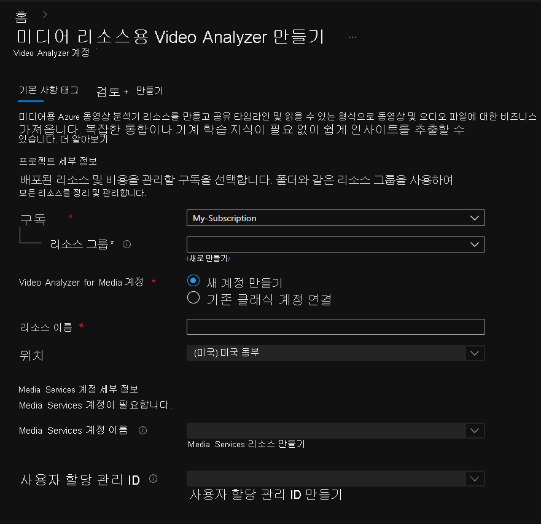
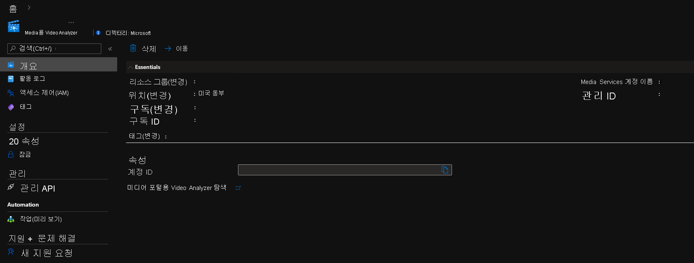
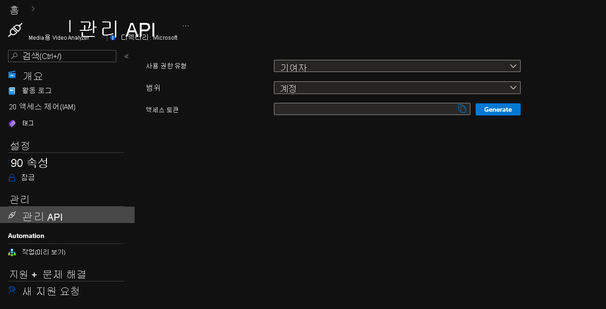

# Azure Portal의 Azure Video Analyzer for Media 시작하기

이 빠른 시작에서는 Azure Video Analyzer for Media를 시작하는 단계를 안내합니다. Azure Portal을 사용하여 Azure Video Analyzer for Media 계정과 포함되는 해당 리소스를 만듭니다.

Azure Video Analyzer for Media를 사용하려면 먼저 Video Analyzer for Media 계정을 만들어야 합니다. 해당 계정은 [Media Services][docs-ms] 리소스 및 [사용자가 할당한 관리 ID][docs-uami]와 연결되어야 합니다. 관리 ID에는 Media Services 대한 기여자 권한 역할이 있어야 합니다.

## 사전 요구 사항
> [!NOTE]
> 새 리소스와 더불어 Azure Media Services 및 사용자가 할당한 관리 ID의 기여자 역할을 만드는 리소스 그룹에 대한 기여자 역할과 사용자 액세스 관리자 역할 모두에 액세스할 수 있는 Azure 구독이 필요합니다. 적절한 권한이 없는 경우 계정 관리자에게 권한을 부여해 달라고 요청하세요. 연결된 Azure Media Services는 Video Analyzer for Media 계정과 동일한 지역에 있어야 합니다.

## Azure Portal

### Azure Portal에서 Video Analyzer for Media 계정 만들기

1. [Azure Portal](https://portal.azure.com/)에 로그인합니다.
1. 상단의 검색 창을 사용하여 **"Video Analyzer for Media"** 를 입력합니다.
1. *서비스* 에서 *Video Analyzer for Media* 를 클릭합니다.

    

1. **만들기** 를 클릭합니다.
1. **Video Analyzer for Media 리소스 만들기** 섹션에서 필수 값을 입력합니다.

    

 
| Name | 설명 |
| ---|---|
|**구독**|Video Analyzer for Media 계정을 만드는 데 사용 중인 구독을 선택합니다.|
|**리소스 그룹**|Video Analyzer for Media 계정을 만들고 있는 리소스 그룹을 선택하거나 **새로 만들기** 를 선택하여 리소스 그룹을 만듭니다.|
|**Video Analyzer for Media 계정**|*새 계정 만들기* 옵션을 선택합니다.|
|**리소스 이름**|새 Video Analyzer for Media 계정의 이름을 입력합니다. 이름에는 공백 없이 문자, 숫자 및 대시가 포함될 수 있습니다.|
|**위치**|Video Analyzer for Media 계정을 배포하는 데 사용할 지리적 지역을 선택합니다. 위치는 선택한 **리소스 그룹 위치** 와 일치하며, 선택한 위치를 변경하려는 경우 선택한 리소스 그룹을 변경하거나 기본 위치에 새 리소스 그룹을 만듭니다. [Video Analyzer for Media를 사용할 수 있는 Azure 지역](https://azure.microsoft.com/global-infrastructure/services/?products=cognitive-services&regions=all)|
|**Media Services 계정 이름**|새 Video Analyzer for Media 계정이 비디오를 처리하는 데 사용할 Media Services를 선택합니다. 기존 Media Services를 선택하거나 새로 만들 수 있습니다. Media Services는 선택한 동일한 위치에 있어야 합니다.| 
|**사용자 할당 관리 ID**|새 Video Analyzer for Media 계정에서 Media Services에 액세스하는 데 사용할 사용자가 할당한 관리 ID를 선택합니다. 기존 사용자 할당 관리 ID를 선택하거나 새로 만들 수 있습니다. 사용자가 할당한 관리 ID에는 Media Services 대한 기여자 역할의 역할이 할당됩니다.|

1. 양식 아래쪽에서 **검토 + 만들기** 를 클릭합니다.

### 배포된 리소스 검토

Azure Portal을 사용하여 Azure Video Analyzer for Media 계정 및 생성된 기타 리소스의 유효성을 검사할 수 있습니다. 배포가 완료되면 **리소스로 이동** 을 선택하여 새 Video Analyzer for Media 계정을 확인합니다.

### 개요

*Video Analyzer for Media* 의 포털 탐색을 클릭하여 [Azure Video Analyzer for Media 포털](https://aka.ms/vi-portal-link)에서 새 계정을 봅니다

### 관리 API

관리 *API* 탭을 사용하여 계정에 대한 액세스 토큰을 수동으로 생성합니다.
이 토큰은 이 계정에 대한 API 호출을 인증하는 데 사용할 수 있습니다. 각 토큰은 1시간 동안 유효합니다.

다음을 선택합니다.
* 권한 유형: **기여자** 또는 **읽기 권한자**
* 범위: **계정**, **프로젝트** 또는 **비디오**
    * **프로젝트** 또는 **비디오** 에 대해 해당 ID도 삽입해야 합니다
* **생성** 을 클릭합니다

---

### 다음 단계

[C#을 사용하여 비디오를 업로드](https://github.com/Azure-Samples/media-services-video-indexer/tree/master/ApiUsage/ArmBased)방법에 대해 알아봅니다.

<!-- links -->
[docs-uami]: ../../active-directory/managed-identities-azure-resources/overview.md
[docs-ms]: ../../media-services/latest/media-services-overview.md
[docs-role-contributor]: ../../role-based-access-control/built-in-roles.md#contibutor
[docs-contributor-on-ms]: ./add-contributor-role-on-the-media-service.md
