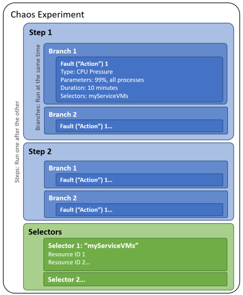

# Azure Chaos Studio Preview란?

Azure Chaos Studio는 Azure 애플리케이션에 오류를 주입하여 복원력을 개선하는 관리형 서비스입니다. 애플리케이션에 대해 통제된 오류 주입 실험을 진행하는 이 카오스 엔지니어링이라는 방식을 사용하면 지역 정전이나 VM의 CPU 활용률을 높이는 애플리케이션 오류 같이 실제 인시던트에 대한 복원력을 측정, 파악, 개선할 수 있습니다.

## Chaos Studio를 사용해야 하는 이유는 무엇인가요?

Azure에서 호스트될 새 애플리케이션을 개발하든, 기존 애플리케이션을 Azure로 마이그레이션하든, Azure에서 이미 실행되는 애플리케이션을 운영하든 애플리케이션의 복원력을 확인하고 개선하는 것은 중요합니다. 복원력은 중단을 처리하고 복구하는 시스템의 능력입니다. 애플리케이션의 가용성이 중단되면 사용자가 오류 및 실패를 겪을 수 있으며, 이로 인해 비즈니스 또는 업무에 부정적인 결과가 발생할 수 있습니다.

클라우드에서 애플리케이션을 실행할 때 이러한 부정적인 결과를 방지하려면 애플리케이션이 사용하는 서비스, 서비스 자체의 오류로 인한 중단 또는 인시던트 대응 도구 및 프로세스 중단으로 인해 발생할 수 있는 중단에 효과적으로 대응하는지 확인해야 합니다. 카오스 실험을 통해 클라우드 호스팅 애플리케이션에 오류에 대한 복원력이 있는지 테스트할 수 있습니다.

## Chaos Studio를 사용해야 하는 경우는 언제인가요?

카오스 엔지니어링은 다양한 복원력 유효성 검사 시나리오에 사용할 수 있습니다. 이러한 시나리오는 서비스 개발 및 운영 수명 주기 전반에 걸쳐 있으며 시나리오가 프로덕션 또는 사전 프로덕션 환경에서 가장 효과적으로 검증되는 오른쪽 시프트 또는 개발 환경이나 공유된 테스트 환경에서 검증될 수 있는 왼쪽 시프트로 분류해 볼 수 있습니다. 일반적으로 오른쪽 시프트 시나리오는 실제 고객 트래픽 또는 시뮬레이션된 부하를 통해 수행해야 하는 반면 왼쪽 시프트 시나리오는 실제 고객 트래픽 없이도 수행할 수 있습니다. 카오스 엔지니어링을 적용할 수 있는 몇 가지 일반적인 시나리오는 다음과 같습니다.
* 애플리케이션에 영향을 주는 인시던트를 재현하여 오류 모드를 더 정확하게 이해하거나 인시던트 후 복구 항목이 인시던트를 되풀이하지 않도록 합니다.
* 주요 사용자 이벤트 또는 시즌에 대비하여 서비스의 로드, 크기 조정, 성능 및 복원력을 검사하는 "게임 데이"를 실행합니다.
* 애플리케이션이 중대한 재해의 영향을 받는 경우 신속하게 복구하고 중요한 데이터를 보존할 수 있도록 BCDR(비즈니스 연속성/재해 복구) 훈련을 수행합니다.
* 지역적 정전, 네트워크 구성 오류, 스트레스가 높은 이벤트 또는 노이즈 인접 문제와 같은 특정 오류에 대한 애플리케이션 복원력을 테스트할 수 있도록 고가용성 훈련을 실행합니다.
* 애플리케이션 성능 벤치마크를 개발합니다.
* 프로덕션 환경에 대한 용량 요구 사항을 계획합니다.
* 스트레스 테스트 또는 부하 테스트를 실행합니다.
* 온-프레미스 또는 다른 클라우드 환경에서 마이그레이션된 서비스가 알려진 오류에 대한 복원력을 유지하는지 확인합니다.
* 클라우드 네이티브 아키텍처를 기반으로 하는 서비스에 대한 신뢰도를 구축합니다.
* 라이브 사이트 도구, 관찰 가능성 데이터 및 호출 중인 프로세스가 예기치 않은 조건에서 예상대로 작동하는지 확인합니다.

이러한 많은 시나리오에서 먼저 임시 카오스 실험을 사용하여 복원력을 구축한 다음, CI/CD 파이프라인에서 배포 게이트로 카오스 실험을 사용하여 새 배포가 복원력을 회귀하지 않는지 지속적으로 확인합니다.

## Chaos Studio는 어떻게 작동하나요?

Chaos Studio를 사용하면 안전하고 제어된 방식으로 Azure 리소스에 대한 오류 주입을 오케스트레이션할 수 있습니다. Chaos Studio의 핵심은 카오스 실험입니다. 카오스 실험은 실행해야 하는 오류와 해당 오류를 실행해야 하는 리소스를 설명하는 Azure 리소스입니다. 필요에 따라 오류를 병렬 또는 순차적으로 실행하도록 구성할 수 있습니다. Chaos Studio는 두 가지 유형의 오류를 지원합니다. - *service-direct* 오류는 설치나 계측 없이 직접 Azure 리소스에 대해 실행(예: Azure Cache for Redis 클러스터 재부팅 또는 AKS Pod에 네트워크 대기 시작 추가)되며, *agent-based* 오류는 게스트 실패를 수행하기 위해 가상 머신 또는 가상 머신 확장 집합에서 실행(예: 가상 메모리 압력 적용 또는 프로세스 종료)됩니다. 오류마다 제어할 수 있는 특정 매개 변수(예: 종료할 프로세스 또는 생성할 메모리 압력의 양)가 있습니다.

카오스 실험을 빌드할 때는 순차적으로 실행되는 단계를 하나 이상 정의하며, 각 단계는 단계 내에서 병렬적으로 실행되는 분기를 하나 이상 포함하고 각 분기는 오류를 주입하거나 특정 기간을 대기하는 등의 작업을 하나 이상 포함합니다. 마지막으로 각 작업에서 리소스 그룹을 쉽게 참조할 수 있도록 오류마다 선택기라는 그룹으로 실행할 리소스(대상)을 정리합니다.

카오스 실험은 구독 및 리소스 그룹에 있는 Azure 리소스입니다. Azure Portal 또는 Chaos Studio REST API를 사용하여 실험 상태를 생성, 업데이트, 시작, 취소, 조회할 수 있습니다.

## 다음 단계
아래 링크를 사용하여 Chaos Studio를 통해 애플리케이션 복원력을 개선하기 위한 카오스 상황을 만들고 실행합니다.
- [첫 번째 실험 만들기 및 실행](chaos-studio-tutorial-service-direct-portal.md)
- [카오스 엔지니어링 자세히 알아보기](chaos-studio-chaos-engineering-overview.md)
