# 자습서: Azure Chaos Studio를 사용하여 되풀이 실험 예약

Azure Chaos Studio를 사용하면 애플리케이션 또는 서비스의 일부가 의도적으로 실패하는 혼돈 실험을 실행하여 이러한 실패에 대해 복원력이 있는지 확인할 수 있습니다. 이러한 혼돈 실험을 정기적으로 실행하여 애플리케이션의 복원력이 퇴화하지 않았는지 확인하거나 규정 준수 요구 사항을 충족시키는 데 유용할 수 있습니다. 이 자습서에서는 [논리 앱](../logic-apps/logic-apps-overview.md)을 사용하여 하루에 한 번 실행되는 실험을 트리거합니다.

이 자습서에서는 다음 작업 방법을 알아봅니다.

> [!div class="checklist"]
> * 논리 앱 만들기 
> * 하루에 한 번 시작하는 혼돈 실험을 트리거하도록 논리 앱 구성
> * 논리 앱이 올바르게 구성되었는지 테스트

## 사전 요구 사항

- 활성 구독이 있는 Azure 계정. [체험 계정을 만듭니다](https://azure.microsoft.com/free/?WT.mc_id=A261C142F).
- 혼돈 실험. [빠른 시작을 사용하여 혼돈 실험을 만듭니다](chaos-studio-quickstart-azure-portal.md).
- 혼돈 실험의 대상이 되는 모든 리소스는 [Chaos Studio에 온보딩](chaos-studio-targets-capabilities.md)해야 합니다.

## 논리 앱 만들기
논리 앱은 일정에 따라 실행할 수 있는 자동화된 워크플로입니다. 이 자습서에 사용되는 논리 앱은 되풀이 일정을 사용하여 혼돈 실험을 시작합니다.

1. Azure 계정 자격 증명을 사용하여 [Azure Portal](https://portal.azure.com)에 로그인합니다. Azure 홈 페이지에서 **리소스 만들기** 를 선택합니다.

1. Azure Marketplace 메뉴에서 **통합** > **논리 앱** 을 선택합니다.

   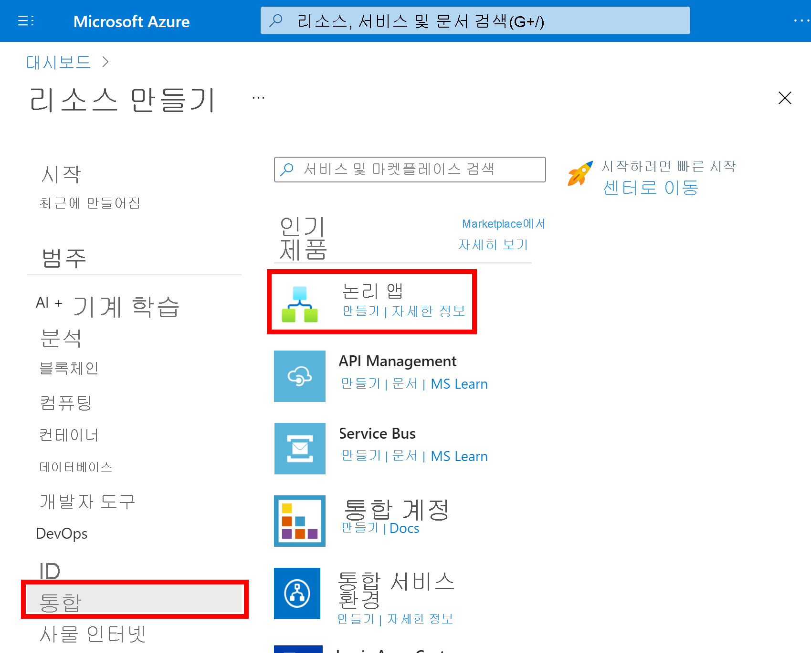

1. **논리 앱** 창에서, 만들려는 논리 앱에 대해 설명하는 정보를 여기에 입력합니다.

   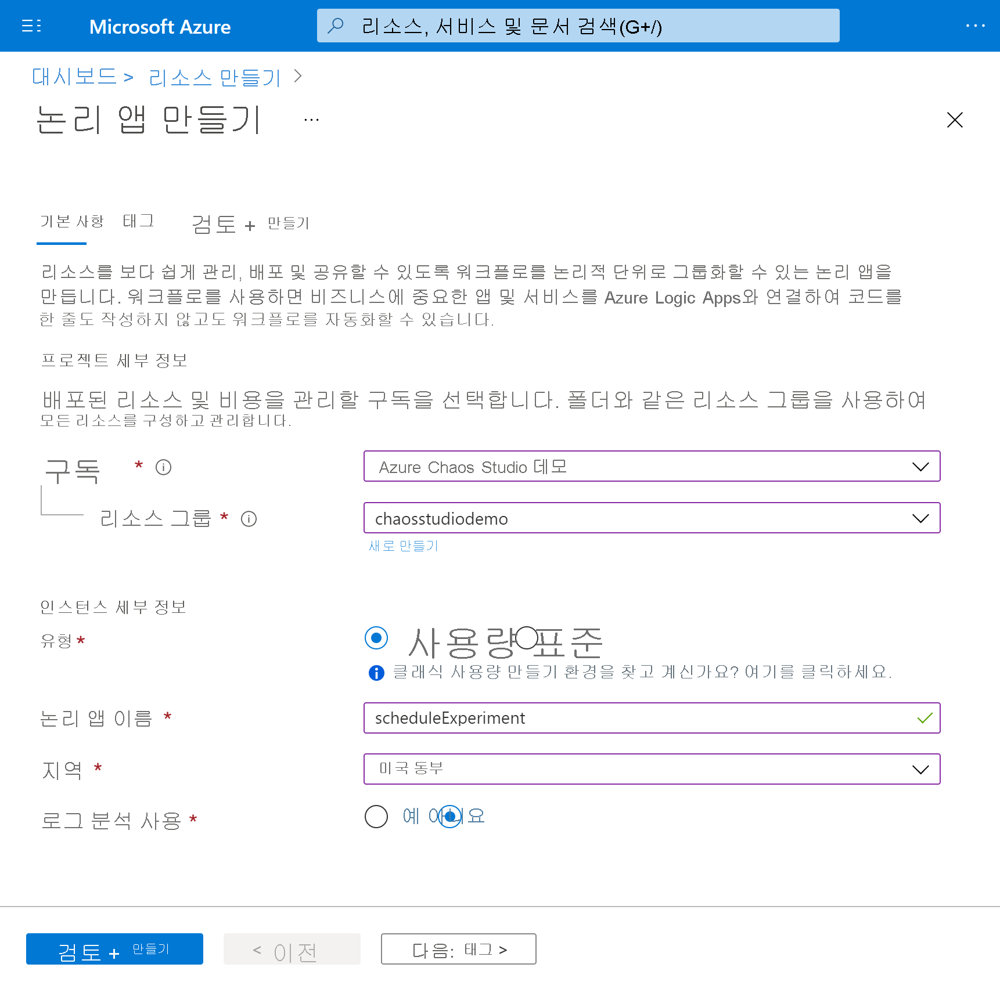

   | 속성 | 값 | Description |
   |----------|-------|-------------|
   | **구독** | <*Azure-subscription-name*> | Azure 구독 이름. 이 예에서는 `Azure Chaos Studio Demo`를 사용합니다. |
   | **리소스 그룹** | chaosstudiodemo | 관련 리소스를 구성하는 데 사용되는 [Azure 리소스 그룹](../azure-resource-manager/management/overview.md)의 이름입니다. 이 예제는 새 리소스 그룹 `chaosstudiodemo`를 만듭니다. |
   | **형식** | Consumption | [논리 앱 리소스 종류](../logic-apps/single-tenant-overview-compare.md)입니다. **사용** 으로 설정합니다. |
   | **이름** | scheduleExperiment | 문자, 숫자, 하이픈(`-`), 밑줄(`_`), 괄호(`(`, `)`) 및 마침표(`.`)만 포함할 수 있는 논리 앱의 이름입니다. 이 예에서는 `scheduleExperiment`를 사용합니다. |
   | **위치** | 미국 동부 | 논리 앱 정보를 저장할 지역입니다. 이 예에서는 `East US`를 사용합니다. |
   | **로그 분석 사용** | No | 논리 앱에 대한 진단 로깅을 설정합니다. **아니요** 로 설정합니다. |

1. 완료되면 **검토 + 만들기** 를 선택합니다. Azure가 논리 앱에 대한 정보의 유효성을 검사한 후에는 **만들기** 를 선택합니다.

1. Azure가 앱을 배포한 후 **리소스로 이동** 을 선택합니다.

   Azure가 Logic Apps 템플릿 선택 창을 엽니다. 이 창은 소개 비디오, 일반적으로 사용되는 트리거 및 논리 앱 템플릿 패턴을 보여줍니다.

## 되풀이 트리거 추가
다음으로, 지정된 일정에 따라 워크플로를 실행하는 되풀이 [트리거](../logic-apps/logic-apps-overview.md#logic-app-concepts)를 추가합니다. 모든 논리 앱은 특정 이벤트가 발생하거나 새 데이터가 특정 조건을 충족할 때 실행되는 트리거를 통해 시작되어야 합니다.

1. 비디오와 일반 트리거를 지나 **템플릿** 섹션이 나올 때까지 아래로 스크롤하고, **비어 있는 논리 앱** 을 선택합니다.

   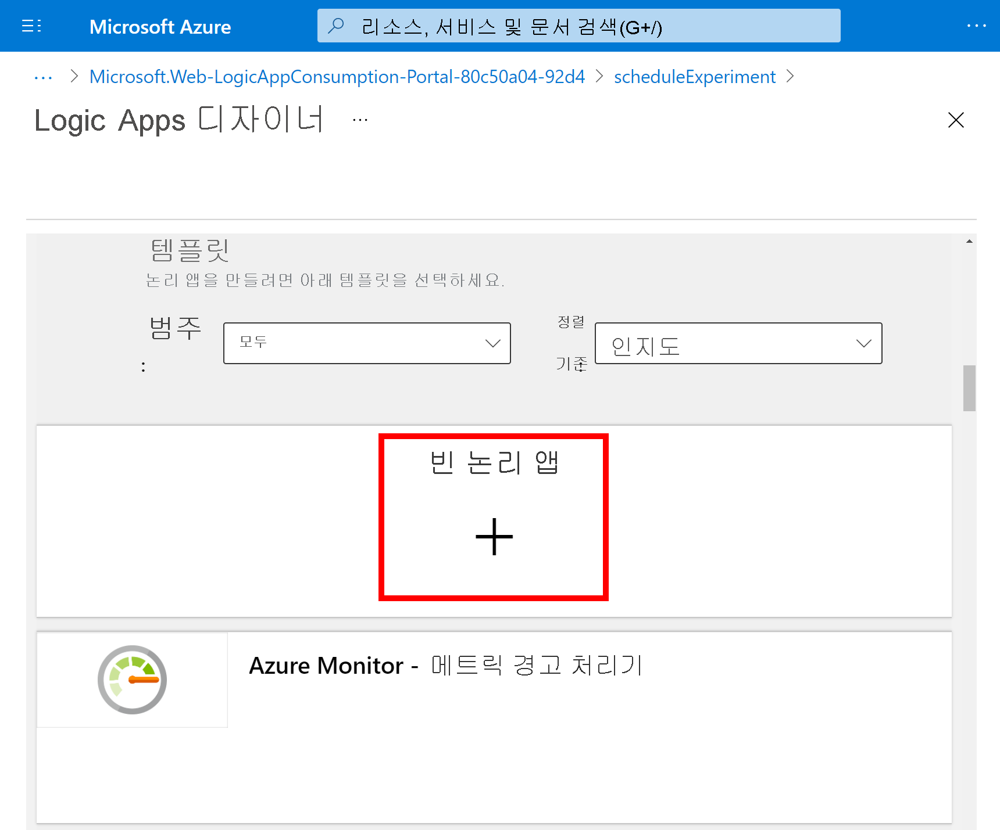

1. Logic Apps 디자이너 검색 상자에 `recurrence`를 입력하고 **Recurrence** 라는 트리거를 선택합니다.

   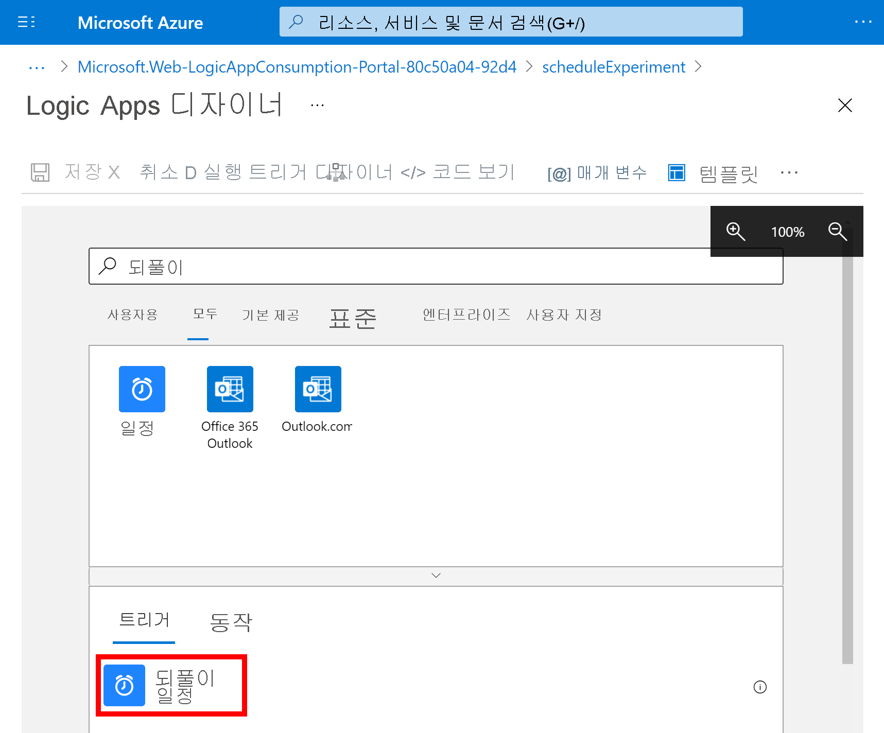

1. **되풀이** 셰이프에서 **줄임표**( **...** ) 단추, **이름 바꾸기** 를 차례로 선택합니다. `Start chaos experiment every morning` 설명이 포함되도록 트리거 이름을 바꿉니다.

   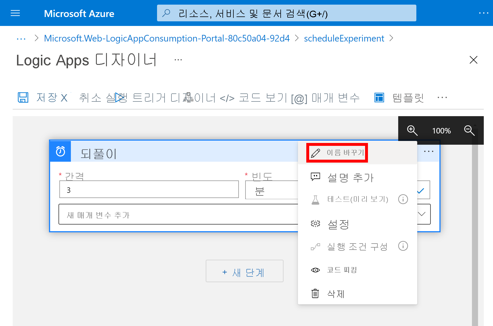

1. 트리거 내에서 이러한 속성을 여기에 설명된 대로 변경합니다.

   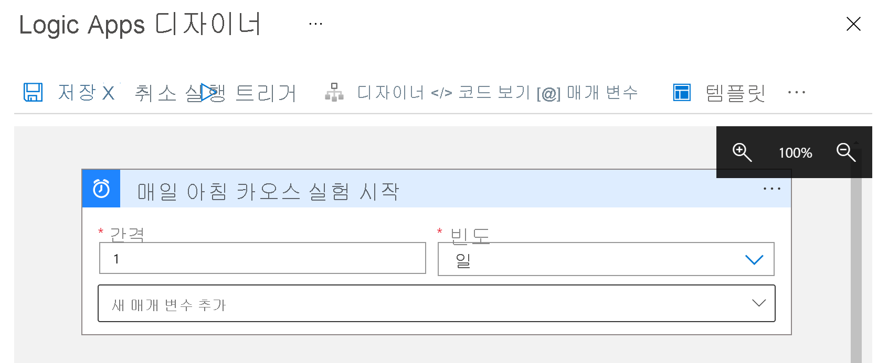

   | 속성 | 필수 | 값 | 설명 |
   |----------|----------|-------|-------------|
   | **간격** | 예 | 1 | 검사 간에 대기하는 간격의 수 |
   | **빈도** | 예 | 일 | 되풀이에 사용할 시간 단위 |

1. **간격** 및 **빈도** 아래에서 **새 매개 변수 추가** 목록을 열고, 다음 속성을 선택하여 트리거에 추가합니다.

   * **시간 선택**
   * **분 선택**

   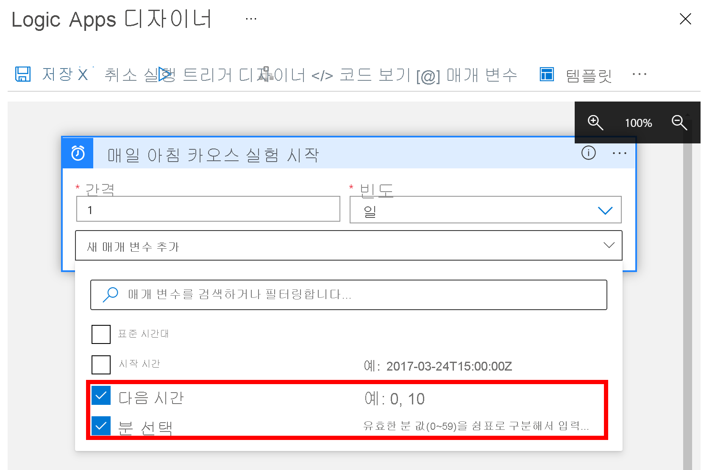

1. 이제 여기서 보여 주고 설명한 대로 속성 값을 설정합니다.

   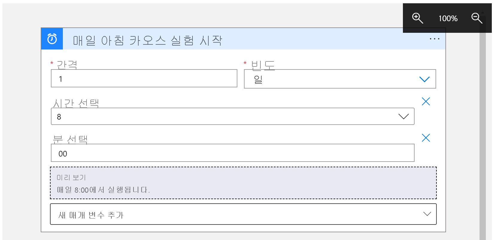

   | 속성 | 값 | Description |
   |----------|-------|-------------|
   | **시간 선택** | 8 | 이 설정은 **빈도** 를 **주** 또는 **일** 로 설정한 경우에만 사용할 수 있습니다. 이 되풀이의 실행 시간을 선택합니다. 이 예에서는 `8` 시간 표시에 실행됩니다. |
   | **분 선택** | 00 | 이 설정은 **빈도** 를 **주** 또는 **일** 로 설정한 경우에만 사용할 수 있습니다. 이 되풀이를 실행할 분을 선택합니다. 이 예에서는 0 시간 표시에 한 번 실행됩니다. |

   이 트리거는 매주 평일 오전 8시에 실행됩니다. **미리 보기** 상자는 되풀이 일정을 표시합니다. 자세한 내용은 [작업 및 워크플로 예약](../connectors/connectors-native-recurrence.md) 및 [워크플로 작업 및 트리거](../logic-apps/logic-apps-workflow-actions-triggers.md#recurrence-trigger)를 참조하세요.

1. 논리 앱을 저장합니다. 디자이너 도구 모음에서 **저장** 을 선택합니다.

## 실행 혼돈 실험 작업 추가
이제 트리거가 있으므로 실험을 시작하는 [작업](../logic-apps/logic-apps-overview.md#logic-app-concepts)을 추가합니다. 이 자습서에서는 **리소스 작업 호출** 작업을 사용하여 실험을 시작합니다.

1. 논리 앱 디자이너의 되풀이 트리거에서 **새 단계** 를 선택합니다.

1. **작업 선택** 아래에서 `Invoke resource operation`을 입력하고, **작업** 아래에서 **리소스 작업 호출** 이라는 옵션을 선택합니다.

    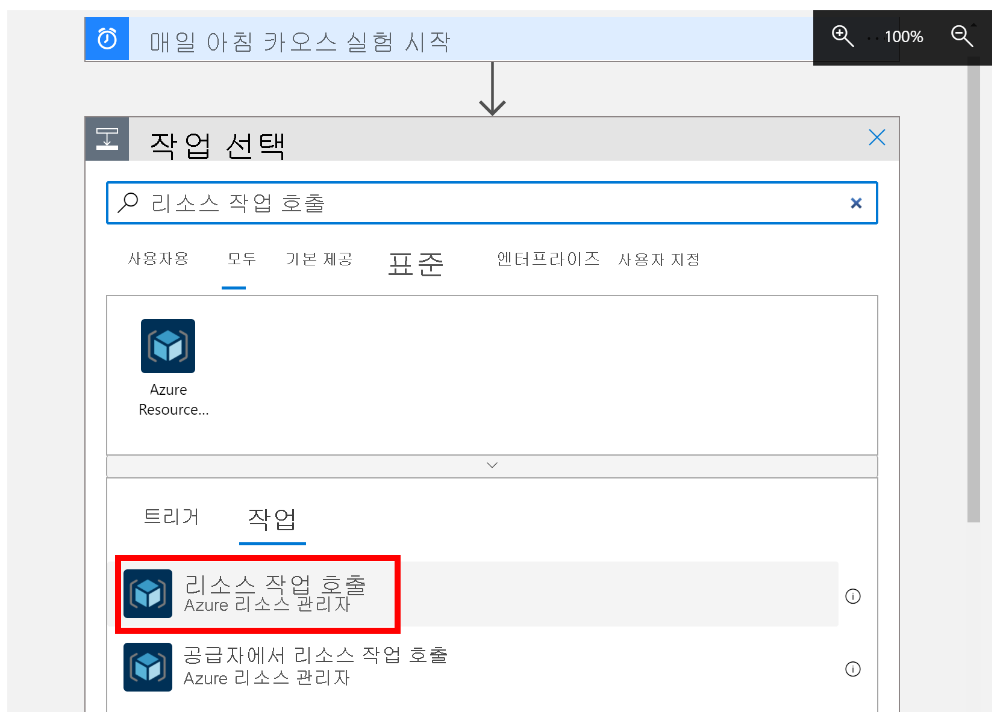

1. 실험이 저장되는 올바른 **테넌트** 를 설정하고, **로그인** 을 클릭합니다.

1. 해당 테넌트의 Azure 계정에 로그인합니다.

1. 이제 여기서 보여 주고 설명한 대로 작업 속성의 값을 설정합니다.

   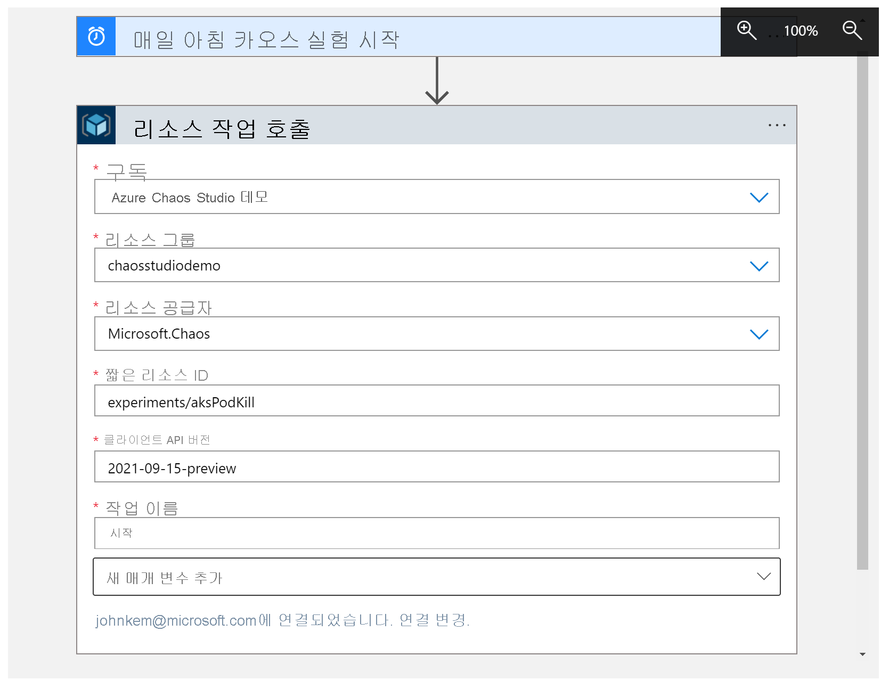

   | 속성 | 값 | Description |
   |----------|-------|-------------|
   | **구독** | <*Azure-subscription-name*> | 혼돈 실험이 배포되는 Azure 구독의 이름입니다. 이 예에서는 `Azure Chaos Studio Demo`를 사용합니다. |
   | **리소스 그룹** | <*Resource-group-name*> | 혼돈 실험이 배포되는 리소스 그룹의 이름입니다. 이 예에서는 `chaosstudiodemo`를 사용합니다. |
   | **리소스 공급자** | `Microsoft.Chaos` | Chaos Studio 리소스 공급자입니다. |
   | **짧은 리소스 ID** | `experiments/`<*Resource-group-name*> | `experiments/`가 앞에 나오는 혼돈 실험의 이름입니다. |
   | **클라이언트 API 버전** | `2021-09-15-preview` | Chaos Studio REST API 버전입니다. |
   | **작업 이름** | `start` | Chaos Studio 실험 작업의 이름입니다. 항상 `start`입니다. |

1. 논리 앱을 저장합니다. 디자이너 도구 모음에서 **저장** 을 선택합니다.

## 논리 앱 테스트
이제 논리 앱을 테스트하여 실험을 성공적으로 시작하는지 확인합니다.

1. Logic Apps Designer를 닫습니다.

1. 논리 앱 개요에서 **트리거 실행** 을 선택한 다음, **실행** 을 선택합니다.

    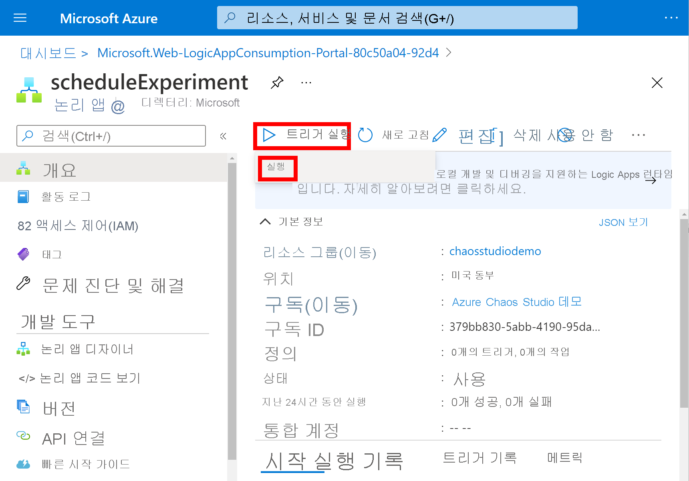

1. Azure Portal에서 혼돈 실험으로 이동하여, **상태** 가 **실행 중** 으로 설정되어 있는지 확인합니다.

    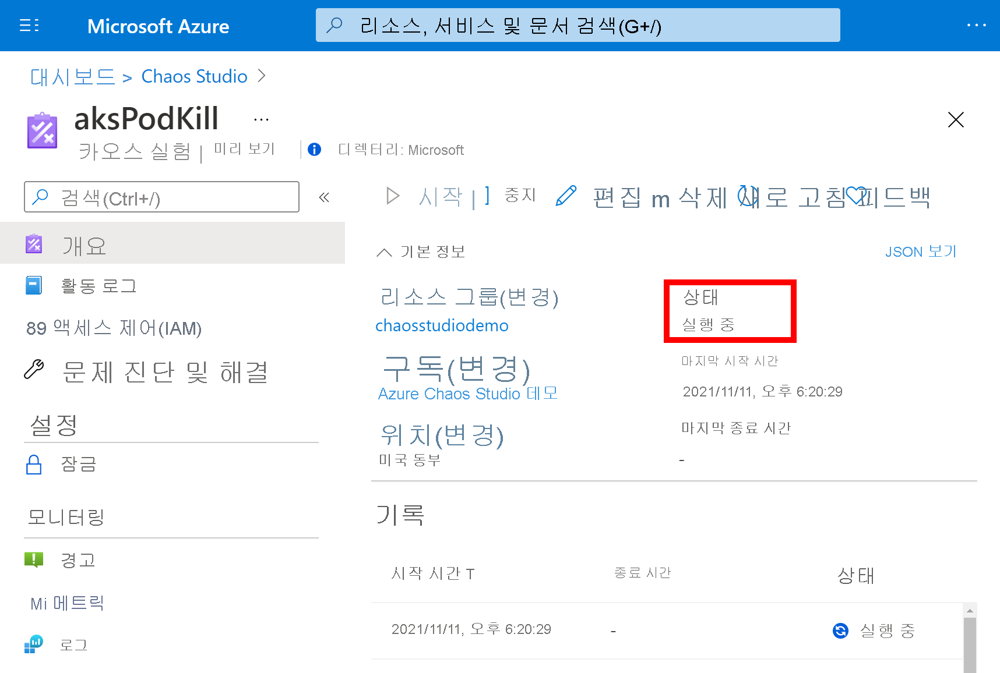

## 리소스 정리

이 애플리케이션을 계속 사용하지 않으려면 다음 단계에 따라 논리 앱을 삭제합니다.

1. 논리 앱 개요에서 **삭제** 를 클릭합니다.
1. 논리 앱 이름을 입력한 다음, **삭제** 를 클릭합니다.

## 다음 단계

이제 실험 일정을 설정했으므로 다음을 수행할 수 있습니다.
> [!div class="nextstepaction"]
> [실험 실행 및 관리](chaos-studio-run-experiment.md)
