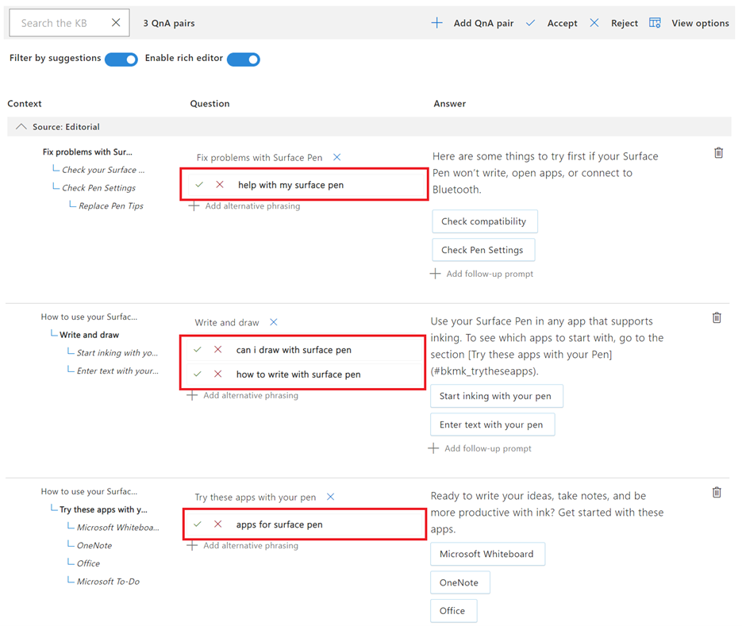

# 활성 학습을 사용하여 기술 자료 보강

이 자습서에서는 활성 학습을 사용하여 기술 자료를 보강하는 방법을 보여 줍니다. 고객이 기술 자료에 포함되지 않은 질문을 하는 것을 확인하는 경우입니다. 질문의 변형이 서로 다르게 표현되는 경우가 많습니다. 

관련 QnA 쌍에 대체 질문으로 추가된 이 변형은 실제 사용자 쿼리에 응답하도록 기술 자료를 최적화하는 데 도움이 됩니다. 편집기를 통해 수동으로 QnA 쌍에 대체 질문을 추가할 수 있습니다. 동시에 활성 학습 기능을 사용하여 사용자 쿼리에 따라 활성 학습 제안을 생성할 수도 있습니다. 그러나 활성 학습 기능을 사용하려면 기술 자료가 일반 사용자 트래픽을 수신하여 제안을 생성해야 합니다.

## 활성 학습 사용
활성 학습은 사용자 지정 질문 답변 기능에 대해 기본적으로 켜집니다. 그러나 QnA Maker GA에 대한 활성 학습 설정은 수동으로 업데이트해야 합니다. [활성 학습 켜기](../how-to/use-active-learning.md#turn-on-active-learning-for-alternate-questions)에서 자세한 내용을 확인할 수 있습니다.

활성 학습 제안을 사용해 보려면 [SampleActiveLearning.tsv](https://github.com/Azure-Samples/cognitive-services-sample-data-files/blob/master/qna-maker/knowledge-bases/SampleActiveLearning.tsv) 파일을 기술 자료에 가져오면 됩니다. 기술 자료 가져오기에 관한 자세한 내용은 [기술 자료 가져오기](migrate-knowledge-base.md)를 참조하세요.

## 활성 학습 제안 보기 및 추가/거부
활성 학습 제안을 사용할 수 있으면 **옵션 보기** > **활성 학습 제안 표시** 에서 볼 수 있습니다.

> [!div class="mx-imgBorder"]
> 

**활성 학습 제안 표시** 를 클릭하면 제안이 포함된 QnA 쌍을 필터링하는 옵션을 사용할 수 있습니다. 활성 학습이 사용되지 않거나 제안이 없으면 **활성 학습 제안 표시** 가 사용되지 않습니다.

> [!div class="mx-imgBorder"]
> 

활성 학습에서 제안한 대로 대체 질문이 있는 QnA 쌍만 필터링하도록 선택할 수 있으므로 필터링된 QnA 쌍 목록이 표시됩니다.

> [!div class="mx-imgBorder"]
> 

이제 확인 표시나 십자 표시를 사용하여 이 제안을 수락하거나 거부할 수 있습니다. 이 작업을 수행하려면 개별적으로 각 QnA 쌍으로 이동하거나 위쪽에서 **수락/거부** 옵션을 사용합니다.

> [!div class="mx-imgBorder"]
> 

활성 학습에서 제안한 대로 제안을 추가하거나 편집하도록 선택하는 경우가 아니면 기술 자료는 변경되지 않습니다. 마지막으로, 저장 후 학습을 클릭하여 변경 내용을 저장합니다.

> [!NOTE] 
> 활성 학습의 버전 및 서비스 설정을 확인하려면 [활성 학습을 사용하는 방법](../how-to/use-active-learning.md)에 관한 문서를 참조하세요.

## 편집기를 사용하여 대체 질문 추가

활성 학습은 기술 자료를 적중하는 사용자 쿼리를 기반으로 대체 질문을 자동으로 제안하지만 편집기를 사용하여 질문의 변형을 추가할 수도 있습니다.
대체 질문을 추가할 QnA 쌍을 선택하고 **대체 구문 추가** 를 선택합니다.

> [!div class="mx-imgBorder"]
> 

QnA 쌍에 추가된 대체 질문은 다음가 같이 표시됩니다.

> [!div class="mx-imgBorder"]
> 

활성 학습과 함께 대체 질문을 추가하면 비슷한 사용자 쿼리에 동일한 응답을 제공하는 데 도움이 되는 질문의 변형으로 기술 자료가 더욱 보강됩니다.

> [!NOTE] 
> 대체 질문에는 중지 단어가 많기 때문에 예상된 응답의 정확도에 영향을 미치지 않을 수 있습니다. 따라서 대체 질문 간 유일한 차이점이 중지 단어에 있는 경우에는 대체 질문이 필요하지 않습니다.

중지 단어 목록은 [중지 단어](https://github.com/Azure-Samples/azure-search-sample-data/blob/master/STOPWORDS.md) 목록에서 확인할 수 있습니다.

## 다음 단계

> [!div class="nextstepaction"]
> [동의어를 사용하여 응답 품질 향상](adding-synonyms.md)