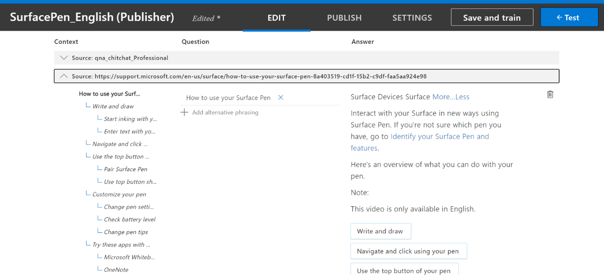

# 여러 언어의 기술 자료 만들기

이 자습서는 여러 언어로 기술 자료를 만드는 과정을 안내합니다. [Surface 펜 FAQ](https://support.microsoft.com/surface/how-to-use-your-surface-pen-8a403519-cd1f-15b2-c9df-faa5aa924e98) URL을 사용하여 독일어와 영어로 기술 자료를 만듭니다. 그런 다음 기술 자료를 게시하고 [GenerateAnswerAPI](/rest/api/cognitiveservices-qnamaker/QnAMaker4.0/Runtime/GenerateAnswer)를 사용하여 쿼리함으로써 원하는 언어로 FAQ에 대한 답변을 얻습니다.

## 독일어로 기술 자료 만들기

둘 이상의 언어로 기술 자료를 만들 수 있으려면 QnA 서비스의 첫 번째 KB(기술 자료)를 만들 때 언어 설정을 지정해야 합니다.

> [!NOTE]
> 서비스에 여러 언어로 된 기술 자료를 추가할 수 있는 옵션은 Text Analytics의 기능인 사용자 지정 질문 대답의 일부로만 사용할 수 있습니다.
>
> QnA Maker의 GA 버전을 사용하는 경우 각 고유 언어에 대해 별도의 QnA Maker 리소스를 만들어야 합니다.

> [!div class="mx-imgBorder"]
> 

**2단계**: “이 서비스에 여러 언어로 된 기술 자료 추가”를 사용하도록 설정하고 “언어” 드롭다운 목록에서 KB 언어로 **독일어** 를 선택합니다.
3단계와 4단계에서 관련 세부 정보를 입력하고 마지막으로 **KB 만들기** 를 선택합니다.
 
이 단계에서 QnA Maker는 문서를 읽고 원본 URL에서 QnA 쌍을 추출하여 독일어 기술 자료를 만듭니다. 기술 자료의 내용을 편집할 수 있는 기술 자료 페이지가 열립니다.

> [!div class="mx-imgBorder"]
> 

## 영어로 기술 자료 만들기

이제 2단계 및 4단계에서 언어별 변경 사항을 적용한 상태에서 위의 단계를 반복하여 영어로 기술 자료를 만듭니다.
1.  **2단계**: 언어를 **영어** 로 선택합니다.
2.  **4단계**: 선택한 언어의 원본 파일을 선택하여 영어로 기술 자료를 만듭니다.
기술 자료가 만들어지면 아래와 같이 QnA Maker가 영어로 생성한 관련 QnA 쌍을 볼 수 있습니다.

> [!div class="mx-imgBorder"]
> 

## 기술 자료 게시 및 쿼리

이제 두 가지 기술 자료를 게시하고 [GenerateAnswerAPI](/rest/api/cognitiveservices-qnamaker/QnAMaker4.0/Runtime/GenerateAnswer)를 사용하여 원하는 언어로 쿼리할 준비가 되었습니다. 기술 자료가 게시되면 기술 자료 쿼리에 대한 세부 정보를 제공하는 다음 페이지가 표시됩니다.

> [!div class="mx-imgBorder"]
> 

수신되는 사용자 쿼리의 언어는 [언어 감지 API](../../text-analytics/how-tos/text-analytics-how-to-language-detection.md)로 감지할 수 있으며 사용자는 감지된 언어에 따라 적절한 엔드포인트 및 기술 자료를 호출할 수 있습니다.