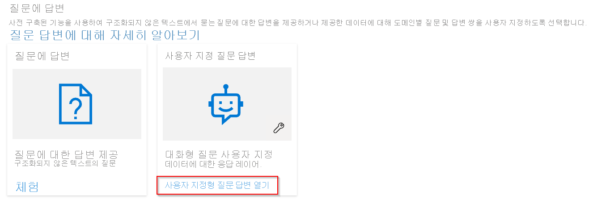
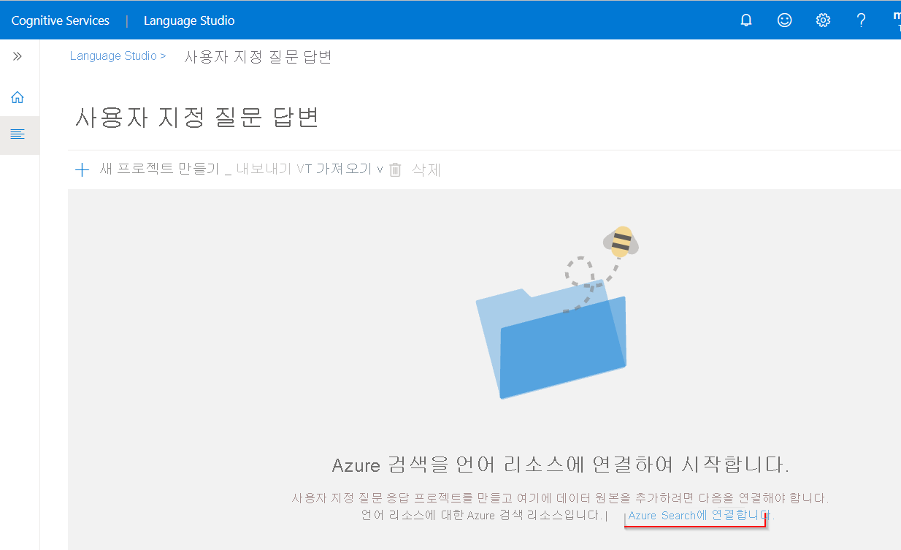
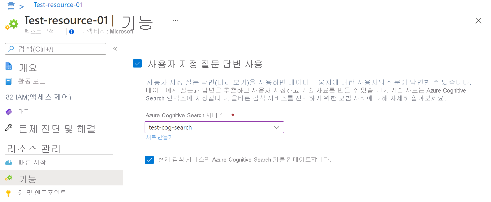
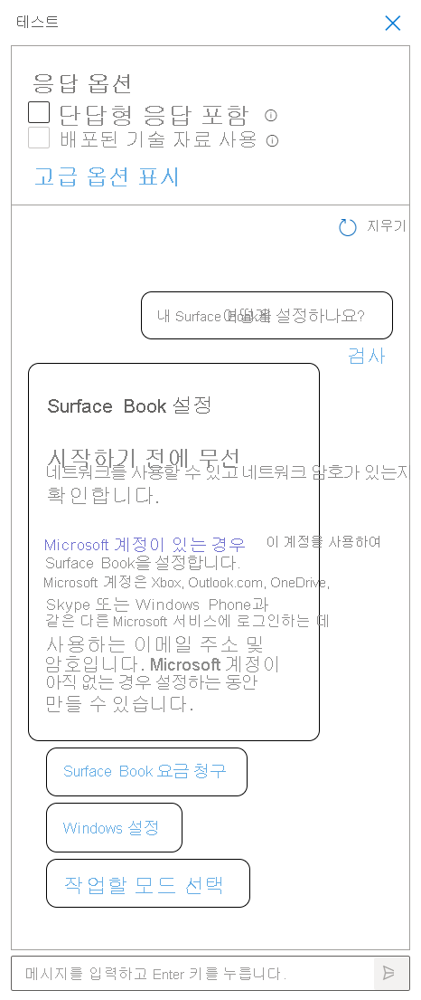
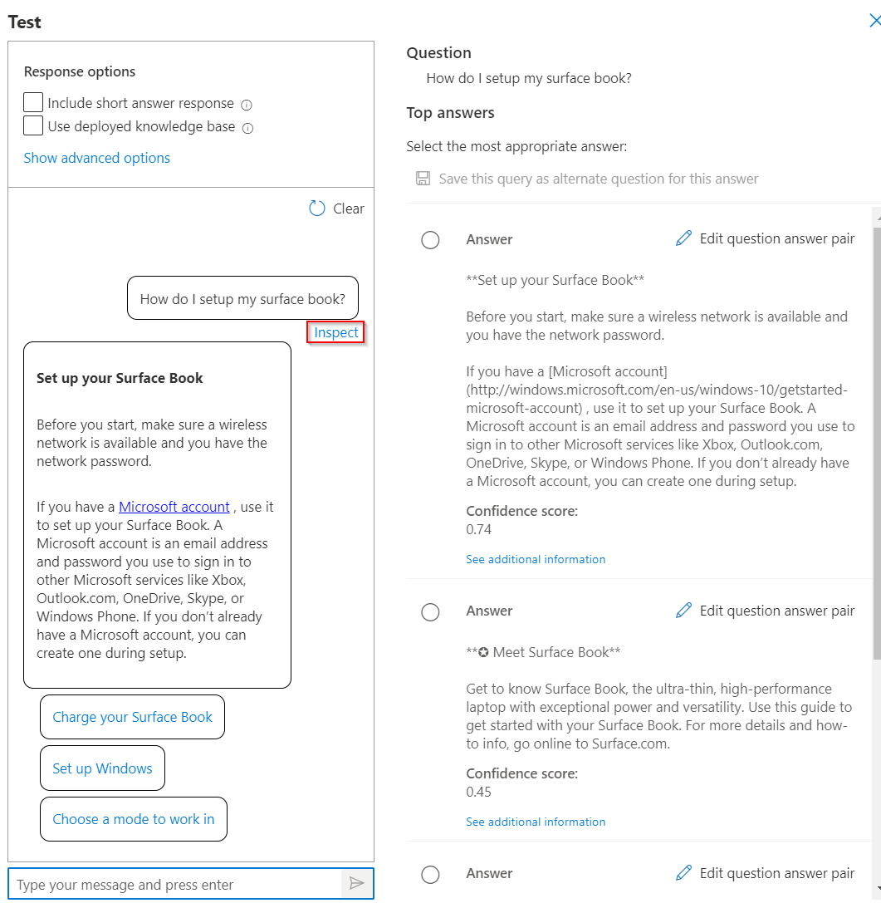
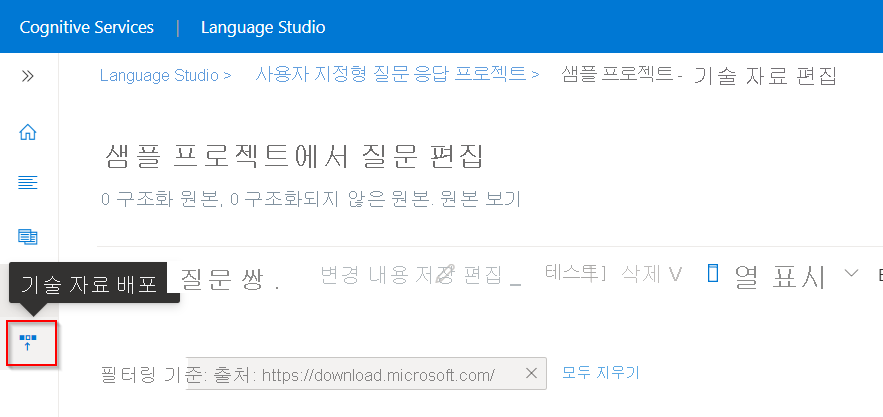
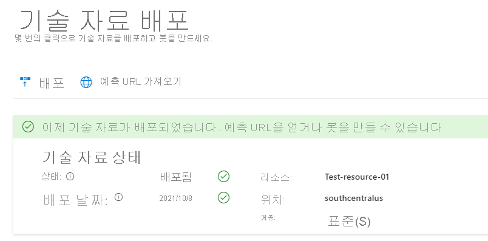

FAQ 또는 제품 매뉴얼과 같은 자신의 콘텐츠에서 질문 답변 프로젝트를 만들 수 있습니다. 이 문서에는 질문에 답하기 위해 제품 매뉴얼에서 질문 답변 프로젝트를 만드는 예가 포함되어 있습니다.

## 사전 요구 사항

> [!div class="checklist"]
> * Azure 구독이 아직 없는 경우 시작하기 전에 [체험 계정](https://azure.microsoft.com/free/cognitive-services/)을 만듭니다.
> * 사용자 지정 질문 답변 기능이 사용하도록 설정된 [언어 리소스](https://aka.ms/create-language-resource). 리소스를 만들 때 선택한 Azure Active Directory ID, 구독, 언어 리소스 이름을 기억합니다.

## 첫 번째 질문 답변 프로젝트 만들기

1. Azure 자격 증명으로 [Language Studio](https://language.azure.com/)에 로그인합니다.

2. **질문 답변** 섹션까지 아래로 스크롤하고 **사용자 지정 질문 답변 열기** 를 선택합니다.

    > [!div class="mx-imgBorder"]
    > 

3. 리소스가 아직 Azure Search에 연결되지 않은 경우 **Azure Search에 연결** 을 선택합니다. 그러면 Azure Portal에서 리소스의 **기능** 창에 대한 새 브라우저 탭이 열립니다.

    > [!div class="mx-imgBorder"]
    > 

4. **사용자 지정 질문 답변 사용** 을 선택하고 연결할 Azure Search 리소스를 선택한 다음 **적용** 을 선택합니다.

    > [!div class="mx-imgBorder"]
    > 

5. 언어 스튜디오 탭으로 돌아갑니다. 변경 사항을 리소스에 등록하려면 이 페이지를 새로 고쳐야 할 수 있습니다. **새 프로젝트 만들기** 를 선택합니다.

6. **이 리소스에서 만든 모든 프로젝트의 언어를 설정하려고 합니다** >**영어** 를 선택한 후 >**다음** 을 선택합니다.

7. **Sample-project** 라는 프로젝트 이름, **나의 첫 질문 답변 프로젝트** 의 설명을 입력하고 기본 답변은 **답변을 찾을 수 없음** 설정으로 둡니다.

8. 선택 사항을 검토하고 **프로젝트 만들기** 를 선택합니다.

9. **원본 관리** 페이지에서 **원본 추가** > **URL** 을 선택합니다.

10. **URL 추가** 를 선택하고 다음 값을 입력한 다음 **모두 추가** 를 선택합니다.

    |URL 이름|URL 값|
    |--------|---------|
    |Surface Book 사용자 가이드 |https://download.microsoft.com/download/7/B/1/7B10C82E-F520-4080-8516-5CF0D803EEE0/surface-book-user-guide-EN.pdf |

    추출 프로세스는 문서를 읽고 질문과 답변을 확인하는 데 몇 분 정도가 걸립니다.

    원본을 성공적으로 추가한 후 원본 내용을 편집하여 더 많은 사용자 지정 질문 답변 세트를 추가할 수 있습니다.

## 프로젝트 테스트

1. 원본에 대한 링크를 선택하면 기술 자료 편집 페이지가 열립니다.

2. 메뉴 모음에서 **테스트** 를 선택하고 **Surface Book을 어떻게 설정하나요?** 질문을 입력합니다. 원본 URL에서 자동으로 식별되고 추출된 질문 답변 쌍을 기반으로 답변이 생성됩니다.

    > [!div class="mx-imgBorder"]
    > 

    **단답형 답변 포함** 확인란을 선택하면 질문을 할 때 테스트 창에 답변 구절과 함께 정확한 답변(가능한 경우)도 표시됩니다.

3. 응답을 더 자세히 조사하려면  **검사** 를 선택합니다. 테스트 창은 프로젝트를 배포하기 전에 프로젝트에 대한 변경 사항을 테스트하는 데 사용됩니다.

    > [!div class="mx-imgBorder"]
    > 

    **검사** 인터페이스에서 이 응답이 질문에 답하고 주어진 질문 및 답변 응답 쌍을 직접 편집할 것이라는 신뢰도 수준을 확인할 수 있습니다.

## 프로젝트 배포

1. 기술 자료 배포 아이콘을 선택하여 기술 자료 배포 메뉴로 들어갑니다.

    > [!div class="mx-imgBorder"]
    > 

    프로젝트를 배포하면 프로젝트 콘텐츠가 Azure Search의 `test` 인덱스에서 `prod` 인덱스로 이동합니다.

2. **배포** >를 선택한 다음 메시지가 표시되면 **배포** 를 다시 선택합니다.

    > [!div class="mx-imgBorder"]
    > 

    이제 프로젝트가 성공적으로 배포되었습니다. 엔드포인트를 사용하여 답변할 사용자 지정 애플리케이션 또는 봇에서 질문에 답변할 수 있습니다.
