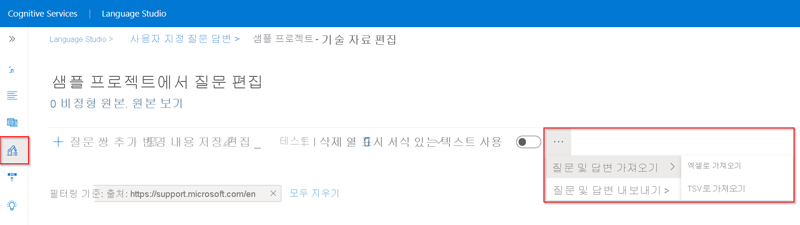
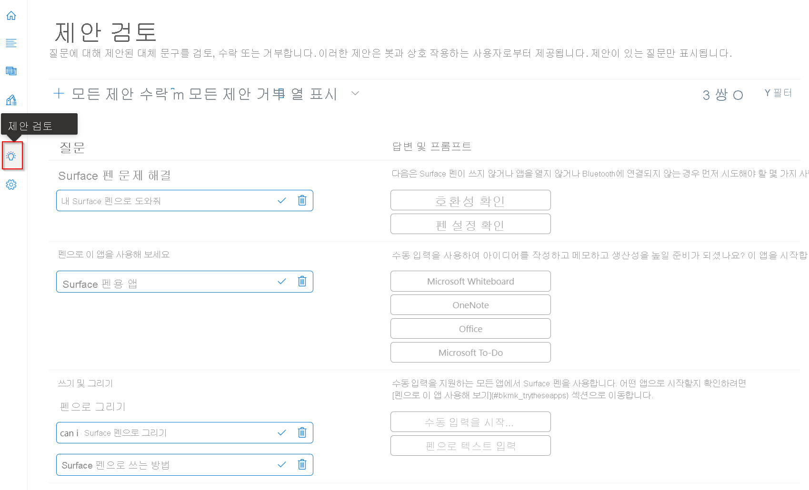
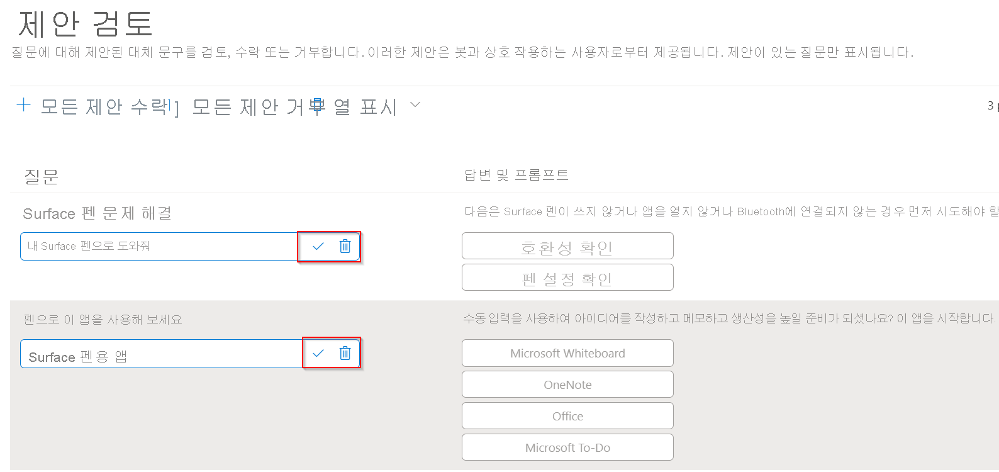

# <a name="enrich-your-project-with-active-learning"></a>활성 학습을 통해 프로젝트 보강

이 자습서에서는 다음과 같은 작업을 수행하는 방법을 살펴봅니다.

<!-- green checkmark -->
> [!div class="checklist"]
> * 활성 학습 테스트 파일 다운로드
> * 기존 프로젝트로 테스트 파일 가져오기
> * 활성 학습 제안 수락/거부
> * 대체 질문 추가

이 자습서에서는 활성 학습을 사용하여 질문 응답 프로젝트를 개선하는 방법을 보여 줍니다. 고객이 프로젝트에 포함되지 않은 질문을 하는 것을 확인하는 경우입니다. 질문의 변형이 서로 다르게 표현되는 경우가 많습니다.

관련 질문 답변 쌍에 대체 질문으로 추가된 이 변형은 실제 사용자 쿼리에 응답하도록 프로젝트를 최적화하는 데 도움이 됩니다. 편집기를 통해 질문 답변 쌍에 대체 질문을 수동으로 추가할 수 있습니다. 동시에 활성 학습 기능을 사용하여 사용자 쿼리에 따라 활성 학습 제안을 생성할 수도 있습니다. 그러나 활성 학습 기능을 사용하려면 기술 자료가 일반 사용자 트래픽을 수신하여 제안을 생성해야 합니다.

## <a name="enable-active-learning"></a>활성 학습 사용

활성 학습은 질문 답변 지원 리소스에 대해 기본적으로 켜져 있습니다.

활성 학습 제안을 사용해 보려면 [SampleActiveLearning.tsv](https://github.com/Azure-Samples/cognitive-services-sample-data-files/blob/master/qna-maker/knowledge-bases/SampleActiveLearning.tsv) 파일을 새 프로젝트로 가져오면 됩니다.

## <a name="download-file"></a>파일 다운로드

명령 프롬프트에서 다음 명령을 실행하여 `SampleActiveLearning.tsv` 파일의 로컬 복사본을 다운로드합니다.

```cmd
curl "https://github.com/Azure-Samples/cognitive-services-sample-data-files/blob/master/qna-maker/knowledge-bases/SampleActiveLearning.tsv" --output SampleActiveLearning.tsv
```

## <a name="import-file"></a>파일 가져오기

프로젝트의 기술 자료 편집 창에서 메뉴 > **질문 및 답변 가져오기** > **TSV로 가져오기** 에서 `...`(줄임표) 아이콘을 선택합니다. **파일 선택** 을 선택하여 이전 단계에서 컴퓨터에 다운로드한 `SampleActiveLearning.tsv` 복사본을 찾은 다음, 완료를 선택합니다.

> [!div class="mx-imgBorder"]
> [  ]( ../media/active-learning/import-questions.png#lightbox)

## <a name="view-and-addreject-active-learning-suggestions"></a>활성 학습 제안 보기 및 추가/거부

테스트 파일 가져오기가 완료되면 검토 제안 창에서 활성 학습 제안을 볼 수 있습니다.

> [!div class="mx-imgBorder"]
> [  ]( ../media/active-learning/review-suggestions.png#lightbox)

이제 이러한 제안을 수락하거나 메뉴 모음의 옵션을 사용하여 **모든 제안을 수락** 하거나 **모든 제안을 거부** 할 수 있습니다.

또는 개별 제안을 수락하거나 거부하려면 **제안 검토** 페이지에서 개별 질문 옆에 표시되는 확인 표시(수락) 기호 또는 휴지통(거부) 기호를 선택합니다.

> [!div class="mx-imgBorder"]
> [  ]( ../media/active-learning/accept-reject.png#lightbox)

## <a name="add-alternate-questions"></a>대체 질문 추가

활성 학습은 프로젝트에 도달하는 사용자 쿼리를 기반으로 대체 질문을 자동으로 제안하지만 질문 답변 쌍에 **대체 구 추가** 를 선택하여 기술 자료 편집 페이지에서 질문의 변형을 추가할 수도 있습니다.

활성 학습과 함께 대체 질문을 추가하면 사용자 쿼리에 일관된 답변을 제공하는 데 도움이 되는 질문의 변형으로 프로젝트가 더욱 보강됩니다.

> [!NOTE]
> 대체 질문에 중지 단어가 많으면 응답의 정확성에 부정적인 영향을 줄 수 있습니다. 따라서 대체 질문 간 유일한 차이점이 중지 단어에 있는 경우에는 대체 질문이 필요하지 않습니다.
> 중지 단어 목록을 검사하려면 [중지 단어 문서](https://github.com/Azure-Samples/azure-search-sample-data/blob/master/STOPWORDS.md)를 참조하세요.

## <a name="next-steps"></a>다음 단계

> [!div class="nextstepaction"]
> [동의어를 사용하여 응답 품질 향상](adding-synonyms.md)
