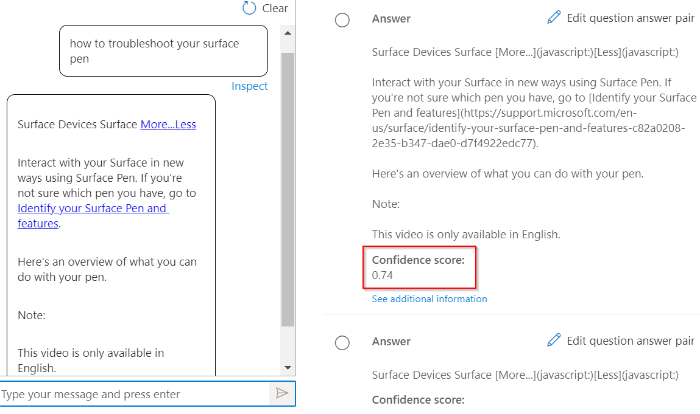
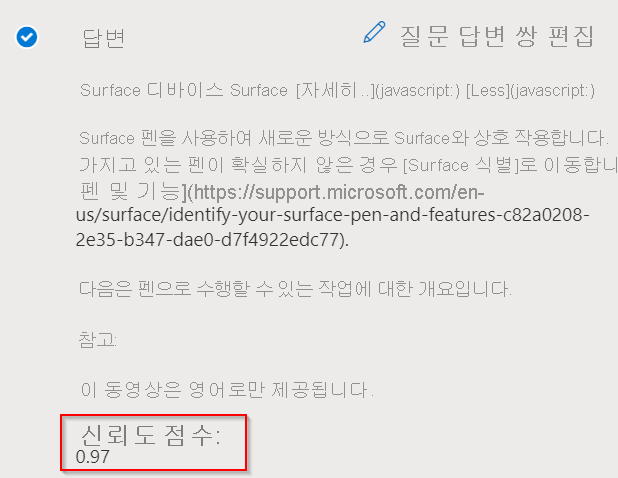

# <a name="improve-quality-of-response-with-synonyms"></a>동의어를 사용하여 응답 품질 향상

이 자습서에서는 다음과 같은 작업을 수행하는 방법을 살펴봅니다.

> [!div class="checklist"]
> * 동의어를 추가하여 응답 품질 개선
> * 테스트 창의 검사 옵션을 통해 응답 품질 평가

이 자습서에서는 동의어를 사용하여 응답의 품질을 향상시킬 수 있는 방법을 보여줍니다. 사용자가 대체 폼, 동의어 또는 단어 머리글자어를 사용하는 경우 쿼리에 대한 정확한 응답을 얻지 못한다고 가정합니다. 따라서 그들은 [Authoring API](/rest/api/cognitiveservices-qnamaker/QnAMaker4.0/Alterations)를 사용하여 키워드에 대한 동의어를 추가하여 응답 품질을 개선하기로 결정했습니다.

## <a name="add-synonyms-using-authoring-api"></a>Authoring API를 사용하여 동의어 추가

결과를 향상시키기 위해 다음과 같은 단어와 변경 내용을 추가해 보겠습니다.

|Word | 변경|
|--------------|--------------------------------|
| 문제 해결 | `troubleshoot`, `trouble-shoot`|
| 화이트보드   | `white-board`, `white board`   |
| bluetooth    | `blue-tooth`, `blue tooth`     |

```json
{
    "synonyms": [
        {
            "alterations": [
                "fix problems",
                "troubleshoot",
                "trouble-shoot",
                ]
        },
        {
            "alterations": [
                "whiteboard",
                "white-board",
                "white board"
            ]
        },
        {
            "alterations": [
                "bluetooth",
                "blue-tooth",
                "blue tooth"
            ]
        }
    ]
}

```

질문 및 답변 쌍 "Surface 펜으로 문제 해결"의 경우 동의어 "문제 해결"을 사용하여 만든 쿼리에 대한 응답을 비교합니다.

## <a name="response-before-addition-of-synonym"></a>동의어 추가 전 응답

> [!div class="mx-imgBorder"]
> [  ]( ../media/adding-synonyms/score.png#lightbox)

## <a name="response-after-addition-of-synonym"></a>동의어 추가 후 응답

> [!div class="mx-imgBorder"]
> [  ]( ../media/adding-synonyms/score-improvement.png#lightbox)

여기에서 볼 수 있듯이 `troubleshoot`가 동의어로 추가되지 않은 경우 "표면 펜 문제를 해결하는 방법"에 대해 신뢰도가 낮은 응답을 받았습니다. 그러나 `troubleshoot`를 "문제 해결"에 동의어로 추가한 후에는 신뢰도 점수가 높은 쿼리에 대한 올바른 응답을 받게 됩니다. 이러한 동의어가 추가되면 결과의 관련성이 개선되어 사용자 환경이 개선되었습니다.

> [!NOTE]
> 동의어는 대/소문자를 구분하지 않습니다. 중지 단어를 동의어로 추가하는 경우에도 동의어가 예상대로 작동하지 않을 수 있습니다. 중지 단어 목록은 [중지 단어 목록](https://github.com/Azure-Samples/azure-search-sample-data/blob/master/STOPWORDS.md)에서 확인할 수 있습니다.

예를 들어 정보 기술에 대한 약어 **IT** 를 추가하면 **IT** 는 중지 단어이고 쿼리가 처리될 때 필터링되기 때문에 시스템에서 정보 기술을 인식하지 못할 수 있습니다.

## <a name="next-steps"></a>다음 단계

> [!div class="nextstepaction"]
> [여러 언어의 기술 자료 만들기](multiple-languages.md)
