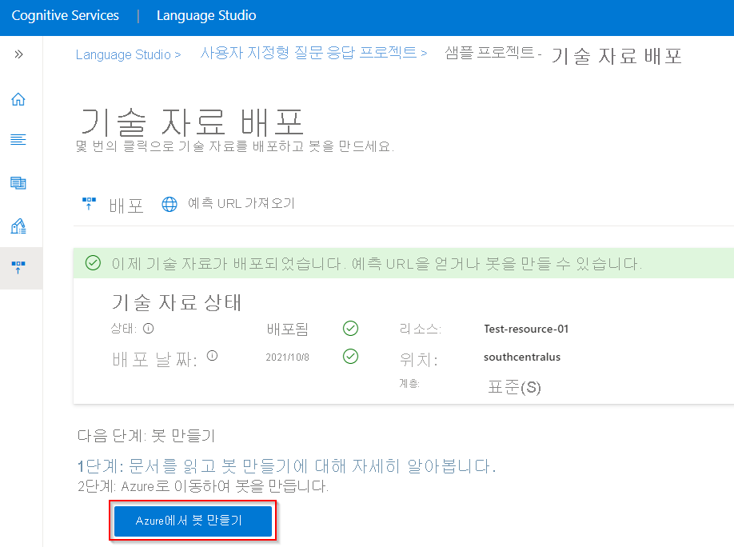
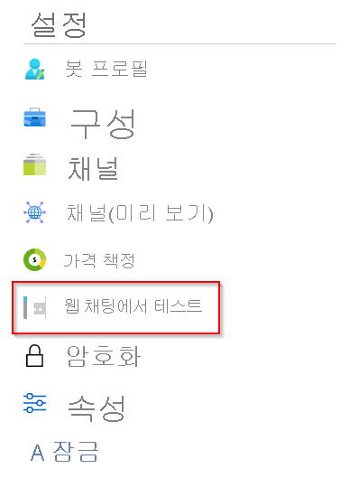
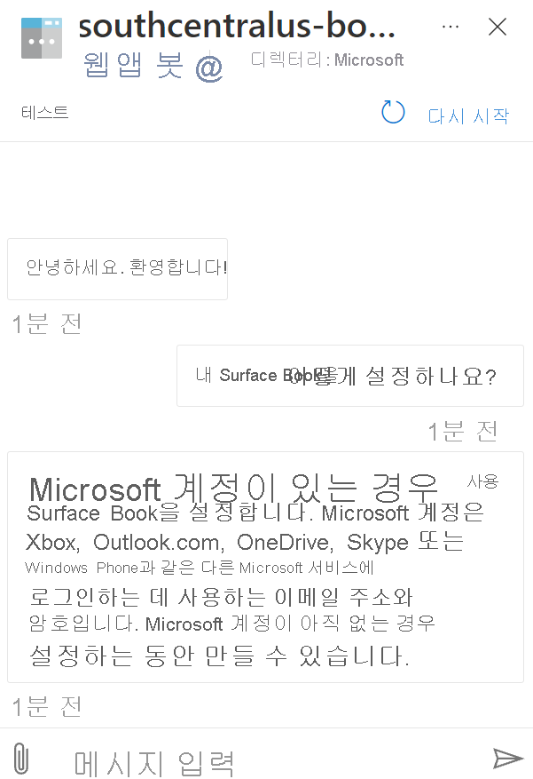
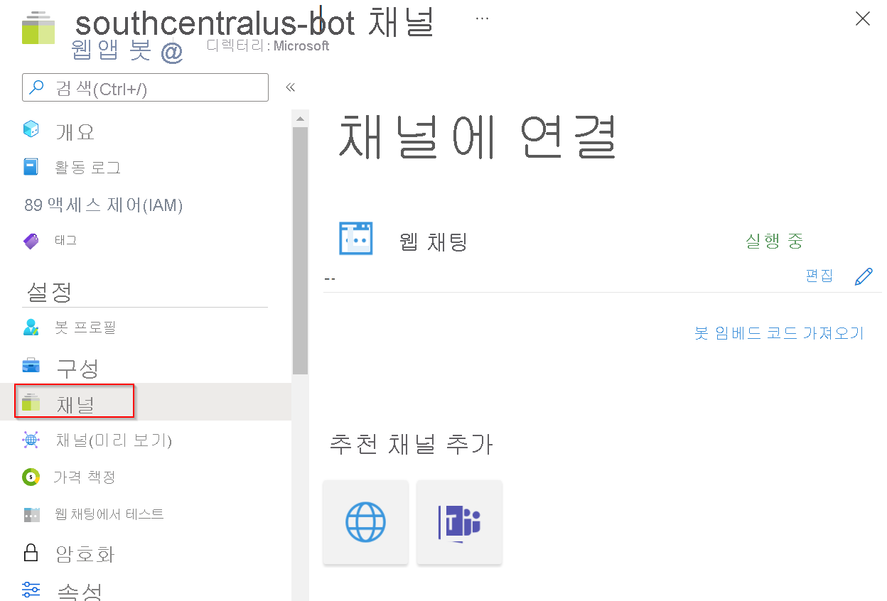

# 자습서: FAQ 봇 만들기

코드 없이 사용자 지정 질문 답변 및 Azure [Bot Service](https://azure.microsoft.com/services/bot-service/)를 사용하여 FAQ 봇을 만듭니다.

이 자습서에서는 다음과 같은 작업을 수행하는 방법을 살펴봅니다.

<!-- green checkmark -->
> [!div class="checklist"]
> * 질문 답변 프로젝트/기술 자료를 Azure Bot Service에 연결
> * 봇 배포
> * 웹 채팅에서 봇과 채팅
> * 지원되는 채널에서 봇 사용

## 기술 자료 만들기 및 게시

[시작하기 문서](../how-to/create-test-deploy.md)를 따르세요. 기술 자료가 성공적으로 배포되면 이 문서를 시작할 준비가 된 것입니다.

## 봇 만들기

프로젝트/기술 자료를 배포한 후 **기술 자료 배포** 페이지에서 봇을 만들 수 있습니다.

* 개별 봇의 여러 Azure 지역 또는 가격 책정 계획에 대한 동일한 기술 자료를 가리키는 여러 봇을 신속하게 만들 수 있습니다.

* 기술 자료를 변경하고 다시 배포할 때 봇에 추가 작업을 수행할 필요가 없습니다. 이미 기술 자료와 함께 작동하도록 구성되어 있으며 향후 모든 기술 자료 변경 내용과 호환됩니다. 기술 자료를 게시할 때마다 기술 자료에 연결된 모든 봇이 자동으로 업데이트됩니다.

1. Language Studio 포털의 질문 답변 **기술 자료 배포** 페이지에서 **봇 만들기** 를 선택합니다.

    > [!div class="mx-imgBorder"]
    > 

1. 새 브라우저 탭에서 Azure Portal의 Azure Bot Service 만들기 페이지가 열립니다. Azure Bot Service를 구성합니다.

    |설정 |값|
    |----------|---------|
    | 봇 핸들| 봇의 고유 식별자입니다. 이 값은 앱 이름과 구별되어야 합니다. |
    | 구독 | 구독 선택 |
    | Resource group | 기존 리소스 그룹을 선택하거나 새로 만듭니다. |
    | 위치 | 원하는 위치를 선택합니다. |
    | 가격 책정 계층 | 가격 책정 계층 선택 |
    |앱 이름 | 봇의 앱 서비스 이름입니다. |
    |SDK 언어 | C# 또는 Node.js입니다. 봇이 만들어지면 로컬 개발 환경에 코드를 다운로드하고 개발 프로세스를 계속할 수 있습니다. |
    | QnA 인증 키 | 이 키는 배포된 질문 답변 프로젝트/기술 자료에 자동으로 채워집니다. |
    | 앱 서비스 플랜/위치 | 이 값은 자동으로 채워지므로 이 값을 변경하지 마세요. |

1. 봇을 만든 후 **봇 서비스** 리소스를 엽니다.
1. **설정** 아래에서 **웹 채팅에서 테스트** 를 선택합니다.

    > [!div class="mx-imgBorder"]
    > 

1. **메시지 입력** 의 채팅 프롬프트에서 다음을 입력합니다.

    `How do I setup my surface book?`

    채팅 봇은 기술 자료의 답변으로 응답합니다.

    > [!div class="mx-imgBorder"]
    > 

## 봇을 채널과 통합

만든 봇 서비스 리소스에서 **채널** 을 선택합니다. 추가 [지원되는 채널](/azure/bot-service/bot-service-manage-channels)에서 봇을 활성화할 수 있습니다.

   >[!div class="mx-imgBorder"]
   >

## 리소스 정리

이 애플리케이션을 계속 사용하지 않으려면 관련 질문 답변 및 봇 서비스 리소스를 삭제합니다.

## 다음 단계

멀티 턴 프롬프트로 FAQ 봇을 사용자 지정하는 방법을 알아보려면 다음 문서로 이동합니다.
> [!div class="nextstepaction"]
> [다중 턴 프롬프트](guided-conversations.md)
