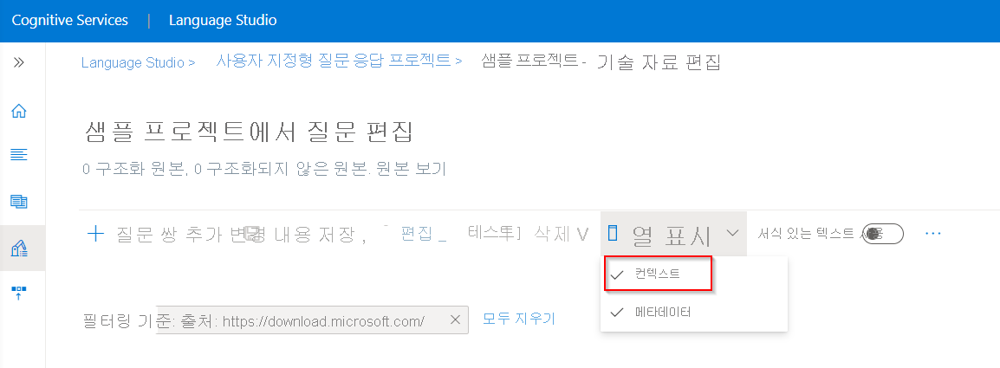
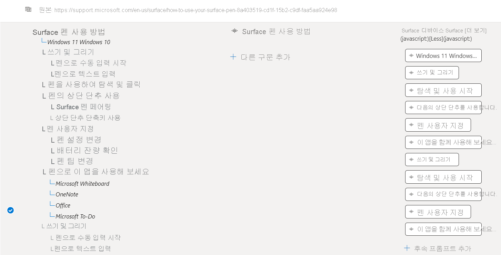
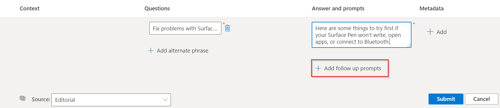
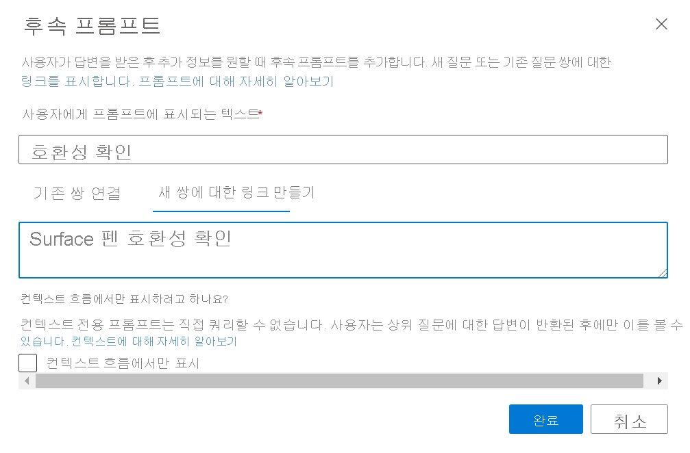
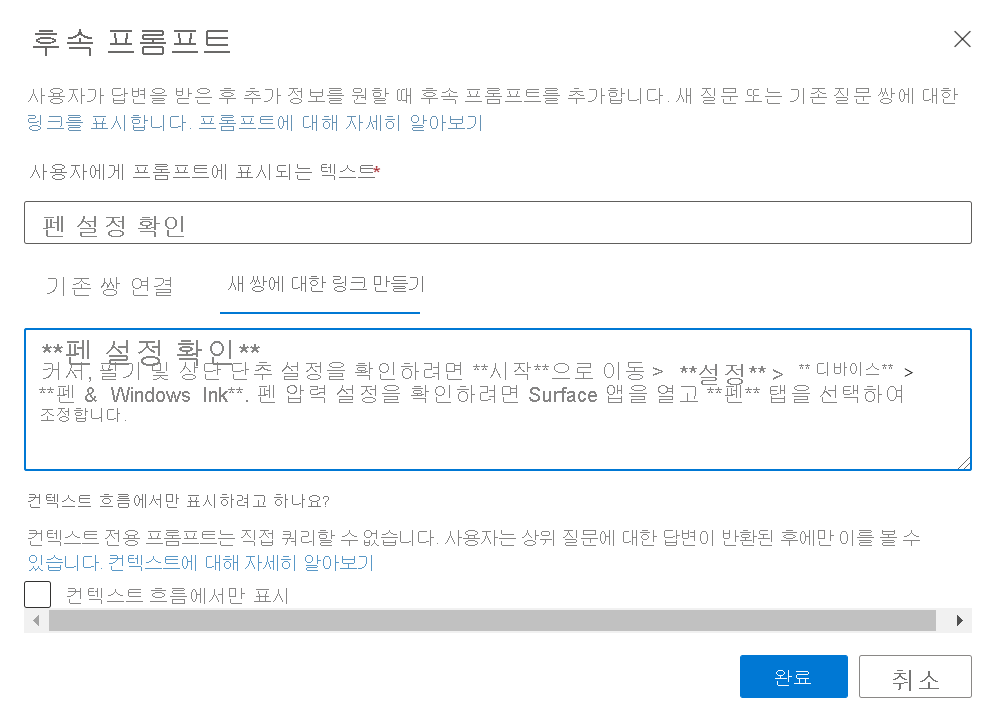
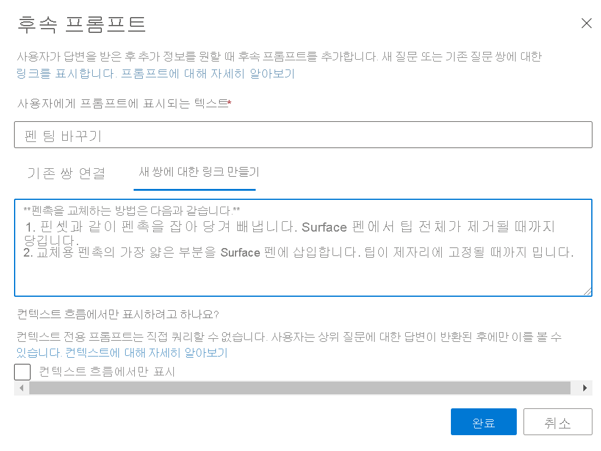
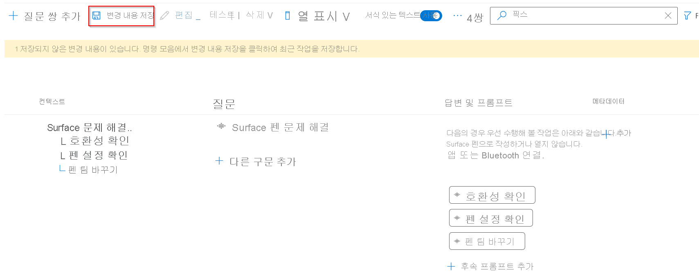
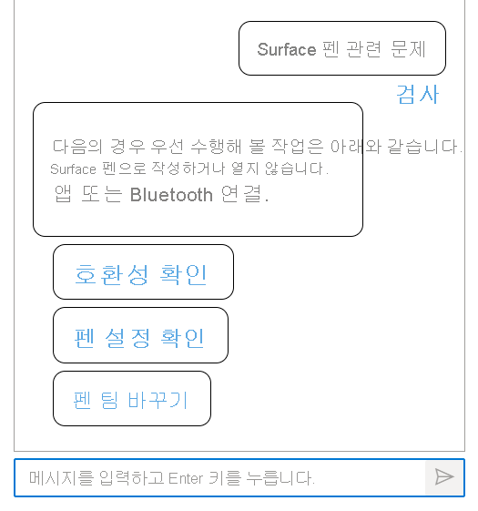

# 멀티 턴 프롬프트를 사용하여 단계별 대화 추가

이 자습서에서는 다음과 같은 작업을 수행하는 방법을 살펴봅니다.

> [!div class="checklist"]
> * 기존 프로젝트에 새 질문 및 답변 쌍 추가
> * 안내 대화를 만들기 위한 후속 프롬프트 추가
> * 멀티 턴 프롬프트 테스트

## 사전 요구 사항

 이 자습서에서는 [Surface 펜 FAQ](https://support.microsoft.com/surface/how-to-use-your-surface-pen-8a403519-cd1f-15b2-c9df-faa5aa924e98)를 사용하여 기술 자료를 만듭니다.

질문 답변 프로젝트를 만든 적이 없다면 프로세스를 단계별로 안내하는 [시작하기](../how-to/create-test-deploy.md) 문서부터 시작합니다.

## 질문 답변 쌍 컨텍스트 보기

이 예에서는 사용자가 Surface 펜 제품에 대한 추가 세부 정보, 특히 Surface 펜 문제를 해결하는 방법을 요청하지만 올바른 대답을 얻지 못하고 있다고 가정합니다. 따라서 추가 시나리오를 지원하고 사용자에게 멀티 턴 프롬프트를 사용하여 올바른 대답을 안내하는 프롬프트를 더 추가합니다.

질문 및 답변 쌍과 연결된 멀티 턴 프롬프트는 **열 표시** > **컨텍스트** 를 선택하여 볼 수 있습니다. 기본적으로 이 기능은 Language Studio 질문 답변 인터페이스의 **기술 자료 편집** 페이지에서 이미 사용하도록 설정되어 있어야 합니다.

> [!div class="mx-imgBorder"]
> 

이는 QnA 쌍에 연결된 모든 후속 프롬프트가 표시되는 컨텍스트 트리를 표시합니다. 

> [!div class="mx-imgBorder"]
> 

## 후속 프롬프트와 함께 질문 쌍 추가

사용자가 Surface 펜 문제를 해결하는 데 도움이 되도록 후속 프롬프트를 추가합니다.

- 두 개의 후속 프롬프트가 있는 새 질문 쌍 추가
- 후속 프롬프트를 새로 추가된 프롬프트 중 하나에 추가합니다.

1. 두 개의 후속 프롬프트, 즉 **호환성 검사** 및 **펜 설정 검사** 를 사용하여 새 질문 쌍을 추가합니다. 편집기에서 **질문 쌍 추가** 를 클릭하여 후속 프롬프트를 통해 새 QnA 쌍을 추가합니다.

    > [!div class="mx-imgBorder"]
    > 
    
    **Editorial** 에 새 행이 만들어져 아래와 같이 질문 답변 쌍을 입력합니다.
    
    |필드|값|
    |-----|----|
    |질문 | Surface 문제 해결 |
    |답변 및 프롬프트 | 다음은 Surface 펜이 쓰지 않거나 앱을 열지 않거나 Bluetooth에 연결되지 않는 경우 먼저 시도해야 할 몇 가지 사항입니다.|
    
2. 그런 다음 **추가 메시지 추가** 를 선택하여 새로 만들어진 질문 쌍에 후속 프롬프트를 추가합니다. 다음과 같이 프롬프트에 대한 세부 정보를 입력합니다.
    
    > [!div class="mx-imgBorder"]
    > 
    
    프롬프트에 대한 "표시 텍스트"로 **호환성 검사** 를 제공하고 이를 QnA에 연결하려고 시도합니다. 프롬프트에 연결하는 데 사용할 수 있는 관련 QnA 쌍이 없으므로 "Surface 펜 호환성 검사"를 검색할 때 **새 쌍에 대한 링크 만들기** 를 클릭하고 **완료** 를 선택합니다. **변경 내용 저장** 을 선택합니다.
    
    > [!div class="mx-imgBorder"]
    > 
    
3. 마찬가지로 사용자가 Surface 펜 문제를 해결하고 질문 쌍을 추가하는 데 도움이 되도록 또 다른 **펜 설정 검사** 프롬프트를 추가합니다.
    
    > [!div class="mx-imgBorder"]
    > 

4. 새로 만들어진 프롬프트에 다른 후속 프롬프트를 추가합니다. 이제 "펜 팁 바꾸기"를 이전에 만든 "펜 설정 검사" 프롬프트에 대한 후속 프롬프트로 추가합니다.

    > [!div class="mx-imgBorder"]
    > 
    
5. 마지막으로 변경 내용을 저장하고, **테스트** 창에서 다음과 같은 프롬프트를 테스트합니다.
    
    > [!div class="mx-imgBorder"]
    > 
    
    **Surface 펜 관련 문제** 에 대한 사용자 쿼리의 경우 시스템에서 대답을 반환하고 새로 추가된 프롬프트를 사용자에게 표시합니다. 그런 다음, **펜 설정 검사** 프롬프트 중 하나를 선택하면 관련 대답이 **펜 팁 바꾸기** 프롬프트와 함께 사용자에게 반환됩니다. 이를 선택하면 추가 정보가 사용자에게 추가로 제공됩니다. 따라서 멀티 턴은 사용자를 원하는 대답으로 안내하는 데 사용됩니다.
    
    > [!div class="mx-imgBorder"]
    > 

## 다음 단계

> [!div class="nextstepaction"]
> [활성 학습을 사용하여 기술 자료 보강](active-learning.md)
