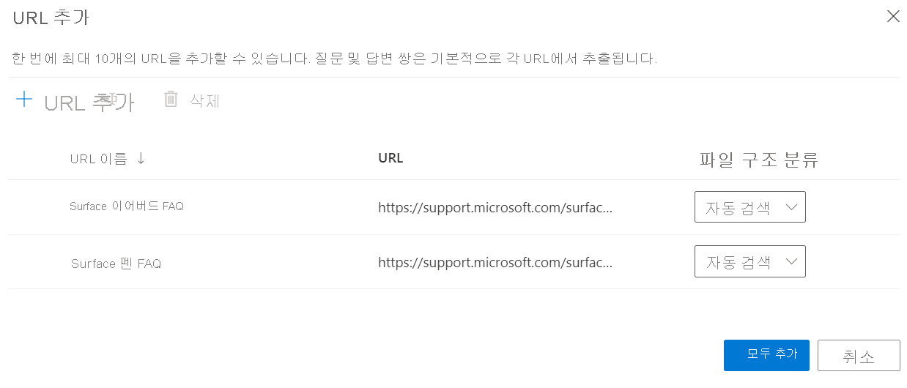
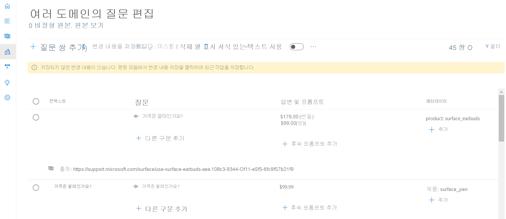
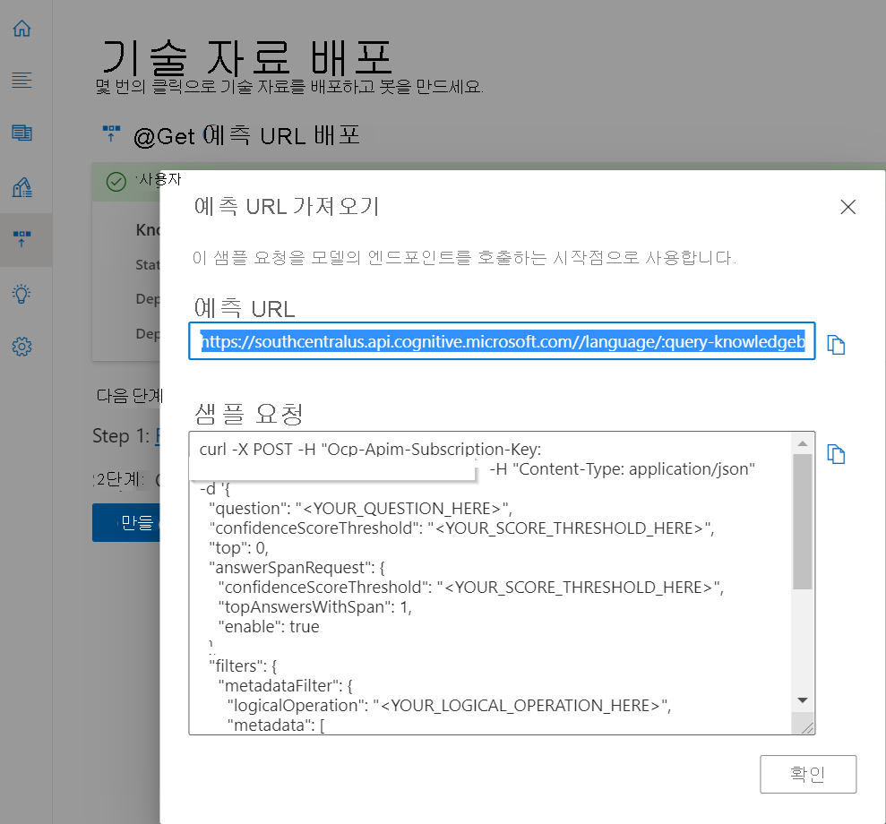
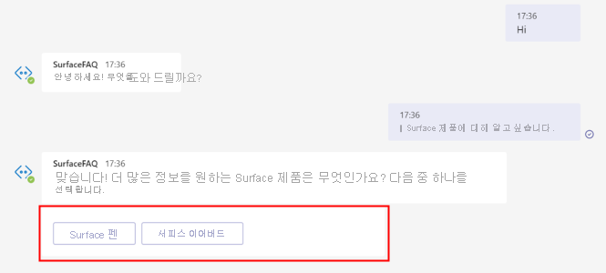
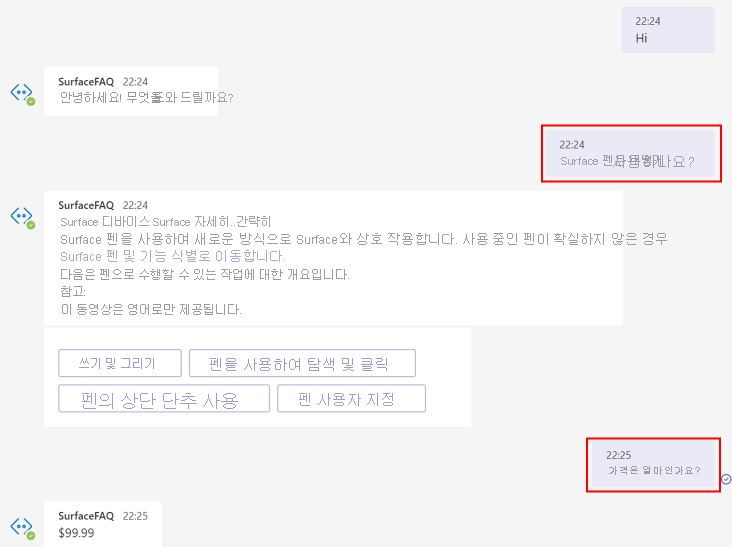
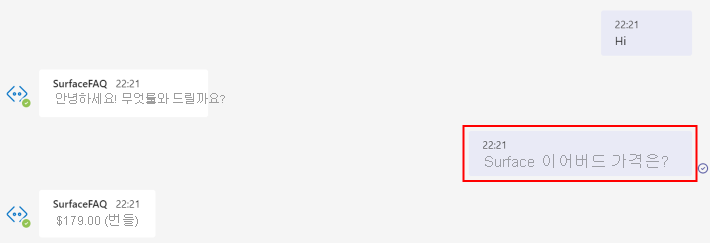

# <a name="add-multiple-domains-to-your-faq-bot"></a>FAQ 봇에 여러 도메인 추가

이 자습서에서는 다음과 같은 작업을 수행하는 방법을 살펴봅니다.

> [!div class="checklist"]
> * 프로젝트를 만들고 질문 답변 쌍을 메타데이터가 있는 고유한 도메인으로 태그 지정
> * 각 도메인에 대해 별도의 프로젝트 만들기
> * 각 도메인에 대해 별도의 언어 리소스 만들기

FAQ 봇을 빌드하는 경우 여러 도메인에서 쿼리를 처리해야 하는 사용 사례가 발생할 수 있습니다. Microsoft의 마케팅 팀이 여러 Surface 제품에 대한 일반적인 사용자 쿼리에 답변하는 고객 지원 봇을 빌드한다고 가정합니다. 여기서는 간단하게 하기 위해 두 개의 FAQ URL인 [Surface 펜](https://support.microsoft.com/surface/how-to-use-your-surface-pen-8a403519-cd1f-15b2-c9df-faa5aa924e98)과 [Surface Earbuds](https://support.microsoft.com/surface/use-surface-earbuds-aea108c3-9344-0f11-e5f5-6fc9f57b21f9)를 사용하여 프로젝트를 만듭니다.

## <a name="create-project-with-domain-specific-metadata"></a>도메인별 메타데이터로 프로젝트 만들기

콘텐츠 작성자는 문서를 사용하여 질문 답변 쌍을 추출하거나 프로젝트/기술 자료에 사용자 지정 질문 답변 쌍을 추가할 수 있습니다. 이러한 질문과 답변을 특정 도메인 또는 범주로 그룹화하기 위해 메타데이터를 추가할 수 있습니다.

Surface 제품의 경우 다음 단계를 수행하여 두 제품 유형에 대한 쿼리에 답변하는 봇을 만들 수 있습니다.

1. 아래의 각 URL을 추가했으면 **원본 추가** > **URL** >**모두 추가** 를 차례로 선택하여 다음 FAQ URL을 원본으로 추가합니다.
   
   [Surface 펜 FAQ](https://support.microsoft.com/surface/how-to-use-your-surface-pen-8a403519-cd1f-15b2-c9df-faa5aa924e98)<br>[Surface 이어버드 FAQ](https://support.microsoft.com/surface/use-surface-earbuds-aea108c3-9344-0f11-e5f5-6fc9f57b21f9)

    >[!div class="mx-imgBorder"]
    >[](../media/multiple-domains/add-url.png#lightbox)

2. 이 기술 자료에는 두 제품에 대한 질문 답변 쌍이 있으며 주어진 제품에 대한 질문과 답변 중에서 응답을 검색할 수 있도록 두 제품을 구별하려고 합니다. 이를 위해 질문 답변 쌍에 대한 메타데이터 필드를 업데이트할 수 있습니다.

   아래 예에서 볼 수 있듯이 키는 **product** 이고, 값은 각각 **surface_pen** 또는 **surface_earbuds** 인 메타데이터를 추가했습니다. 이 예제를 확장하여 여러 제품에 대한 데이터를 추출하고 각 제품에 대한 다른 값을 추가할 수 있습니다.

   >[!div class="mx-imgBorder"]
   >[](../media/multiple-domains/product-metadata.png#lightbox)

4. 이제 시스템이 특정 제품에서 응답을 검색하도록 제한하려면 질문 답변 REST API에서 해당 제품을 필터로 전달해야 합니다.

    REST API 예측 URL은 기술 자료 배포 창에서 검색할 수 있습니다.

   >[!div class="mx-imgBorder"]
   >[](../media/multiple-domains/prediction-url.png#lightbox)

    API 호출의 JSON 본문에서 메타데이터 *product* 에 대한 값으로 *surface_pen* 을 전달했습니다. 그러면 시스템은 QnA 쌍 중에서 동일한 메타데이터가 있는 답변만 찾습니다.

    ```json
        {
          "question": "What is the price?",
          "top": 3
        },
        "answerSpanRequest": {
          "enable": true,
          "confidenceScoreThreshold": 0.3,
          "topAnswersWithSpan": 1
        },
        "filters": {
          "metadataFilter": {
            "metadata": [
              {
                "key": "product",
                "value": "surface_pen"
              }
            ]
          }
        }
    ```

    사용자 입력을 기반으로 메타데이터 값을 확보할 수 있는 방법은 다음과 같습니다. 

    * 봇 클라이언트를 통해 사용자로부터 도메인을 입력으로 명시적으로 받습니다. 예를 들어 아래와 같이 대화가 시작되면 사용자로부터 제품 범주를 입력으로 받을 수 있습니다.

      

    * 봇 컨텍스트를 기반으로 도메인을 암시적으로 식별합니다. 예를 들어 이전 질문이 특정 Surface 제품에 관한 것이면 클라이언트에 의해 컨텍스트로 저장될 수 있습니다. 사용자가 다음 쿼리에서 제품을 명시하지 않으면 봇 컨텍스트를 메타데이터로 GenerateAnswer API에 전달할 수 있습니다.

      

    * 사용자 쿼리에서 엔터티를 추출하여 메타데이터 필터에 사용할 도메인을 식별합니다. 엔터티 추출을 위해 [NER(명명된 엔터티 인식)](../../named-entity-recognition/overview.md) 및 [대화형 Language Understanding](../../conversational-language-understanding/overview.md)과 같은 다른 Cognitive Services를 사용할 수 있습니다.

      

### <a name="how-large-can-our-projects-be"></a>프로젝트는 얼마나 커질 수 있나요?

단일 프로젝트/기술 자료에 최대 50000개의 질문 답변 쌍을 추가할 수 있습니다. 데이터가 50,000개의 질문 답변 쌍을 초과하는 경우 기술 자료 분할을 고려해야 합니다.

## <a name="create-a-separate-project-for-each-domain"></a>각 도메인에 대해 별도의 프로젝트 만들기

또한 각 도메인에 대해 별도의 프로젝트/기술 자료를 만들고 프로젝트를 별도로 유지할 수 있습니다. 모든 API는 사용자가 기술 자료를 업데이트하거나 사용자 질문에 대한 답변을 가져오기 위해 프로젝트 ID를 전달해야 합니다.  

서비스에서 사용자 질문을 받으면 관련 기술 자료에서 응답을 가져오기 위해 표시된 REST API 엔드포인트에서 `projectName`을 전달해야 합니다. **예측 URL 가져오기** 아래의 **기술 자료 배포** 페이지에서 URL을 찾을 수 있습니다.

`https://southcentralus.api.cognitive.microsoft.com/language/:query-knowledgebases?projectName=Test-Project-English&api-version=2021-10-01&deploymentName=production`

## <a name="create-a-separate-language-resource-for-each-domain"></a>각 도메인에 대해 별도의 언어 리소스 만들기

Microsoft의 마케팅 팀이 Surface 및 Xbox 제품에 대한 사용자 쿼리에 답변하는 고객 지원 봇을 빌드한다고 가정합니다. Surface 및 Xbox의 기술 자료에 액세스하는 별개의 팀을 할당하려고 합니다. 이런 경우 하나는 Surface용, 다른 하나는 Xbox용으로 두 개의 QnA Maker 리소스를 만드는 것이 좋습니다. 하지만 동일한 리소스에 액세스하는 사용자에 대해 별개의 역할을 정의할 수 있습니다.
