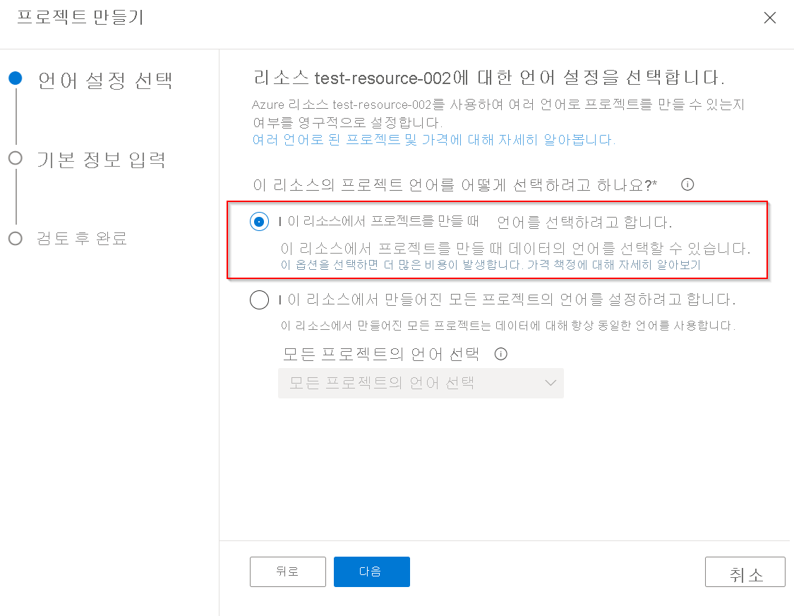

# 여러 언어로 프로젝트 만들기

이 자습서에서는 다음과 같은 작업을 수행하는 방법을 살펴봅니다.

<!-- green checkmark -->
> [!div class="checklist"]
> * 영어를 지원하는 프로젝트 만들기
> * 독일어를 지원하는 프로젝트 만들기

이 자습서는 여러 언어로 프로젝트/기술 자료를 만드는 과정을 안내합니다. [Surface 펜 FAQ](https://support.microsoft.com/surface/how-to-use-your-surface-pen-8a403519-cd1f-15b2-c9df-faa5aa924e98) URL을 사용하여 독일어와 영어로 프로젝트를 만듭니다. 그런 다음 프로젝트를 배포하고 질문 답변 REST API를 사용하여 원하는 언어로 FAQ를 쿼리하고 답변을 얻습니다.

## 독일어로 프로젝트 만들기

둘 이상의 언어로 프로젝트를 만들 수 있으려면 언어 리소스와 연결된 첫 번째 프로젝트를 만들 때 다중 언어 설정을 지정해야 합니다.

> [!div class="mx-imgBorder"]
> 

1. [Language Studio](https://aka.ms/languageStudio) 홈 페이지에서 사용자 지정 질문 답변 열기를 선택합니다. **새 프로젝트 만들기** > **이 리소스에서 프로젝트를 만들 때 언어를 선택하려고 합니다** > **다음** 을 선택합니다.

2. 기본 정보 입력 페이지를 작성하고 **다음** > **프로젝트 만들기** 를 선택합니다.

    |설정| 값|
    |---|----|
    |Name | 프로젝트의 고유 이름|
    |설명 | 프로젝트를 식별하는 데 도움이 되는 고유한 설명 |
    |원본 언어 | 이 자습서에서는 독일어를 선택합니다. |
    |기본 답변 | 답변이 반환되지 않은 경우 기본 답변 |

    > [!div class="mx-imgBorder"]
    > 

3. **원본** > **URL 추가** > **URL 추가** > **모두 추가**.

    |설정| 값 |
    |----|------|
    | URL 이름 | Surface 펜 독일어 |
    | URL | https://support.microsoft.com/de-de/surface/how-to-use-your-surface-pen-8a403519-cd1f-15b2-c9df-faa5aa924e98 |
    | 파일 구조 분류 | 자동 검색 |
    
    질문 답변은 문서를 읽고 원본 URL에서 질문 답변 쌍을 추출하여 독일어로 프로젝트/기술 자료를 만듭니다. 원본에 대한 링크를 선택하면 내용을 편집할 수 있는 기술 자료 페이지가 열립니다.
    
    > [!div class="mx-imgBorder"]
    > 
    
## 영어로 프로젝트 만들기

이제 이전 단계를 반복하지만 이번에는 영어를 선택하고 영어 URL을 원본으로 제공합니다.

1. [Language Studio](https://aka.ms/languageStudio)에서 질문 답변 페이지 >**새 프로젝트 만들기** 를 엽니다.

2. 기본 정보 입력 페이지를 작성하고 **다음** > **프로젝트 만들기** 를 선택합니다.

    |설정| 값|
    |---|----|
    |Name | 프로젝트의 고유 이름|
    |설명 | 프로젝트를 식별하는 데 도움이 되는 고유한 설명 |
    |원본 언어 | 이 자습서에서는 영어를 선택합니다. |
    |기본 답변 | 답변이 반환되지 않은 경우 기본 답변 |

3. **원본** > **URL 추가** > **URL 추가** > **모두 추가**.

    |설정| 값 |
    |-----|-----|
    | URL 이름 | Surface 펜 독일어 |
    | URL | https://support.microsoft.com/en-us/surface/how-to-use-your-surface-pen-8a403519-cd1f-15b2-c9df-faa5aa924e98 |
    | 파일 구조 분류 | 자동 검색 |

## 기술 자료 배포 및 쿼리

이제 두 개의 프로젝트/기술 자료를 배포하고 질문 답변 REST API를 사용하여 원하는 언어로 쿼리할 준비가 되었습니다. 프로젝트가 배포되면 기술 자료 쿼리에 대한 세부 정보를 제공하는 다음 페이지가 표시됩니다.

> [!div class="mx-imgBorder"]
> 

수신되는 사용자 쿼리의 언어는 [언어 감지 API](../../language-detection/how-to/call-api.md)로 감지할 수 있으며 사용자는 감지된 언어에 따라 적절한 엔드포인트 및 기술 자료를 호출할 수 있습니다.
